# Complete a disaster recovery of virtual machines using Azure VMWare Solution

This article contains the process to complete a disaster recovery of your virtual machines with VMWare Hybrid Cloud Extension (HCX) solution and using an Azure VMWare Solution private cloud as the recovery or target site.

VMWare HCX provides various operations that provide fine control and granularity in replication policies. Available Operations include:

- Reverse – After a disaster has occurred. Reverse helps make Site B the source site and Site A where the protected VM now lives.

- Pause – Pause the current replication policy associated with the virtual machine selected.

- Resume - Pause the current replication policy associated with the virtual machine selected.

- Remove - Remove the current replication policy associated with the virtual machine selected.

- Sync Now – Out of bound sync source virtual machine to the protected VM.

In this guide the following replication scenarios are covered:

- Protect a VM or a group of VMs.

- Complete a Test Recover of a VM or a group of VMs.

- Recover a VM or a group of VMs.

- Reverse Protection of a VM or a group of VMs.

## Protect virtual machines

Log into **vSphere Client** on the source site and access **HCX plugin**.

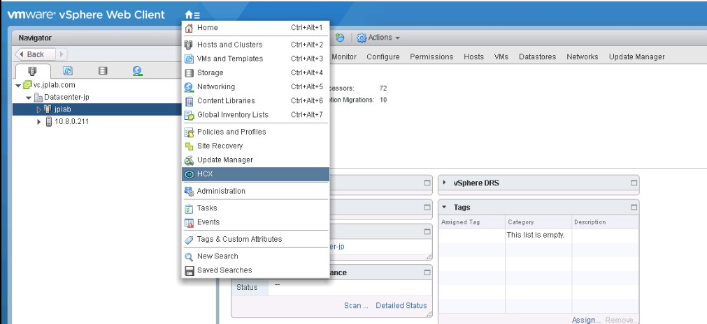

Enter the **Disaster Recovery** area and click on **PROTECT VMS**.

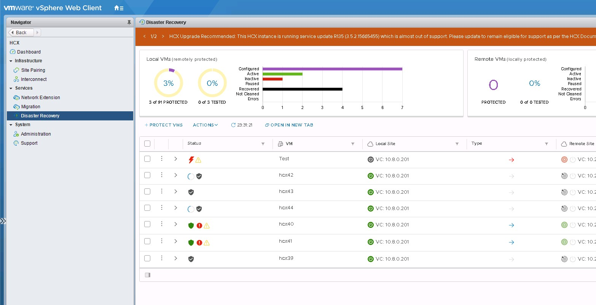

In the window that opens, select the Source and the Remote sites, the Remote site in
this case should be the AVS private cloud.


If needed, select the Default replication options:

- **Enable Compression:** Recommended for low throughput scenarios.

- **Enable Quiescence:** Pauses the VM to ensure a consistent copy is synced to the remote site.

- **Destination Storage:** Select the remote datastore for the protected VM(s). In an AVS private cloud, this selection should be the VSAN datastore.

- **Compute Container:** The remote vSphere Cluster or Resource Pool.

- **Destination Folder:** The remote destination folder, this setting is optional and if no folder is selected the VM(s) will be paced directly under the selected cluster.

- **RPO:** This value is the synchronization interval between the Source virtual machine and the protected virtual machine and can be anywhere from 5 minutes to 24 hours.

- **Snapshot interval:** Interval between snapshots.

- **Number of Snapshots:** Total number of snapshots within the configured snapshot interval.

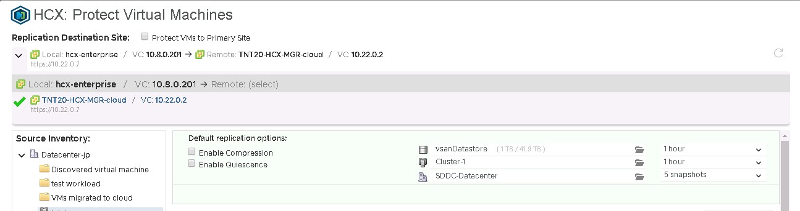

Select one or more virtual machines from the list and configure the
Virtual Machine the replication options as needed.

By default, the virtual machines will inherit the Global Settings Policy configured in the Default Replication Options. For each NIC in the selected VM, configure the remote **Network Port Group** and select **Finish** to start the protection process.


As seen in the following image, you can monitor the process for each of the selected virtual machines in the same disaster recovery area.

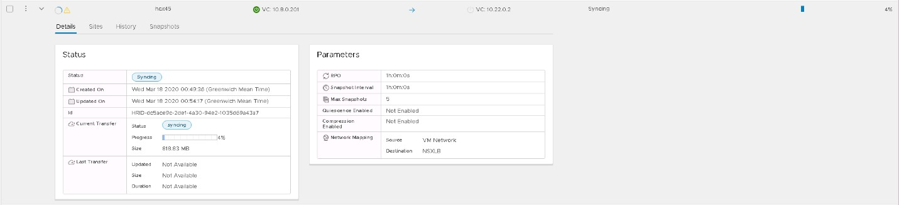

After the VM has been protected, the different snapshots can be seen in the **Snapshots** tab.

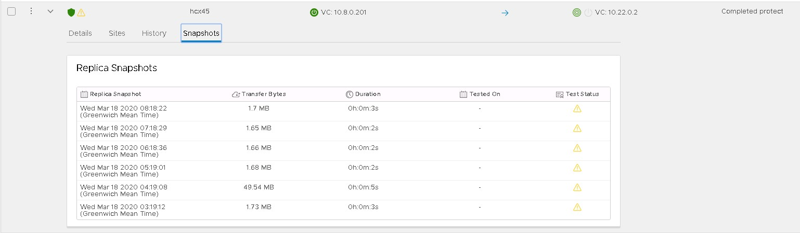

The yellow triangle means the snapshots and the virtual haven't been tested in a Test Recovery operation.

There are key differences between a VM that is powered off and one that is powered on.
The preceding screenshot shows the syncing process for a powered on virtual machine. It started the syncing process until it finishes the first snapshot, which is a full copy of the VM, and then completes the next ones in the configured interval.

For a powered off VM, it will sync up a copy and then the VM will appear as inactive and protection operation will show as completed.

When the virtual machine is powered on, it will start the syncing up process to the remote site.

## Complete a test recover of virtual machines

Log into **vSphere Client** on the remote site, which is the AVS private cloud. Within the **HCX plugin**, in the Disaster Recovery area, select the vertical ellipses on any VM to display the operations menu. Select **Test Recover VM**.

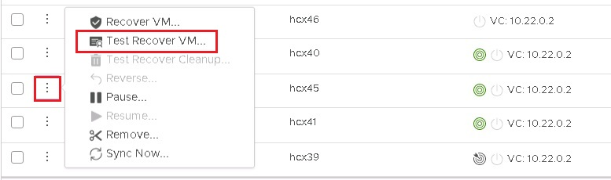

In the new window, select the options for the
test. Select the snapshot you want to use to test different states of the virtual machine.

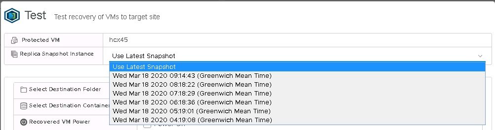

After clicking on **Test**, the recovery operation will begin.

When the Test Recovery operation is finished, the new VM can be checked in the AVS private cloud vCenter.

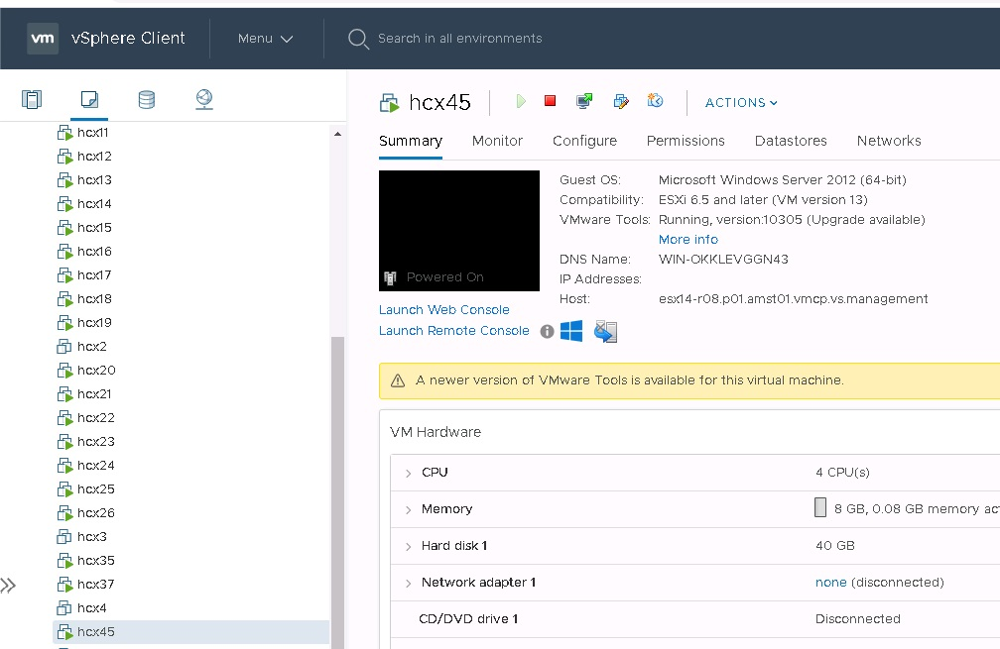

Finally after testing has been done on the VM or any application running on it do a cleanup to delete the test instance.

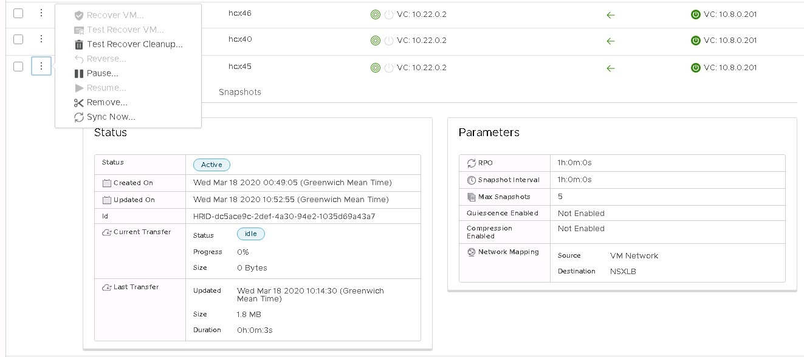

## Recover virtual machines

Log into **vSphere Client** on the remote site, which is the AVS private cloud, and access the **HCX plugin**.

For the recovery scenario, a group of virtual machines used for this example.

Select the virtual machine to be recovered from the list, open the **ACTIONS** menu, and select **Recover VMs**.

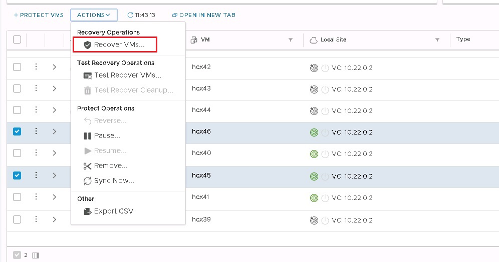

Configure the recovery options for each instance and click on **Recover** to start the recovery operation.

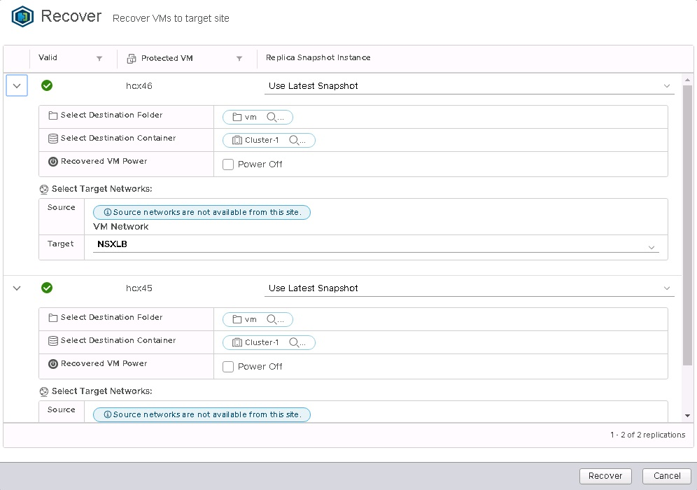

After the recovery operation is completed, the new VMs will appear in the remote vCenter Server inventory.

## Complete a reverse replication on virtual machines

Log into **vSphere Client** on your AVS private cloud, and access **HCX plugin**.
It's required that the original virtual machines on the source site are powered off before you start the reverse replication. The operation fails if the virtual machines aren't powered off.

Select the virtual machines to be replicated back to the source site
from the list, open the **ACTIONS** menu, and select **Reverse**. In the
pop-up window click on **Reverse** to start the replication.


The replication can be monitored on the details section of each virtual
machine.

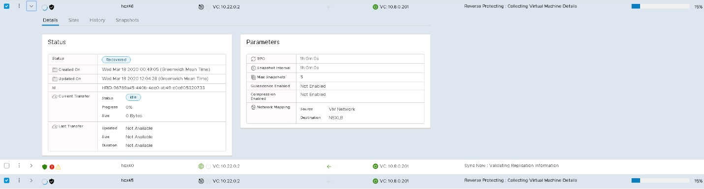

## Disaster recovery plan automation

VMWare HCX currently doesn't have a built-in mechanism to create and automate a disaster recovery plan. This capability doesn't exist in HCX. However it provides a set of REST APIs, including APIs for the Disaster Recovery operation.

The API specification can be accesses within HCX Manager in the URL.

The following operations in Disaster Recovery are covered by these APIs.

- Protect

- Recover

- Test Recover

- Planned Recover

- Reverse

- Query

- Test Cleanup

- Pause

- Resume

- Remove Protection

- Reconfigure

An example of a recover operation payload in JSON is shown below.

```json
[

    {

        "replicationId": "string",

        "needPowerOn": true,

        "instanceId": "string",

        "source": {

            "endpointType": "string",

            "endpointId": "string",

            "endpointName": "string",

            "resourceType": "string",

            "resourceId": "string",

            "resourceName": "string"

        },

        "destination": {

            "endpointType": "string",

            "endpointId": "string",

            "endpointName": "string",

            "resourceType": "string",

            "resourceId": "string",

            "resourceName": "string"

        },

        "placement": [

            {

                "containerType": "string",

                "containerId": "string"

            }

        ],

        "resourceId": "string",

        "forcePowerOff": true,

        "isTest": true,

        "forcePowerOffAfterTimeout": true,

        "isPlanned": true

    }

]
```

Using these APIs a customer can build a custom mechanism
to automate the creation and the execution of a Disaster Recovery Plan.

## Appendix TODO

References:

- [Getting Started with VMware HCX](https://docs.vmware.com/en/VMware-HCX/services/install-checklist/GUID-DE0AD0AE-A6A6-4769-96ED-4D200F739A68.html)

- [VMware HCX User Guide](https://docs.vmware.com/en/VMware-HCX/services/user-guide/GUID-BFD7E194-CFE5-4259-B74B-991B26A51758.html)

## Next steps

Advance to the next article to learn how to create...

> [!div class="nextstepaction"]

> [Next steps button](contribute-get-started-mvc.md)
