# HCX installation

In this article, set up the VMWare Hybrid Cloud Extension (HCX) solution for your Azure VMWare Solution (AVS) private cloud. The HCX solution supports up to three external enterprise sites, where each external site must have its own HCX Enterprise activation (HEA) key in order to migrate to the AVS Private Cloud target. Hot/cold vMotion migrations for VMs to and from on-premises environments and your AVS private cloud are enabled by the solution.

**Before you begin:**
	
* Review the basic AVS Software Defined Datacenter (SDDC) [tutorial series](tutorial-network-checklist.md).
* Related VMware materials on HCX, such as Megie’s VMware vSphere [blog series](https://blogs.vmware.com/vsphere/2019/10/cloud-migration-series-part-1.html) on HCX. 
* Order an AVS HCX Enterprise activation through AVS support channels.

Sizing workloads against compute and storage resources is an essential planning step when preparing to use the AVS Private Cloud HCX solution. This sizing step should be addressed as part of initial private cloud environment planning. 

## Software version requirements
Infrastructure components must be running the required minimum version. 
                                                         
| Component Type                                                          | Source Environment Requirements                                                                   | Destination Environment Requirements                                                                      |
| --- | --- | --- |
| vCenter Server                                                          | 5.1  If using 5.5 U1 or earlier, use the standalone HCX User Interface for HCX operations.         | 6.0 U2 and above                                                                                          |
| ESXi                                                                    | 5.0                                                                                               | ESXi 6.0 and above                                                                                        |
| NSX                                                                     | For HCX Network Extension of Logical Switches at the Source: NSXv 6.2+ or NSX-T 2.4+              | NSXv 6.2+ or NSX-T 2.4+ <br/For HCX Proximity Routing: NSXv 6.4+ (Proximity Routing not supported with NSX-T) |
| vCloud Director                                                         | Not required - no interoperability with vCloud Director at the source site | When the destination environment is integrated with vCloud Director, the minimum is 9.1.0.2.              |

## Prerequisites

1.  Global reach should be configured between on-premises and AVS SDDC ER
    circuits.

2.  All required ports should be open between on-premises and AVS SDDC.

3.  One IP address for HCX Manager at on-premises and a minimum of 2 IP addresses
    for Interconnect (IX) and Network Extension (NE) appliance.

4.  On-premises HCX IX and NE appliances should be able to reach vCenter
    and ESXi infrastructure.

## Deploy the VMware HCX OVA

1. Sign in to AVS SDDC vCenter and select **HCX**.

    

1. To download the VMware HCX OVA file, select **Administration** > **System Updates**.

    

1. Select an OVF template to deploy to on-premises vCenter.  
    

1. Select a name and location, then select a resource/cluster where HCX needs to be deployed then, review details and required resources.  
    

1. Review license terms, and if you agree, select required storage and network. Then select **Next**.

1. In **Customize template**, enter all required information. 
      

1. Select **Next**, verify configuration, and select **Finish** to deploy HCX
    OVA.

## Activate HCX

After installation, perform the following steps.

1. Open HCX Manager at `https://HCXManagerIP:9443` and sign in with your username
 and your password. 

1. In **Licensing**, enter your **HCX Advanced Key**.  
    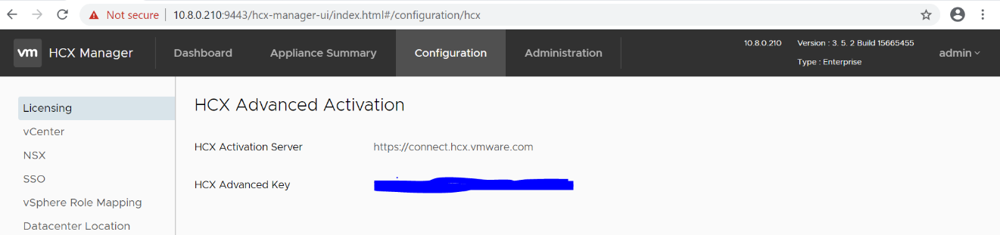  
    
    > [!NOTE]
    > HCX Manager must have open internet access or a proxy
    configured.

1. Configure vCenter
    

1. In **Datacenter Location**, if needed, edit the datacenter location  
    

## Configure HCX 

1. Sign into on-premises vCenter, then select **Home** > **HCX**  
    

1. Select **Infrastructure** > **Site Pairing** > **Add a site pairing**
    

1. Enter **Remote HCX URL**, **Username**, and **Password**. Then select **Connect**.

   The system shows the connected site  
    

1. Select **Interconnect** > **Multi-Site Service Mesh** > **Network Profiles** > **Create Network Profile**  
    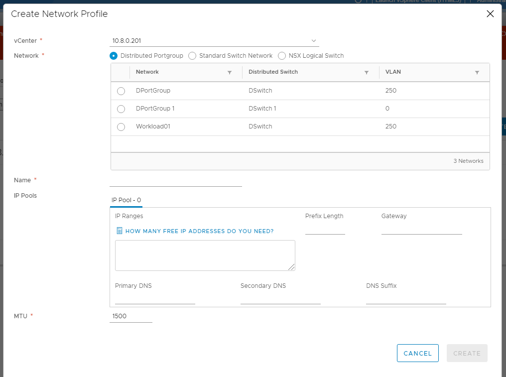

1. Enter HCX IX and NE IP address ranges (a minimum of 2 IP addresses is
    required for IX and NE appliancees)
  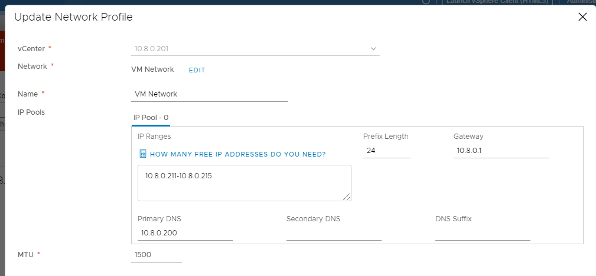
     > [!NOTE]
     > The network extension appliance (HCX-NE) has a one-to-one
relationship with a distributed virtual switch (DVS).  
1. Now select **Compute profile** > **Create compute profile**.

1. Enter a compute profile name and select **Continue**.  
    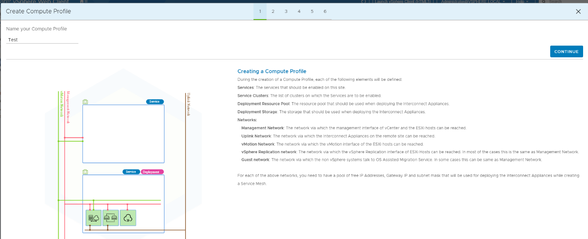

1. Select services to enable such as migration, Network Extension, pr Disaster Recovery. Select **Continue**.
    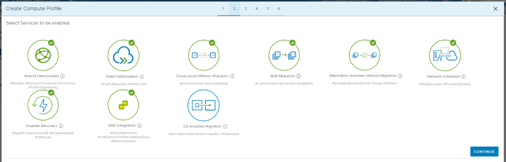

1. In **Select Service Resources**, select one or more service resources for
    which the selected HCX services should be enabled. Select **Continue**.
  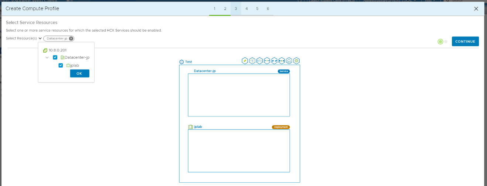
    > [!NOTE]
    > Select specific clusters in which source
VMs are targeted for migration using HCX.
1. Select **Datastore** and select **Continue**. 
      
    Select each compute and storage resource for deploying the HCX
    Interconnect appliances. When multiple resources are selected, HCX uses the first resource selected until its capacity is
    exhausted.  
    

1. Select the management network profile created in **Network Profiles**
    and select **Continue**.  
      
    Select the network profile through which the management interface of
    vCenter and the ESXi hosts can be reached. If you haven't already
    defined such a network profile, you can create it here.  
    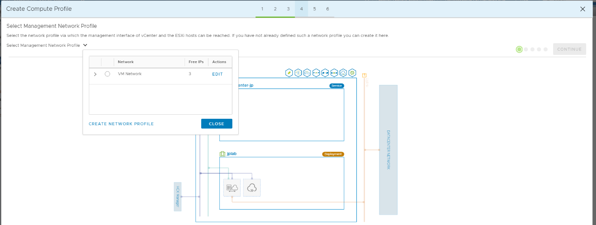

1. Select **Network Uplink** and select **Continue**
      
    Select one or more network profiles such that one of the following
    is true:  
    * The Interconnect Appliances on the remote site can be reached via
    this network  
    * The remote-side appliances can reach the local Interconnect
    Appliances via this network.  
    If you have point-to-point networks like Direct Connect which are
    not shared across multiple sites, you can skip this step, since
    compute profiles are shared with multiple sites. In such cases,
    Uplink Network profiles can be overridden and specified during the
    creation of the Interconnect Service mesh.  
    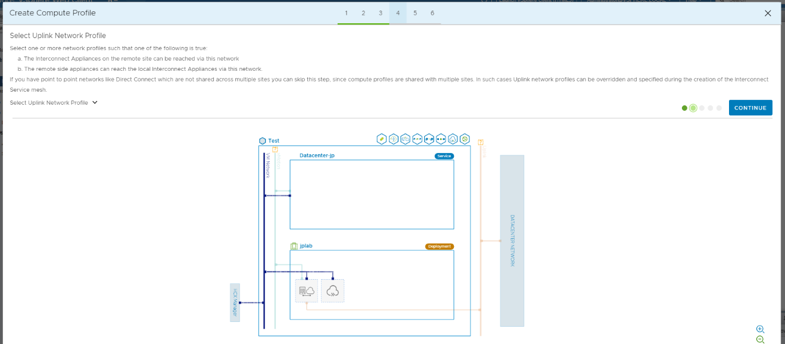

1. Select **vMotion Network Profile** and select **Continue**  
      
    Select the network profile via which the vMotion interface of the
    ESXi hosts can be reached. If you haven't already defined such a
    network profile, you can create it here. If you don't have vMotion
    Network, select **Management Network Profile**.  
    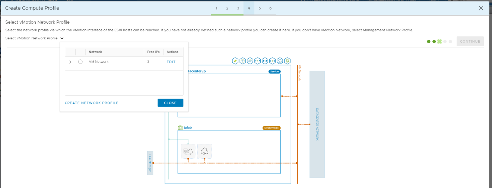

1. Select **vSphere Replication Network Profile** and select **Continue**  
      
    Select a Network Profile via which the vSphere Replication
    interface of ESXi Hosts can be reached. In most cases, this profile
    is the same as the Management Network Profile.  
    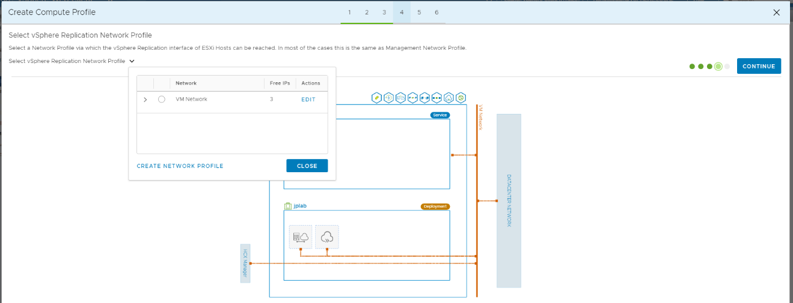

1. Select **Distributed Switches for Network Extensions** and select
    **Continue**  
      
    Select the Distributed Virtual Switches on which you have networks
    to which the Virtual Machines that will be migrated are connected.

    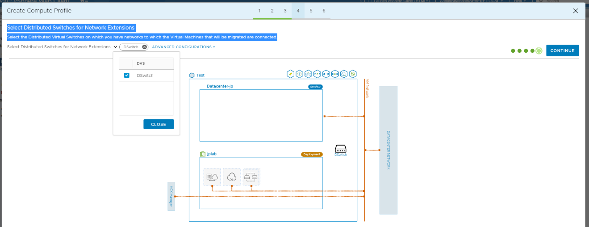

1. Review connection rules and select **Continue**. Select **Finish** to create the compute profile.  
    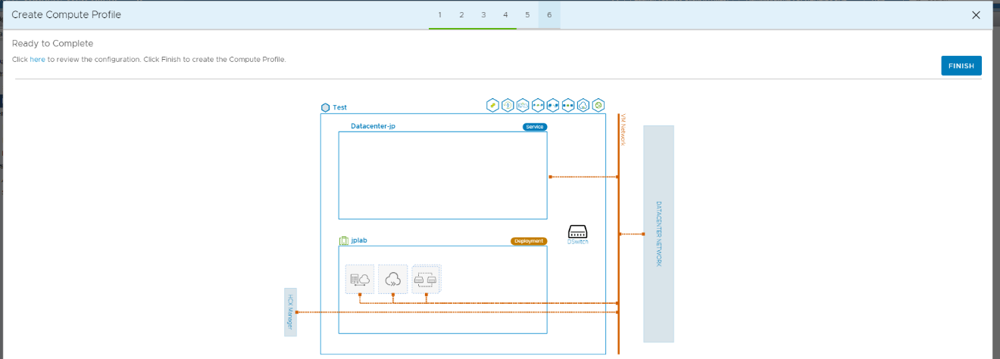

## Configure Network Uplink

Now configure the network profile change in AVS SDDC for Network
Uplink.

1. Sign in to SDDC NSX-T to create a new logical switch, or use an existing
    logical switch which can be used for Network Uplink between
    on-premises and AVS SDDC.

1. Create a network profile for HCX uplink in AVS SDDC which can be
    used for on-premises to AVS SDDC communication.  
    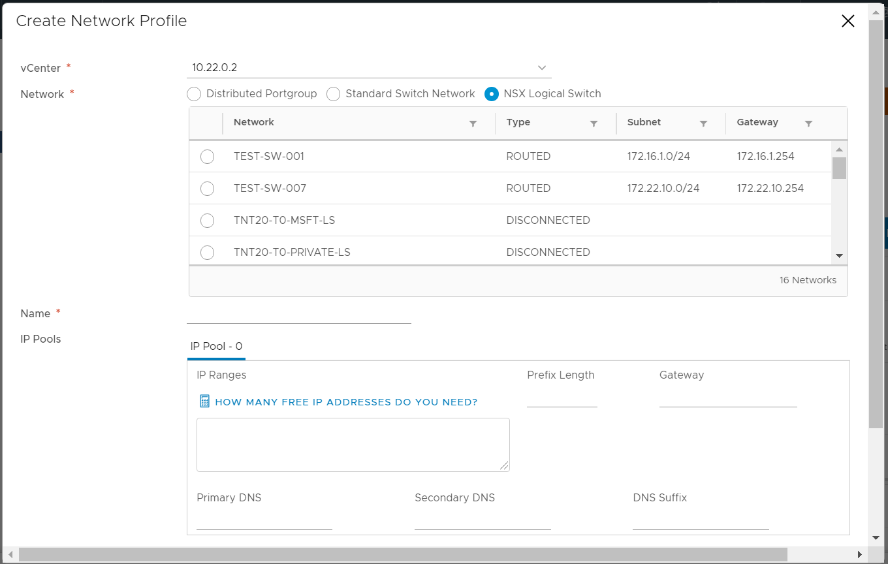

1. Enter a name for the network profile and atleast 4-5 free IP addresses
    based on the L2 network extension required.  
    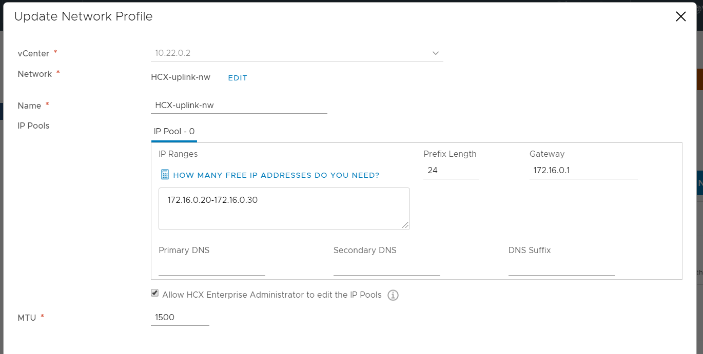

1. Select **Create** to complete the AVS SDDC configuration

## Configure Service Mesh

Now configure Service Mesh between on-premises and AVS SDDC.

1. Sign in to AVS SDDC vCenter and select **HCX**.

1. Select **Infrastructure** > **Interconnect** > **Service
    Mesh** > **Create Service Mesh**.  Configure the network and compute profiles
    created in previous steps.    
      
    

3.  Select **Create Service Mesh** and select **Continue**  
      
    Select paired sites between which to enable hybrid
    mobility.  
    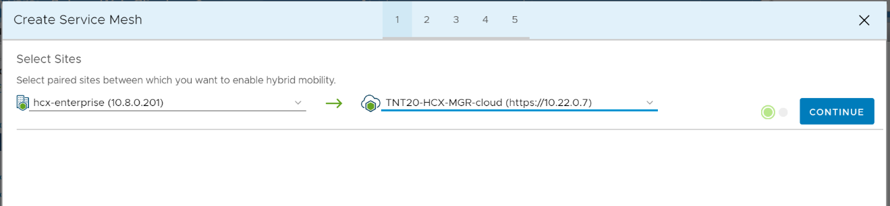

4.  Select **Compute profile** and select **Continue**  
      
    Select one compute profile each in the source and remote sites to
    enable hybridity services. The selections will define the
    resources, where Virtual Machines will be able to consume HCX
    services.  
      
    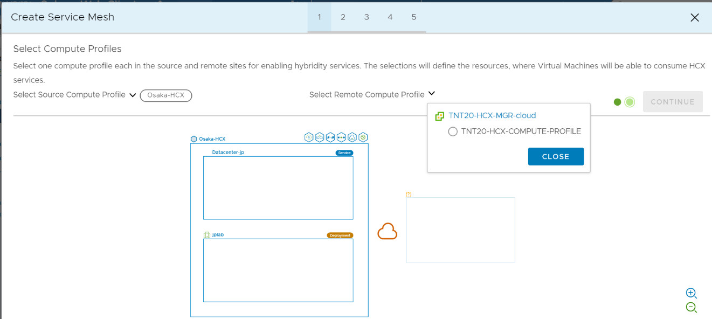

5.  Select services to be enabled for HCX and select **Continue**  
      
    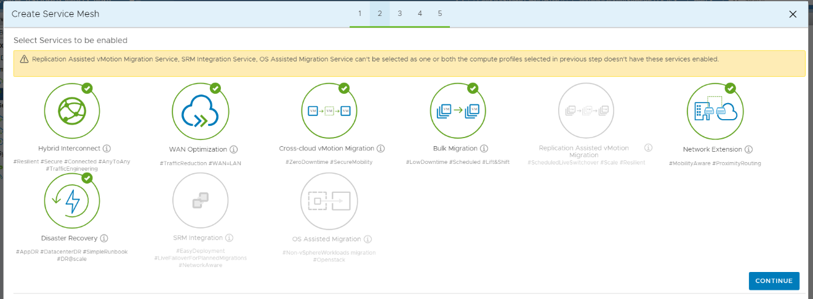

6.  In **Advanced Configuration - Override Uplink Network profiles** select **Continue**  
      
    Uplink network profiles are used to connect to the network via
    which the remote site’s interconnect appliances can be reached.  
      
    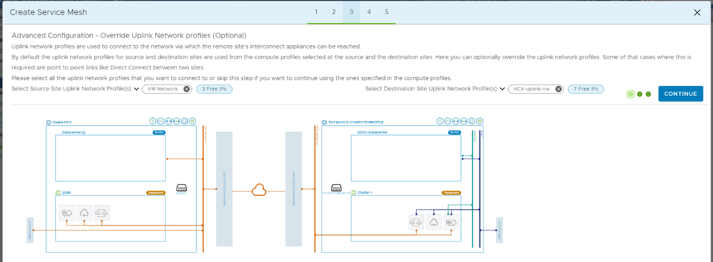

7.  In **Advanced Configuration – Network Extension Appliance Scale Out**, select **Configure the Network Extension Appliance Scale Out**  
      
    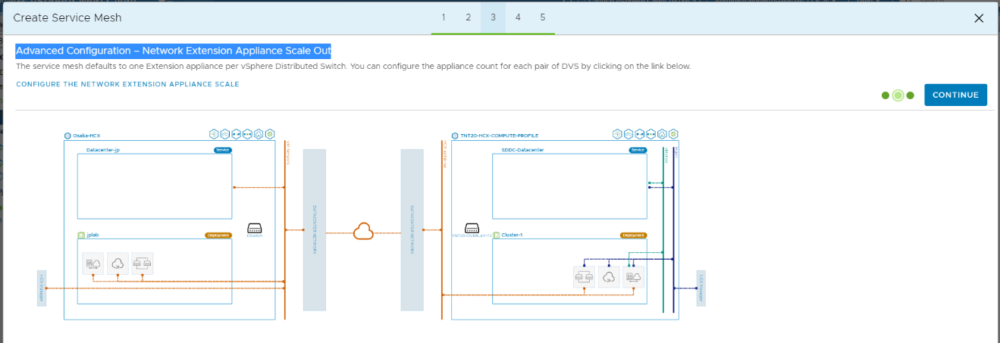

8.  Enter the appliance count corresponding to the DVS switch count  
      
    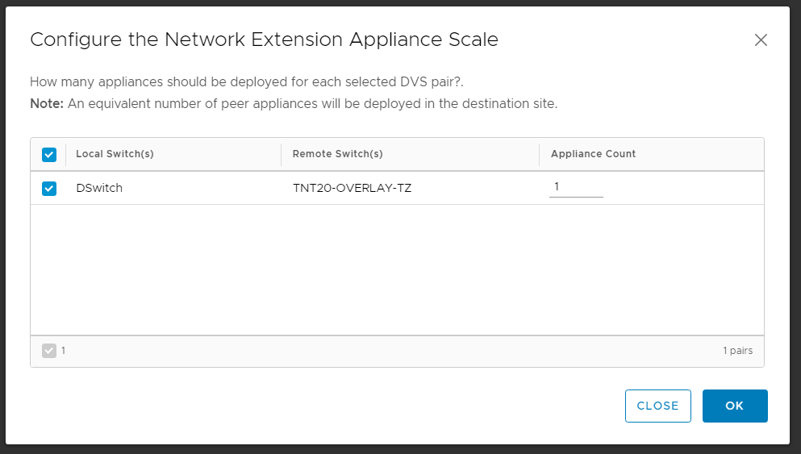

9.  In **Advanced Configuration - Traffic Engineering**, select **Continue**  
      
    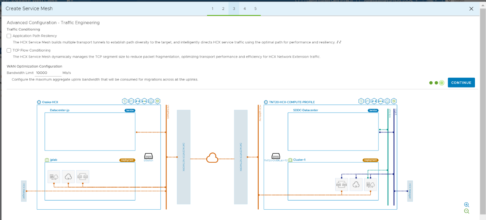

10. Review the topology preview and select **Continue**. Then, enter a user-friendly name for this Service Mesh and select
    **Finish** to complete.  
      
    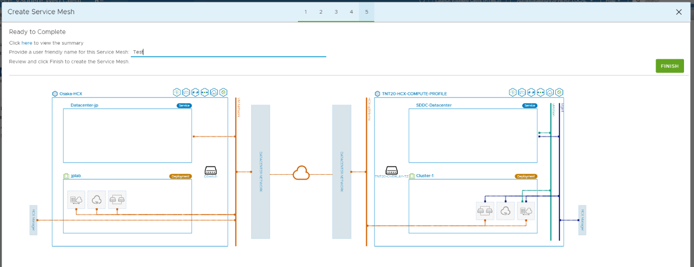

The Service Mesh is deployed and configured.  
      

## Check appliance status
To check the status of the appliance, select **Interconnect** > **Appliances**. 
      

## Next steps

When **Tunnel Status** is **UP** and green, you are ready for
    migration and protecting VMs using HCX Disaster Recovery.