# Install HCX for Azure VMware Solution

In this article, we walk through procedures for setting up the VMWare Hybrid Cloud Extension (HCX) solution for your Azure VMWare Solution (AVS) private cloud. HCX enables migration of your VMware workloads to the cloud, and other connected sites through various built-in HCX supported migration types.

HCX Advanced, the default installation, supports up to three external sites. If more than three sites are required, customers have the option to enable the HCX Enterprise add-on through Support. HCX Enterprise installation carries additional charges for customers after general availability (GA) but provides [additional features](https://cloud.vmware.com/community/2019/08/08/introducing-hcx-enterprise/).

Thoroughly review [Before you begin](#before-you-begin), [Software version requirements](#software-version-requirements), and [Prerequisites](#prerequisites) first. 

Then, we walk through all necessary procedures to:

> [!div class="checklist"]
> * Deploy the on-premises HCX OVA
> * Activate and configure HCX
> * Configure the network uplink and service mesh
> * Complete setup by checking the appliance status

After completing the setup, you can follow the recommended next steps provided at the end of this article.  

## Before you begin
	
* Review the basic AVS Software Defined Datacenter (SDDC) [tutorial series](tutorial-network-checklist.md)
* Review and reference the [VMware HCX documentation](https://docs.vmware.com/en/VMware-HCX/index.html) including the HCX user guide
* Review VMware docs [Migrating Virtual Machines with VMware HCX](https://docs.vmware.com/en/VMware-HCX/services/user-guide/GUID-D0CD0CC6-3802-42C9-9718-6DA5FEC246C6.html?hWord=N4IghgNiBcIBIGEAaACAtgSwOYCcwBcMB7AOxAF8g)
* Optionally review [VMware HCX Deployment Considerations](https://docs.vmware.com/en/VMware-HCX/services/install-checklist/GUID-C0A0E820-D5D0-4A3D-AD8E-EEAA3229F325.html)
* Optionally review related VMware materials on HCX, such as the VMware vSphere [blog series](https://blogs.vmware.com/vsphere/2019/10/cloud-migration-series-part-2.html) on HCX. 
* Order an AVS HCX Enterprise activation through AVS support channels.

Sizing workloads against compute and storage resources is an essential planning step when preparing to use the AVS Private Cloud HCX solution. Address the sizing step as part of the initial private cloud environment planning.   

## Software version requirements
Infrastructure components must be running the required minimum version. 
                                                         
| Component Type    | Source Environment Requirements    | Destination Environment Requirements   |
| --- | --- | --- |
| vCenter Server   | 5.1  If using 5.5 U1 or earlier, use the standalone HCX User Interface for HCX operations.  | 6.0 U2 and above   |
| ESXi   | 5.0    | ESXi 6.0 and above   |
| NSX    | For HCX Network Extension of Logical Switches at the Source: NSXv 6.2+ or NSX-T 2.4+   | NSXv 6.2+ or NSX-T 2.4+  For HCX Proximity Routing: NSXv 6.4+ (Proximity Routing not supported with NSX-T) |
| vCloud Director   | Not required - no interoperability with vCloud Director at the source site | When integrating the destination environment with vCloud Director, the minimum is 9.1.0.2.  |

## Prerequisites

* Global reach should be configured between on-premises and AVS SDDC ER circuits.

* All required ports should be open between on-premises and AVS SDDC (see [VMware HCX documentation](https://docs.vmware.com/en/VMware-HCX/services/user-guide/GUID-E456F078-22BE-494B-8E4B-076EF33A9CF4.html)).

* One IP address for HCX Manager at on-premises and a minimum of two IP addresses for Interconnect (IX) and Network Extension (NE) appliance.

* On-premises HCX IX and NE appliances should be able to reach vCenter and ESXi infrastructure.

* To deploy the WAN Interconnect appliance, in addition to the /22 CIDR network address block used for SDDC deployment in the Azure portal, HCX requires a /29 block. Make sure to factor this requirement into your network planning.

## Deploy the VMware HCX OVA on-premises

1. Sign in to AVS SDDC vCenter and select **HCX**.

    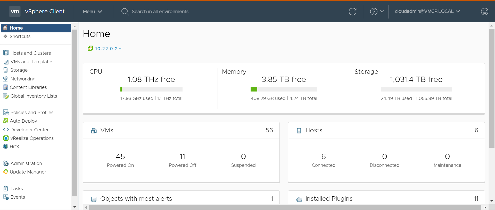

1. Under **Administration**, select **System Updates** and then select **Request download link** to download the VMware HCX OVA file.

    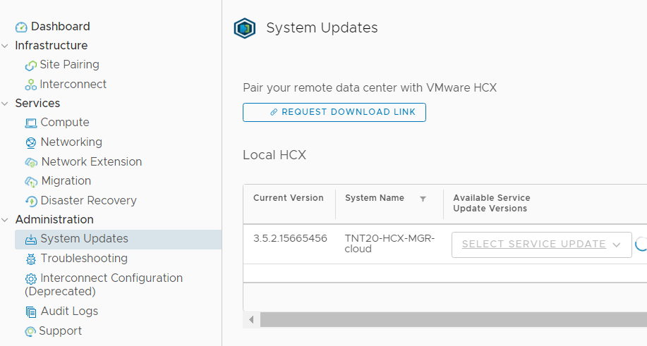

1. Next, go to the on-premises vCenter and select an OVF template to deploy to your on-premises vCenter.  

    

1. Select a name and location, then select a resource/cluster where HCX needs to be deployed. Then, review details and required resources.  

    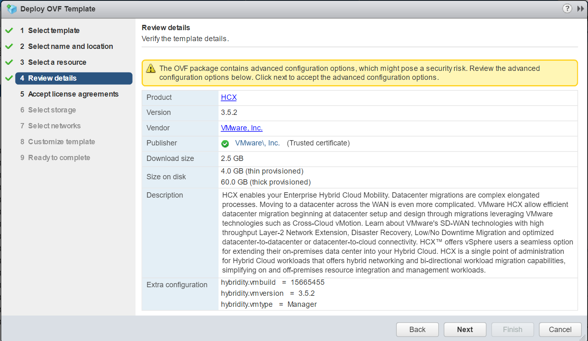

1. Review license terms, and if you agree, select required storage and network. Then select **Next**.

1. In **Customize template**, enter all required information. 

      

1. Select **Next**, verify configuration, and select **Finish** to deploy HCX
    OVA.

## Activate HCX

After installation, perform the following steps.

1. Log on to the on-premises HCX manager at `https://HCXManagerIP:9443` and sign in with your username and your password. 

   > [!IMPORTANT]
   > Make sure to include the `9443` port number with the HCX Manager IP address.

1. In **Licensing**, enter your **HCX Advanced Key**.  

    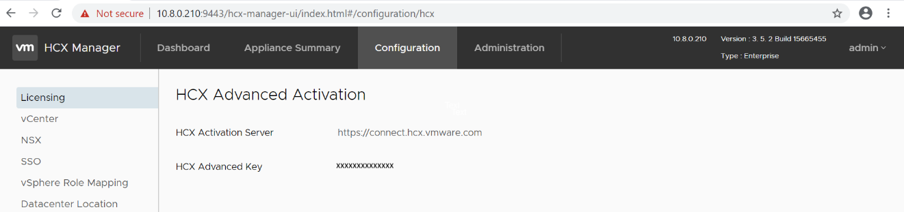  
    
    > [!NOTE]
    > HCX Manager must have open internet access or a proxy configured.

1. In **vCenter**, if needed, edit the vCenter information.

    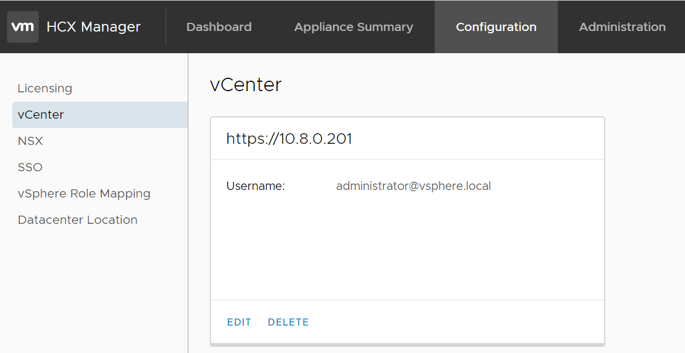

1. In **Datacenter Location**, if needed, edit the datacenter location.

    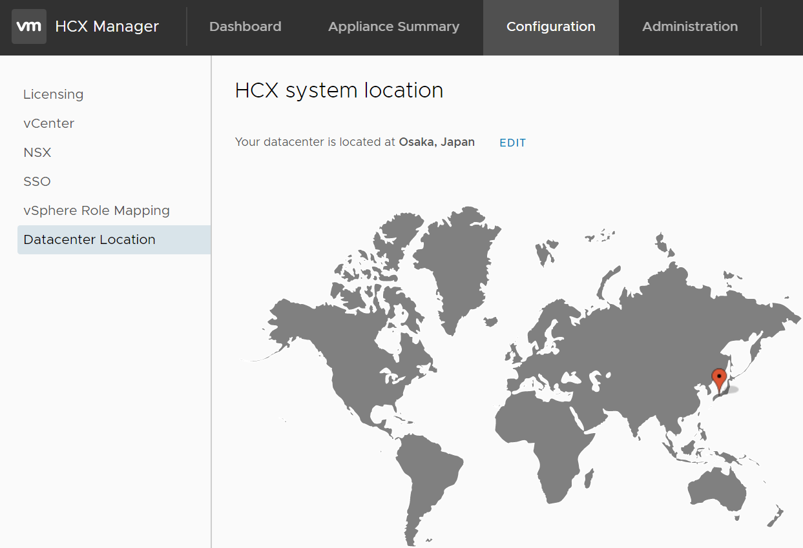

## Configure HCX 

1. Sign into on-premises vCenter, and under **Home**, select **HCX**.

    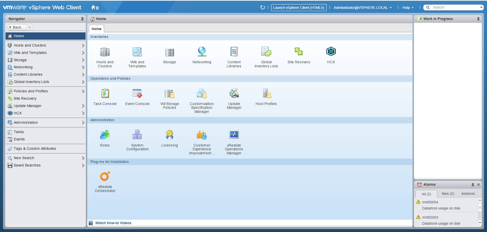

1. Under **Infrastructure**, select **Site Pairing** > **Add a site pairing**.

    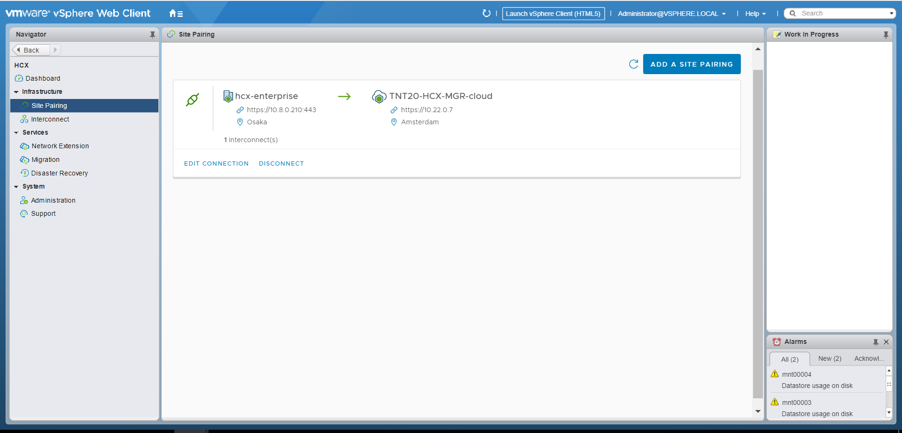

1. Enter the Remote HCX URL or IP address, AVS cloudadmin username and password, and then select **Connect**.

   The system shows the connected site.
   
    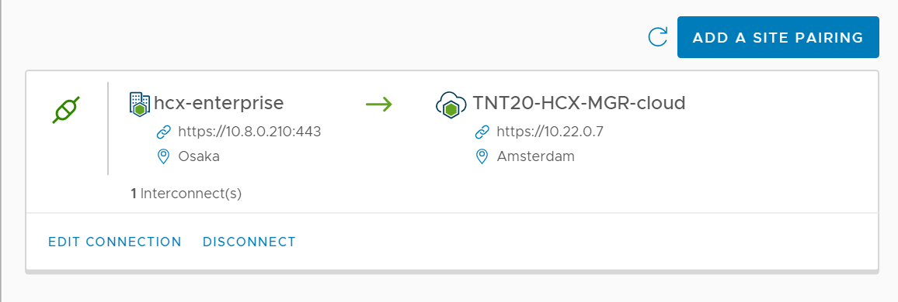

1. Under **Infrastructure**, select **Interconnect** > **Multi-Site Service Mesh** > **Network Profiles** > **Create Network Profile**.

    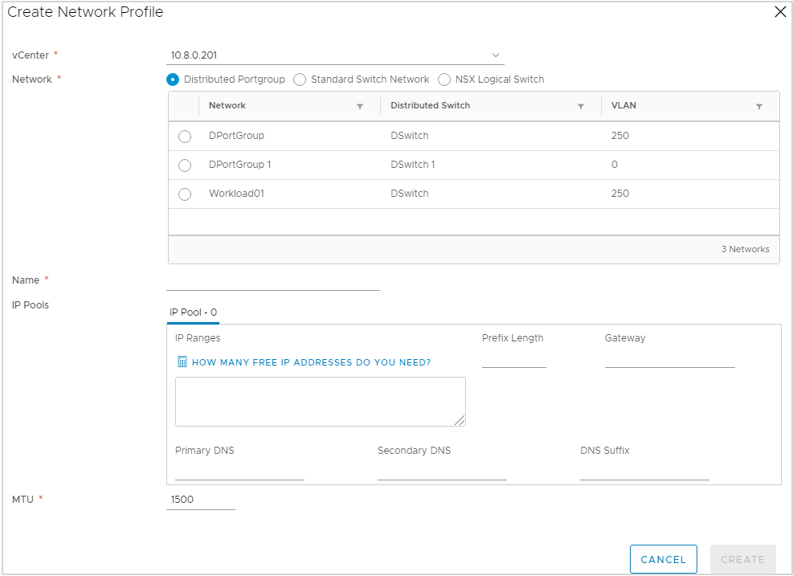

1. For the new network profile, enter the HCX IX and NE IP address ranges (a minimum of two IP addresses is required for IX and NE appliances).
    
   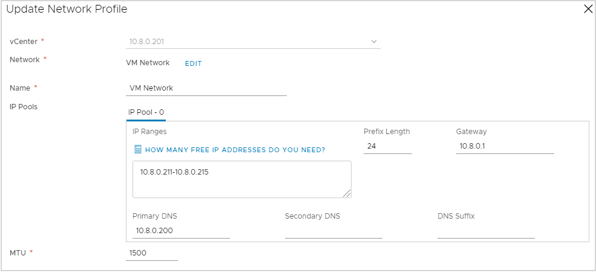
  
   > [!NOTE]
   > The network extension appliance (HCX-NE) has a one-to-one relationship with a distributed virtual switch (DVS).  

1. Now select **Compute profile** > **Create compute profile**.

1. Enter a compute profile name and select **Continue**.  

    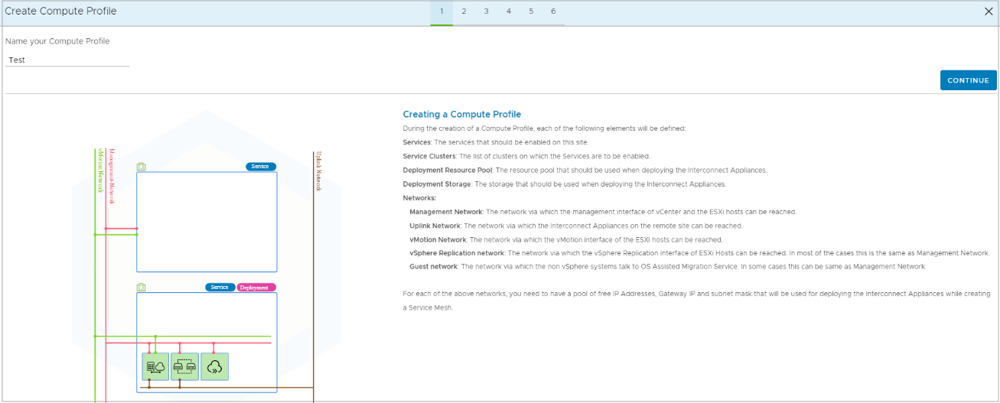

1. Select the services to enable, such as migration, Network Extension, or Disaster Recovery, and then select **Continue**.

    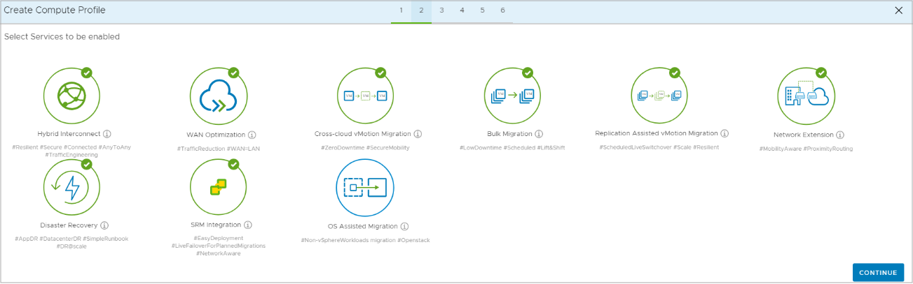

1. In **Select Service Resources**, select one or more service resources for which the selected HCX services should be enabled. Select **Continue**.
    
   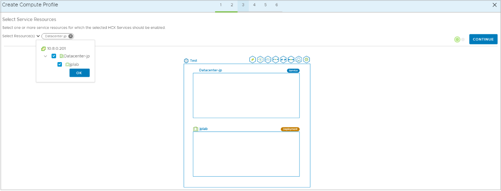
  
   > [!NOTE]
   > Select specific clusters in which source VMs are targeted for migration using HCX.

1. Select **Datastore** and select **Continue**. 
      
    Select each compute and storage resource for deploying the HCX Interconnect appliances. When multiple resources are selected, HCX uses the first resource selected until its capacity is exhausted.  
    
    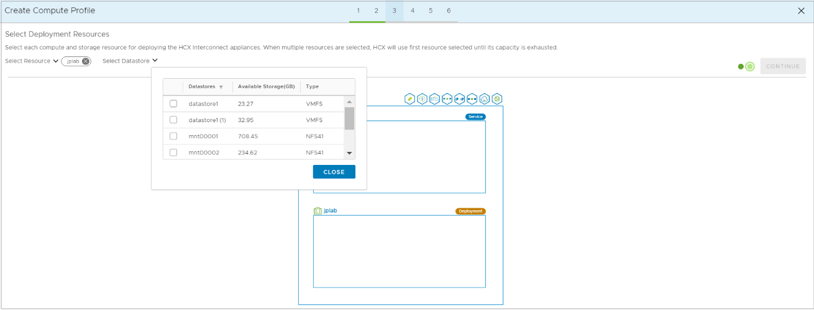

1. Select the management network profile created in **Network Profiles** and select **Continue**.  
      
    Select the network profile through which the management interface of vCenter and the ESXi hosts can be reached. If you haven't already defined such a network profile, you can create it here.  
    
    

1. Select **Network Uplink** and select **Continue**.
      
    Select one or more network profiles so that one of the following is true:  
    * The Interconnect Appliances on the remote site can be reached via this network  
    * The remote-side appliances can reach the local Interconnect Appliances via this network.  
    
    If you have point-to-point networks like Direct Connect which are not shared across multiple sites, you can skip this step, since compute profiles are shared with multiple sites. In such cases, Uplink Network profiles can be overridden and specified during the creation of the Interconnect Service mesh.  
    
    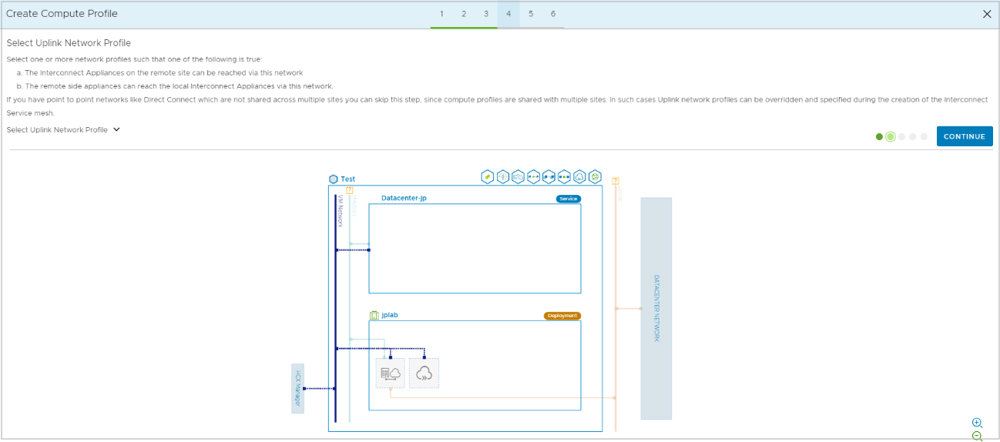

1. Select **vMotion Network Profile** and select **Continue**.
      
   Select the network profile via which the vMotion interface of the ESXi hosts can be reached. If you haven't already defined such a network profile, you can create it here. If you don't have vMotion Network, select **Management Network Profile**.  
    
   

1. From **Select vSphere Replication Network Profile**, select a network profile the vSphere Replication interface of ESXi hosts and then select **Continue**.
      
   In most cases, this profile is the same as the Management Network Profile.  
    
   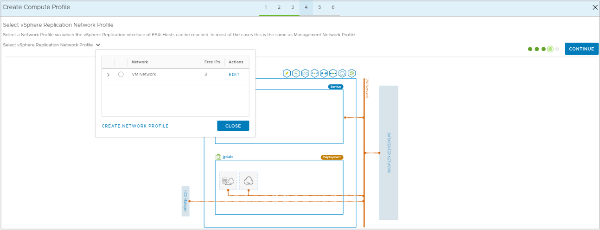

1. From **Select Distributed Switches for Network Extensions**, select the DVS on which you have networks the VMs that will be integrated and are connected.  Select **Continue**.  
      
    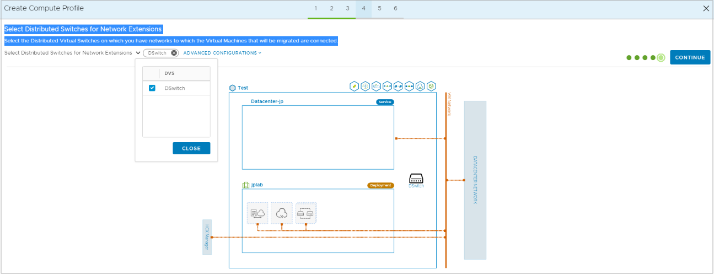

1. Review the connection rules and select **Continue**.  

    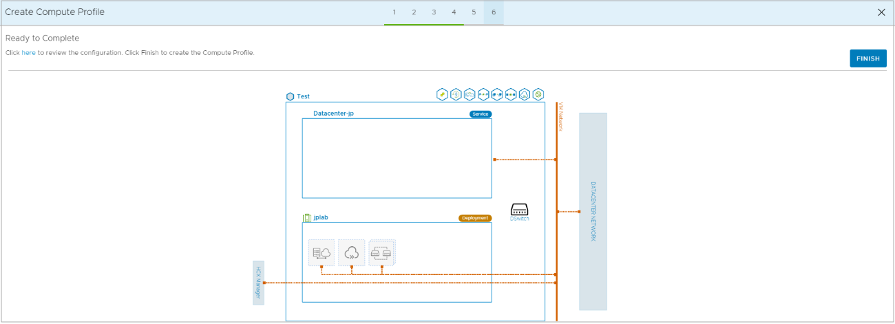

1.  Select **Finish** to create the compute profile.

## Configure Network Uplink

Now configure the network profile change in AVS SDDC for Network Uplink.

1. Sign in to SDDC NSX-T to create a new logical switch, or use an existing logical switch that can be used for Network Uplink between on-premises and AVS SDDC.

1. Create a network profile for HCX uplink in AVS SDDC that can be used for on-premises to AVS SDDC communication.  
    
   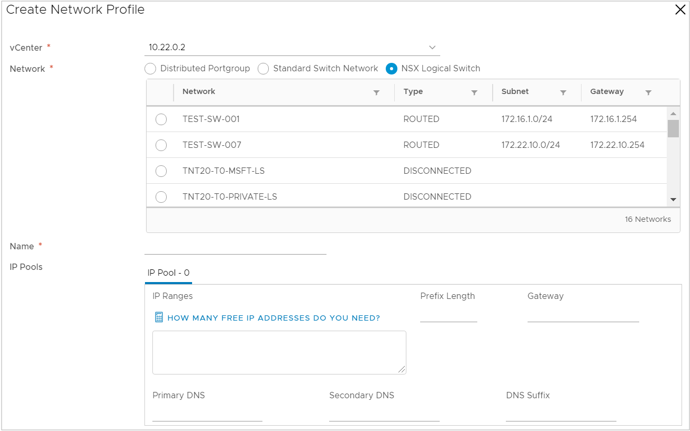

1. Enter a name for the network profile and at least 4-5 free IP addresses based on the L2 network extension required.  
    
   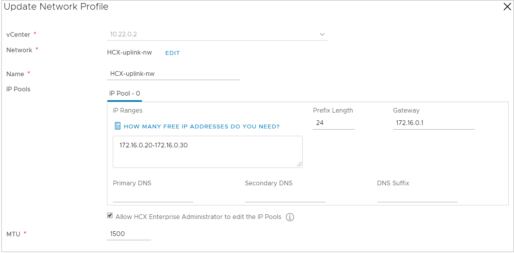

1. Select **Create** to complete the AVS SDDC configuration

## Configure Service Mesh

Now configure Service Mesh between on-premises and AVS SDDC.

1. Sign in to AVS SDDC vCenter and select **HCX**.

2. Under **Infrastructure**, select **Interconnect** > **Service Mesh** > **Create Service Mesh** to configure the network and compute profiles created in previous steps.    
      
    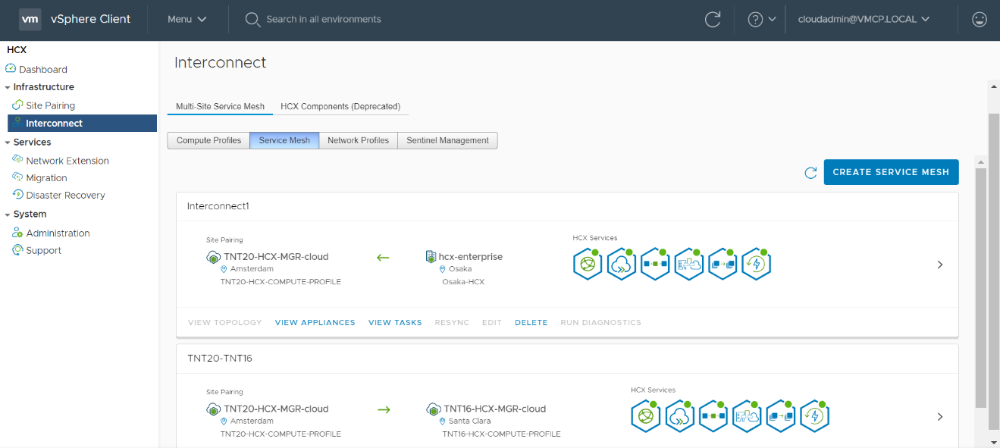

3. Select paired sites to enable hybrid ability and select **Continue**.   
    
    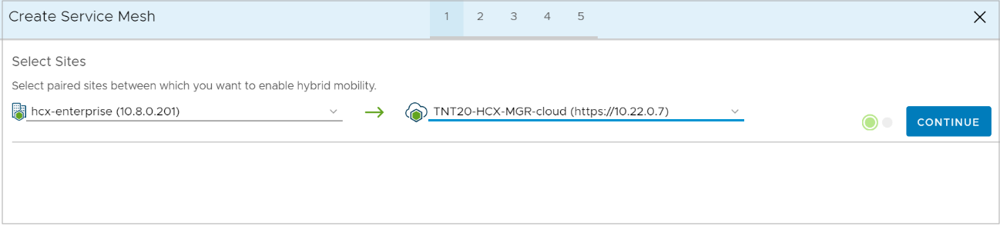

4. Select the source and remote compute profiles to enable hybridity services and select **Continue**.
      
    The selections define the resources, where VMs can consume HCX services.  
      
    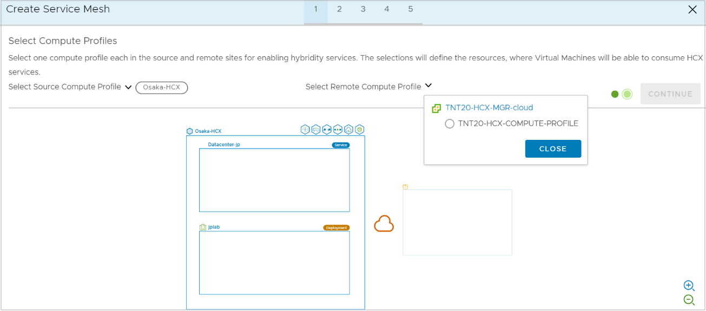

5. Select services to enable and select **Continue**.  
      
    

6. In **Advanced Configuration - Override Uplink Network profiles** select **Continue**.  
      
    Uplink network profiles are used to connect to the network via which the remote site’s interconnect appliances can be reached.  
      
    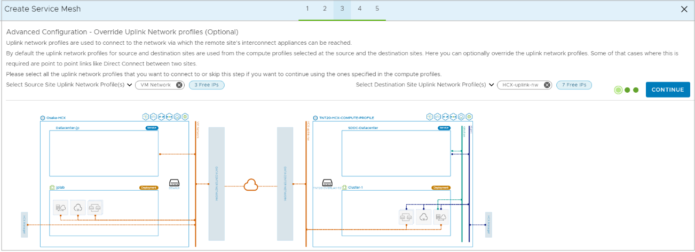

7. Select **Configure the Network Extension Appliance Scale Out**. 
      
    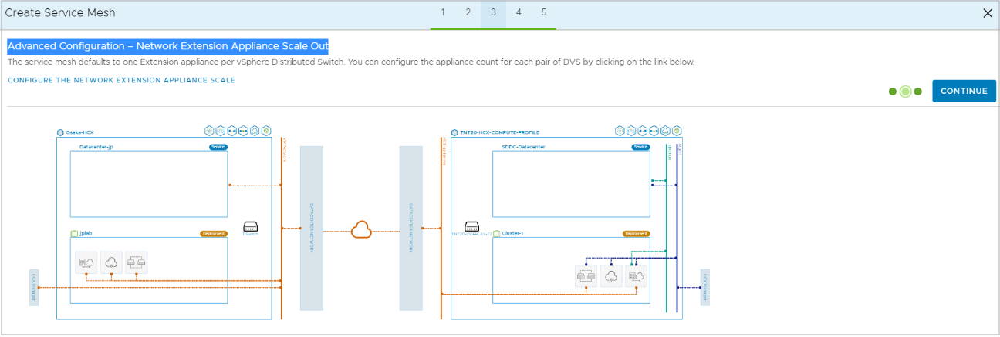

8. Enter the appliance count corresponding to the DVS switch count.  
      
    

9. Select **Continue** to skip.  
      
    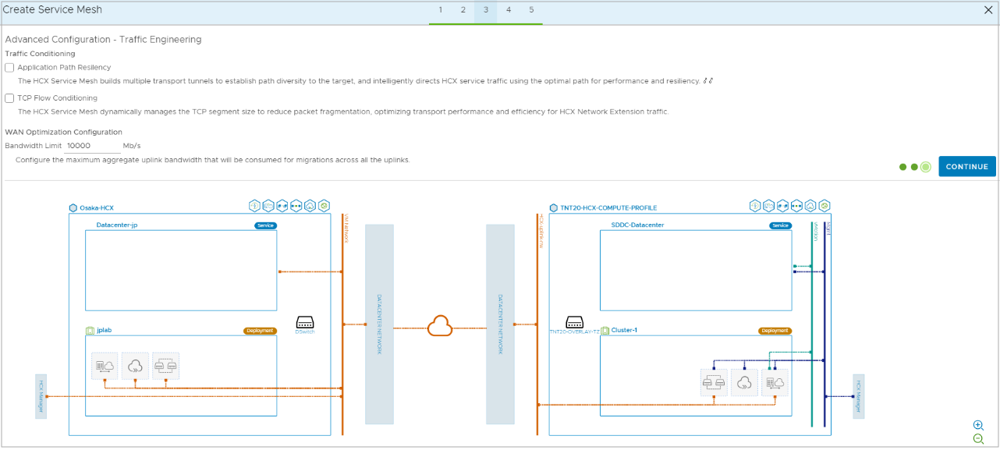

10. Review the topology preview and select **Continue**. 

11. Enter a user-friendly name for this Service Mesh and select **Finish** to complete.  
      
    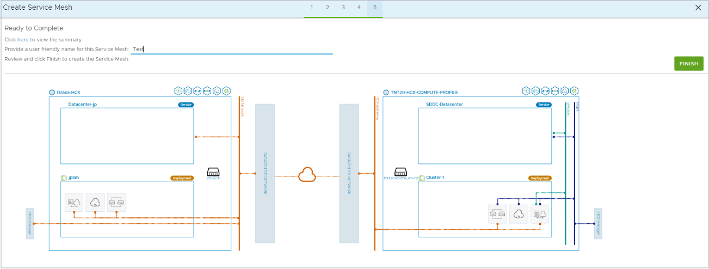

    The Service Mesh is deployed and configured.  
      
    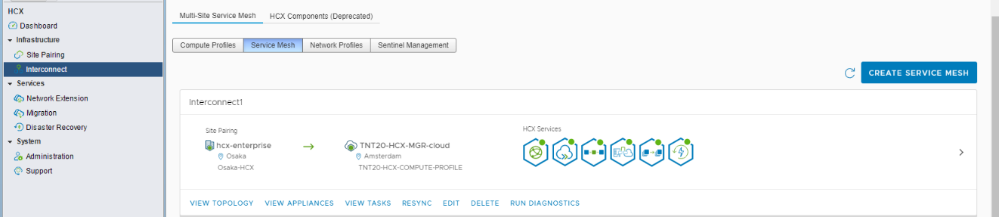

## Check appliance status
To check the status of the appliance, select **Interconnect** > **Appliances**. 
      
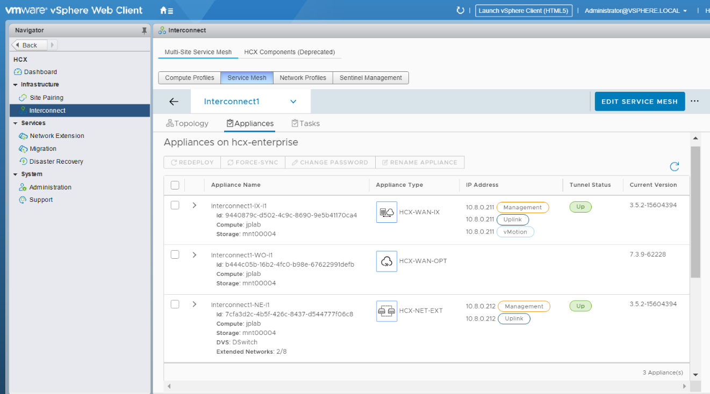

## Next steps

When the appliance interconnect **Tunnel Status** is **UP** and green, you are ready to migrate and protect AVS VMs using HCX. See [VMware HCX documentation](https://docs.vmware.com/en/VMware-HCX/index.html) and [Migrating Virtual Machines with VMware HCX](https://docs.vmware.com/en/VMware-HCX/services/user-guide/GUID-D0CD0CC6-3802-42C9-9718-6DA5FEC246C6.html?hWord=N4IghgNiBcIBIGEAaACAtgSwOYCcwBcMB7AOxAF8g) in the VMware technical documentation.
