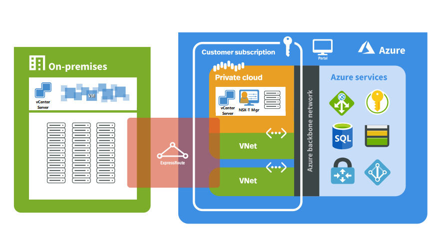

# What is Azure VMware Solution?

Azure VMware Solution provides you with private clouds that contain vSphere clusters, built from dedicated bare-metal Azure infrastructure. The minimum initial deployment is three hosts, but additional hosts can be added one at a time, up to a maximum of 16 hosts per cluster.  All provisioned private clouds have vCenter Server, vSAN, vSphere, and NSX-T. You can migrate workloads from your on-premises environments, deploy new virtual machines (VMs), and consume Azure services from your private clouds.  Azure VMware management tools (vCenter Server and NSX Manager) will be available at least 99.9% of the time. For more information, see [Azure VMware Solution SLA](https://aka.ms/avs/sla).

Azure VMware Solution is a VMware validated solution with on-going validation and testing of enhancements and upgrades. Microsoft manages and maintains private cloud infrastructure and software. It allows you to focus on developing and running workloads in your private clouds. 

The diagram shows the adjacency between private clouds and VNets in Azure, Azure services, and on-premises environments. Network access from private clouds to Azure services or VNets provides SLA-driven integration of Azure service endpoints. ExpressRoute Global Reach connects your on-premises environment to your Azure VMware Solution private cloud. 

## Hosts, clusters, and private clouds

Azure VMware Solution private clouds and clusters are built from a bare-metal, hyper-converged Azure infrastructure host. The high-end hosts have 576-GB RAM and dual Intel 18 core, 2.3-GHz processors. The HE hosts have two vSAN diskgroups with 15.36 TB (SSD) of raw vSAN capacity tier and a 3.2 TB (NVMe) vSAN cache tier.

New private clouds are deployed through the Azure portal or Azure CLI.

## Networking

[!INCLUDE [avs-networking-description](includes/azure-vmware-solution-networking-description.md)]

For more information, see [Networking concepts](concepts-networking.md).

## Access and security

Azure VMware Solution private clouds use vSphere role-based access control for enhanced security. You can integrate vSphere SSO LDAP capabilities with Azure Active Directory. For more information, see the [Access and Identity concepts](concepts-identity.md).  

vSAN data-at-rest encryption, by default, is enabled and is used to provide vSAN datastore security. For more information, see [Storage concepts](concepts-storage.md).

## Host and software lifecycle maintenance

Regular upgrades of the Azure VMware Solution private cloud and VMware software ensure the latest security, stability, and feature sets are running in your private clouds. For more information, see [Private cloud updates and upgrades](concepts-upgrades.md).

## Monitoring your private cloud

Once Azure VMware Solution is deployed into your subscription, [Azure Monitor logs](../azure-monitor/overview.md) are generated automatically. 

In your private cloud, you can:
- Collect logs on each of your VMs.
- [Download and install the MMA agent](../azure-monitor/agents/log-analytics-agent.md#installation-options) on Linux and Windows VMs.
- Enable the [Azure diagnostics extension](../azure-monitor/agents/diagnostics-extension-overview.md).
- [Create and run new queries](../azure-monitor/logs/data-platform-logs.md#log-queries).
- Run the same queries you usually run on your VMs.

Monitoring patterns inside the Azure VMware Solution are similar to Azure VMs within the IaaS platform. For more information and how-tos, see [Monitoring Azure VMs with Azure Monitor](../azure-monitor/vm/monitor-vm-azure.md).

## Customer communication
[!INCLUDE [customer-communications](includes/customer-communications.md)]

## Next steps

The next step is to learn key [private cloud and cluster concepts](concepts-private-clouds-clusters.md).

<!-- LINKS - external -->

<!-- LINKS - internal -->
[concepts-private-clouds-clusters]: ./concepts-private-clouds-clusters.md

