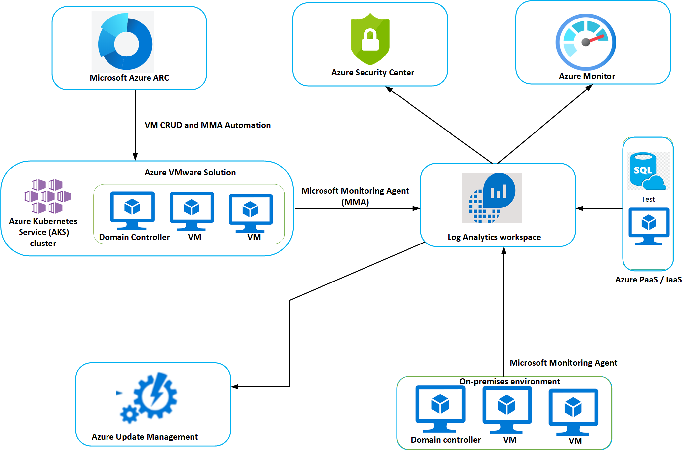

# Lifecycle management of Azure VMware Solution VMs

Microsoft Azure native tools allow you to monitor and manage your virtual machines (VMs) in the Azure environment. Yet they also allow you to monitor and manage your VMs on Azure VMware Solution and your on-premises VMs. In this overview, we'll look at the integrated monitoring architecture Azure offers, and how you can use its native tools to manage your Azure VMware Solution VMs throughout their lifecycle.

## Benefits

- Azure native services can be used to manage your VMs in a hybrid environment (Azure, Azure VMware Solution, and on-premises).
- Integrated monitoring and visibility of your Azure, Azure VMware Solution, and on-premises VMs.
- With Azure Update Management in Azure Automation, you can manage operating system updates for both your Windows and Linux machines. 
- Azure Security Center provides advanced threat protection, including:
    - File integrity monitoring
    - Fileless security alerts
    - Operating system patch assessment
    - Security misconfigurations assessment
    - Endpoint protection assessment 
- Easily deploy the Log Analytics agent using Azure Arc enabled servers VM extension support for new and existing VMs. 
- Your Log Analytics workspace in Azure Monitor enables log collection and performance counter collection using the Log Analytics agent or extensions. Collect data and logs to a single point and present that data to different Azure native services. 
- Added benefits of Azure Monitor include: 
    - Seamless monitoring 
    - Better infrastructure visibility 
    - Instant notifications 
    - Automatic resolution 
    - Cost efficiency 

## Integrated Azure monitoring architecture

The following diagram shows the integrated monitoring architecture for Azure VMware Solution VMs.

## Before you start

If you are new to Azure or unfamiliar with any of the services previously mentioned, review the following articles:

- [Automation account authentication overview](../automation/automation-security-overview.md)
- [Designing your Azure Monitor Logs deployment](../azure-monitor/platform/design-logs-deployment.md) and [Azure Monitor](../azure-monitor/overview.md)
- [Planning](../security-center/security-center-planning-and-operations-guide.md) and [Supported platforms](../security-center/security-center-os-coverage.md) for Azure Security Center
- [Enable Azure Monitor for VMs overview](../azure-monitor/insights/vminsights-enable-overview.md)
- [What is Azure Arc enabled servers?](../azure-arc/servers/overview.md) and [What is Azure Arc enabled Kubernetes?](../azure-arc/kubernetes/overview.md)
- [Update Management overview](../automation/update-management/overview.md)

## Integrating and deploying Azure native services

### Enable Azure Update Management

Azure Update Management in Azure Automation manages operating system updates for your Windows and Linux machines in a hybrid environment. It monitors patching compliance and forwards patching deviation alerts to Azure Monitor for remediation. Azure Update Management must connect to your Log Analytics workspace to use stored data to assess the status of updates on your VMs.

1.  Before you can add Log Analytics to Azure Update Management, you first need to [Create an Azure Automation account](../automation/automation-create-standalone-account.md). If you prefer to create your account using a template, see [Create an Automation account using an Azure Resource Manager template](../automation/quickstart-create-automation-account-template.md).

2. **Log Analytics workspace** enables log collection and performance counter collection using the Log Analytics agent or extensions. To create your Log Analytics workspace, see [Create a Log Analytics workspace in the Azure portal](../azure-monitor/learn/quick-create-workspace.md). If you prefer, you can also create a workspace via [CLI](../azure-monitor/learn/quick-create-workspace-cli.md), [PowerShell](../azure-monitor/platform/powershell-workspace-configuration.md), or [Azure Resource Manager template](../azure-monitor/samples/resource-manager-workspace.md).

3. To enable Azure Update Management for your VMs, see [Enable Update Management from an Automation account](../automation/update-management/update-mgmt-enable-automation-account.md). In the process, you will link your Log Analytics workspace with your automation account. 
 
4. Once you've added VMs to Azure Update Management, you can [Deploy updates on VMs and review results](../automation/update-management/deploy-updates.md). 

### Enable Azure Security Center

Azure Security Center provides advanced threat protection across your hybrid workloads in the cloud and on premises. It will assess the vulnerability of Azure VMware Solution VMs and raise alerts as needed. These security alerts can be forwarded to Azure Monitor for resolution.

Azure Security Center does not require deployment. For more information, see a list of [Supported features for virtual machines](../security-center/security-center-services.md).

1. To add Azure VMware Solution VMs and non-Azure VMs to Security Center, see [Quickstart: Setting up Azure Security Center](../security-center/security-center-get-started.md). 

2. After adding Azure VMware Solution VMs or VMs from a non-Azure environment, enable Azure Defender in Security Center. Security Center will assess the VMs for potential security issues. It also provides recommendations in the Overview tab. For more information, see [Security recommendations in Azure Security Center](../security-center/security-center-recommendations.md).

3. You can define security policies in Azure Security Center. For information on configuring your security policies, see [Working with security policies](../security-center/tutorial-security-policy.md).

### Onboard VMs to Azure Arc enabled servers

Azure Arc extends Azure management to any infrastructure, including Azure VMware Solution, on-premises, or other cloud platforms.

- See [Connect hybrid machines to Azure at scale](../azure-arc/servers/onboard-service-principal.md) to enable Azure Arc enabled servers for multiple Windows or Linux VMs.

### Onboard hybrid Kubernetes clusters with Arc enabled Kubernetes

You can attach a Kubernetes cluster hosted in your Azure VMware Solution environment using Azure Arc enabled Kubernetes. 

- See [Create an Azure Arc-enabled onboarding Service Principal](../azure-arc/kubernetes/create-onboarding-service-principal.md).

### Deploy the Log Analytics agent

Azure VMware Solution VMs can be monitored through the Log Analytics agent (also referred to as Microsoft Monitoring Agent (MMA) or OMS Linux agent). You already created a Log Analytics workspace while enabling Azure Automation Update Management.

- Deploy the Log Analytics agent by using [Azure Arc enabled servers VM extension support](../azure-arc/servers/manage-vm-extensions.md).

### Enable Azure Monitor

Azure Monitor is a comprehensive solution for collecting, analyzing, and acting on telemetry from your cloud and on-premises environments. It requires no deployment. With Azure Monitor, you can monitor guest operating system performance and discover and map application dependencies for Azure VMware Solution or on-premises VMs.

- Azure Monitor allows you to collect data from different sources to monitor and analyze. For more information, see [Sources of monitoring data for Azure Monitor](../azure-monitor/platform/data-sources.md).

- Collect different types of data for analysis, visualization, and alerting. For more information, see [Azure Monitor data platform](../azure-monitor/platform/data-platform.md).

- To configure Azure Monitor with your Log Analytics workspace, see [Configure Log Analytics workspace for Azure Monitor for VMs](../azure-monitor/insights/vminsights-configure-workspace.md).

- You can create alert rules to identify issues in your environment, like high use of resources, missing patches, low disk space, and heartbeat of your VMs. You can also set an automated response to detected events by sending an alert to IT Service Management (ITSM) tools. Alert detection notification can also be sent via email. To create such rules, see:
    - [Create, view, and manage metric alerts using Azure Monitor](../azure-monitor/platform/alerts-metric.md).
    - [Create, view, and manage log alerts using Azure Monitor](../azure-monitor/platform/alerts-log.md).
    - [Action rules](../azure-monitor/platform/alerts-action-rules.md) to set automated actions and notifications.
    - [Connect Azure to ITSM tools using IT Service Management Connector](../azure-monitor/platform/itsmc-overview.md).
