# How to manage DHCP in Azure VMWare Solution (AVS)

NSX-T provides the ability to configure a DHCP for your private cloud. If you plan to use NSX-T to host your DHCP server, see [Create DHCP server](#create-dhcp-server). Otherwise, if you have a 3rd party external DHCP server in your network and you want to relay requests to that DHCP server, see [Configure DHCP relay service](#configure-dhcp-relay).

## Create DHCP server

Use the following steps to configure a DHCP server on NSX-T.

1. From NSX manager, navigate to the **Networking** tab and select **DHCP** under **IP Management**.

   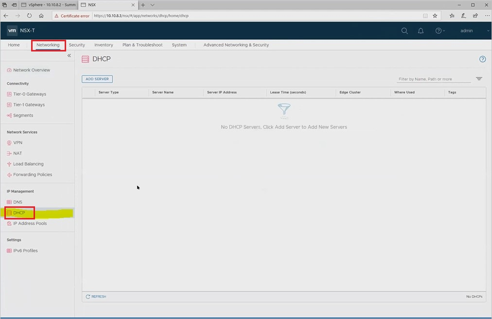

1. Click on the **ADD SERVER** button. Then provide the server name and server IP address. Once done, click **Save**.

   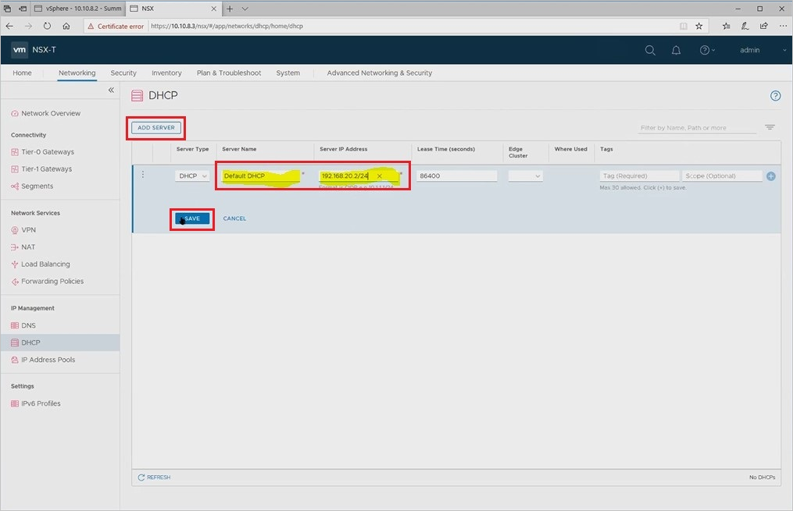

1. Connect DHCP server to the tier1 gateway.

1. Click on **Tier 1 Gateways**, select the gateway and click **Edit**

   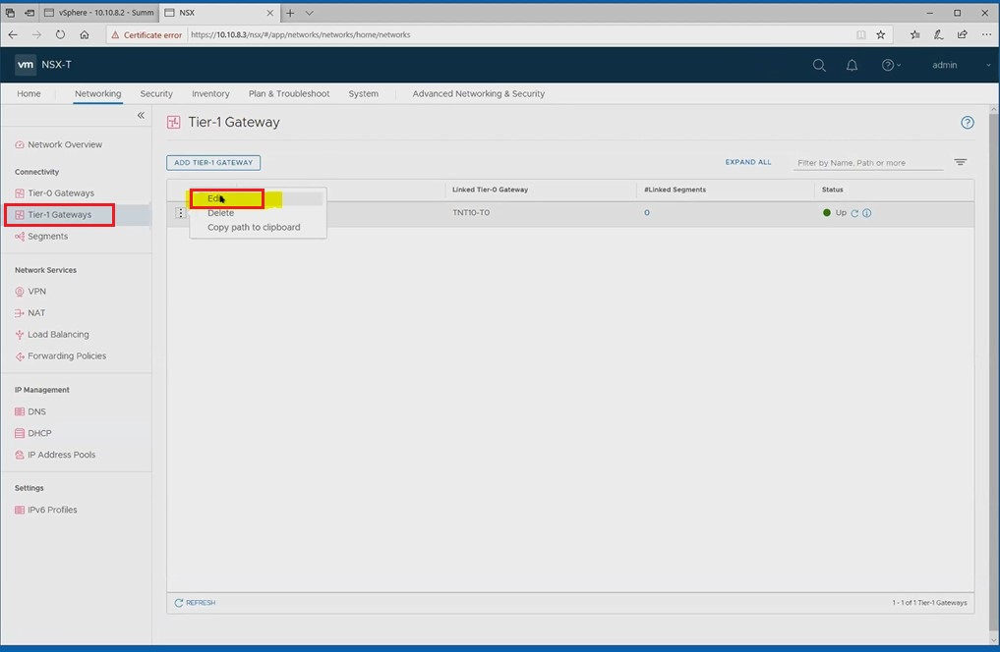

1. Add a subnet by clicking on **No IP Allocation Set**

   

1. On the next screen, select **DHCP Local Server** from the **Type** dropdown. For **DHCP Server**, select **Default DHCP** and click **Save**.

    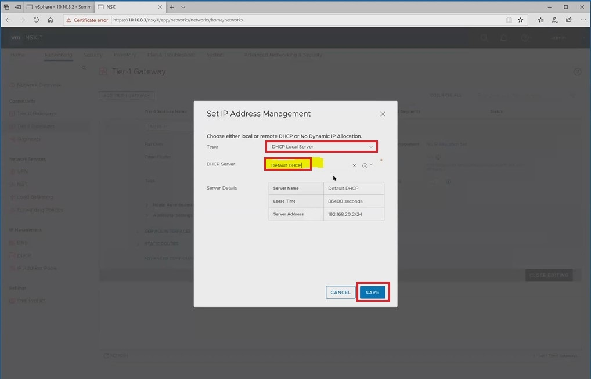

1. On the **Tier -1 Gateway** window, click **Save**. On the next screen you'll see **Changes Saved**, click **Close Editing** to finish.

    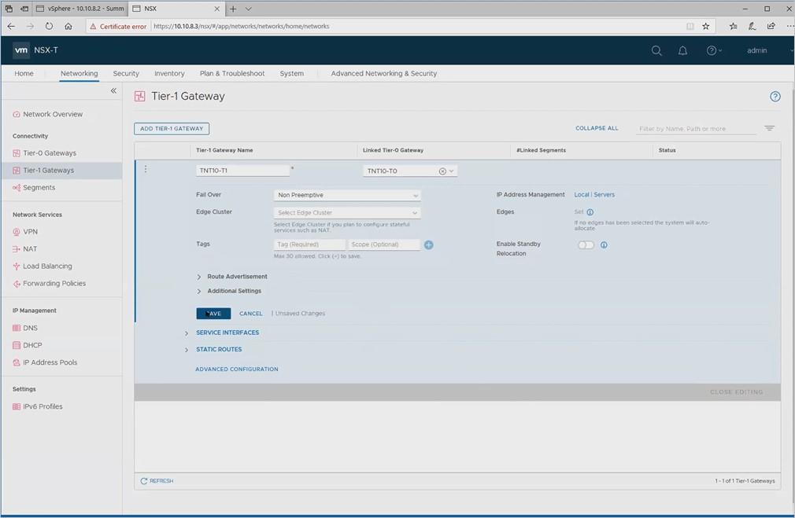

Once you've created your DHCP Server, you'll need to add network segments to it.

1. In NSX-T, select the **Networking** tab and select **Segments** under **Connectivity**. Click **ADD SEGMENT**. Name the segment and connection to the Tier-1 Gateway.

   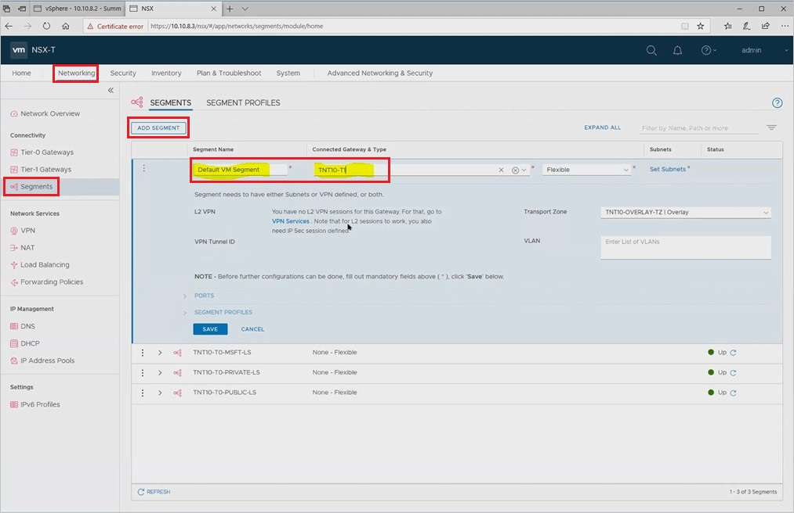

1. Next, click **Set Subnets** to configure a new subnet.

   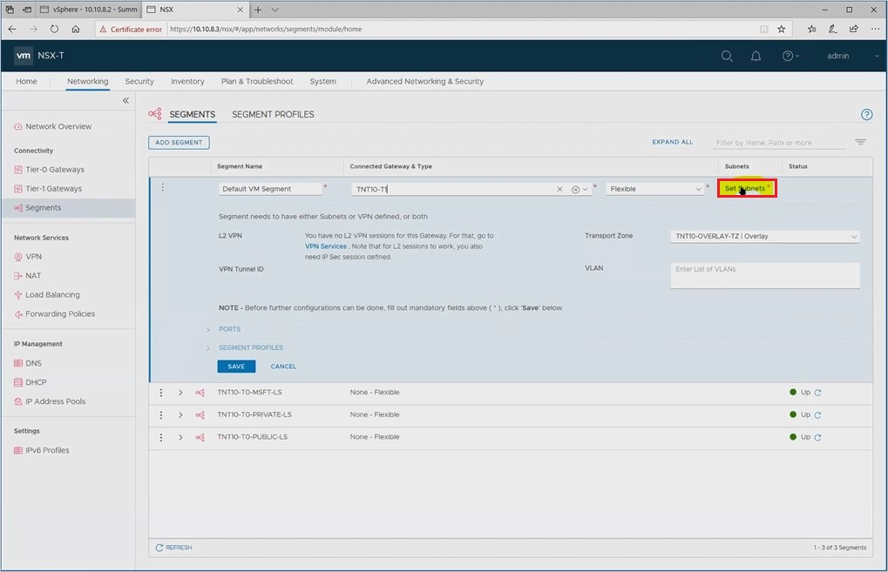

1. On the **Set Subnets** window, click **ADD SUBNET**. Enter the Gateway IP address and the DHCP range and click **Add**.

   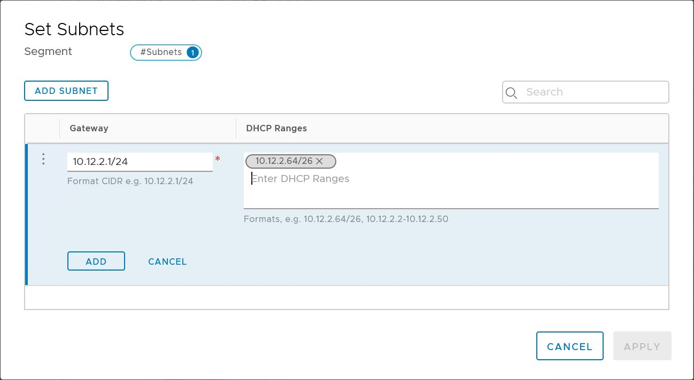

1. On the next window, click **APPLY**.

1. When complete, click **Save** to complete adding a network segment.

   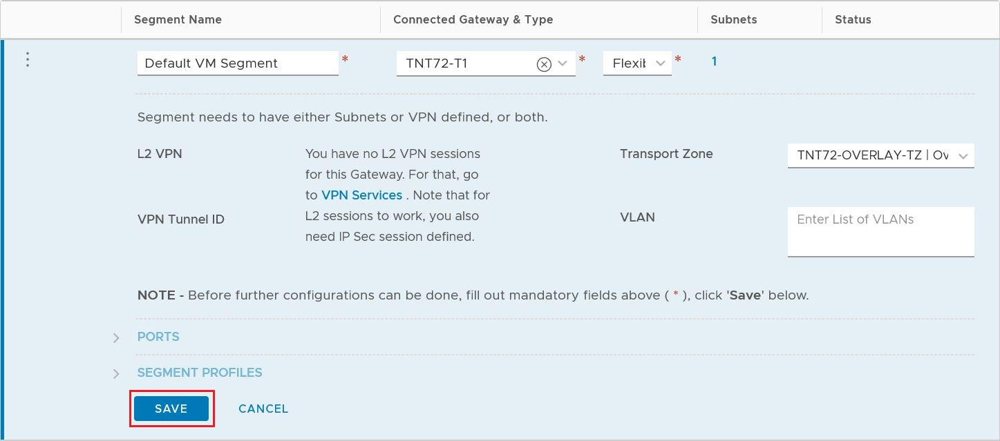

## Create DHCP Relay service

1. In the NXT-T window, select the **Networking** tab, and under **IP Management**, select **DHCP**. Click **ADD SERVER**. Choose DHCP Relay for the **Server Type** and enter the server name and IP address for the relay server. Click **Save** to save your changes.

   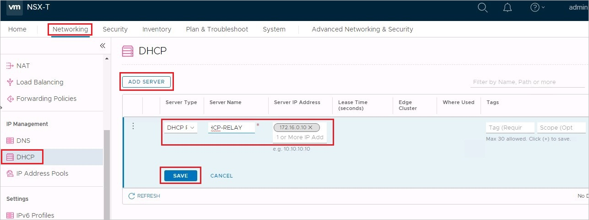

1. Select **Tier-1 Gateways** under **Connectivity**. Click the vertical ellipsis on the Tier-1 gateway and choose **Edit**.

   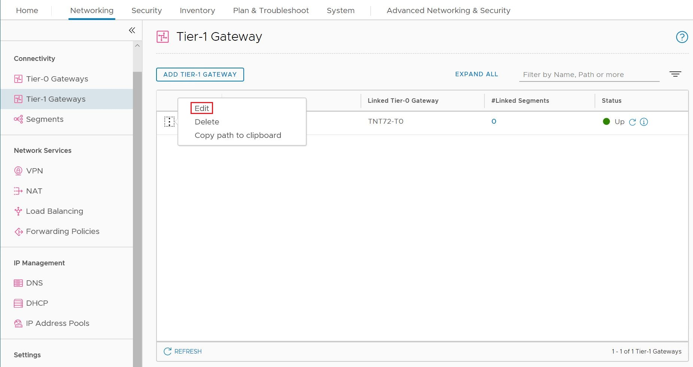

1. Click **No IP Allocation Set** to define the IP address allocation.

   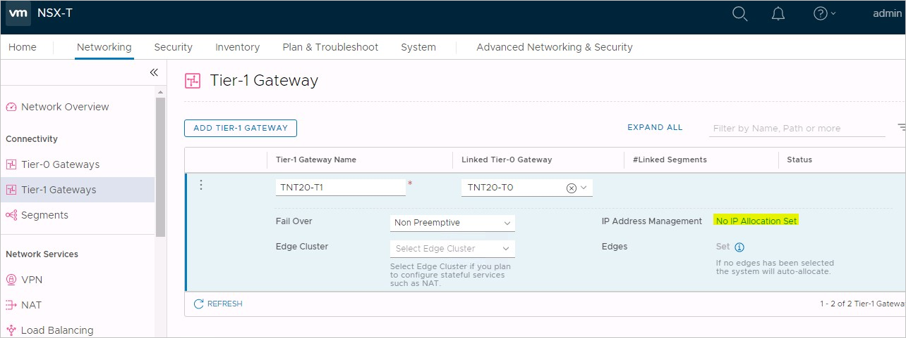

1. Into the dialog box, for **Type**, select **DHCP Relay Server**. In the **DHCP Relay** dropdown, select your DHCP relay server. When finished, click **Save**

   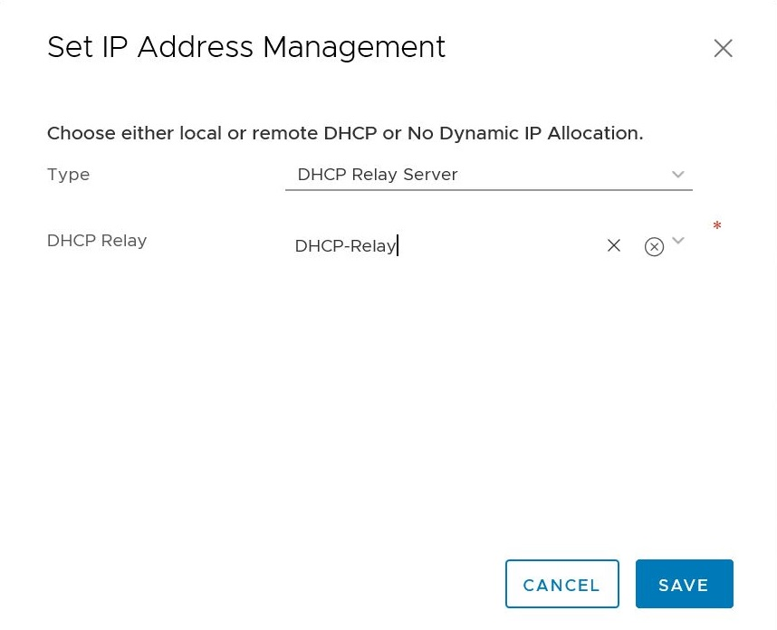

1. Specify a DHCP Range IP on Segment:

   > [!NOTE]
   > This configuration is required to realize DHCP relay functionality on the DHCP Client Segment. 
release.

1. Under **Connectivity**, select **Segments**. Click the vertical ellipses and select **Edit**. Instead, if you wanted to add a new segment, you can click **Add Segment** to create a new segment.

   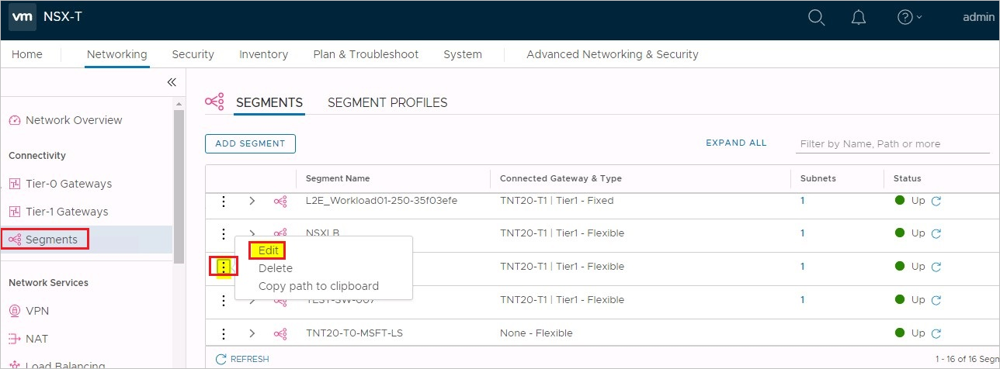

1. You'll see details about the segment. Click the value under **Subnets** to add or modify the subnet.

   

1. Click the vertical ellipses and choose **Edit**. If you need to create a new subnet, click **Add Subnet** to create a Gateway and configure a DHCP range.

   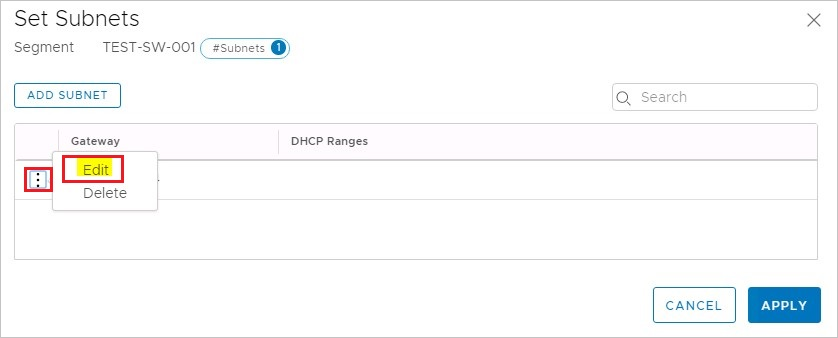

1. Provide the Range of the IP pool and click **Apply**

   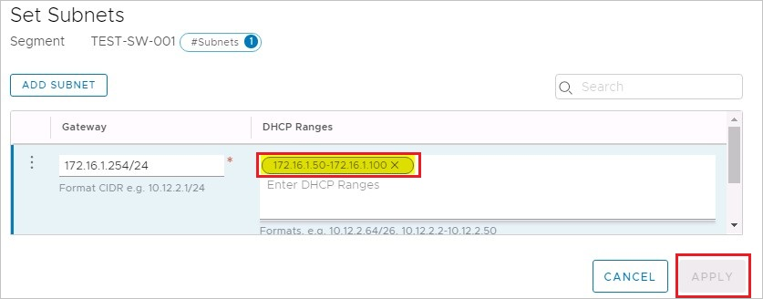

1. A DHCP server pool is assigned to the segment.

   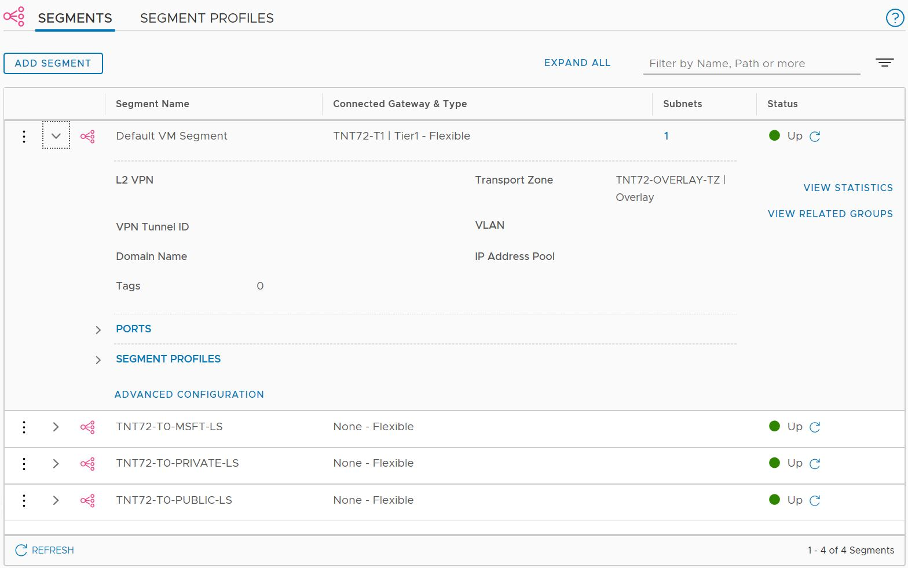
