# How to manage DHCP in AVS
## Create DHCP server

**Steps**

1. From NSX manager navigate to the Networking tab.

   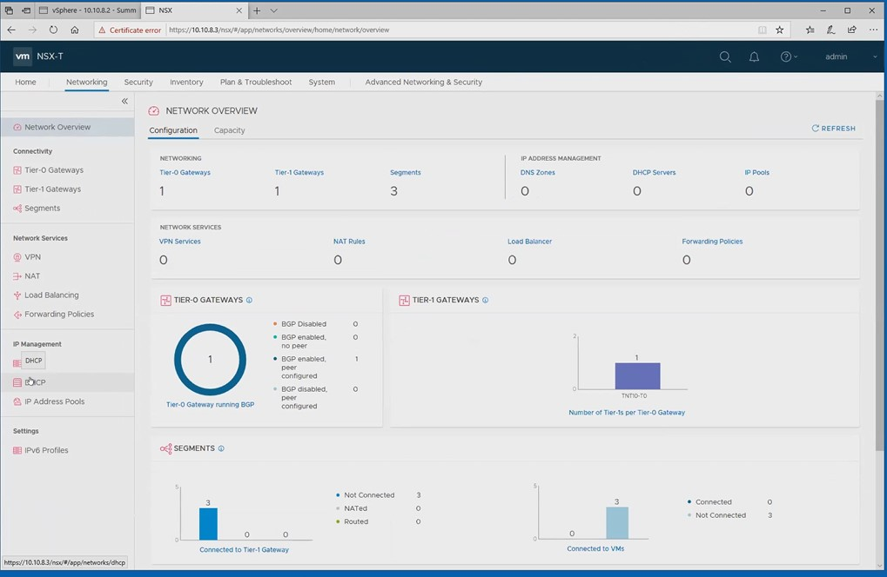

2. Under IP Management click on the DHCP button

   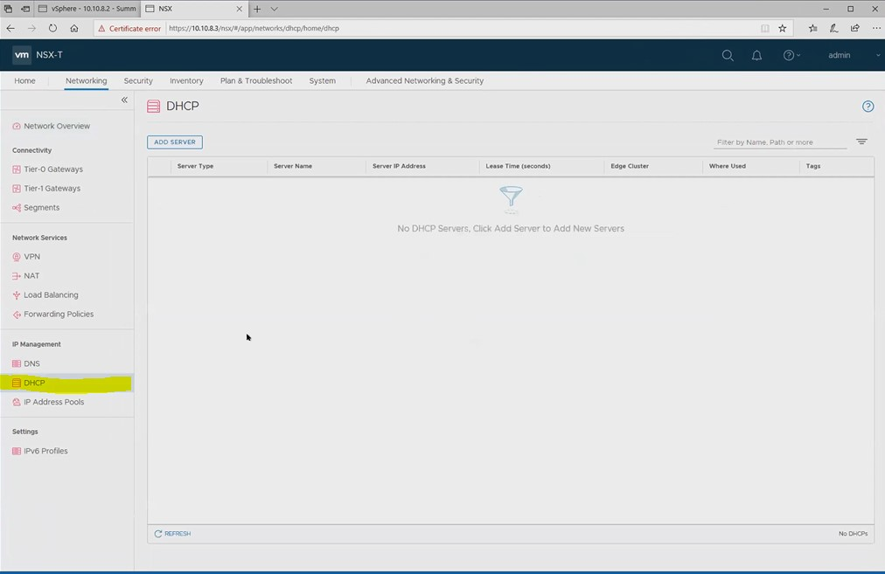

3. Click on the ADD SERVER button.H

   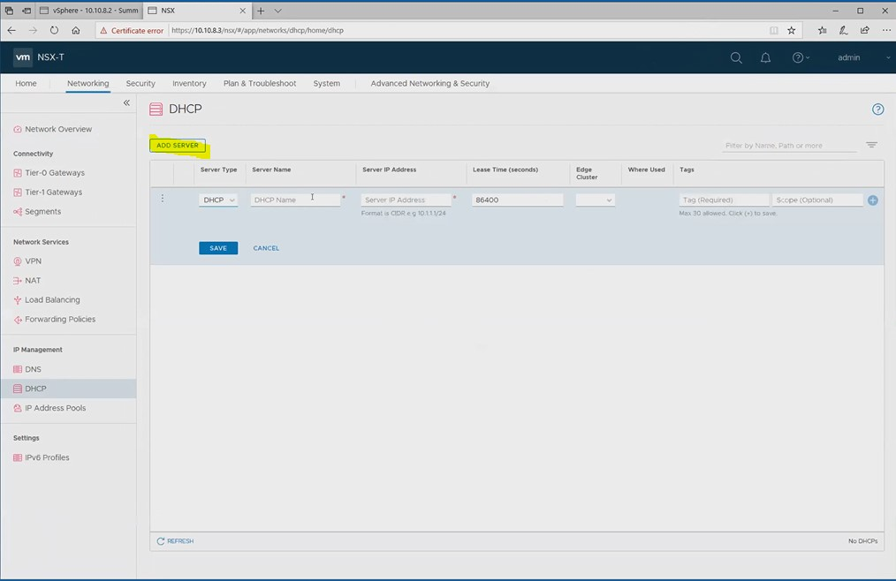

4. Provide the server name.

5. Provide the server IP address and click save

   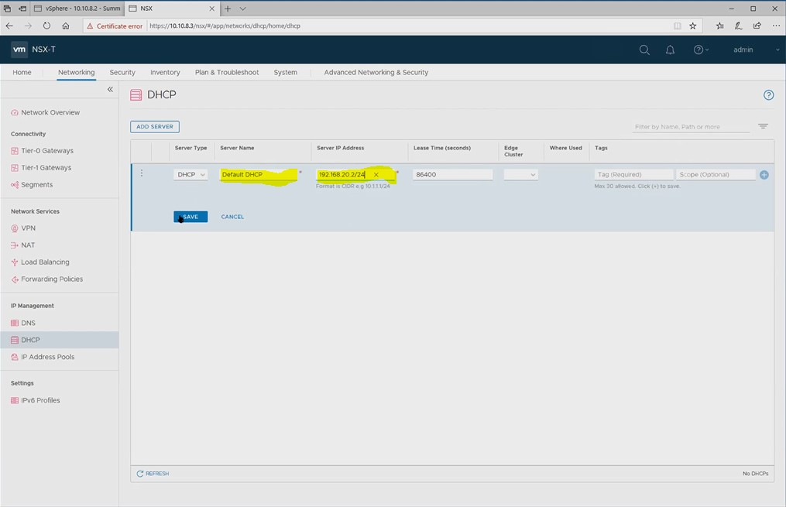

6. Connect DHCP ser to the tier1 gateway.

7. Click on Tier 1 Gateways and select the gateway.

   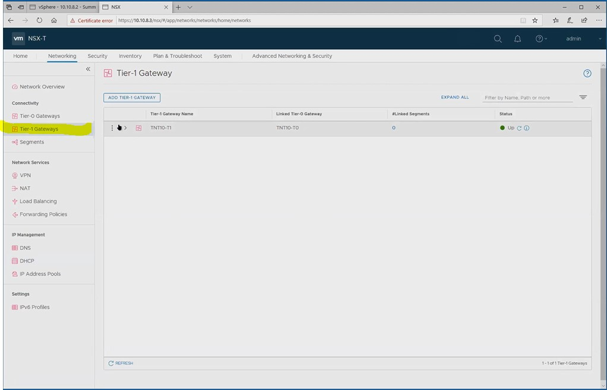

8. Click on edit

   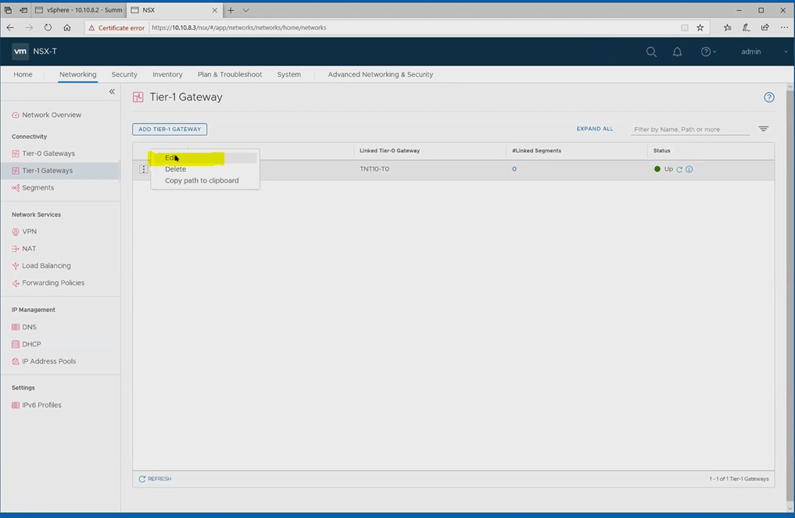

9. Add a subnet by clicking on No IP Allocation Set

   

10. Set IP management to DHCP Local Server

    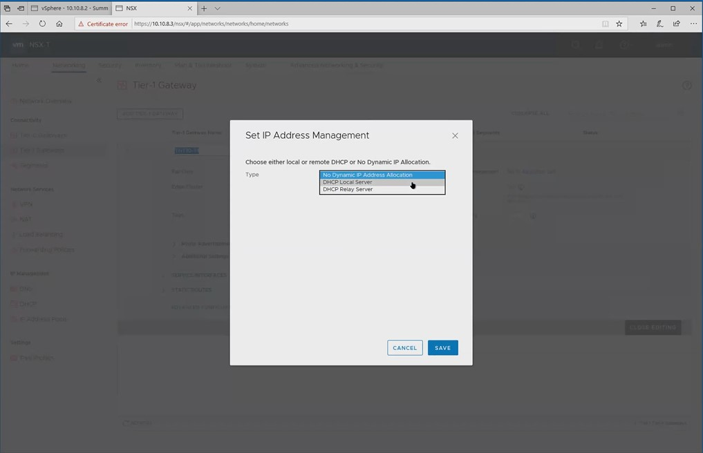

11. Select Default Server and click save.

    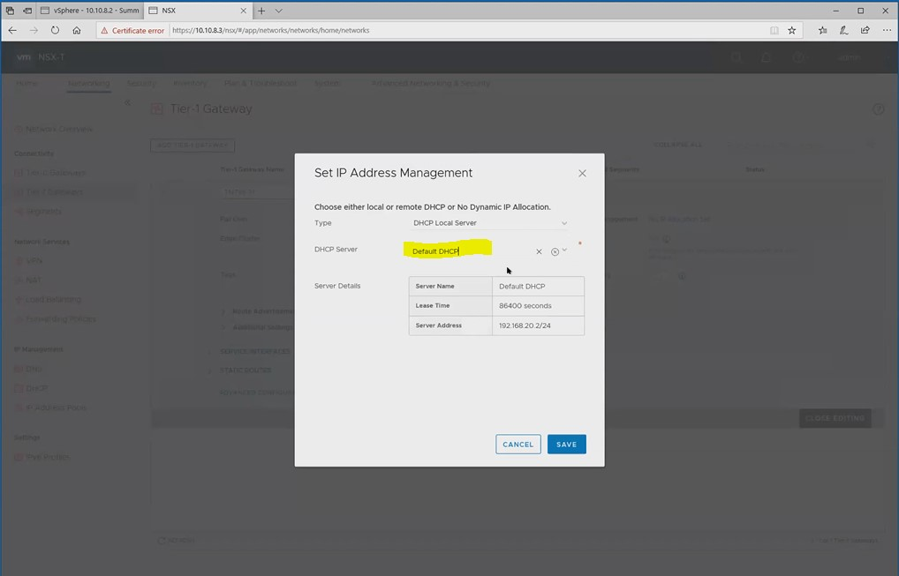

12. Then click save on the Tier-1 Gateway

    

13. You should see "Changes Saved" then close editing.

    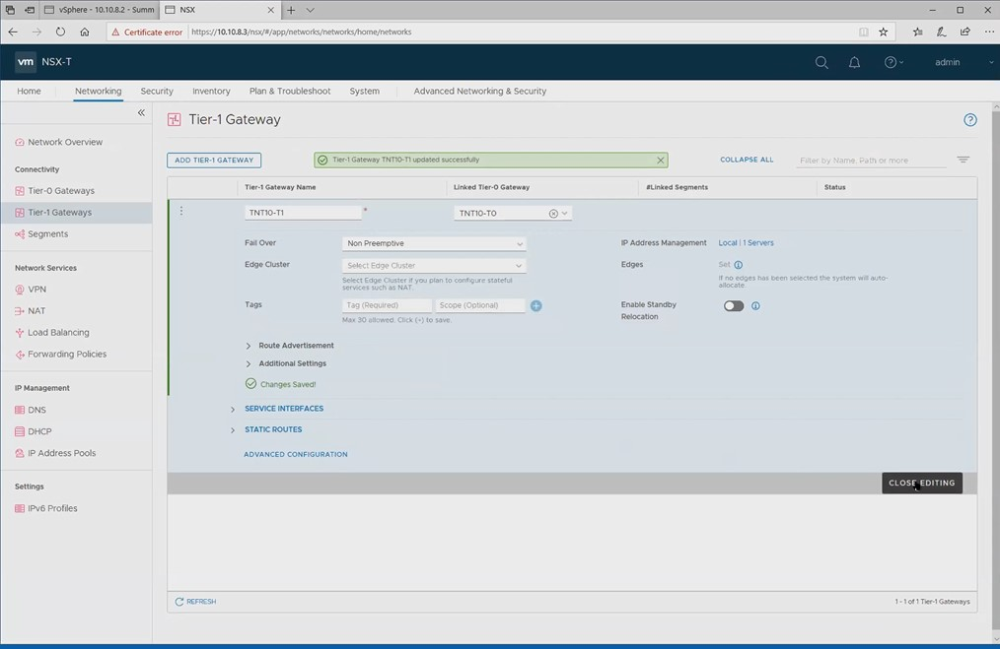

## Create Network Segments

In this exercise will add network segments to our DHCP server.

Steps

1. Click on the Segments tab.

   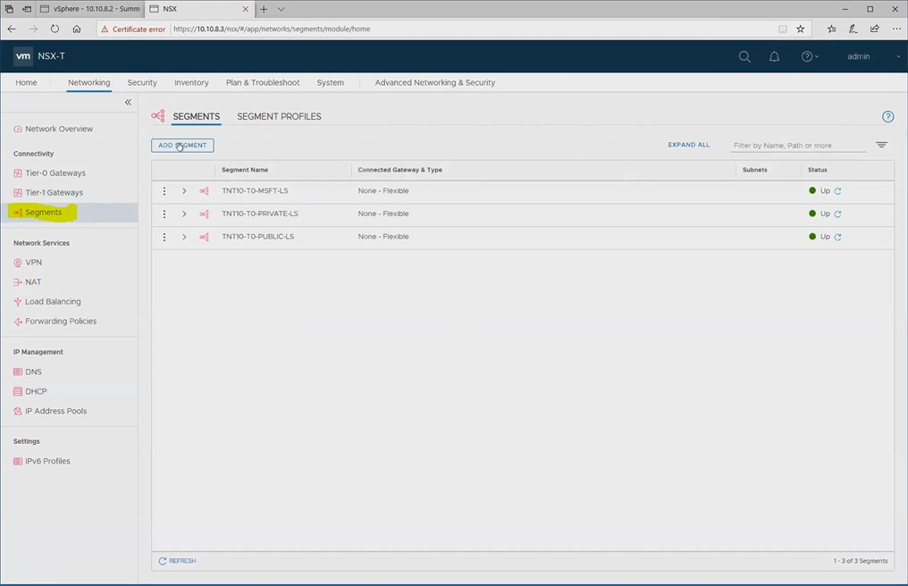

2. Click on ADD Segment

   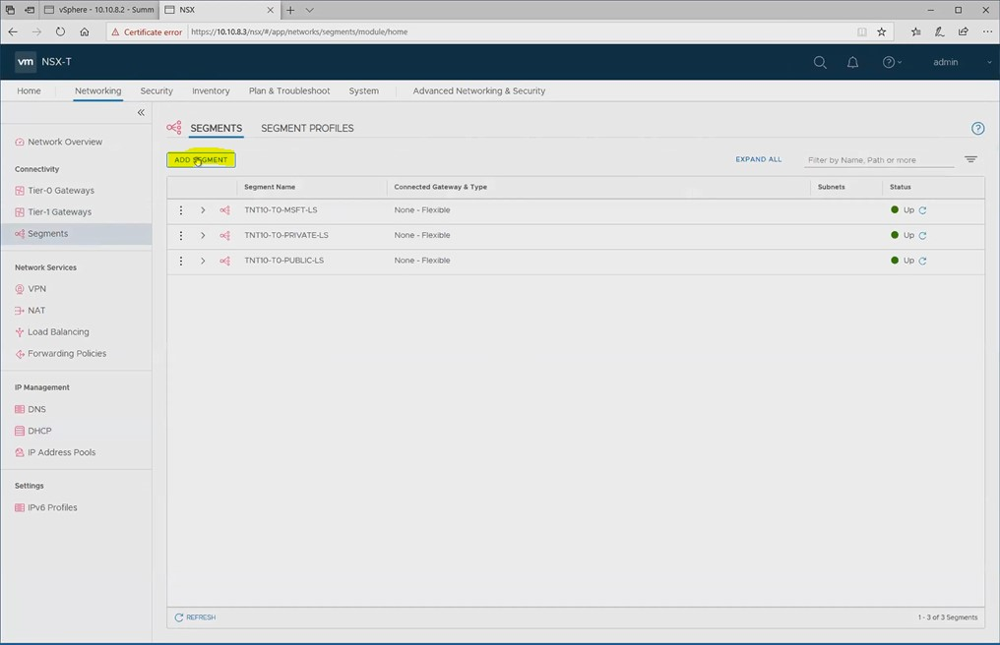

3. Name the Segment and connection to the Tier-1 Gateway

   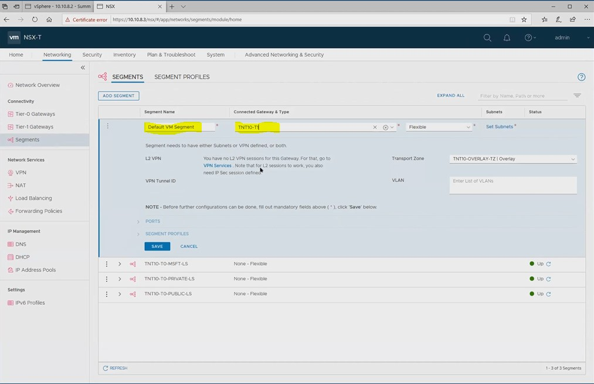

4. Then click Set Subnets

   

5. Click on ADD SUBNET

   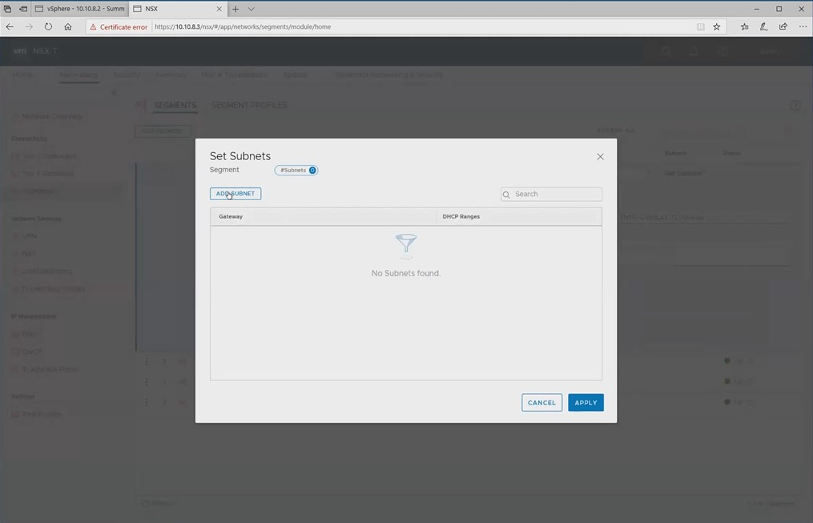

6. Enter the Gateway IP address and the DHCP range

   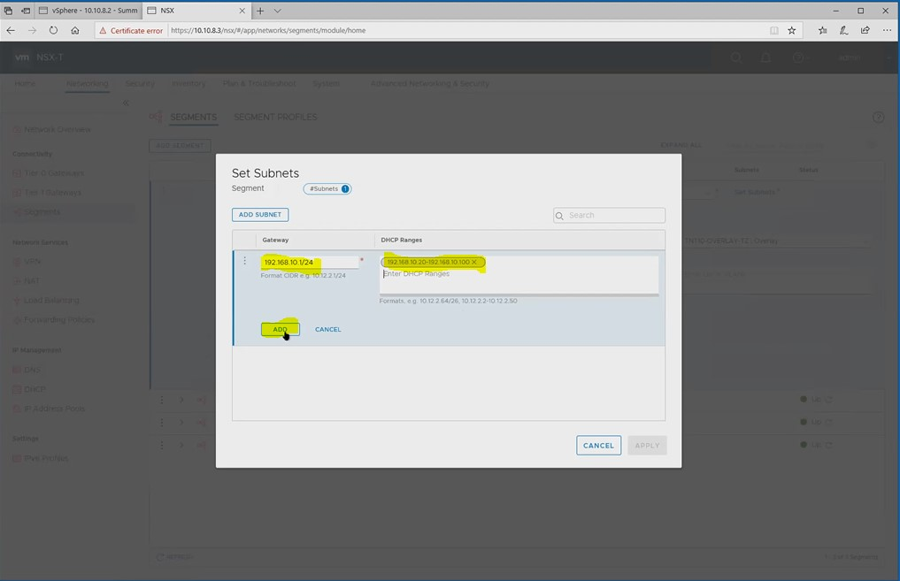

7. Then click APPLY

   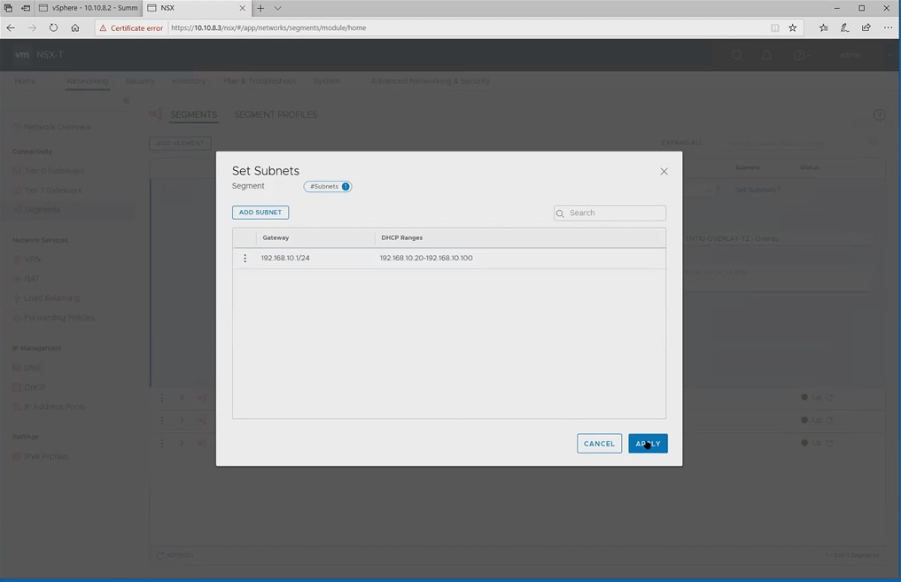

8. Then click SAVE

   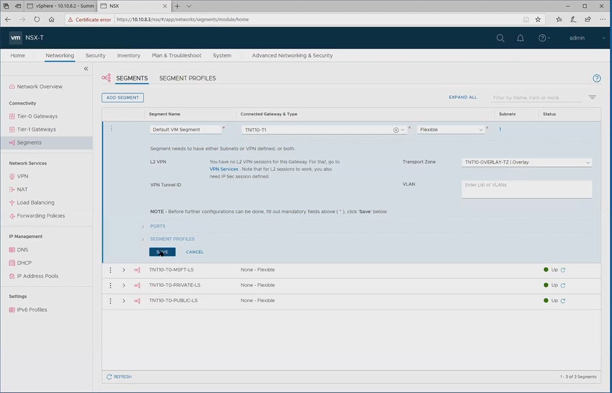