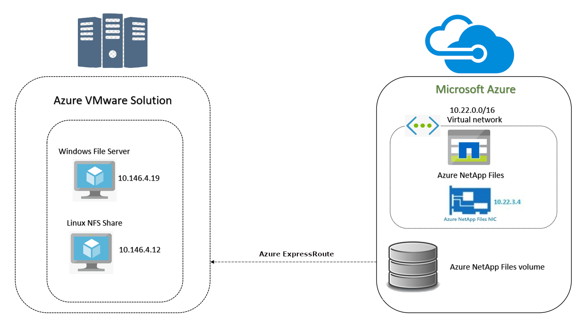

# NetApp Files for Azure VMware Solution

In this article, we'll walk through the steps of integrating Azure NetApp Files with Azure VMware Solution-based workloads. [Azure NetApp Files](../azure-netapp-files/azure-netapp-files-introduction.md) is an Azure service for migrating and running enterprise file workloads in the cloud with no code changes. It enables easy migration of data across on-premises and cloud infrastructures. Rapid, security-enhanced data synchronization simplifies migration and DevOps scenarios with capabilities like instantaneous snapshot, restore, and Active Directory integration.

## Topology

In this scenario, to test and verify the Azure NetApp Files pool share, Azure NetApp Files is configured on Azure with capacity pool, volume pool, and subnet. We've used the NFS protocol. Both Azure NetApp Files and Azure VMware Solution are created in the same Azure region, East US. Connection to Azure VMware Solution is via Azure ExpressRoute.

## Prerequisites 

> [!div class="checklist"]
> * Azure subscription with Azure NetApp Files
> * Subnet for Azure NetApp File
> * Linux VM on Azure VMware Solution
> * Windows VM on Azure VMware Solution

## Verify configuration of Azure NetApp Files 

First, verify the configuration of Azure NetApp Files, created in Azure on a premium disk.

1. In the Azure portal, under **STORAGE**, select **Azure NetApp Files**. A list of your configured Azure NetApp Files will show.

    :::image type="content" source="media/net-app-files/azure-net-app-files-list.png" alt-text="List of Azure NetApp Files."::: 

2. If you select a NetApp account, you can view various settings. For example, if you select **Contoso-anf2**, you'll see its settings. 

    :::image type="content" source="media/net-app-files/net-app-settings.png" alt-text="View settings of a NetApp account."::: 

3. Select **Capacity pools** to verify the configured pool. 

    :::image type="content" source="media/net-app-files/capacity-pools.png" alt-text="Verify configured pool.":::

    You can see that the storage pool is configured as 4 TiB with premium disk.

4. Select **Volumes** (see screenshot from step 2), to view volumes created under the capacity pool.  

    :::image type="content" source="media/net-app-files/azure-net-app-volumes.png" alt-text="Azure NetApp Files volume.":::

5. Select a volume to view its configuration.  

    :::image type="content" source="media/net-app-files/configuration-of-volume.png" alt-text="Configuration details of a volume.":::

    You can see that the anfpool volume pool, with 200 GiB, was created as a NetApp Files share. A private IP virtual network was created for Azure NetApp Files that gives the NFS path to mount on the Azure VMware Solution VMs. 

## Protocols supported by Azure NetApp Files  

Azure NetApp Files supports Server Message Block (SMB) and Network File System (NFS) share mapping. 

- **SMB share**: To deploy an SMB volume, you need to first create an Active Directory connection. The specified domain controllers have to be accessible by the delegated subnet of Azure NetApp Files for a successful connection. Once Active Directory is configured within the Azure NetApp Files account, it will appear as a selectable item when creating SMB volumes. 

- **NFS share**: Azure NetApp Files contributes to creating volumes by using NFS (NFSv3 and NFSv4.1), SMBv3, or a dual protocol (NFSv3 and SMB). A volume's capacity consumption counts against its pool's provisioned capacity. NFS can be mounted to a Linux server by using a command line.

## Create Azure NetApp Files 

1. Log in to the [Azure portal](https://rc.portal.azure.com/#home). Under Azure Services, select **Azure NetApp Files**. 

2. Select **+ Add** to create a new Azure NetApp Files Volume. 

3. Fill in the required fields (Name, Subscription, Resource group, and Location) and select **Create**. 

## Add capacity pools into Azure NetApp Files 

1. In the Azure portal, select **Azure NetApp Files**, select **Capacity pools** and **+ Add pool**. 

2. Enter the required details for volume pool name, service level, and disk size (FQDN) or IP and weight. Select **Add**.

    :::image type="content" source="media/net-app-files/add-capacity-pool.png" alt-text="Add a capacity pool to NetApp Files.":::

3. To create volumes under the capacity pool, select **Volumes** from the search pane and select **+ Add volume**. 
 
4. Fill in the required fields as shown in the following screenshot.

    :::image type="content" source="media/net-app-files/create-a-volume.png" alt-text="Add volumes under the capacity pool.":::

5. On the next page, select the protocol type share. Select the versions if it's an NFS share, and select the Active Directory domain if it's an SMB share.  

6. If it's an NFS share, add the source IP address from where the protocol type share will be accessed. Select **Review + create**. 

    :::image type="content" source="media/net-app-files/select-volume-details.png" alt-text="Select volume details.":::
 
    Under Azure NetApp Files in the Azure portal, your NFS share is ready to use.

    :::image type="content" source="media/net-app-files/share-ready.png" alt-text="NFS share is ready.":::

## Mount an NFS file share on your Azure VMware Solution VMs

### Mount an NFS file share on an Azure VMware Solution Windows VM

- Open a command prompt and run the command to map the NFS file share. The following screenshots show the share drive mapped on a Windows VM in Azure VMware Solution.  

    :::image type="content" source="media/net-app-files/share-mapped-to-windows-vm.png" alt-text="Share drive mapped on a Windows VM in Azure VMware Solution.":::
 
    :::image type="content" source="media/net-app-files/mapped-to-windows-drive.png" alt-text="Share drive mapped on a Windows VM.":::

### Mount an NFS file share on an Azure VMware Solution Linux VM

#### Setting up your Azure instance

1. In your Azure portal, associate your Azure instance with a subnet defined in the same virtual network as your volume.

    > [!NOTE]
    > The subnet needs a network security group rule that allows traffic on the NFS ports (2049, 111), UDP and TCP.

2. Open an SSH client and connect to your Azure instance. For more information, see [How to use SSH keys with Windows on Azure](../virtual-machines/linux/ssh-from-windows.md).

3. Install the NFS client on your Azure instance:
   - On Red Hat Enterprise Linux or SUSE Linux instance: `sudo yum install -y nfs-utils`
   - On an Ubuntu or Debian instance: `sudo apt-get install nfs-common` 

#### Mounting your file system

1. Create a new directory on your Azure instance: `sudo mkdir ANFPOOL`

2. Select a mount target IP address.

3. Mount your file system: `sudo mount -t nfs -o rw,hard,rsize=1048576,wsize=1048576,vers=3,tcp 10.22.3.4:/ANFPOOL ANFPOOL`

    :::image type="content" source="media/net-app-files/root-test.png" alt-text="Root test.":::

## Create an Active Directory connection for an SMB share

1. Select a NetApp account in the Azure portal.

2. Under Azure NetApp Files, select **Active Directory connections**.

    :::image type="content" source="media/net-app-files/active-directory-connections.png" alt-text="Active Directory connections."::: 

3. Select **Join** to join the SMB share to Active Directory. The following screenshot shows the domain details of the SMB share.

    :::image type="content" source="media/net-app-files/active-directory-connect-details.png" alt-text="Domain details of SMB share."::: 

    Your Azure SMB file share is ready to use.  

    :::image type="content" source="media/net-app-files/smb-file-share-details.png" alt-text="SMB file share is ready."::: 

4. Map the SMB share to your Windows Azure VMware Solution VM. Use the SMB mount path as shown in the previous screenshot. For more information, see [Map a network drive in Windows 10](https://support.microsoft.com/help/4026635/windows-10-map-a-network-drive)

## Next steps
- Learn more about the [Storage hierarchy of Azure NetApp Files](../azure-netapp-files/azure-netapp-files-understand-storage-hierarchy.md).
- See [Lifecycle management of Azure VMware Solution VMs](lifecycle-management-of-azure-vmware-solution-vms.md)
- See [Integrate Azure VMware Solution in a hub and spoke architecture](concepts-hub-and-spoke.md)
