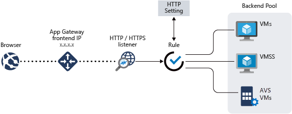

# Use Azure Application Gateway to protect your web apps on Azure VMware Solution

[Azure Application Gateway](https://azure.microsoft.com/services/application-gateway/) is a layer 7 web traffic load balancer that enables you to manage traffic to your web applications. It offers many capabilities: cookie-based session affinity, URL-based routing, and Web Application Firewall (WAF) to name a few. (For a complete list of features, see [Azure Application Gateway features](../application-gateway/features.md).) It is offered in two versions, v1 and v2. Both have been tested with web apps running on Azure VMware Solution.

In this article, we'll walk through a common scenario using Application Gateway in front of a web server farm with a set of configurations and recommendations to protect a web app running on Azure VMware Solution. 

## Topology
As shown in the following figure, Application Gateway can be used to protect Azure IaaS virtual machines, Azure virtual machine scale sets, or on-premises servers. Azure VMware Solution virtual machines will be treated as on-premises servers by Application Gateway.



> [!IMPORTANT]
> Azure Application Gateway is currently the only supported method to expose web apps running on Azure VMware Solution virtual machines.

The following diagram shows the testing scenario used to validate Application Gateway with Azure VMware Solution web applications.


The Application Gateway instance is deployed on the hub in a dedicated subnet. It has an Azure public IP address; activating Standard DDoS protection for the virtual network is recommended. The web server is hosted on an Azure VMware Solution private cloud behind NSX T0 and T1 routers. Azure VMware Solution uses [ExpressRoute Global Reach](../expressroute/expressroute-global-reach.md) to enable the communication with the hub and on-premises systems.

## Prerequisites

- An Azure account with an active subscription.
- An Azure VMware Solution private cloud deployed and running.

## Deployment and configuration

1. In the Azure portal, search for **Application Gateway** and select **Create application gateway**.

2. Provide the basic details as in the following figure; then select **Next:Frontends>**. 

    :::image type="content" source="media/protect-azure-vmware-solution-with-application-gateway/create-app-gateway.png" alt-text="Application Gateway creation":::

3. Choose the frontend IP address type. For public, choose an existing public IP address or create a new one. Select **Next:Backends>**.

    > [!NOTE]
    > Only standard and Web Application Firewall (WAF) SKUs are supported for private frontends.

4. Next add a backend pool, which describes a set of instances that are part of the application or service (in this case, virtual machines running on Azure VMware Solution infrastructure). Provide the details of web servers running on the Azure VMware Solution private cloud and select **Add**; then select **Next:Configuration>**.

1. On the **Configuration** tab, select **Add a routing rule**.

6. On the **Listener** tab, provide the details for the listener. If HTTPS is selected, a certificate must be provided, either from a PFX file or an existing certificate from Azure Key Vault. 

7. Select the **Backend targets** tab and select the backend pool previously created. For the **HTTP settings** field, select **Add new**.

8. Configure the parameters for the HTTP settings. Select **Add**.

9. If you want to configure path-based rules, select **Add multiple targets to create a path-based rule**. 

10. Add a path-based rule and select **Add**. Repeat to add additional path-based rules. 

11. When you have finished adding path-based rules, select **Add** again; then select **Next:Tags>**. 

12. Add any desired tags. Select **Next:Review + Create>**.

13. A validation will run on your Application Gateway; if it is successful, select **Create** to deploy.

## Configuration examples

In this section, you will learn how to configure Application Gateway with Azure VMware Solution virtual machines as the backend pools for the following use cases: 

- [Hosting multiple sites](#hosting-multiple-sites)
- [Routing by URL](#routing-by-url)

### Hosting multiple sites

You can use the Azure portal to configure hosting multiple websites when you create an application gateway. In this tutorial, you define backend address pools using virtual machines running on an Azure VMware Solution private cloud on an existing application gateway. The application gateway is part of a Hub virtual network as described in [Integrate Azure VMware Solution in a hub and spoke architecture](concepts-hub-and-spoke.md). This tutorial assumes you own multiple domains, and it uses examples of www.contoso.com and www.fabrikam.com.

1. Create the virtual machines. On the Azure VMware Solution private cloud, create two different pools of virtual machines; one will represent Contoso and the second Fabrikam. 

    :::image type="content" source="media/protect-azure-vmware-solution-with-application-gateway/app-gateway-multi-backend-pool-avs.png" alt-text="Create the virtual machines.":::

    To illustrate this tutorial, we've used Windows Server 2016 with Internet Information Services (IIS) role installed. Once the virtual machines are installed, run the following PowerShell commands to configure IIS on each of the VMs. 

    ```powershell
    Install-WindowsFeature -Name Web-Server
    Add-Content -Path C:\inetpub\wwwroot\Default.htm -Value $($env:computername)
    ```

2. Add the backend pools. In an existing application gateway instance, select **Backend pools** from the left menu, select  **Add**, and enter the details of the new pools. Select **Add** in the right pane.

    :::image type="content" source="media/protect-azure-vmware-solution-with-application-gateway/app-gateway-multi-backend-pool-avs-02.png" alt-text="Add the backend pools." lightbox="media/protect-azure-vmware-solution-with-application-gateway/app-gateway-multi-backend-pool-avs-02.png":::

3. In the **Listeners** section, create a new listener for each website. Enter the details for each listener and select **Add**.

4. On the left navigation, select **HTTP settings** and select **Add** in the left pane. Fill in the details to create a new HTTP setting and select **Save**.

    :::image type="content" source="media/protect-azure-vmware-solution-with-application-gateway/app-gateway-multi-backend-pool-avs-03.png" alt-text="Fill in the details to create a new HTTP setting and select Save." lightbox="media/protect-azure-vmware-solution-with-application-gateway/app-gateway-multi-backend-pool-avs-03.png":::

5. Create the rules in the **Rules** section of the left menu. Associate each rule with the corresponding listener. Select **Add**.

6. Configure the corresponding backend pool and HTTP settings. Select **Add**.

7. Test the connection. Open your preferred browser and navigate to the different websites hosted on your Azure VMware Solution environment, for example http://www.fabrikam.com.

    :::image type="content" source="media/protect-azure-vmware-solution-with-application-gateway/app-gateway-multi-backend-pool-avs-07.png" alt-text="Test the connection.":::

### Routing by URL

You can use Azure Application Gateway to configure URL path-based routing rules. In this tutorial, you define backend address pools using virtual machines running on an Azure VMware Solution private cloud on an existing application gateway. The application gateway is part of a Hub virtual network as described in [Azure VMware Solution Azure Native integration documentation](concepts-hub-and-spoke.md). You then create routing rules that make sure web traffic arrives at the appropriate servers in the pools.

1. Create the virtual machines. On the Azure VMware Solution private cloud, create a pool of virtual machines to represent the web farm. 

    :::image type="content" source="media/protect-azure-vmware-solution-with-application-gateway/app-gateway-url-route-backend-pool-avs.png" alt-text="Create a pool of virtual machines on Azure VMware Solution.":::

    Windows Server 2016 with IIS role installed has been used to illustrate this tutorial. Once the virtual machines are installed, run the following PowerShell commands to configure IIS for the tutorial in each VM. 

    The first virtual machine, contoso-web-01, will host the main website.

    ```powershell
    Install-WindowsFeature -Name Web-Server
    Add-Content -Path C:\inetpub\wwwroot\Default.htm -Value $($env:computername)
    ```

    The second virtual machine, contoso-web-02, will host the images site.
 
    ```powershell
    Install-WindowsFeature -Name Web-Server
    New-Item -Path "C:\inetpub\wwwroot\" -Name "images" -ItemType "directory"
    Add-Content -Path C:\inetpub\wwwroot\images\test.htm -Value $($env:computername)
    ```

    The third virtual machine, contoso-web-03, will host the video site.

    ```powershell
    Install-WindowsFeature -Name Web-Server
    New-Item -Path "C:\inetpub\wwwroot\" -Name "video" -ItemType "directory"
    Add-Content -Path C:\inetpub\wwwroot\video\test.htm -Value $($env:computername)
    ```

2. Add the backend pools. You will need to add three new backend pools in an existing application gateway instance. Select **Backend pools** from the left menu. Select **Add** and enter the details of the first pool, **contoso-web**. Add one VM as the target. Select **Add**. Repeat this process for **contoso-images** and **contoso-video**, adding one unique VM to each as target. 

    :::image type="content" source="media/protect-azure-vmware-solution-with-application-gateway/app-gateway-url-route-backend-pool-avs-02.png" alt-text="Add three new backend pools." lightbox="media/protect-azure-vmware-solution-with-application-gateway/app-gateway-url-route-backend-pool-avs-02.png":::

3. In the **Listeners** section, create a new listener of type Basic using port 8080.

4. On the left navigation, select **HTTP settings** and select **Add** in the left pane. Fill in the details to create a new HTTP setting and select **Save**.

    :::image type="content" source="media/protect-azure-vmware-solution-with-application-gateway/app-gateway-url-route-backend-pool-avs-04.png" alt-text="HTP settings configuration.":::

5. Create the rules in the **Rules** section of the left menu. Associate each rule with the previously created listener. Then configure the main backend pool and HTTP settings. Select **Add**.

    :::image type="content" source="media/protect-azure-vmware-solution-with-application-gateway/app-gateway-url-route-backend-pool-avs-07.png" alt-text="Create the rules in the Rules section of the left menu.":::

6. Test the configuration. Access the application gateway on the Azure portal and in the **Overview** section, copy the public IP address. Then open a new browser window and enter the URL `http://<app-gw-ip-address>:8080`. 

    :::image type="content" source="media/protect-azure-vmware-solution-with-application-gateway/app-gateway-url-route-backend-pool-avs-08.png" alt-text="Test the configuration from the Azure portal.":::

    Change the URL to `http://<app-gw-ip-address>:8080/images/test.htm`.

    :::image type="content" source="media/protect-azure-vmware-solution-with-application-gateway/app-gateway-url-route-backend-pool-avs-09.png" alt-text="Change the URL.":::

    Change the URL again to `http://<app-gw-ip-address>:8080/video/test.htm`.

    :::image type="content" source="media/protect-azure-vmware-solution-with-application-gateway/app-gateway-url-route-backend-pool-avs-10.png" alt-text="Change the URL again.":::

## Next Steps

Review the [Azure Application Gateway documentation](https://docs.microsoft.com/azure/application-gateway/) for more configuration examples.
