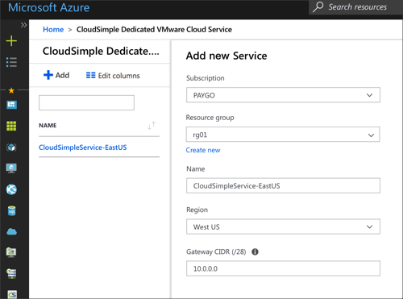

# Quick start - Initialize and purchase capacity

To get started with Azure VMware Solutions by CloudSimple, first create the Azure VMware Solutions by CloudSimple in the Azure portal.

## Create the service

1. Sign in to the [Azure portal](https://portal.azure.com).
2. On the side menu, click **Create Resource**.
3. Search for and select **Azure VMware Solutions by CloudSimple**.
4. Click **Add**.
5. Select the type of subscription.
6. Select the resource group for the service. To add a new resource group, click **Create New**.
7. Enter name to identify the service.
8. Enter the CIDR for the service gateway. Specify a /28 subnet that doesn’t overlap with any of your  on-premises subnets, Azure subnets, or planned CloudSimple subnets. You can't change the CIDR after the service is created.
9. Click **OK**.

The service is created and added to the list of services.

## Purchase nodes

To set up pay-as-you go capacity for a CloudSimple Private Cloud environment, first provision nodes in the Azure Portal. For instructions on reserving capacity for a fixed term, see Node reservations.

1. In the [Azure portal](https://portal.azure.com) left navigation menu, select **Dedicated VMware Cloud Nodes**.
2. Select **Add Node**.
3. Select the type of subscription.
4. Enter a resource group for the node. To add a new resource group, click **Create New**.
5. Enter a name or prefix to identify the node.
6. Select the Azure region to host the node.
7. Select the node location.
8. Select the node type. You can choose the [CS28 or CS36 option](cs-node.md#VMwareSolution-by-CloudSimple-–-Nodes-SKU). The latter option includes the maximum compute and memory capacity.
9. Select the number of nodes to provision.
10. Select **Next: Review**.
11. Review the settings. To modify any settings, click **Previous**.
12. Select **Add nodes**.

## Reserve nodes

Reserving nodes for a fixed term is a cost-effective alternative to pay-as-you-go node provisioning. You can reserve capacity for your base needs at reduced prices, while still retaining the ability to add additional capacity on a pay-as-you-go basis.

1. In the [Azure portal](https://portal.azure.com) left navigation menu, select **Dedicated VMware Cloud Nodes**.
2. Select **Reservations** > **Purchase**.  
3. On the **Create Reserved Dedicated VMware Cloud Nodes** page, select a name for the dedicated node.
4. Select a subscription type.
5. Keep the default setting of a single subscription for Scope.
6. Select the Azure region to host the reserved nodes.
7. Select the location.
8. Select the Private Cloud node size.
9. Select the term of use for the dedicated nodes. With reservations the term is fixed. To set up pay-as-you-go capacity, see [Create nodes](create-nodes.md).
10. Select the number of nodes.
    The costs and estimated savings are presented. If you modify settings, the cost calculations are updated.
11. Select **Create**.

The reservation request is recorded and the details are listed, including a reservation ID.

All the reservations are listed on the **Dedicated VMware Cloud Nodes** > **Reservations** page.
