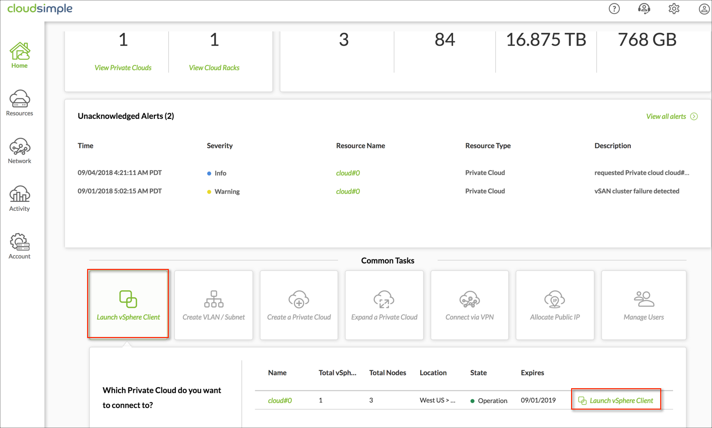
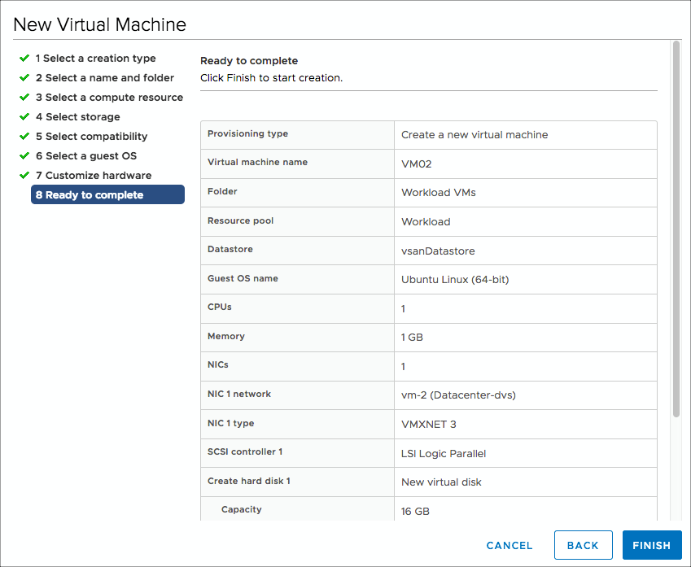
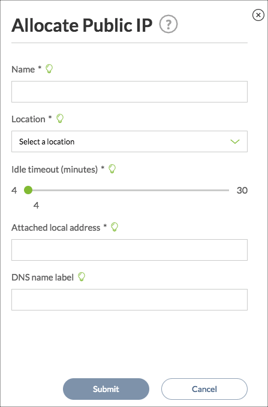

# Quick start - Configure a Private Cloud Environment

This topic shows how to create a CloudSimple Private Cloud and set up your Private Cloud environment.

## Create a Private Cloud

1. Sign in to the [Azure portal](https://portal.azure.com).
2. On the **Resources** or **CloudSimple Dedicated VMware Nodes** page, select **Create Private Cloud**.
3. Select the location to host the Private Cloud resources.
4. Select the node type for your Private Cloud. You can choose the [CS28 or CS36 option](cs-node.md#vmware-solution-by-cloudsimple-nodes-sku). The latter option includes the maximum compute and memory capacity.
5. Select the number of nodes for the Private Cloud. You can select at most the number of nodes that you have [purchased](create-nodes.md) or [reserved](reserve-nodes.md).
6. Select **Next: Advanced options**.
7. Enter the CIDR range for vSphere/vSAN subnets. Make sure that the CIDR range doesn't overlap with any of your on-premises or other Azure subnets.
8. Select **Next: Review and create**.
9. Review the settings. If you need to change any settings, click **Previous**.
10. Select **Create**.

## Create a VLAN for your workload VMs

After creating a Private Cloud, create a VLAN in which to deploy your workload/application VMs.

1. In the CloudSimple Portal, select **Network > VLAN/Subnets**.
2. Click **Create VLAN/Subnet**.
3. Select the Private Cloud for the new VLAN/subnet.
4. Enter a VLAN ID.
5. Enter an optional subnet name.
6. To enable routing on the VLAN (subnet), specify the subnet CIDR range.
7. Click **Submit**.

    

    [!NOTE]
        If you want the subnet created accessible over point-to-site or site-to-site VPN, open a support ticket with [CloudSimple Support](http://support.cloudsimple.com).

## Connect  your environment to an Azure Virtual Network

CloudSimple provides you with an ExpressRoute circuit for your Private Cloud. You can connect your virtual network on Azure to the ExpressRoute circuit. For full details on setting up the connection, follow the steps in [Azure Virtual Network Connection using ExpressRoute](https://docs.azure.cloudsimple.com/azure-er-connection)

## Log in to vCenter

You can now log in to vCenter to set up virtual machines and policies.

1. To access vCenter, start from the CloudSimple Portal. On the Home page, click **Launch vSphere Client** and then click **Launch vSphere Client**.

    

2. Select your preferred vSphere client to access vCenter and sign in with your username and password.  The default user name is **CloudOwner@cloudsimple.local** and the default password is **CloudSimple123!**.  If your Private Cloud was created in link mode, log in as your on-premises administrator user or as a user who is a member of the administrator group.

    

[!NOTE]
    The vCenter screens in the next procedures are from the vSphere (HTML5) client.

## Change your vCenter Password

CloudSimple recommends that you change your password the first time you log in to vCenter.  
The password you set must meet the following requirements:

* Maximum lifetime: Password must be changed every 365 days
* Restrict re-use: Users cannot reuse any of the previous 5 passwords
* Maximum length: 20 characters
* Minimum length: 8 characters
* Character requirements: At least 1 special character
* Alphabetic characters: At least 2 alphabetic characters, A-Z or a-z
* Uppercase characters: At least 1 uppercase characters, A-Z
* Lowercase characters: At least 1 lowercase characters, a-z
* Numbers: At least 1 numeric character, 0-9
* Maximum identical adjacent characters: 3.
Example: CC or CCC is acceptable as a part of the password, but CCCC is not.

[!NOTE]
    The vSphere Flash Client reports an error if you set a password that doesn’t meet the requirements. However, the HTML5 client does NOT report an error. With the HTML5 client, if you enter a password that doesn’t meet the requirements, it is not accepted, and the old password continues to work.

## Add Users and Identity Sources to vCenter

CloudSimple assigns a default vCenter user account with username **cloudowner@cloudsimple.local**. No additional account setup is required for you to get started. However, you can request additional user accounts and permission to add identity sources.

* If you require additional user accounts, provide the user information to[CloudSimple Support](http://support.cloudsimple.com). Support will set up the user accounts for you.
* CloudSimple normally assigns administrators the privileges they need to perform normal operations, but performing operations such as adding identity sources, is restricted. If you want to add an identity source, you can temporarily [escalate your privileges](https://docs.azure.cloudsimple.com/vsphere-access/#escalate-privileges).

## Create a Port Group

To create a distributed port group in vSphere, follow the instructions in the VMware topic 'Add a distributed port group' in the [vSphere Networking Guide](https://docs.vmware.com/en/VMware-vSphere/6.5/vsphere-esxi-vcenter-server-65-networking-guide.pdf). When setting up the distributed port group, provide the VLAN ID used in [Create a VLAN for your Workload VMs](#Create a VLAN for your Workload VMs).

## Upload an ISO and/or vSphere Template

[!WARNING]
    For ISO upload, use the vSphere HTML5 client.  Using Flash client may result in an error.

1. Obtain the ISO or vSphere template that you want to upload to vCenter to create a VM and have it available on your local system.
2. In vCenter, click the **Disk** icon and select **vsanDatastore**. Click **Files** and then click **New Folder**.
    

3. Create a folder entitled ‘ISOs and Templates’.

4. Navigate to the ISOs folder in ISOs and Templates, and click **Upload Files**. Follow the on-screen instructions to upload the ISO.

## Create a Virtual Machine in vCenter

1. In vCenter, click the **Hosts and Clusters** icon.

2. Right-click **Workload** and select **New Virtual Machine**.
    

3. Select **Create new virtual machine** and click **Next**.
    

4. Name the machine, select the **Workload VMs** location, and click **Next**.
    

5. Select the **Workload** compute resource and click **Next**.
    

6. Select **vsanDatastore** and click **Next**.
    

7. Keep the default ESXi 6.5 compatibility selection and click **Next**.
    

8. Select the guest OS of the ISO for the VM that you are creating and click **Next**.
    

9. Select hard disk and network options. For New DC/DVD Drive, select **Datastore ISO file**.  If you want to allow traffic from the Public IP address to this VM, select the network as **vm-1**.
    

10. A selection window opens. Select the file you previously uploaded to the ISOs and Templates folder and click **OK**.
    

11. Review the settings and click **OK** to create the VM.
    

The VM is now added to the Workload compute resources and is ready for use.

The basic setup is now complete. You can start using your Private Cloud similar to how you would use your on-premises VM infrastructure.

The following sections contain optional information about setting up DNS and DHCP servers for Private Cloud workloads and modifying the default networking configuration.

## Create a DNS and DHCP Server (Optional)

Applications and workloads running in a Private Cloud environment require name resolution and DHCP services for lookup and IP address assignment. A proper DHCP and DNS infrastructure is required to provide these services. You can configure a virtual machine in vCenter to provide these services in your Private Cloud environment.

Prerequisites

* A distributed port group with VLAN configured

* Route setup to on-premises or Internet-based DNS servers

* Virtual machine template or ISO to create a virtual machine

The following links provide guidance on setting up DHCP and DNS servers on Linux and Windows.

### Linux Based DNS Server Setup

Linux offers various packages for setting up DNS servers.  Here is a link to instructions for setting up an open source BIND DNS server.

[Example setup][6]

[6]: https://www.digitalocean.com/community/tutorials/how-to-configure-bind-as-a-private-network-dns-server-on-centos-7

#### Windows Based Setup

These Microsoft topics describe how to set up a Windows server as a DNS server and as a DHCP server.

[Windows Server as DNS Server](https://docs.microsoft.com/en-us/windows-server/networking/dns/dns-top)

[Windows Server as DHCP Server](https://docs.microsoft.com/en-us/windows-server/networking/technologies/dhcp/dhcp-top)

## Customize Networking Configuration (Optional)

The Network pages in the CloudSimple Portal allow you to specify the configuration for firewall tables and public IP addresses for VMs.

### Allocate public IPs

1. Navigate to **Network > Public IP** in the CloudSimple Portal.
2. Click **Allocate Public IP**.
3. Enter a name to identify the IP address entry.
4. Keep the default location.
5. Use the slider to change the idle timeout if desired.
6. Enter the local IP address for which you want to assign a public IP address.
7. Enter an associated DNS name if desired.
8. Click **Done**.

    

The task of allocating the public IP address begins. You can check the status of the task on the **Activity > Tasks** page. When allocation is complete, the new entry is shown on the Public IPs page.

The VM to which this IP address must be mapped needs to be configured with the local address specified above. The procedure to configure an IP address is specific to the VM operating system. Consult the documentation for your VM operating system for the correct procedure.

#### Example

For example, here are the details for Ubuntu 16.04.

Add the static method to the inet address family configuration in the file /etc/network/interfaces. Change the address, netmask, and gateway values. For this example we are using the eth0 interface, internal IP address 192.168.24.10, gateway address 192.168.24.1, and netmask 255.255.255.0. For your environment, the available subnet information is provided in the welcome email.

### sudo vi /etc/network/interfaces

auto eth0
Iface eth0 inet static
iface eth0 inet static
address 192.168.24.10
netmask 255.255.255.0
gateway 192.168.24.1
dns-nameservers 8.8.8.8
dns-domain acme.com
dns-search acme.com

Manually disable the interface.

### sudo ifdown eth0

Manually enable the interface again.

### sudo ifup eth0

By default, all incoming traffic from the Internet is **denied**. If you would like to open any other port, file a ticket with CloudSimple Support.

After configuring an internal IP address as the static IP address, verify that you can reach the Internet from within the VM.

### ping 8.8.8.8

Also verify that you can reach the VM from the Internet using the public IP address.

* Ensure that any iptable rules on the VM are not blocking port 80 inbound.

### netstat -an | grep 80

* Start an http server that listens on port 80.

### python2.7 -m SimpleHTTPServer 80

or

### python3 -m http.server 80

* Start a browser on your desktop and point it to port 80 for the public IP address to browse the files on your VM.

### Default CloudSimple Firewall Rules for Public IP

The following are the default firewall rules.

Explicitly allocated workload public IP traffic:

* VPN traffic: All traffic between (from/to) the VPN and all the workload networks and management network is allowed.
* Private cloud internal traffic: All east-west traffic between (from/to) workload networks and the management network (shown above) is allowed.
* Internet traffic:
  * All incoming traffic from the Internet is denied to workload networks and the management network.
  * All outgoing traffic to the Internet from workload networks or the management network is allowed.

You can also modify the way your traffic is secured, using the Firewall Rules feature. For more information, see [Set up firewall tables and rules](https://docs.azure.cloudsimple.com/firewall).

## Install Solutions (Optional)

You can install solutions on your CloudSimple Private Cloud to take full advantage of your Private Cloud vCenter environment. You can set up backup, disaster recovery, replication, and other functions to protect your virtual machines. Examples include VMware Site Recovery Manager (VMware SRM) and Veeam Backup & Replication.

To install a solution, you must request additional privileges for a limited period. See [Escalate privileges](https://docs.azure.cloudsimple.com/vsphere-access#escalate-privileges).
