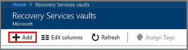
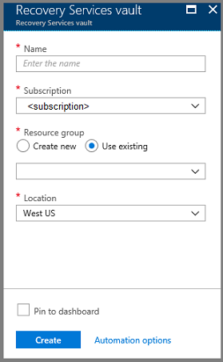
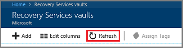

# Set up Microsoft Azure Backup Server for AVS

Microsoft Azure Backup Server is a robust enterprise backup and recovery system that contributes to your Business Continuity and Disaster Recovery (BCDR) strategy. During the AVS preview, you can configure only virtual machine level backup using Azure Backup Server. 

Azure Backup Server can store backup data to:

- **Disk**: For short-term storage, Azure Backup Server backs up data to disk pools.

- **Azure**: For both short-term and long-term storage off-premises, Azure Backup Server data stored in disk pools can be backed up to the Microsoft Azure cloud using the Azure Backup service.

When outages occur, and source data is unavailable, you can use Azure Backup Server to restore data to the source or an alternate location easily. That way, if the original data is unavailable because of planned or unexpected issues, you can easily restore data to an alternate location.

In this article, we help you prepare your AVS environment to backup virtual machines (VMs) using Azure Backup Server.  We walk you through steps to: 

> [!div class="checklist"]
> * Determine the recommended VM disk type and size to use
> * Create a Recovery Services vault that stores the recovery points
> * Set the storage replication for a Recovery Services vault
> * Add storage to Azure Backup Server

## Supported VMware features

- **Agentless backup:** Azure Backup Server does not require an agent to be installed on the vCenter or ESXi server to back up the virtual machine. Instead, just provide the IP address or fully qualified domain name (FQDN), and sign-in credentials used to authenticate the VMware server with Azure Backup Server.

- **Cloud-Integrated Backup:** Azure Backup Server protects workloads to disk and cloud. The backup and recovery workflow of Azure Backup Server helps you manage long-term retention and offsite backup.

- **Detect and protect VMs managed by vCenter:** Azure Backup Server detects and protects VMs deployed on a vCenter or ESXi server. Azure Backup Server also detects VMs managed by vCenter, allowing you to protect large deployments.

- **Folder level auto protection:** vCenter lets you organize your VMs in VM folders. Azure Backup Server detects these folders and enables you to protect VMs at the folder level and includes all subfolders. When protecting folders, Azure Backup Server not only protects the VMs in that folder but also protects VMs added later. Azure Backup Server detects new VMs daily and protects them automatically. As you organize your VMs in recursive folders, Azure Backup Server automatically detects and protects the new VMs deployed in the recursive folders.

- **Azure Backup Server continues to protect vMotioned VMs within the cluster:** As VMs are vMotioned for load balancing within the cluster, Azure Backup Server automatically detects and continues VM protection.

- **Recover necessary files faster:** Azure Backup Server can recover files/folders from a Windows VM without recovering the entire VM.

## Limitations

- Update Rollup 1 for Azure Backup Server v3 must be installed.

- You cannot back up user snapshots before the first Azure Backup Server backup. Once Azure Backup Server completes the first backup, then you can back up user snapshots.

- Azure Backup Server cannot protect VMware VMs with pass-through disks and physical raw device mappings (pRDM).

- Azure Backup Server cannot detect or protect VMware vApps.

**To set up Microsoft Azure Backup Server for Azure VMware Solution (AVS), you must complete the following steps:**

- Setup the prerequisites and environment

- Create Azure Recovery Services Vault

- Download and install the Azure Backup Server 

- Add storage to Azure Backup Server 

**Deployment Architecture**  
Microsoft Azure Backup Server is deployed as Azure IaaS VM to protect AVS VMs.

:::image type="content" source="media/avs-backup/deploy-mabs-avs-diagram.png" alt-text="AVS Deployment Architecture" border="false":::

## Prerequisites for the Azure Backup Server environment

Consider the recommendations in this section when installing the Azure Backup Server in your Azure environment.

### Azure Virtual Network

Ensure that you [configure networking for your VMWare private cloud in Azure](tutorial-configure-networking.md).

### Determine the size of the virtual machine

You must create a Windows virtual machine in the virtual network that you have created in the above step. When choosing a server for running Azure Backup Server, it is recommended you start with a gallery image of Windows Server 2019 Datacenter. The [Create your first Windows virtual machine in the Azure portal](../virtual-machines/windows/quick-create-portal.md) tutorial gets you started with the recommended VM in Azure, even if you've never used Azure.

The table below summarizes the maximum number of protected workloads for each Azure Backup Server virtual machine size. The information is based on internal performance and scale tests with canonical values for the workload size and churn. The actual workload size can be larger but should be accommodated by the disks attached to the Azure Backup Server virtual machine.

| Max protected workloads | Average workload size | Average workload churn (daily) | Min Storage IOPS | Recommended Disk Type / Size      | Recommended VM Size |
|-------------------------|-----------------------|--------------------------------|------------------|-----------------------------------|---------------------|
| 20                      | 100 GB                | Net 5% churn                   | 2000             | Standard HDD (8 TB or above size per disk)  | A4V2       |
| 40                      | 150 GB                | Net 10% churn                  | 4500             | Premium SSD* (1 TB or above size per disk) | DS3_V2     |
| 60                      | 200 GB                | Net 10% churn                  | 10500            | Premium SSD* (8 TB or above size per disk) | DS3_V2     |

* To get the required IOPs, use minimum recommended or higher size disks. Smaller size disk offers lower IOPs.

> [!NOTE]
> Azure Backup Server is designed to run on a dedicated, single-purpose server. You cannot install Azure Backup Server on a computer:
> * Running as a domain controller
> * Has the Application Server role installed
> * That is a System Center Operations Manager management server
> * Running Exchange Server
> * That is a node of a cluster

### Disks and storage

Azure Backup Server requires disks for installation, including system files, installation files, prerequisite software, database files, and dedicated disks for the storage pool.

| Requirement                      | Recommended Size  |
|----------------------------------|-------------------------|
| Azure Backup Server installation                | Installation location: 3 GB<br />Database files drive: 900 MB<br />System drive: 1 GB for SQL installation<br /><br />Additionally, you'll need space for Azure Backup Server to copy the file catalog to a temporary installation location when archiving.      |
| Disk for storage pool<br />(Uses basic volumes, cannot be on a dynamic disk.) | 2 to 3 times the size of the protected data<br />For detailed storage calculation, refer [DPM Capacity Planner](https://www.microsoft.com/download/details.aspx?id=54301).   |

The [Attach a managed data disk to a Windows VM by using the Azure portal](../virtual-machines/windows/attach-managed-disk-portal.md) articles show you how to attach a new managed data disk to an existing Azure VM.

> [!NOTE]
> A single Azure Backup Server has a soft limit of 120 TB for the storage pool.

### Store backup data on local disk and in Azure

Storing backup data in Azure reduces backup infrastructure on Azure Backup Server VM. For operational recovery (backup), Azure Backup Server stores backup data on Azure disks attached to the VM. Once the disks and storage space are attached to the VM, Azure Backup Server manages the storage for you. The amount of backup data storage depends on the number and size of disks attached to each Azure VM, and each size of the Azure VM has a maximum number of disks that can be attached. For example, A2 is four disks. A3 is eight disks. A4 is 16 disks. Again, the size and number of disks determine the total backup storage pool capacity.

> [!IMPORTANT]
> You should **not** retain operational recovery data on Azure Backup Server-attached disks for more than five days. If data is more than five days old, store it in Azure Recovery Services vault.

To store backup data in Azure, create or use a Recovery Services vault. When preparing to back up the Azure Backup Server workload, you [configure the Recovery Services vault](#create-a-recovery-services-vault). Once configured, each time an online backup job runs, a recovery point gets created in the vault. Each Recovery Services vault holds up to 9999 recovery points. Depending on the number of recovery points created, and how long they are retained, you can retain backup data for many years. For example, you could create monthly recovery points and retain them for five years.

> [!IMPORTANT]
> Whether you send backup data to Azure or keep it locally, you must register Azure Backup Server with a Recovery Services vault.

### Scale deployment

If you want to scale your deployment, you have the following options:

- **Scale-up** - Increase the size of the Azure Backup Server VM from A series to DS3 series, and increase the local storage.

- **Offload data** - send older data to Azure and retain only the newest data on the storage attached to the Azure Backup Server.

- **Scale-out** - Add more Azure Backup Servers to protect the workloads.

### .NET Framework

The VM must have .NET Framework 3.5 SP1 or higher installed.

### Join a domain

The Azure Backup Server VM must be joined to a domain, and a domain user with administrator privileges on the VM must install Azure Backup Server.

Though not supported at the time of preview, Azure Backup Server deployed in an Azure VM can back up workloads on the VMs in AVS, but they should be in the same domain to enable backup operation.

## Create a Recovery Services vault

A Recovery Services vault is a storage entity that stores the recovery points created over time. It also contains backup policies that are associated with protected items.

1. Sign in to your subscription in the [Azure portal](https://portal.azure.com/).

1. On the left menu, select **All services**.

   

1. In the **All services** dialog box, enter *Recovery Services* and select **Recovery Services vaults** from the list.

   

   The list of Recovery Services vaults in the subscription appears.

1. On the **Recovery Services vaults** dashboard, select **Add**.

   

   The **Recovery Services vault** dialog box opens.

1. Provide values for the **Name**, **Subscription**, **Resource group**, and **Location**.

   

   - **Name**: Enter a friendly name to identify the vault. The name must be unique to the Azure subscription. Specify a name that has at least two but not more than 50 characters. The name must start with a letter and consist only of letters, numbers, and hyphens.

   - **Subscription**: Choose the subscription to use. If you're a member of only one subscription, you'll see that name. If you're not sure which subscription to use, use the default (suggested) subscription. There are multiple choices only if your work or school account is associated with more than one Azure subscription.

   - **Resource group**: Use an existing resource group or create a new one. To see the list of available resource groups in your subscription, select **Use existing**, and then select a resource from the drop-down list. To create a new resource group, select **Create new** and enter the name.

   - **Location**: Select the geographic region for the vault. To create a vault to protect AVS virtual machines, the vault *must* be in the same region as the AVS Private Cloud.

1. When you're ready to create the Recovery Services vault, select **Create**.

   

   It can take a while to create the Recovery Services vault. Monitor the status notifications in the **Notifications** area in the upper-right corner of the portal. After your vault gets created, it's visible in the list of Recovery Services vaults. If you don't see your vault, select **Refresh**.

   

## Set Storage Replication

The storage replication option lets you choose between geo-redundant storage (the default) and locally redundant storage. Geo-redundant storage copies the data in your storage account to a secondary region, making your data durable. Locally redundant storage is a cheaper option that isn't as durable. Read more about
geo-redundant and locally redundant storage options in the [Azure Storage redundancy](../storage/common/storage-redundancy.md).

> [!IMPORTANT]
> Changing **Storage Replication type** (Locally-redundant/ Geo-redundant) for a Recovery services vault must be done before configuring backups in the vault. Once you configure backup, the option to modify it is disabled, and you cannot change the **Storage Replication type**.

1. From **Recovery Services vaults**, click the new vault. 

1. Under **Settings**, select **Properties**, and under **Backup Configuration**, click **Update**.

1. Select the storage replication type, and click **Save**.

   

## Download and Install Software package

### Downloading the software package

1. Sign in to the [Azure portal](https://portal.azure.com/).

1. If you already have a Recovery Services vault open, continue to the next step. If you do not have a Recovery Services vault open, but are in the Azure portal, on the main menu, click **Browse**.

   1. In the list of resources, type **Recovery Services**.

   1. As you begin typing, the list filters based on your input. When you see **Recovery Services vaults**, click it.

   

1. From the list of Recovery Services vaults, select a vault.

   The selected vault dashboard opens.

   

   The **Settings** opens by default. If closed, select **Settings** to open it.

   

1. Click **Backup** to open the Getting Started wizard.

   

1. In the window that opens, do the following:

   1. From the **Where is your workload running** menu, select **On-premises**.

      :::image type="content" source="media/avs-backup/deploy-mabs-on-premises-workload.png" alt-text="Where is your workload running?":::

   1. From the **What do you want to back up** menu, select the workloads you want to protect using Azure Backup Server.

   1. Click on **Prepare Infrastructure** to download and install Azure Backup Server and the vault credentials.

      :::image type="content" source="media/avs-backup/deploy-mabs-prepare-infrastructure.png" alt-text="Prepare Infrastructure":::

1. In the **Prepare infrastructure** window that opens, do the following:

   1. Click the **Download** link to Install Azure Backup Server.

   1. Download the vault credentials by selecting the **Already Downloaded or using the latest Azure Backup Server installation** check box and then click **Download**. You use the vault credentials during the registration of Azure Backup Server to the recovery services vault. The links take you to the Download Center, where you download the software package.

   :::image type="content" source="media/avs-backup/deploy-mabs-prepare-infrastructure2.png" alt-text="Prepare Infrastructure - Azure Backup Server":::

1. On the download page, select all the files and click **Next**.

   > [!NOTE]
   > You must download all the files to the same folder.  Since the download size of the files together is > 3GB, it may take up to 60 minutes to the download to complete. 

   

### Extracting the software package

If you downloaded the software package to a different server, copy the files onto the Virtual Machine that you created to deploy the Azure Backup Server.

> [!WARNING]
> At least 4 GB of free space is required to extract the setup files.

1. After you've downloaded all the files, double-click **MicrosoftAzureBackupInstaller.exe** to open the **Microsoft Azure Backup Setup Wizard** and then click **Next**.

1. Select the location to extract the files to and click **Next**.

1. Click **Extract** to begin the extraction process.

   

1. Once extracted, select the option to **Execute setup.exe** and then click **Finish**.

> [!TIP]
> You can also locate the setup.exe file from the folder where you extracted the software package.

### Installing the software package

1. On the setup window under Install, click **Microsoft Azure Backup** to open the setup wizard.

   

1. On the Welcome screen, click **Next** to continue to the Prerequisite Checks.

1. Click **Check** to determine if the hardware and software prerequisites for Azure Backup Server are met. If met successfully, click **Next**.

   

1. The Azure Backup Server installation package comes bundled with the appropriate SQL Server binaries needed. When starting a new Azure Backup Server installation, select the **Install new Instance of SQL Server with this Setup** option and click **Check and Install**.

   

   > [!NOTE]
   > If you wish to use your own SQL server, the supported SQL Server versions are SQL Server 2014 SP1 or higher, 2016 and 2017. All SQL Server versions should be Standard or Enterprise 64-bit. Azure Backup Server does not work with a remote SQL Server instance. The instance used by Azure Backup Server needs to be local. If you are using an existing SQL server for Azure Backup Server, the setup only supports the use of *named instances* of SQL server.

   If a failure occurs with a recommendation to restart the machine, do so and click **Check Again**. If there are any SQL configuration issues, reconfigure SQL as per the SQL guidelines and retry to install/upgrade Azure Backup Server using the existing instance of SQL.

   **Manual configuration**

   When you use your own instance of SQL, make sure you add builtin\Administrators to the sysadmin role to master DB.

   **SSRS Configuration with SQL 2017**

   When you are using your own instance of SQL 2017, you need to configure SSRS manually. After SSRS configuration, ensure that *IsInitialized* property of SSRS is set to *True*. When this is set to True, MABS assumes that SSRS is already configured and will skip the SSRS configuration.

   To check the SSRS configuration status, run the following command:

   ```powershell
   $configset =Get-WmiObject –namespace 
   "root\Microsoft\SqlServer\ReportServer\RS_SSRS\v14\Admin" -class 
   MSReportServer_ConfigurationSetting -ComputerName localhost

   $configset.IsInitialized
   ```

   Use the following values for SSRS configuration:
   * Service Account: ‘Use built-in account’ should be Network Service
   * Web Service URL: ‘Virtual Directory’ should be ReportServer_\<SQLInstanceName>
   * Database: DatabaseName should be ReportServer$\<SQLInstanceName>
   * Web Portal URL: ‘Virtual Directory’ should be Reports_\<SQLInstanceName>

   [Learn more](https://docs.microsoft.com/sql/reporting-services/report-server/configure-and-administer-a-report-server-ssrs-native-mode?view=sql-server-2017) about SSRS configuration.

   > [!NOTE]
   > [Microsoft Online Services Terms](https://www.microsoft.com/licensing/product-licensing/products) (OST) governs the licensing for SQL Server used as the database for Azure Backup Server. According to OST, SQL Server bundled with Azure Backup Server can be used only as the database for Azure Backup Server.

1. Once successfully installed, click **Next**.

1. Provide a location for the installation of Microsoft Azure Backup server files and click **Next**.

   > [!NOTE]
   > The scratch location is required for back up to Azure. Ensure the scratch location is at least 5% of the data planned to be backed up to the cloud. For disk protection, separate disks need to be configured once the installation completes. For more information regarding storage pools, see [Configure storage pools and disk storage](https://docs.microsoft.com/previous-versions/system-center/system-center-2012-R2/hh758075(v=sc.12)).

   

1. Provide a strong password for restricted local user accounts and click **Next**.

   

1. Select whether you want to use Microsoft Update to check for updates and click **Next**.

   > [!NOTE]
   > We recommend having Windows Update redirect to Microsoft Update, which offers security and important updates for Windows and other products like Microsoft Azure Backup Server.

   

1. Review the *Summary of Settings* and click **Install**.

   The installation happens in phases. The first phase installs the Microsoft Azure Recovery Services Agent and the second phase checks for Internet connectivity. If Internet connectivity is available, you can continue with the installation; if not, you must provide proxy details to connect to the Internet. The final phase checks the prerequisite software, and if not installed, any missing software gets installed along with the Microsoft Azure Recovery Services Agent.

1. Click **Browse** to locate your vault credentials to register the machine to the Recovery Services vault and then click **Next**.

1. Choose a passphrase to encrypt/decrypt the data sent between Azure and your premises.

   > [!TIP]
   > You can automatically generate a passphrase or provide your own minimum 16-character passphrase.

1. Enter the location to save the passphrase and then click **Next** to register the server.

   > [!IMPORTANT]
   > It is important to also save the passphrase to a safe location other than the local server. Microsoft strongly suggests using an Azure Key Vault for storing the passphrase.

   After the Microsoft Azure Recovery Services Agent setup completes, it moves onto the installation and configuration of SQL Server and the Azure Backup Server components.

   

1. Once the installation step completes, click **Close**.

### Install Update Rollup 1

Installation of update Rollup 1 for Microsoft Azure Backup Server v3 is mandatory before protecting the workloads. To view the list of bug fixes and the installation instructions for Microsoft Azure Backup Server V3 UR1, see KB article [4534062](https://support.microsoft.com/en-us/help/4534062/).

## Add storage to Azure Backup Server

Azure Backup Server V3 supports Modern Backup Storage that offers:

-  Storage savings of 50%

-  Backups that are three times faster

-  More efficient storage

-  Workload-aware storage

### Volumes in Backup Server

Add the data disks with the required storage capacity to the Azure Backup server virtual machine if not already added.

Backup Server V3 only accepts storage volumes. When you add a volume, Backup Server formats the volume to Resilient File System (ReFS), which Modern Backup Storage requires.

### Add volumes to Backup Server disk storage

1. In the **Management** pane, rescan the storage, and then select **Add**. 

1. Select from the available volumes to add to the storage pool. 

1. After adding the available volumes, give them a friendly name to help you manage them. 

1. Click **OK** to format these volumes to ReFS so Backup Server can use the benefits of Modern Backup Storage.


## Next Steps

Continue to the next tutorial to learn how to configure back up of VMware VMs running on Azure VMware Solution (AVS) using Azure Backup Server.

> [!div class="nextstepaction"]
> [Configure backup of AVS VMs](backup-avs-vms-with-mabs.md)

