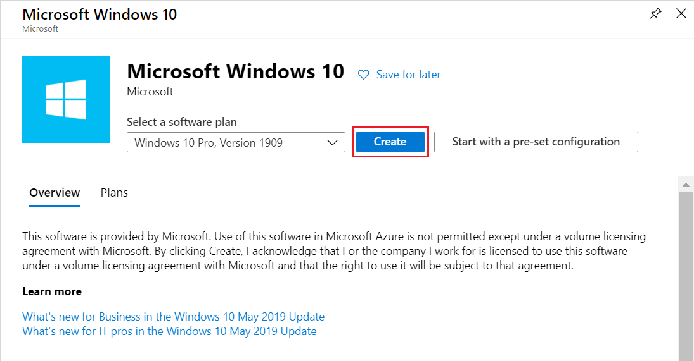
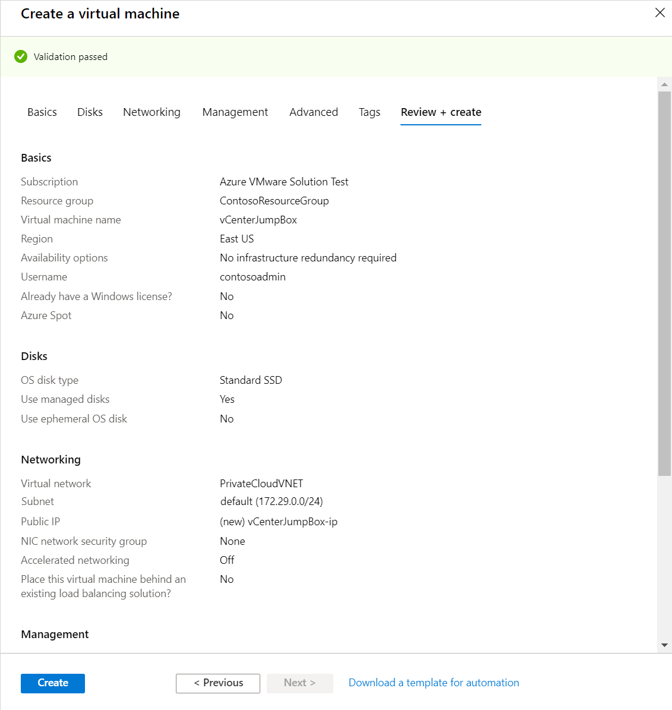
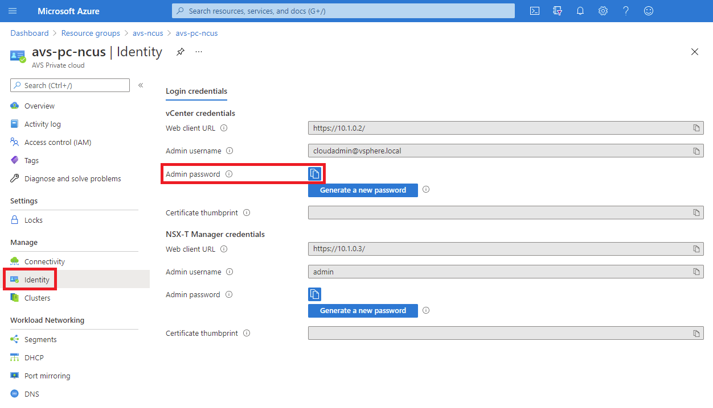
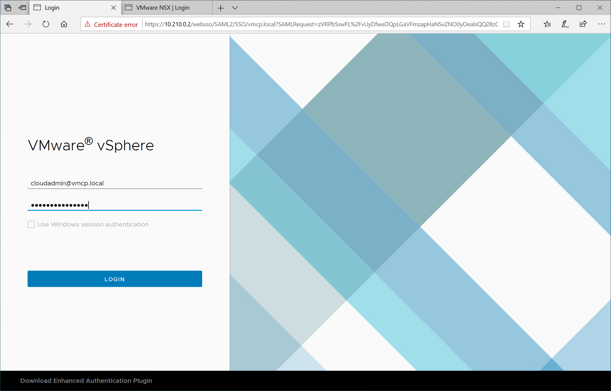
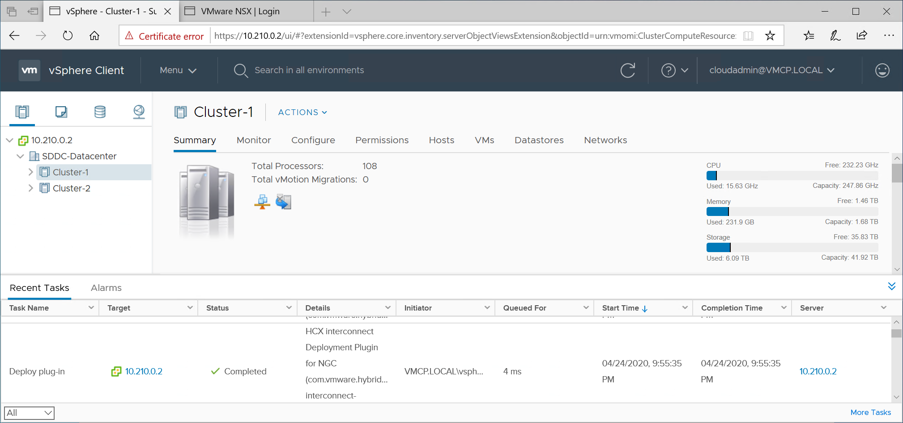
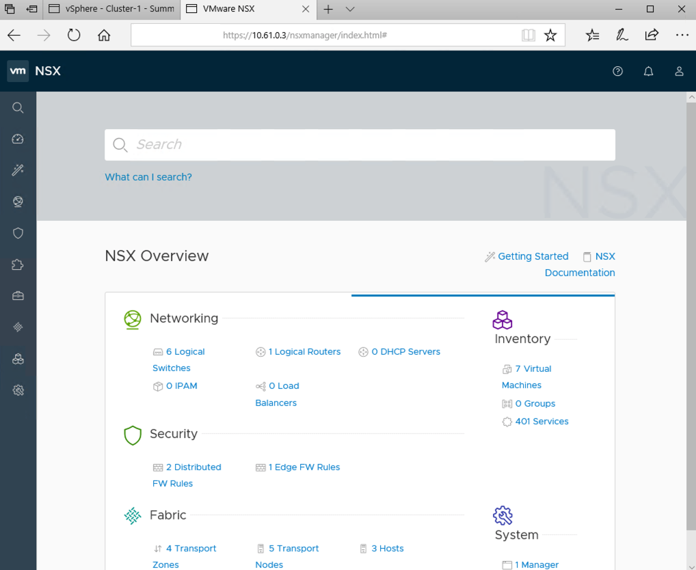

# Tutorial: Learn how to access an Azure VMware Solution (AVS) private cloud

In this tutorial you create a Windows virtual machine in the resource group you created in the previous tutorial [Tutorial: Configure networking for your VMWare private cloud in Azure](tutorial-configure-networking.md) and sign into vCenter. This is a VM on the same virtual network you created and provides access to vCenter and NSX Manager.

In this tutorial, you learn how to:

> [!div class="checklist"]
> * Create a Windows virtual machine to use to connect to vCenter
> * Login to vCenter from your virtual machine

## Create a new Windows virtual machine

In the resource group, select **+ Add** then search and select **Microsoft Windows 10**, and then click **Create**.

Enter the required information in the fields, and then select **Review + create**. For additional information on the fields, see the following table.

| Field | Value |
| --- | --- |
| **Subscription** | This value is already populated with the Subscription the Resource Group belongs to. |
| **Resource group** | This value is already populated for the current Resource Group. This should be the Resource Group you created in a preceding tutorial. |
| **Virtual machine name** | Enter a unique name for the VM. |
| **Region** | Select the geographical location of the VM. |
| **Availability options** | Leave the default value selected. |
| **Image** | Select the VM image. |
| **Size** | Leave the default size value. |
| **Authentication type**  | Select **Password**. |
| **Username** | Enter the user name for logging on to the VM. |
| **Password** | Enter the password for logging on to the VM. |
| **Confirm password** | Enter the password for logging on to the VM. |
| **Public inbound ports** | Select **None**. |

After you have entered the appropriate information, click **Review + create**. Once validation passes, select **Create** to start the virtual machine creation process.

## Connect to vCenter

From the jump box log In to vSphere Client with VMware vCenter SSO. Log in to the vSphere Client using a cloud administrator user name; accept the security risk and continue when you see a warning about a potential security risk; log in to VMware vCenter with Single Sign-On credentials and verify the user interface successfully displays.

In the Azure portal, select your private cloud and then in the **Overview** view, select **Identity > Default**. The URLs and login credentials for private cloud vCenter and NSX-T manager are displayed.

Navigate to the virtual machine you created in the preceding step and connect to the virtual machine. For detailed steps on how to connect to the virtual machine, see [connect to a virtual machine](../virtual-machines/windows/connect-logon.md#connect-to-the-virtual-machine)

In the Windows VM, open a browser and navigate to the vCenter and NSX-T Manger URLs in two tabs. In the vCenter tab, enter the `cloudadmin@vmcp.local` user credentials from the previous step.

In the second tab of the browser, sign in to NSX-T manager.

In this tutorial you learned how to:

> [!div class="checklist"]
> * Create a Windows virtual machine to use to connect to vCenter
> * Login to vCenter from your virtual machine

Continue to the next tutorial to learn how to scale your AVS private cloud.

> [!div class="nextstepaction"]
> [Scale an AVS private cloud](tutorial-scale-private-cloud.md)