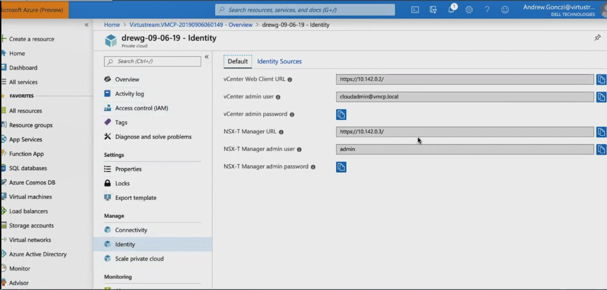

# Tutorial: Configure networking for your VMWare private cloud in Azure

An Azure VMware Solution (AVS) private cloud requires a virtual network. For integration with your on-premises environment it also requires an ExpressRoute circuit and a Virtual Network Gateway.

In this tutorial, you learn how to:

> [!div class="checklist"]
> * Create a Virtual Network
> * Create a Virtual Network Gateway
> * Connect your ExpressRoute circuit to the gateway
> * Locate the URLs for vCenter and NSX Manager

## Sign in to the Azure portal

Sign in to the [Azure portal](https://rc.portal.azure.com).

## Create a virtual network

Navigate to the resource group you created in the
previous tutorial, and click **+ Add** to define a new resource.

Use the **Search the Marketplace** box to find
the **Virtual Network** option and select it.

The portal displays a Virtual Network splash
screen.

Click **Create**.

On the Create Virtual Network tab, complete the fields as shown in the following table. Use the example values in the table, unless the lab proctor specifies otherwise:

| Field | Value |
| --- | --- |
| **Name** | Enter a unique name for the virtual network. |
| **Address space** | Enter the address space in CIDR notation. |
| **Subscription** | This value is already populated with the Subscription the resource group belongs to. |
| **Resource group** | This value is already populated for the current resource group. This should be the resource group you created in a previous tutorial. |
| **Location** | This value is already populated for the geographic region of the resource group. |
| **Subnet name** | Leave this value at default. |
| **Subnet Address range** | Enter the subnet address range in CIDR notation. |
| **DDoS protection** | Select **Basic**. |
| **Service endpoints** | Select **Disabled**. |
| **Firewall** | Select **Disabled**. |

Click **Create**. Once the deployment is complete you'll see your virtual network in the resource group.

## Create a Virtual Network Gateway

You have created a virtual network in the preceding section, now you'll create a Virtual Network Gateway.

In your resource group, click **+ Add** to add a new new resource.

Type **Virtual network gateway** in the **Search the Marketplace** box and select it, on the Virtual Network Gateway screen, click **Create**.

On the Basics tab of the Create virtual network gateway page, complete the fields as shown in the following table.

| Field | Value |
| --- | --- |
| **Subscription** | This value is already populated with the Subscription to which the resource group belongs. |
| **Resource group** | This value is already populated for the current resource group. This should be the resource group you created in a previous test. |
| **Name** | Enter a unique name for the virtual network gateway. |
| **Region** | Select the geographical location of the virtual network gateway. |
| **Gateway type** | Select **ExpressRoute**. |
| **VPN type** | Select **Route-based**. |
| **SKU** | Leave the default value: **standard**. |
| **Virtual network** | Select the virtual network you created previously. If you do not see the virtual network, make sure the region of the gateway matches the region of your virtual network. |
| **Gateway subnet address range** | This value is populated when you select the virtual network. Do not change the default value. |
| **Public IP address** | Select **Create new**. |

Click **Review + create** to start deployment of your virtual network gateway. Once complete, move to the next section in this tutorial to connect your ExpressRoute connection to the virtual network containing your private cloud.

## Connect ExpressRoute to the Virtual Network Gateway

This section walks you through adding a connection between your AVS private cloud and the virtual network gateway you created.

Navigate to the private cloud you created in the previous tutorial and click **Connectivity** under **Manage**.Display the Resource Group you created in the
previous test and click **Connectivity**. On the **Connectivity** page, click the **ExpressRoute** tab.

Copy the authorization key. If there is not an authorization key, you need to create one, to do that click **+ Request an authorization key**

Navigate to the Virtual Network Gateway you created
in the previous step and under **Settings**, click **Connections**. On the **Connections** page click **+ Add**.

1. On the Add connection tab, complete the fields as shown in the following table. Use the example values in the table, unless the test discipline requires otherwise:

   | Field                       | Value                                                                                   |
   | --------------------------- | --------------------------------------------------------------------------------------- |
   | **Name**                    | Enter a name for the connection.                                                        |
   | **Connection type**         | Select **ExpressRoute**.                                                                |
   | **Redeem authorization**    | Ensure this box is selected.                                                            |
   | **Virtual network gateway** | The VNET gateway you created previously is selected.                                    |
   | **Authorization key**       | Copy and paste the authorization key from the ExpressRoute tab for your Resource Group. |
   | **Peer circuit URI**        | Copy and paste the ExpressRoute ID from the ExpressRoute tab for your Resource Group.   |

   

Click **OK**. This creates the connection between your ExpressRoute circuit and your virtual network.

## Locate the URLs for vCenter and NSX Manager

In order to sign in to vVenter and NSX manager you'll need the urls to the vCenter web client and the NSX-T manager site. To find the urls:

Navigate to your AVS private cloud, under **Manage**, select **Identity**, here you'll find the information needed.

In this tutorial you learned how to:

> [!div class="checklist"]
> * Create a Virtual Network
> * Create a Virtual Network Gateway
> * Connect your ExpressRoute circuit to the gateway
> * Locate the URLs for vCenter and NSX Manager

Continue to the next tutorial to learn how to create a jump box that is used to connect to your environment.

> [!div class="nextstepaction"]
> [Access Private Cloud](tutorial-access-private-cloud.md)