# Create a Virtual Network

In this exercise you create a new virtual network (VNET) in the Resource
Group you created previously. Skip this exercise if you already have a
VNET defined in this Resource Group.

In this tutorial, you learn how to:

> [!div class="checklist"]
> * Create a Virtual Network
> * Create a Virtual Network Gateway
> * Connect your ExpressRoute circuit to the gateway

## Sign in to the Azure portal

Sign in to the [Azure portal](https://rc.portal.azure.com).

## Create a virtual network

1. Display the Resource Group you created in the
previous test and click **+ Add** to define a new resource.

   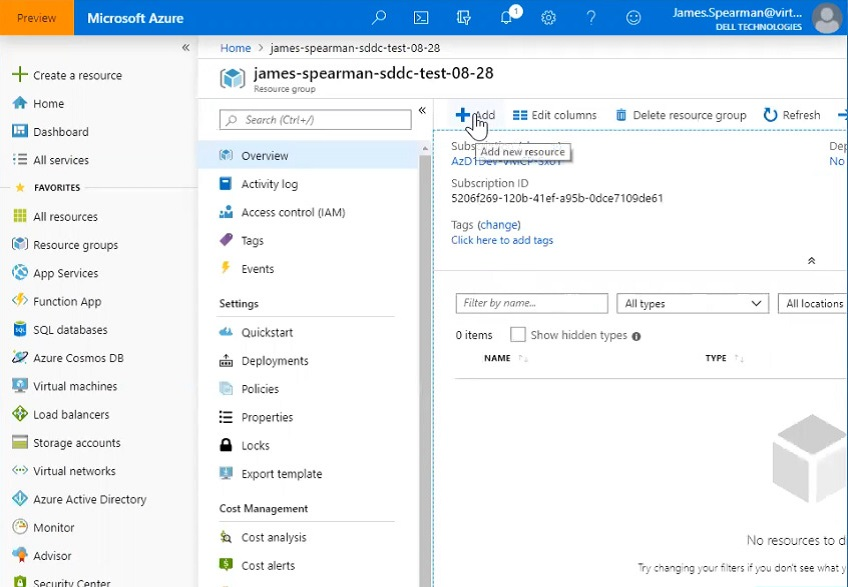

1. Use the **Search the Marketplace** box to find
the **Virtual Network** option and select it.

   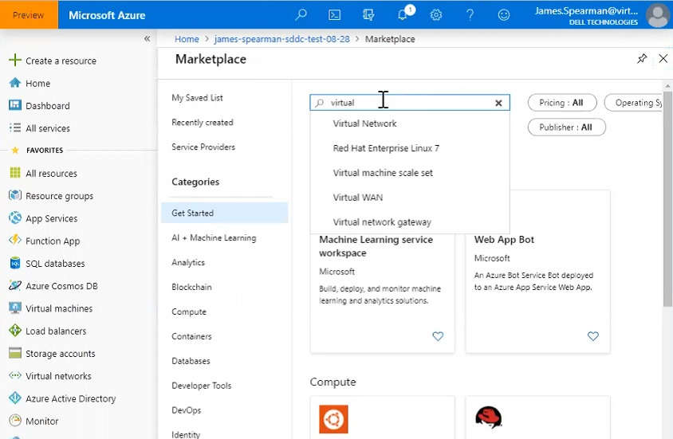

1. The portal displays a Virtual Network splash
screen.

   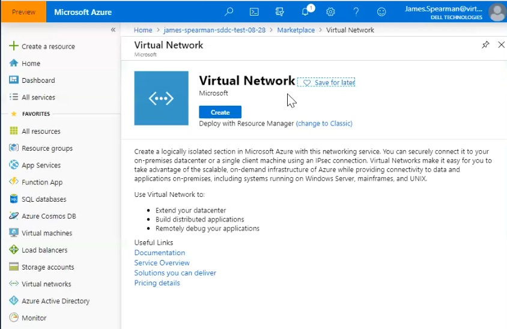

1. Click **Create**.

   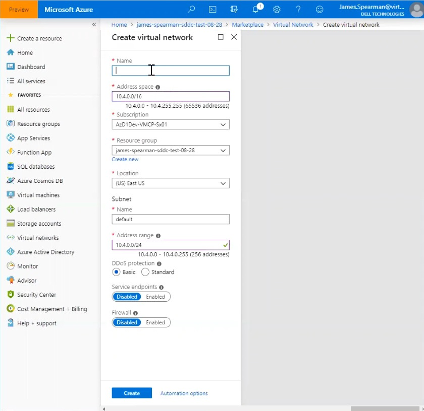

1. On the Create Virtual Network tab, complete the fields as shown in the
following table. Use the example values in the table, unless the lab
proctor specifies otherwise:

   | Field                    | Value                                                                                                                             |
   | ------------------------ | --------------------------------------------------------------------------------------------------------------------------------- |
   | **Name**                 | Enter a unique name for the virtual network.                                                                                      |
   | **Address space**        | Enter the address space.                                                                                                          |
   | **Subscription**         | This value is already populated with the Subscription the Resource Group belongs to.                                              |
   | **Resource group**       | This value is already populated for the current Resource Group. This should be the Resource Group you created in a previous test. |
   | **Location**             | This value is already populated for the geographic region of the Resource Group.                                                  |
   | **Subnet name**          | Leave this value at default.                                                                                                      |
   | **Subnet Address range** | Enter the subnet address range.                                                                                                   |
   | **DDoS protection**      | Select **Basic**.                                                                                                                 |
   | **Service endpoints**    | Select **Disabled**.                                                                                                              |
   | **Firewall**             | Select **Disabled**.                                                                                                              |

6. Click **Create**.

**Expected Results for Create a Virtual Network**

You see a status message that the VNET was created, and you can see the VNET in the Resource Group.

## Create a Virtual Network Gateway

Create a Virtual Network Gateway In this exercise you add a new Virtual
Network Gateway to the Resource Group for your SDDC.

Steps

1. Display the Resource Group you created in the
previous exercise, and click **+ Add** to define a new resource.

   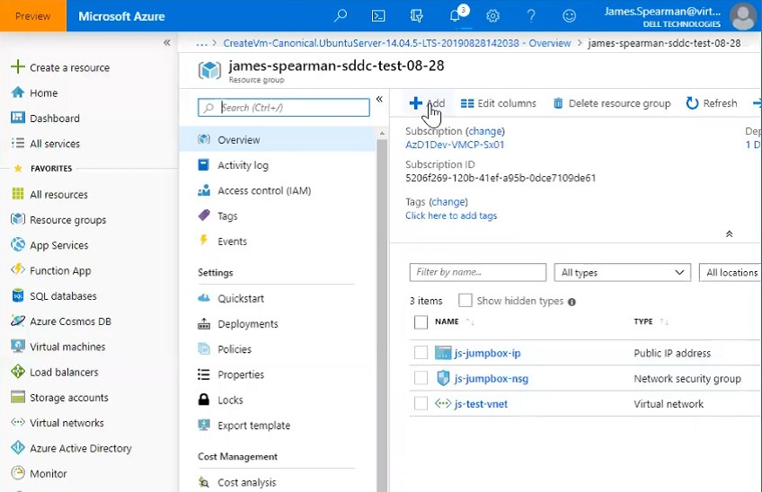

1. Use the **Search the Marketplace** box to find
the **Virtual network gateway** option and select it

   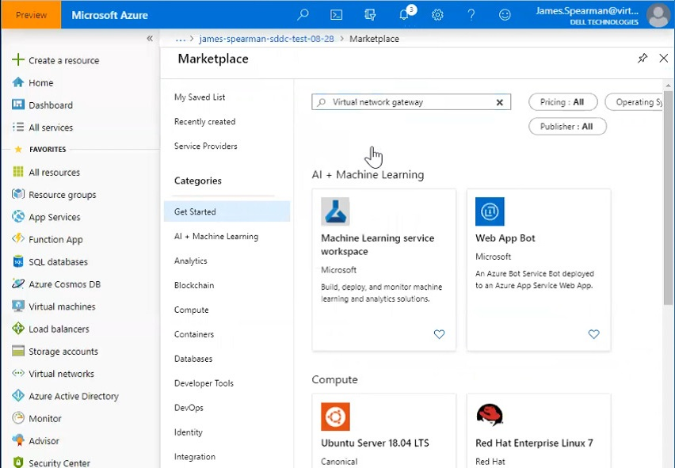
1. The Portal displays a Virtual network gateway
splash screen.

   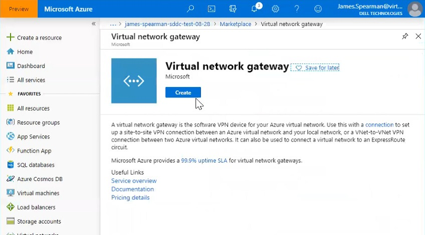

1. Click **Create**.

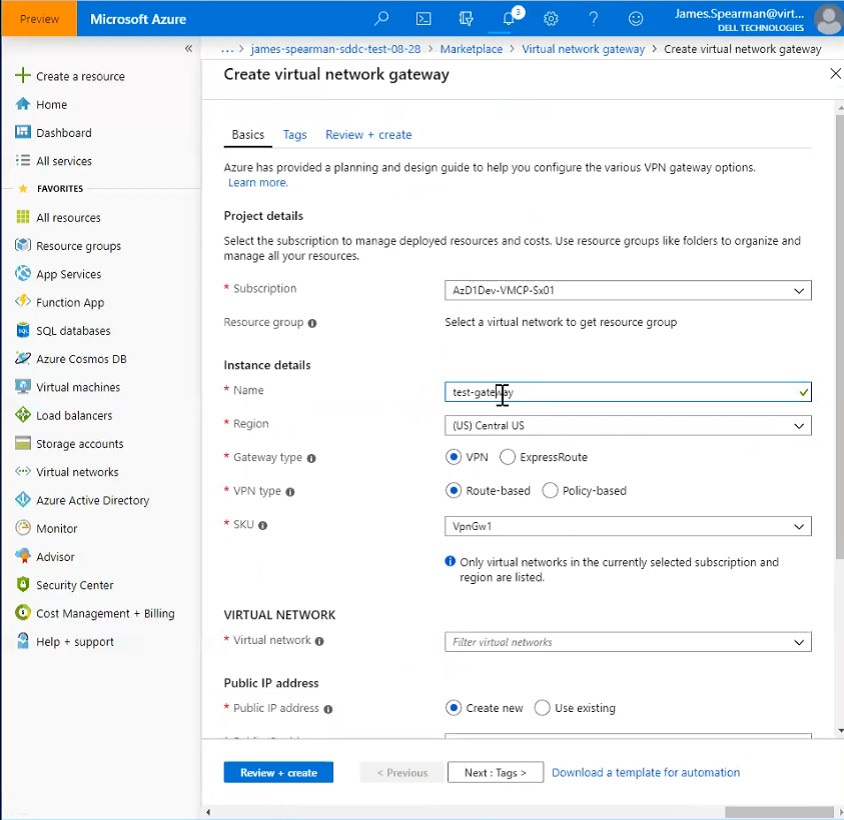

1. On the Basics tab of the Create virtual network gateway page, complete
the fields as shown in the following table. Use the example values in
the table, unless the test discipline requires otherwise:

   | Field                            | Value                                                                                                                                    |
   | -------------------------------- | ---------------------------------------------------------------------------------------------------------------------------------------- |
   | **Subscription**                 | This value is already populated with the Subscription to which the Resource Group belongs.                                               |
   | **Resource group**               | This value is already populated for the current Resource Group. This should be the Resource Group you created in a previous test.        |
   | **Name**                         | Enter a unique name for the VNET gateway.                                                                                                |
   | **Region**                       | Select the geographical location of the VNET gateway.                                                                                    |
   | **Gateway type**                 | Select **ExpressRoute**.                                                                                                                 |
   | **VPN type**                     | Select **Route-based**.                                                                                                                  |
   | **SKU**                          | Leave the default value: **standard**.                                                                                                   |
   | **Virtual network**              | Select the VNET you created previously. If you do not see the VNET, make sure the region of the gateway matches the region of your VNET. |
   | **Gateway subnet address range** | This value is populated when you select the VNET. Do not change the default value.                                                       |
   | **Public IP address**            | Select **Create new**.                                                                                                                   |
   |                                  |                                                                                                                                          |

1. Click **Review + create**.

1. If the values on the Review + create tab are acceptable, click
**Create**.

**Expected Results for Create a Virtual Network Gateway** You receive a
notification that the gateway was created and you can see the gateway in
the Resource Group.

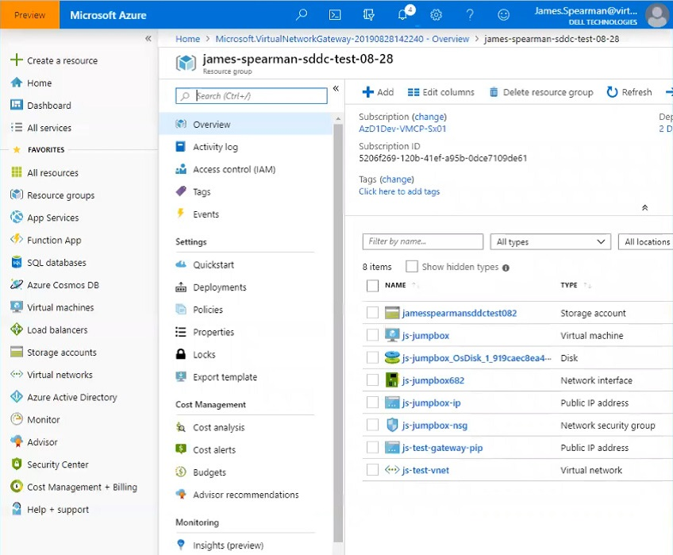

## Connect EXPRESSROUTE to the VNET Gateway

In this exercise you add a connection between your SDDC and the VNET
gateway you created.

**Steps**

1. Display the Resource Group you created in the
previous test and click **Connectivity**.

   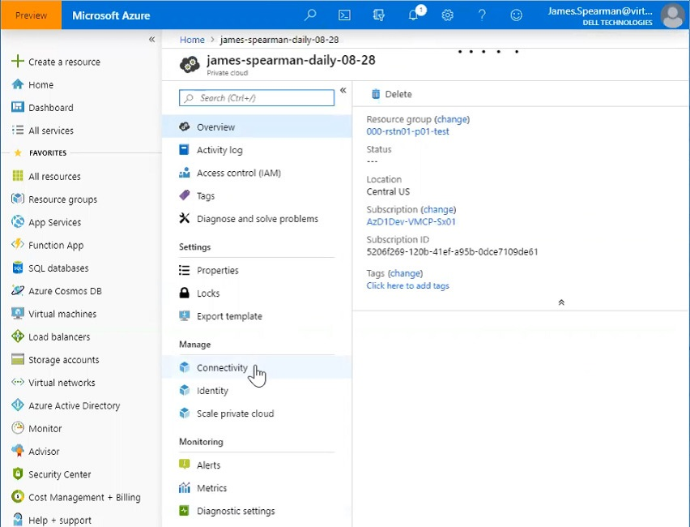

1. Click the **ExpressRoute** tab.

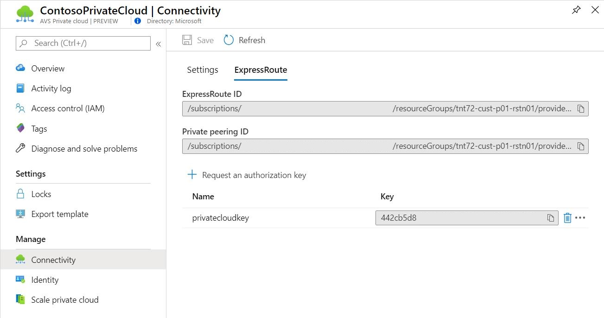

1. Copy the authorization key. If there is not an authorization key, you
need to create one.

1. Display the VNET gateway you created
previously in the portal.

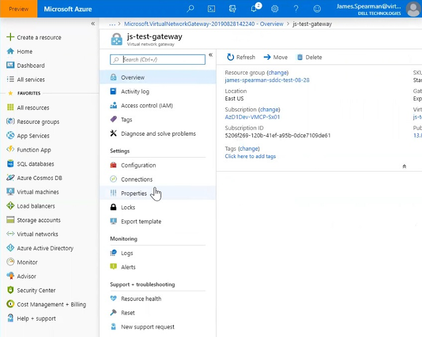

1. Click **Connections**.

   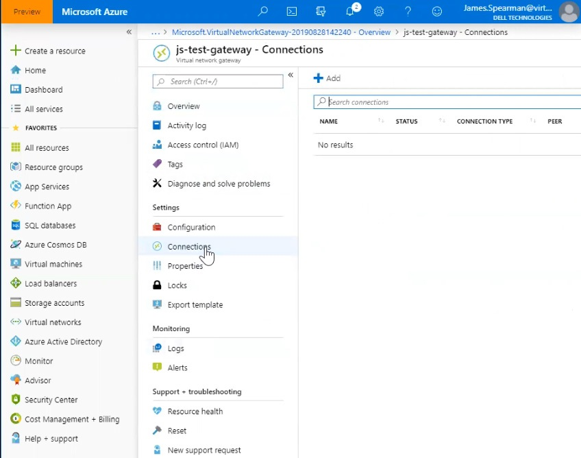

1. Click **+ Add**.

   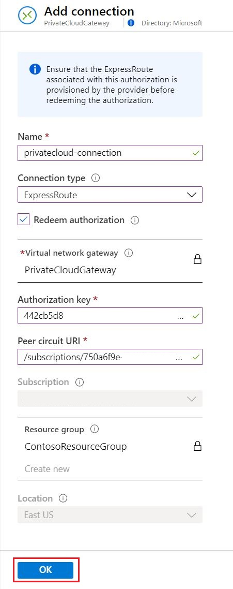

1. On the Add connection tab, complete the fields as shown in the
following table. Use the example values in the table, unless the test
discipline requires otherwise:

   | Field                       | Value                                                                                   |
   | --------------------------- | --------------------------------------------------------------------------------------- |
   | **Name**                    | Enter a name for the connection.                                                        |
   | **Connection type**         | Select **ExpressRoute**.                                                                |
   | **Redeem authorization**    | Ensure this box is selected.                                                            |
   | **Virtual network gateway** | The VNET gateway you created previously is selected.                                    |
   | **Authorization key**       | Copy and paste the authorization key from the ExpressRoute tab for your Resource Group. |
   | **Peer circuit URI**        | Copy and paste the ExpressRoute ID from the ExpressRoute tab for your Resource Group.   |

8.Click **OK**.

Expected Result for Connect EXPRESSROUTE to the VNET Gateway

You receive notification that the connection was successfully created.

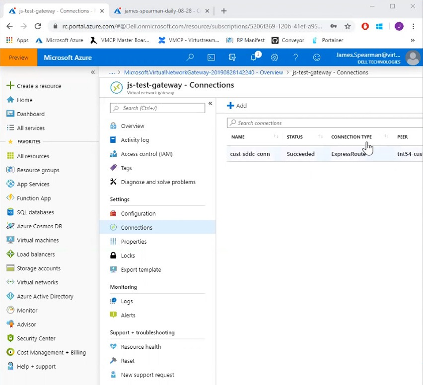

In this tutorial you learned how to:

> [!div class="checklist"]
> * Create a Virtual Network
> * Create a Virtual Network Gateway
> * Connect your ExpressRoute circuit to the gateway

Continue to the next tutorial to learn how to create a jump box that is used to connect to your environment.

> [!div class="nextstepaction"]
> [Create a jump box](create-jump-box.md)