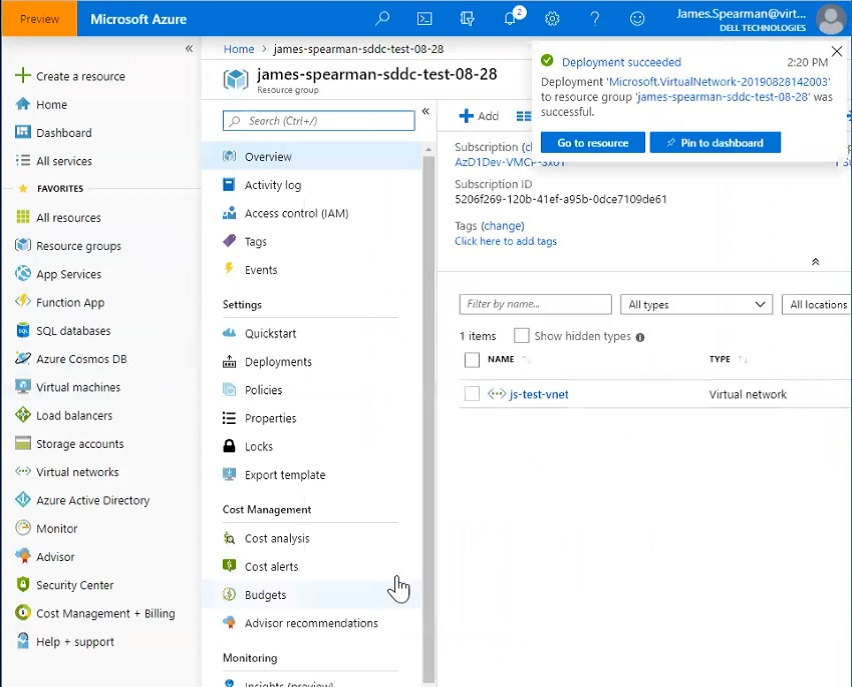
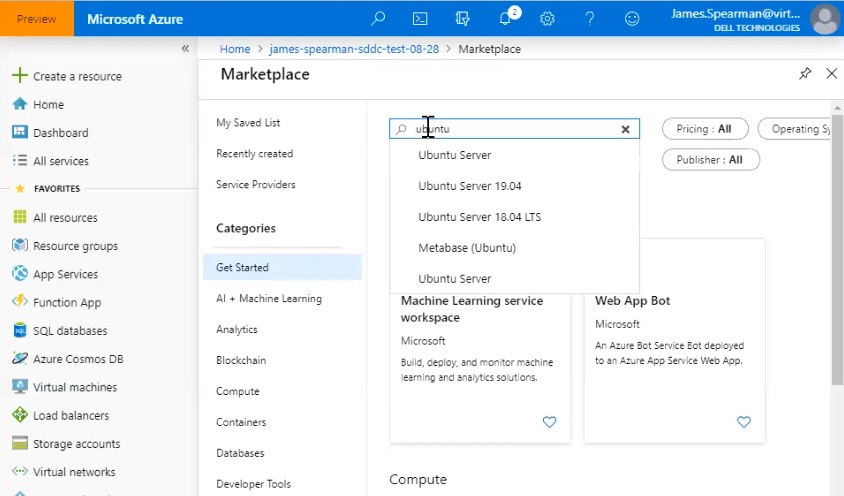
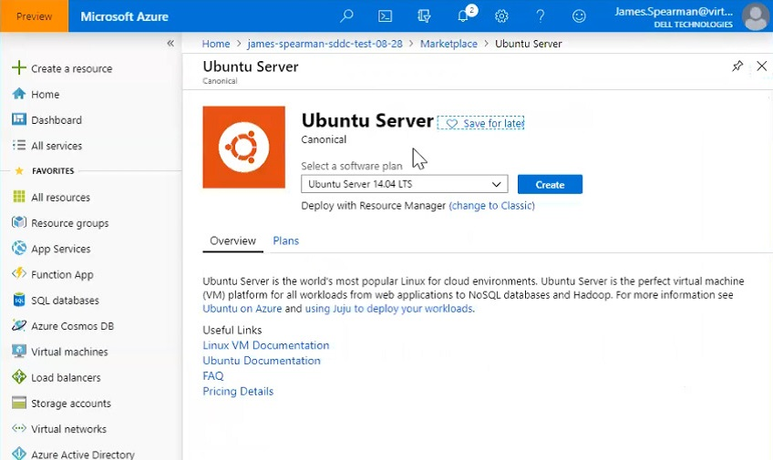
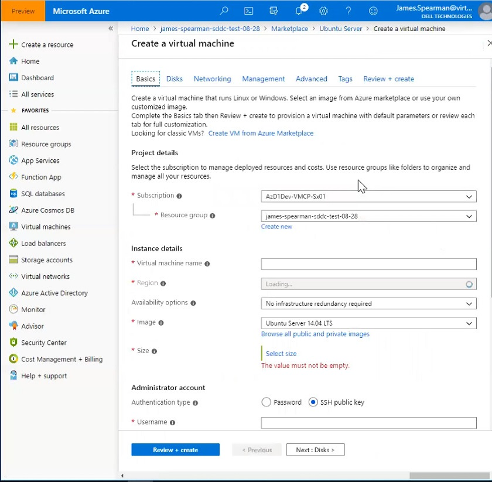

# Create a Jump Box

Create a Virtual Network Gateway In this exercise you add a new Virtual
Network Gateway

In this exercise you create a jump box in the Resource Group you created
previously. This is a VM on the VNET you created that will provide you
access to the vCenter and NSX Manager.

In this tutorial, you learn how to:

> [!div class="checklist"]
> * Create a jump box
> * Login to vCenter from your jump box

1. Display the Resource Group you created in the
previous test and click **+ Add** to define a new resource. 2.Use the
**Search the Marketplace** box to find the **Ubuntu Server** option and
select it.

   

2. Use the **Search the Marketplace** box to find
the **Ubuntu Server** option and select it.

   

3. The Portal displays an Ubuntu Server splash screen.

   

4. Click **Create**.

   

5. On the Basics tab of the Create a virtual machine page, complete the
fields as shown in the following table. Use the example values in the
table, unless the test discipline requires otherwise:

   | Field                    | Value                                                                                                                             |
   | ------------------------ | --------------------------------------------------------------------------------------------------------------------------------- |
   | **Subscription**         | This value is already populated with the Subscription the Resource Group belongs to.                                              |
   | **Resource group**       | This value is already populated for the current Resource Group. This should be the Resource Group you created in a previous test. |
   | **Virtual machine name** | Enter a unique name for the VM.                                                                                                   |
   | **Region**               | Select the geographical location of the VM.                                                                                       |
   | **Availability options** | Leave the default value selected.                                                                                                 |
   | **Image**                | Select the VM image.                                                                                                              |
   | **Size**                 | Leave the default size value.                                                                                                     |
   | **Authentication type**  | Select **Password**.                                                                                                              |
   | **Username**             | Enter the user name for logging on to the VM.                                                                                     |
   | **Password**             | Enter the password for logging on to the VM.                                                                                      |
   | **Confirm password**     | Enter the password for logging on to the VM.                                                                                      |
   | **Public inbound ports** | Select **None**.                                                                                                                  |

6. Click **Review + create**.

7. If the values on the Review + create tab are acceptable, click
**Create**.

**Expected Results for Create a Jump Box**

You receive a notification that you successfully added a VM and you can
see the VM in your Resource Group.

## Login to vCenter

In this tutorial you learned how to:

> [!div class="checklist"]
> * Create a jump box
> * Login to vCenter from your jump box

Continue to the next tutorial to ...

> [!div class="nextstepaction"]
> [...]()