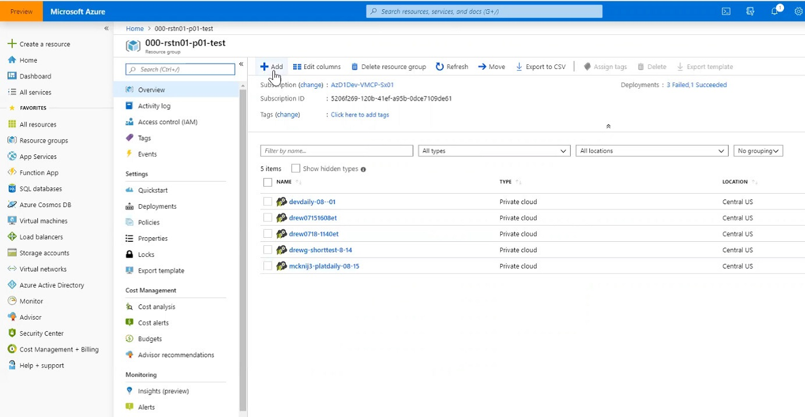
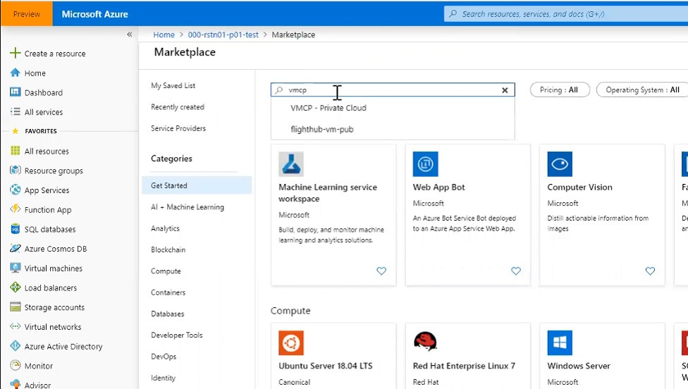
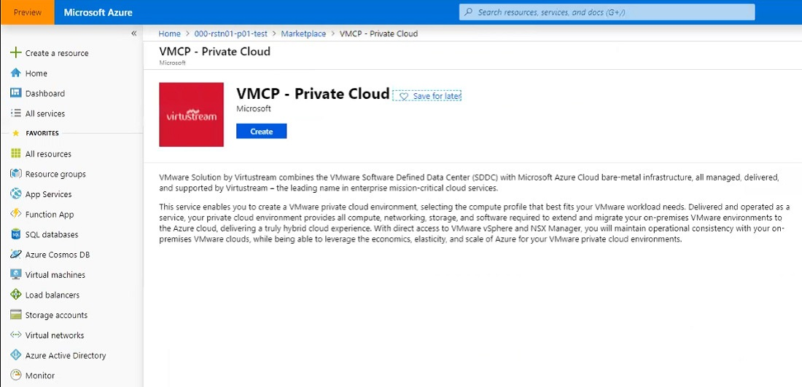
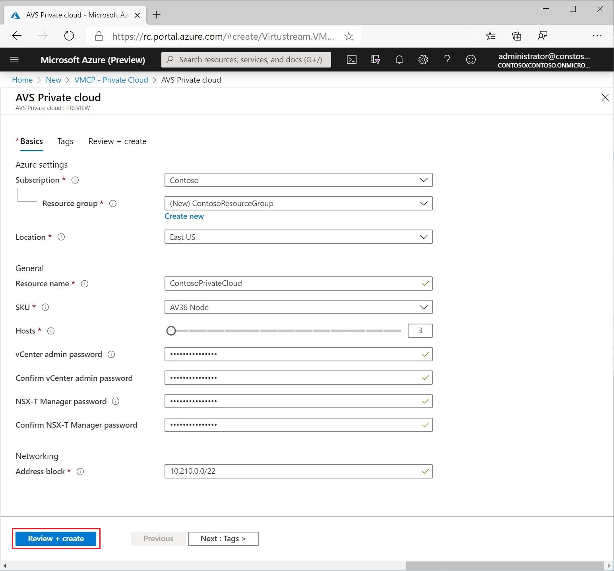
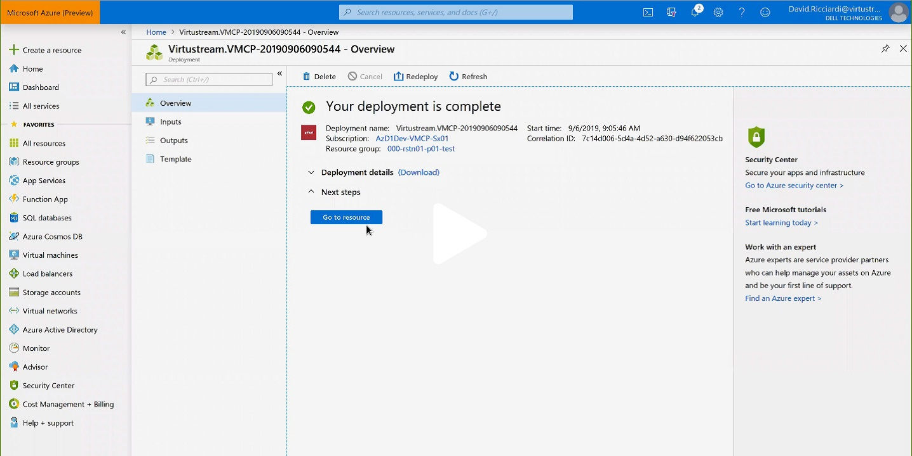

# Tutorial: Deploy an SDDC in Azure

**Deploy vSphere Cluster in Azure (3 host minimum)**

Ability to deploy a vSphere cluster in Azure from the Azure portal.
Minimum initial deployment is three hosts. Additional hosts can be added
one at a time, up to a maximum of 16 hosts per cluster. Deployment
within 150 minute time frame.

In this tutorial, you learn how to:

> [!div class="checklist"]
> * Create a Private Cloud

## Sign in to the Azure portal

Sign in to the [Azure portal](https://rc.portal.azure.com).

## Create a Private Cloud

1. Select your appropriate Resource Group
(**000-rstn01-p01-test**, for example), and click **+Add** on the
overview tab.

   

   
1. Enter vmcp in the **Search the Marketplace**
box, and select **AVSV - Private Cloud** from the list.

   

1. The Portal displays a splash screen for AVSV
private cloud.

   

1. Click **Create**.

   

1. On the Basics tab, complete the fields as shown in the following
table. Use the example values in the table, unless the test discipline
requires otherwise:

   | Field                      | Value                                                                                                                                                 |
   | -------------------------- | ----------------------------------------------------------------------------------------------------------------------------------------------------- |
   | **Subscription**           | Request Unique ID from lab proctor                                                                                                                    |
   | **Resource group**         | Request Unique ID from lab proctor                                                                                                                    |
   | **Location**               | Request location from lab proctor                                                                                                                     |
   | **Resource name**          | Depending on the situation, suggested names include devdaily-mm-dd, platdaily-mm-dd, sredaily-mm-dd, or first-last-daily-mm-dd.                       |
   | **SKU**                    | VS36Node                                                                                                                                              |
   | **Hosts**                  | Typically, leave the value at 3, but you may use a larger cluster if there are enough hosts. Be careful not to exhaust the supply of available hosts. |
   | **vCenter admin password** | Enter cloud administrator credentials.                                                                                                                |
   | **NSX-T manager password** | Enter NSX-T administrator credentials.                                                                                                                |
   | **Address block**          | Enter an IP address block for the CIDR network in this box, such as 10.175.0.0/22. Lab proctor will provide address block.                            |
   |                            |                                                                                                                                                       |

1. Click **Review + Create**.

1. If the values appear valid, click **Create**.

1. This step takes roughly two hours and provides virtually no
indication of progress. If it does not report success within 3 hours
then troubleshooting will be required.

## Verify deployment was successful

The Azure Portal notification shows the
deployment is successful. Navigate to the Azure portal to verify your private cloud is deployed.

## Next steps

In this tutorial you learned how to:

> [!div class="checklist"]
> * Create an SDDC (Private Cloud)
> * Verified the Private Cloud deployed

Continue to the next tutorial to learn how to create a virtual network for use with your Private Cloud.

> [!div class="nextstepaction"]
> [Create a Virtual Network](configure-networking.md)