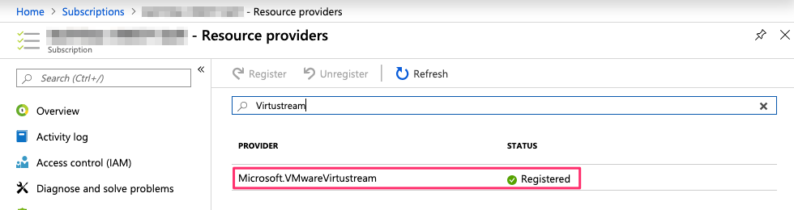
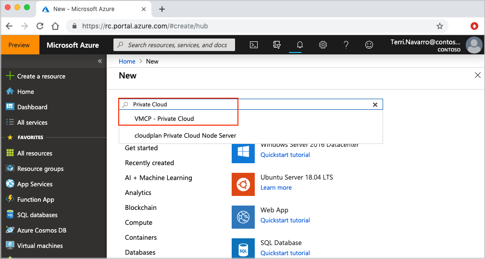
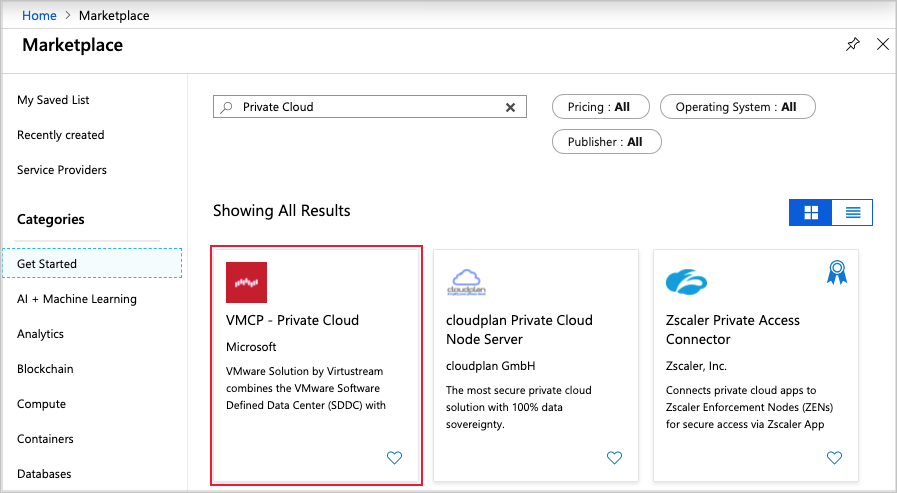
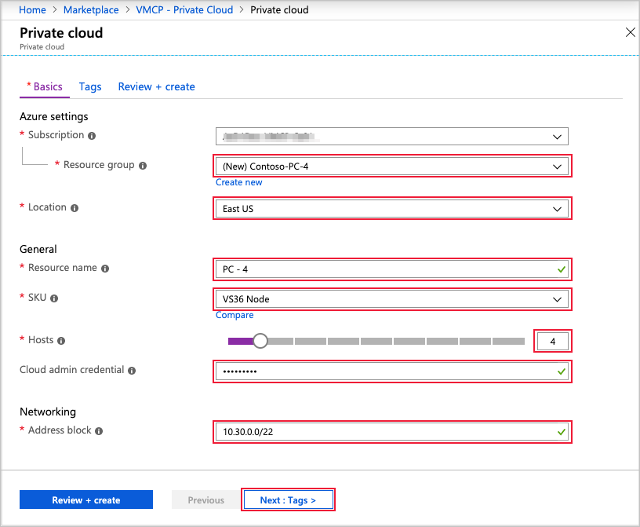

# Tutorial: Create an Azure VMware Solution by Virtustream private cloud

AVS by Virtustream private clouds provide Azure-based environments to run VMware virtual machines (VMs). In this tutorial, you plan and then create a private cloud. Using the Azure portal, you learn how to:

> [!div class="checklist"]
> * Prepare for a deployment
> * Create a private cloud
> * Request ExpressRoute authorization keys
> * Enable internet and Azure connectivity

The next tutorial provides the instructions for deploying resources to a VNet in your subscription. An ExpressRoute gateway in that VNet will be used to peer with an ExpressRoute circuit in your private cloud. Most of the procedures in the second tutorial can be done before this tutorial is started.

## Prerequisites

It's recommended you first plan the private network address space for your private cloud. This network address space for the management access and vMotion networks in your private cloud. The private network address space should be unique across the VNets in your Azure subscription and, if you plan to connect from on-premises environments, it's also recommended that it's unique across your on-premises networks.

You also plan for the type and number of hosts that you'll use in your private cloud clusters. Resource and resource group names are also required when you create a private cloud.

This tutorial also requires that you have an Azure subscription and access to the Azure portal. You also need to have the Microsoft.VMwareVirtustream resource provider is registered in your subscription. Following the instructions in [Azure resource providers and types documentation][resource provider], search for "Virtustream". This screenshot shows what will appear if the resource provider is registered in your subscription.

If it's not registered, continue with instructions in that documentation.

Prerequisites:

- A /22 network address space
- The type of host that you'll use in the private cloud
- The number of hosts to be used in each cluster

## Create a private cloud 

In the Azure portal, select **+ Create a resource > Compute** and then search the marketplace for "private cloud".

In the results, select **VMCP - Private Cloud**.

Select **Create**.

In **Basics**, enter the required information and then select **Next**.

In **Tags**, create or select tags that you'll use to associate with the new private cloud. Once tags are created, select **Next**. In this example, the "environment" tag with value "Production" is used.

If the configuration passes validation, review and then select **Review + Create > Create**.

Once the deployment has succeeded, navigate to the new private cloud in your resources and review the overview information. Confirm the configuration and then select **Admin** to retrieve the credentials to access vCenter and NSX-T manager. You will use the credentials connect to your private cloud in another tutorial.

## Next steps

In the next tutorial, you will [create an NSX-T T1 router and a logical switch][tutorials-create-t1-ls].

<!-- [create a VNet and resources][tutorials-create-vnet-resources] -->

<!-- LINKS - external-->
[resource provider]: https://docs.microsoft.com/azure/azure-resource-manager/resource-manager-supported-services
[enable Global Reach]: https://docs.microsoft.com/azure/expressroute/expressroute-howto-set-global-reach-cli#enable-connectivity-between-expressroute-circuits-in-different-azure-subscriptions

<!-- LINKS - internal -->
[tutorials-create-t1-ls]: tutorials-create-t1-ls.md
<!-- [tutorials-create-vnet-resources]: ./tutorials-create-vnet-resources.md -->
