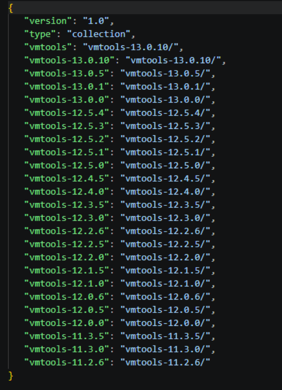
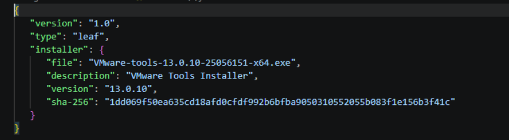

# Set-ToolsRepo Run Command
In this article, learn how to use the Set-ToolsRepo Run Command from end-to-end, how to download and host the correct GuestStore version of the VMware Tools zip file, how we run the AVS Run Command, and how you can validate success.

## When to use Set-ToolsRepo Run Command
This Run Command should be used to make a specific VMware Tools version available for VM guest tools installation and upgrades in an Azure VMware Solution private cloud. When you want to centrally publish the GuestStore version of the VMware tools ZIP file to the vSAN central Tools location so that all relevant hosts can reference the package. 

## Prerequisites 
  - A publicly accessible HTTP/HTTPS URL that points to the GuestStore version of the VMware Tools zip file (provided by the customer). The URL must be reachable from the Azure VMware Solution Run Command execution environment.
  - Permission to execute Azure VMware Solution Run Command packages in the Azure portal for the target private cloud.
  - The ZIP contents must include a VMware Tools payload directory in the expected layout.

### Expected ZIP Content
The ZIP file you upload must contain the versioned folder under the following section: **vmware/apps/vmtools/windows64/vmtools-\<version>/**.
The folder name must follow the format **vmtools-\<version>** (For example, **vmtools-12.4.0**).

## Validate option
The Validate option enables a read-only audit mode for the Tools repository. When specified, Set-ToolsRepo inspects the current datastore metadata files without making any changes to your environment.

### When to use Validate option
  - Before running Set-ToolsRepo (baseline check)
  - After running Set-ToolsRepo (confirm everything is in sync)
  - If you suspect a repository/sync problem and want a quick read-only check
  
### What Validate option checks
  - Identifies all vSAN datastores in the SDDC
  - Reads repository metadata (top-level-metadata.json and version-metadata.json)
  - Verifies the metadata and datastore state are consistent and synchronized
### Validate results
  - **PASS**: versions match and datastores are in sync
  - **FAIL**: mismatch/inconsistency detected

### Common Validate option failures
  - **Metadata mismatch** → Re-run Set-ToolsRepo with a valid Tools ZIP URL (without -Validate option) to redeploy/repair the repository, then run Set-ToolsRepo -Validate to confirm the metadata is in sync.
  - **GuestStore path not found** → The repository may be missing or inaccessible; deploy/reinitialize by running Set-ToolsRepo with a valid ZIP URL (without -Validate option), then run Set-ToolsRepo -Validate to verify the repository is present and synchronized.

## Tools ZIP URL
The Set-ToolsRepo Run command accepts a publicly accessible HTTP/HTTPS URL to the GuestStore version of the VMware Tools zip file that will be published to the vSAN central Tools location. 
Before making any changes, validation that the URL is usable and the ZIP file can be downloaded successfully occurs. 

  - The URL uses HTTP or HTTPS and is a direct download link.
  - The file is reachable without interactive authentication and can be downloaded end to end.

## End to end workflow
1. Customer downloads the required VMware Tools version.
    - The customer obtains the GuestStore version of the VMware Tools ZIP file for the specific version they want to publish to the vSAN central Tools location.
2. Customer hosts the ZIP file at a publicly accessible HTTP/HTTPS location.
    - The customer must host the ZIP at a publicly accessible HTTP/HTTPS URL (for example, any web server or object storage that can serve the file without interactive authentication). They then provide that direct-download URL for use with the Run Command.
>[!IMPORTANT]
> The URL must be a direct download link and reachable without interactive authentication so the Run Command can retrieve the ZIP file. 

3. Customer runs the Set-ToolsRepo Run Command.
    - Run the AVS Run Command and provide the ZIP URL shared in step 2. When it completes, the command output will indicate success or provide an error message.
4. VMware Tools package is published.
    - Once the Run Command completes successfully, the requested VMware Tools version is available from vSAN central Tools location for the private cloud.
5. Hosts are configured to use the vSAN repository
    - As part of the Run Command, the relevant ESXi hosts in the private cloud are updated to use vSAN central Tools location as the VMware Tools source.

## Validation
After successful run of the Set-ToolsRepo Run Command, be sure to follow the below steps for validation. 
  - Navigate to your vCenter client and browse the vSAN datastore. confirm the version folder exists under **GuestStore/vmware/apps/vmtools/windows64/**
  - Confirm the correct VMware Tools version is available to install or upgrade from within a guest test VM.
  - If any issues occur with the VMware Tools after a successful Run Command operation, capture the Run Command output and open a support request.

## Troubleshooting 
If the Run Command fails, the most common customer-side causes are the URL is not publicly reachable as a direct download link, or the ZIP does not contain the expected folder structure.  
Use the error message along with the troubleshooting steps listed below. 

### URL or Download issues 
  - **URL not reachable or the download fails**. Confirm the URL opens from an external network, is a direct-download link, and does not require sign-in, MFA, or time-limited tokens.
  - **TLS/SSL error**. Ensure the HTTPS endpoint supports modern TLS and presents a valid certificate.

### ZIP Structure issues
  - **Expected folder not found**. Ensure the ZIP contains vmware/apps/vmtools/windows64/vmtools-\<version> (including the leading vmware/ directory).
  - **Multiple versions in one ZIP**. Host a ZIP that contains only the single version you intend to publish, with one vmtools-\<version> folder.

### Datastore issues
  - **Service-side publish/configure error**. If the URL and ZIP structure are correct but the command still fails, capture the full Run Command output and open a support request.
  - **Intermittent failures**. Retry the Run Command after confirming the ZIP URL is still valid and reachable.
  
### VMware Tools upgrade option greyed out and not on the current version
### Issue
The VMware Tools Install/Upgrade option appears disabled (greyed out) for virtual machines in vCenter.  
This can occur when the VMware Tools repository metadata in the vSAN datastore is inconsistent or incorrect.

### Resolution
#### Check repository metadata in GuestStore
- Navigate to:  
  **vSAN Datastore → GuestStore → vmware → apps → vmtools → windows64**
  
:::image type="content" source="../azure-vmware/media/tools-troubleshooting/vsan-windows64.png" alt-text="Screenshot of the vSAN datastore showing the GuestStore path vmware apps vmtools windows64 directory." lightbox="../azure-vmware/media/tools-troubleshooting/vsan-windows64.png" border="false":::
- Verify the following files:
  - Top-level metadata:  
    **windows64/metadata.json**
    

  - Version-specific metadata:  
    **windows64/vmtools-&lt;version&gt;/metadata.json**
    

#### Validate metadata consistency
- The top-level metadata.json and version-specific metadata.json should:
  - Match the same VMware Tools version
  - Be consistent with each other (as shown in reference screenshots)
- Interpretation:
  - If they match → metadata is consistent  
  - If they do not match → metadata inconsistency exists  

#### Fix metadata mismatch (if identified)
- If the **top-level file is incorrect**:
  - Delete:  
    **windows64/metadata.json**  
    *(Example: vSAN Datastore/GuestStore/vmware/apps/vmtools/windows64/metadata.json)*
  - Upload the correct windows64/metadata.json from the **highest VMware Tools package uploaded**
- If the **version-specific file is incorrect**:
  - Delete:  
    **windows64/vmtools-&lt;version&gt;/metadata.json**  
    *(Example: vSAN Datastore/GuestStore/vmware/apps/vmtools/windows64/vmtools-&lt;version&gt;/metadata.json)*
  - Upload the correct windows64/vmtools-&lt;version&gt;/metadata.json from the **highest VMware Tools package uploaded**
- Ensure both metadata files match the same VMware Tools version

#### Wait for host refresh
- Allow time for the change to propagate across hosts (up to 24 hours)

#### Verify resolution
- Recheck the VM in vCenter  
- The VMware Tools Install/Upgrade option should now be enabled  

#### Optional
- Run **Set-ToolsRepo -Validate** to confirm metadata consistency

 ## Next step
To learn more about Run Commands, see [Run Commands](using-run-command.md).
