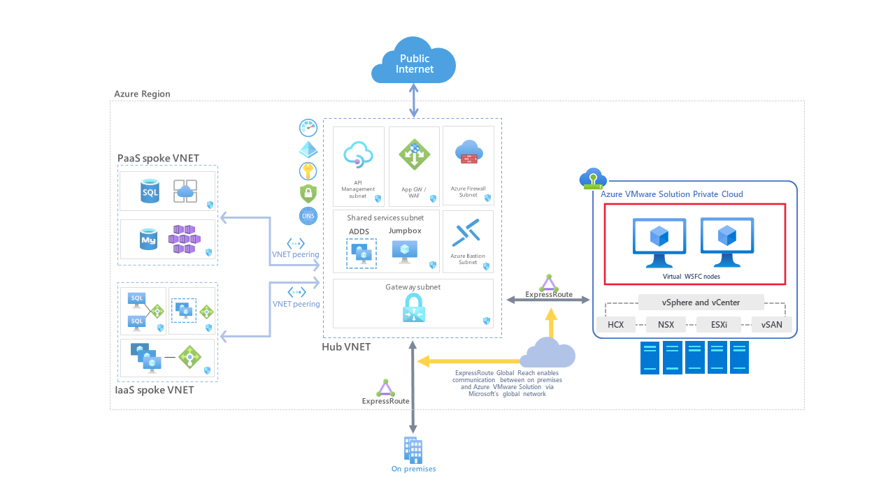

# Windows Server Failover Cluster on Azure VMware Solution vSAN with native shared disks

In this article, we'll walk through setting up Windows Server Failover Cluster on Azure VMware Solution. The implementation in this article is for proof of concept and pilot purposes. We recommend using a Cluster-in-a-Box (CIB) configuration until placement policies are available.

Windows Server Failover Cluster (WSFC), previously known as Microsoft Service Cluster Service (MSCS), is a feature of the Windows Server Operating System (OS). WSFC is a business-critical feature, and for many applications is required. For example, WSFC is required for the following configurations:

- SQL server configured as:
  - Always On Failover Cluster Instance (FCI), for instance-level high availability.
  - Always On Availability Group (AG), for database-level high availability.
- Windows File Services:
  - Generic File share running on active cluster node.
  - Scale-Out File Server (SOFS), which stores files in cluster shared volumes (CSV).
  - Storage Spaces Direct (S2D); local disks used to create storage pools across different cluster nodes.

You can host the WSFC cluster on different Azure VMware Solution instances, known as Cluster-Across-Box (CAB). You can also place the WSFC cluster on a single Azure VMware Solution node. This configuration is known as Cluster-in-a-Box (CIB). We don't recommend using a CIB solution for a production implementation. Were the single Azure VMware Solution node to fail, all WSFC cluster nodes would be powered off, and the application would experience downtime. Azure VMware Solution requires a minimum of three nodes in a private cloud cluster.

It's important to deploy a supported WSFC configuration. You'll want your solution to be supported on vSphere and with Azure VMware Solution. VMware provides a detailed document about WSFC on vSphere 6.7, [Setup for Failover
Clustering and Microsoft
Cluster Service](https://docs.vmware.com/en/VMware-vSphere/6.7/vsphere-esxi-vcenter-server-67-setup-mscs.pdf).

This article focuses on WSFC on Windows Server 2016 and Windows Server 2019. Older Windows Server versions are out of [mainstream support](https://support.microsoft.com/lifecycle/search?alpha=windows%20server) and so we don't consider them here.

You'll need to first [create a WSFC](https://docs.microsoft.com/windows-server/failover-clustering/create-failover-cluster). For more information on WSFC, see [Failover Clustering in Windows Server](https://docs.microsoft.com/windows-server/failover-clustering/failover-clustering-overview). Use the information we provide in this article for the specifics of a WSFC deployment on Azure VMware Solution.

## Prerequisites

- Azure VMware Solution environment
- Microsoft Windows Server OS installation media

## Reference architecture

Azure VMware Solution provides native support for virtualized WSFC. It supports SCSI-3 Persistent Reservations (SCSI3PR) on a virtual disk level. This support is required by WSFC to arbitrate access to a shared disk between nodes. Support of SCSI3PRs enables configuration of WSFC with a disk resource shared between VMs natively on vSAN datastores.

The following diagram illustrates the architecture of WSFC virtual nodes on an Azure VMware Solution private cloud. It shows where Azure VMware Solution resides, including the WSFC virtual servers (red box), in relation to the broader Azure platform. This diagram illustrates a typical hub-spoke architecture, but a similar setup is possible with the use of Azure Virtual WAN. Both offer all the value other Azure services can bring you.

## Supported configurations

Currently, the following configurations are supported:

- Microsoft Windows Server 2012 or later
- Up to five failover clustering nodes per cluster
- Up to four PVSCSI adapters per VM
- Up to 64 disks per PVSCSI adapter

## Virtual Machine configuration requirements

### WSFC node configuration parameters

- Install the latest VMware Tools on each WSFC node.
- Mixing non-shared and shared disks on a single virtual SCSI adapter isn't supported. For example, if the system disk (drive C:) is attached to SCSI0:0, the first shared disk would be attached to SCSI1:0. A VM node of a WSFC has the same virtual SCSI controller maximum as an ordinary VM - up to four (4) virtual SCSI Controllers.
- Virtual discs SCSI IDs should be consistent between all VMs hosting nodes of the same WSFC.

| **Component** | **Requirements** |
| --- | --- |
| VM hardware version | 11 or above to support Live vMotion. |
| Virtual NIC | VMXNET3 paravirtualized network interface card (NIC); enable the in-guest Windows Receive Side Scaling (RSS) on the virtual NIC. |
| Memory | Use full VM reservation memory for nodes in the WSFC cluster. |
| Increase the I/O timeout of each WSFC node. | Modify HKEY\_LOCAL\_MACHINE\System\CurrentControlSet\Services\Disk\TimeOutValueSet to 60 seconds or more. (If you recreate the cluster, this value might be reset to its default, so you must change it again.) |
| Windows cluster health monitoring | The value of the SameSubnetThreshold Parameter of Windows cluster health monitoring must be modified to allow 10 missed heartbeats at minimum. This is [the default in Windows Server 2016](https://techcommunity.microsoft.com/t5/failover-clustering/tuning-failover-cluster-network-thresholds/ba-p/371834). This recommendation applies to all applications using WSFC, including shared and non-shared disks. |

### WSFC node - Boot disks configuration parameters

| **Component** | **Requirements** |
| --- | --- |
| SCSI Controller Type | LSI Logic SAS |
| Disk mode | Virtual |
| SCSI bus sharing | None |
| Modify advanced settings for a virtual SCSI controller hosting the boot device. | Add the following advanced settings to each WSFC node:  scsiX.returnNoConnectDuringAPD = "TRUE" scsiX.returnBusyOnNoConnectStatus = "FALSE" Where X is the boot device SCSI bus controller ID number. By default, X is set to 0. |

### WSFC node - Shared disks configuration parameters

| **Component** | **Requirements** |
| --- | --- |
| SCSI Controller Type | VMware Paravirtualize (PVSCSI) |
| Disk mode | Independent - Persistent (step 2 in illustration below). By using this setting, you ensure that all disks are excluded from snapshots. Snapshots aren't supported for WSFC-based VMs. |
| SCSI bus sharing | Physical (step 1 in illustration below) |
| Multi-writer flag | Not used |
| Disk format | Thick provisioned. (Eager Zeroed Thick (EZT) isn't required with vSAN.) |

:::image type="content" source="media/windows-server-failover-cluster/edit-settings-virtual-hardware.png" alt-text="A screenshot showing the Edit Settings page for virtual hardware.":::

## Non-supported scenarios

The following functionalities aren't supported for WSFC on Azure VMware Solution:

- NFS data stores
- Storage Spaces
- vSAN using iSCSI Service
- vSAN Stretched Cluster
- Enhanced vMotion Compatibility (EVC)
- vSphere Fault Tolerance (FT)
- Snapshots
- Live (online) storage vMotion
- N-Port ID Virtualization (NPIV)

Hot changes to virtual machine hardware might disrupt the heartbeat between the WSFC nodes.

The following activities aren't supported and might cause WSFC node failover:

- Hot adding memory
- Hot adding CPU
- Using snapshots
- Increasing the size of a shared disk
- Pausing and resuming the virtual machine state
- Memory over-commitment leading to ESXi swapping or VM memory ballooning
- Hot Extend Local VMDK file, even if it isn't associated with SCSI bus sharing controller

## Configure WSFC with shared disks on Azure VMware Solution vSAN

1. Ensure that an Active Directory environment is available.
2. Create virtual machines (VMs) on the vSAN datastore.
3. Power on all VMs, configure the hostname, IP addresses, join all VMs to an Active Directory domain, and install latest available OS updates.
4. Install the latest VMware Tools.
5. Enable and configure the Windows Server Failover Cluster feature on each VM.
6. Configure a Cluster Witness for quorum (a file share witness works fine).
7. Power off all nodes of the WSFC cluster.
8. Add one or more Paravirtual SCSI controllers (up to four) to each VM part of the WSFC. Use the settings per the previous paragraphs.
9. On the first cluster node, add all needed shared disks using **Add New Device** > **Hard Disk**. Disk sharing should be left as **Unspecified** (default) and Disk mode as **Independent - Persistent**. Attach it to the controller(s) created in the previous steps.
10. Continue with the remaining WSFC nodes. Add the disks created in the previous step by selecting **Add New Device** > **Existing Hard Disk**. Be sure to maintain the same disk SCSI IDs on all WSFC nodes.
11. Power on the first WSFC node; sign in and open the disk management console (mmc). Make sure the added shared disks can be managed by the OS and are initialized. Format the disks and assign a drive letter.
12. Power on the other WSFC nodes.
13. Add the disk to the WSFC cluster using the **Add Disk wizard** and add them to a Cluster Shared Volume.
14. Test a failover using the **Move disk wizard** and make sure the WSFC cluster with shared disks works properly.
15. Run the **Validation Cluster wizard** to confirm whether the cluster and its nodes are working properly.

    It's important to keep the following specific items from the Cluster Validation test in mind:

       - **Validate Storage Spaces Persistent Reservation**. If you aren't using Storage Spaces with your cluster (such as on Azure VMware Solution vSAN), this test isn't applicable. You can ignore any results of the Validate Storage Spaces Persistent Reservation test including this warning. To avoid warnings, you can exclude this test.
        
      - **Validate Network Communication**. The Cluster Validation test will throw a warning that only one network interface per cluster node is available. You may ignore this warning. Azure VMware Solution provides the required availability and performance needed, since the nodes are connected to one of the NSX-T segments. However, keep this item as part of the Cluster Validation test, as it will validate other aspects of network communication.

16. Create a DRS rule to place the WSFC VMs on the same Azure VMware Solution nodes. To do so, you need a host-to-VM affinity rule. This way, cluster nodes will run on the same Azure VMware Solution host. Again, this is for pilot purposes until placement policies are available.

    >[!NOTE]
    > For this you need to create a Support Request ticket. Our Azure support organization will be able to help you with this.

## Related information

- [Failover Clustering in Windows Server](https://docs.microsoft.com/windows-server/failover-clustering/failover-clustering-overview)
- [Guidelines for Microsoft Clustering on vSphere (1037959) (vmware.com)](https://kb.vmware.com/s/article/1037959)
- [About Setup for Failover Clustering and Microsoft Cluster Service (vmware.com)](https://docs.vmware.com/en/VMware-vSphere/6.7/com.vmware.vsphere.mscs.doc/GUID-1A2476C0-CA66-4B80-B6F9-8421B6983808.html)
- [vSAN 6.7 U3 - WSFC with Shared Disks &amp; SCSI-3 Persistent Reservations (vmware.com)](https://blogs.vmware.com/virtualblocks/2019/08/23/vsan67-u3-wsfc-shared-disksupport/)
- [Azure VMware Solution limits](../azure-resource-manager/management/azure-subscription-service-limits.md#azure-vmware-solution-limits)

## Next steps

Now that you've covered setting up a WSFC in Azure VMware Solution, you may want to learn about:

- Setting up your new WSFC by adding more applications that require the WSFC capability. For instance, SQL Server and SAP ASCS.
- Setting up a backup solution.
  - [Setting up Azure Backup Server for Azure VMware Solution](https://docs.microsoft.com/azure/azure-vmware/set-up-backup-server-for-azure-vmware-solution)
  - [Backup solutions for Azure VMware Solution virtual machines](https://docs.microsoft.com/azure/azure-vmware/ecosystem-back-up-vms)
