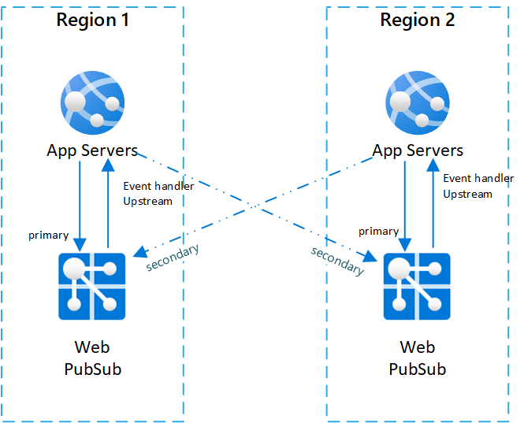
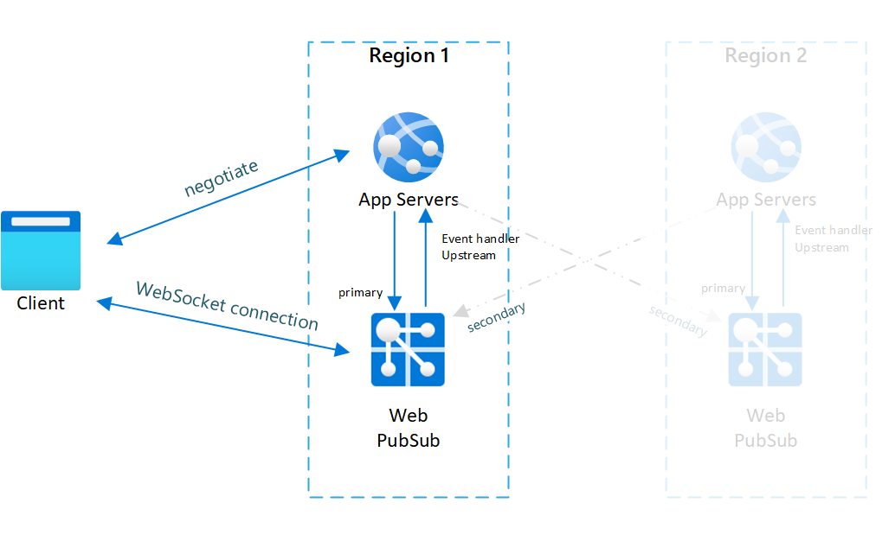
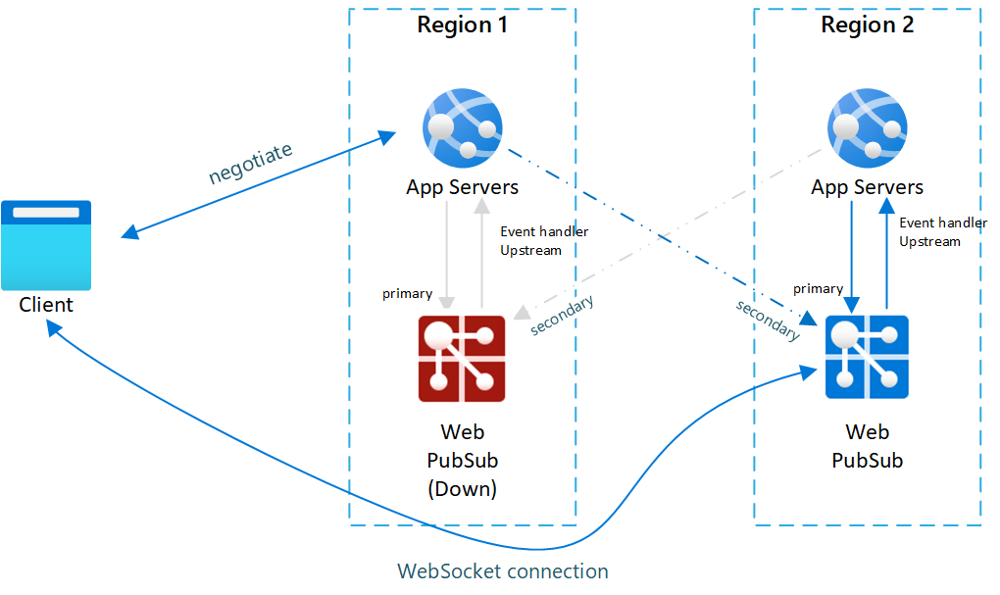
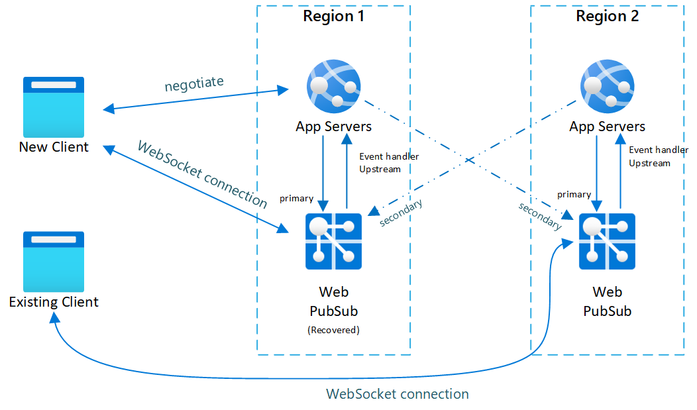

# Resiliency and disaster recovery in Azure Web PubSub Service

Resiliency and disaster recovery is a common need for online systems. Azure Web PubSub Service already guarantees 99.9% availability, but it's still a regional service. When there is a region-wide outage, it is critical for the service to continue processing real-time messages in a different region.

For regional disaster recovery, we recommend the following two approaches:

- **Enable Geo-Replication** (Easy way). This feature will handle regional failover for you automatically. When enabled, there remains just one Azure SignalR instance and no code changes are introduced. Check [geo-replication](howto-enable-geo-replication.md) for details.
- **Utilize Multiple Endpoints**. You learn how to do so **in this document**

## High available architecture for Web PubSub service

There are two typical patterns using Web PubSub service:
* One is client-server pattern that [clients send events the the server](./quickstarts-event-notifications-from-clients.md) and [server pushes messages to the clients](./quickstarts-push-messages-from-server.md).
* Another is client-client pattern that [clients pub/sub messages through the Web PubSub service to other clients](./quickstarts-pubsub-among-clients.md).

Below sections describe different ways for these two patterns to do disaster recovery

###  High available architecture for client-server pattern
In order to have cross region resiliency for Web PubSub service, you need to set up multiple service instances in different regions. So when one region is down, the others can be used as backup.

One typical setup for cross region scenario is to have two (or more) pairs of Web PubSub service instances and app servers.

Inside each pair app server and Web PubSub service are located in the same region, and Web PubSub service set the event handler upstream to the app server in the same region.

To better illustrate the architecture, we call Web PubSub service the **primary** service to the app server in the same pair. And we call Web PubSub services in other pairs as the **secondary** services to the app server.

The application server can use [service health check API](/rest/api/webpubsub/dataplane/health-api/get-service-status) to detect if its **primary** and **secondary** services are healthy or not. For example, for a Web PubSub service called `demo`, the endpoint `https://demo.webpubsub.azure.com/api/health` returns 200 when the service is healthy. The app server can periodically call the endpoints or call the endpoints on demand to check if the endpoints are healthy. WebSocket clients usually **negotiate** with its application server first to get the URL connecting to the Web PubSub service, and the application uses this **negotiate** step to fail over the clients to other healthy **secondary** services. Detailed steps as below:

1. When a client **negotiate** with the app server, app server SHOULD only return primary Web PubSub service endpoints so in normal case clients only connect to primary endpoints.
1. When primary instance is down, **negotiate** SHOULD return a healthy secondary endpoint so client can still make connections, and the client connects to the secondary endpoint.
1. When primary instance is up, **negotiate** SHOULD return the healthy primary endpoint so clients now can connect to the primary endpoint
1. When app server **broadcast**s messages, it SHOULD **broadcast** messages to all the **healthy** endpoints including both **primary** and **secondary**.
1. App server can close connections connected to **secondary** endpoints to force the clients reconnect to the healthy primary endpoint.

With this topology, message from one server can still be delivered to all clients as all app servers and Web PubSub service instances are interconnected.

We haven't integrated the strategy into the SDK yet, so for now the application needs to implement this strategy by itself. 

In summary, what the application side needs to implement is:
1. Health check. Application can either check if the service is healthy using [service health check API](/rest/api/webpubsub/dataplane/health-api/get-service-status) periodically in the background or on demand for every **negotiate** call.
1. Negotiate logic. Application returns healthy **primary** endpoint by default. When **primary** endpoint is down, application returns healthy **secondary** endpoint.
1. Broadcast logic. When messages are sent to multiple clients, application needs to make sure it broadcasts messages to all the **healthy** endpoints.

Below is a diagram that illustrates such topology:

#### Failover sequence and best practice

Now you have the right system topology setup. Whenever one Web PubSub service instance is down, online traffic will be routed to other instances.
Here is what happens when a primary instance is down (and recovers after some time):

1. Primary service instance is down, all clients connected to this instance will be dropped.
2. New clients or reconnect client **negotiate** with the app server
2. App server detects primary service instance is down, and negotiate stops returning this endpoint and start returning a healthy secondary endpoint.
3. Clients connect to secondary instance.
4. Now secondary instance takes all online traffic. All messages from server to clients can still be delivered as secondary is connected to all app servers. But client to server event messages are only sent to the upstream app server in the same region.
5. After primary instance is recovered and back online, app server detects the primary instance is back to healthy. Negotiate will now return primary endpoint again so new clients are connected back to primary. But existing clients won't be dropped and will continue connected to secondary until they disconnect themselves.

Below diagrams illustrate how failover is done:

Fig.1 Before failover

Fig.2 After failover

Fig.3 Short time after primary recovers

You can see in normal case only primary app server and Web PubSub service have online traffic (in blue).

After failover, secondary app server and Web PubSub service also become active.
After primary Web PubSub service is back online, new clients will connect to primary Web PubSub. But existing clients still connect to secondary so both instances have traffic.

After all existing clients disconnect, your system will be back to normal (Fig.1).

There are two main patterns for implementing a cross region high available architecture:

1. The first one is to have a pair of app server and Web PubSub service instance taking all online traffic, and have another pair as a backup (called active/passive, illustrated in Fig.1). 
2. The other one is to have two (or more) pairs of app servers and Web PubSub service instances, each one taking part of the online traffic and serves as backup for other pairs (called active/active, similar to Fig.3).

Web PubSub service can support both patterns, the main difference is how you implement app servers.
If app servers are active/passive, Web PubSub service will also be active/passive (as the primary app server only returns its primary Web PubSub service instance).
If app servers are active/active, Web PubSub service will also be active/active (as all app servers will return their own primary Web PubSub instances, so all of them can get traffic).

Be noted no matter which patterns you choose to use, you'll need to connect each Web PubSub service instance to an app server as a **primary** role.

Also due to the nature of WebSocket connection (it's a long connection), clients will experience connection drops when there is a disaster and failover take place.
You'll need to handle such cases at client side to make it transparent to your end customers. For example, do reconnect after a connection is closed.

###  High available architecture for client-client pattern

For client-client pattern, currently it is not yet possible to support a zero-down-time disaster recovery using multiple instances. If you have high availability requirements, please consider using [geo-replication](howto-enable-geo-replication.md).

## How to test a failover

Follow the steps to trigger the failover:
1. In the Networking tab for the primary resource in the portal, **disable** public network access. If the resource has private network enabled, use *access control rules* to deny all the traffic.
2. **Restart** the primary resource.  

## Next steps

In this article, you have learned how to configure your application to achieve resiliency for Web PubSub service. 

[!INCLUDE [next step](includes/include-next-step.md)]
