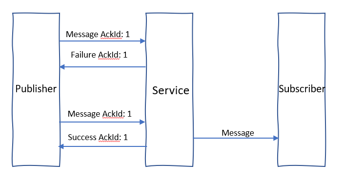
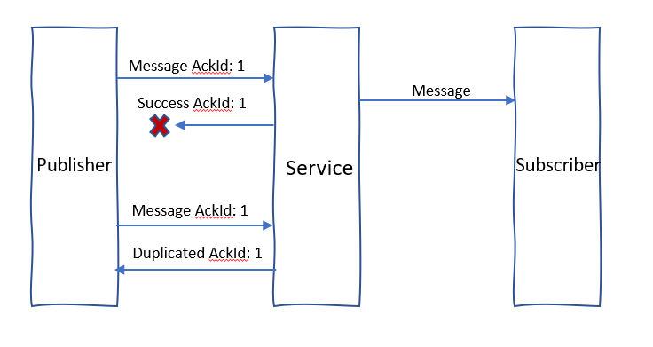

# Azure Web PubSub Service supports exactly once message delivery guarantees 

Exactly once message delivery guarantees are desirable in a real-time pub-sub service. The service supports exactly once message delivery when using subprotocol within a connection-id.The connection-id works like a session and it can cross WebSockets connections. Once a message is published to the service and received a success ack, the message can be delivered to desired connections exactly once.

## How to achieve exactly once message delivery

If everything including network works very well, it's very easy to achieve exactly once message delivery. The problem is how to overcome publishers and subscribers' network issue or service's transient error. It's crucial to mention that exactly once needs the whole system including publisher, service, and subscriber play their roles correctly.

### Service

Service provides a message delivery option to control the type of messaging semantics per hub. By default, it's `AtMostOnce`. Select to `ExactlyOnce` to enable exactly once message delivery support in service side.

### Reconnection

Websockets connections relay on TCP, so if the connection doesn't drop, all messages should be lossless and in order. When connections drop, all the status such as which message has been sent to the service need to be kept and wait for reconnection to recover. A Websockets connection owns a session in the service and the identifier is `connectionId`. Reconnection is the basis of exactly once message delivery and all connections what to achieve exactly once message delivery must implement reconnection. When a new connection connect to service, as long as the hub enabled `ExactlyOnce`, the connection will receive a `Connected` message contains `connectionId` and `reconnectionToken`.

```json
{
    "type":"system",
    "event":"connected",
    "connectionId": "<connection_id>",
    "reconnectionToken": "<reconnection_token>"
}
```

Once the WebSockets connections dropped, clients should first try to reconnect with the same `connectionId` to keep the session. Clients don't need to negotiate with server and obtain the `access_token`. Instead, reconnection should make a websocket connect request to service directly with `connection_id` and `reconnection_token` with following uri:

```
wss://<service-endpoint>/client/hubs/<hub>?awps_connection_id=<connection_id>&awps_reconnection_token=<reconnection_token>
```

The reconnection can be success or failure. If it's failed, client should keep retrying reconnection or giving up and make a new connection depend on the http response code:

- 404: Giving up keep reconnecting and make a new connection. The response means the connection-id has been deleted from the service.
- 5XX or socket error: Keep retrying reconnecting.

### Publisher

Clients who send events to event handler or publish message to other clients are called publishers in the document. Publishers should set `ackId` to the message to get acknowledged from the service about whether the message publishing success or not. The `ackId` in message is the identifier of the message, which means different messages should use different `ackId`s, while resending message should keep the same `ackId` for the service to de-duplicate.

A sample group send message:
```json
{
    "type": "sendToGroup",
    "group": "group1",
    "dataType" : "text",
    "data": "text data",
    "ackId": 1
}
```

A sample ack response:
```json
{
    "type": "ack",
    "ackId": 1,
    "success": false,
    "error": {
        "name": "InternalServerError",
        "message": "InternalServerError"
    }
}
```

In the following cases, the ack will contains `success: false`:

- Service meets some transient internal error and the message can't be sent to subscriber. In such case, publishers should resend message with the same `ackId`.



- Service's response may be dropped because of WebSockets connection dropped. Publishers should wait for ack with timeout, and resend message with the same message-id after timeout. If the message has actually processed by the service, it will response ack with duplicated and publishers should stop resending this message again.



### Subscriber

Clients who receive messages from event handlers or publishers are called subscriber in the document. When connections drop, the service doesn't know how many messages are actually sent to subscribers. So subscribers should tell the service which message has been received. Messages send to subscribers contains `sequenceId` and subscribers must ack the sequence-id with sequence ack message:

A sample sequence ack:
```json
{
    "type": "ack",
    "sequenceId": 1
}
```

The sequence-id is a uint64 incremental number with-in a connection-id session. Subscribers should record the largest sequence-id it ever received and accept all messages with larger sequence-id and drop all messages with smaller or equal sequence-id. The sequence ack supports quick ack, which means if you ack `sequence-id=5`, the service will treat all messages with sequence-id smaller than 5 have already been received by subscribers. Subscribers should ack with the largest sequence-id it recorded, so that the service can skip redelivering messages that subscribers have already received.

All messages are delivered to subscribers in order until the WebSockets connection drops. With sequence-id, the service can have the knowledge about how many messages subscribers have actually received across WebSockets connections with-in a connection-id session. After a WebSockets connection drop, the service will redelivery messages it should deliver but not ack-ed by the subscriber. The service hold messages that are not ack-ed with limit, if messages exceed the limit, the service will close the WebSockets connection and remove the connection-id session. Thus, subscribers should ack the sequence-id as soon as possible.
