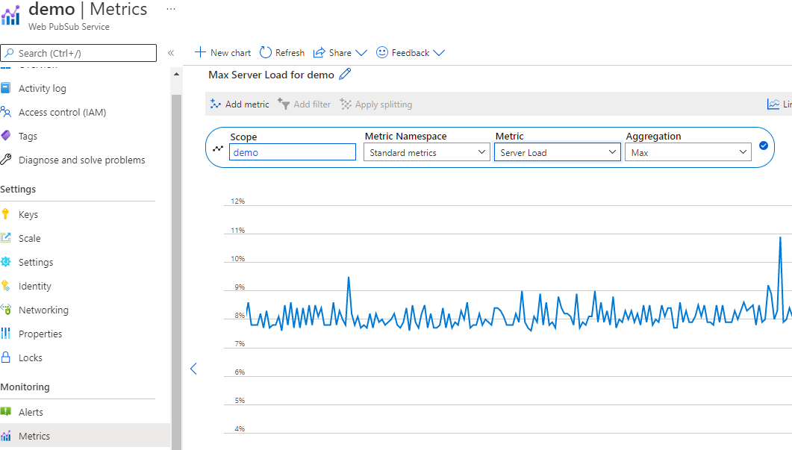
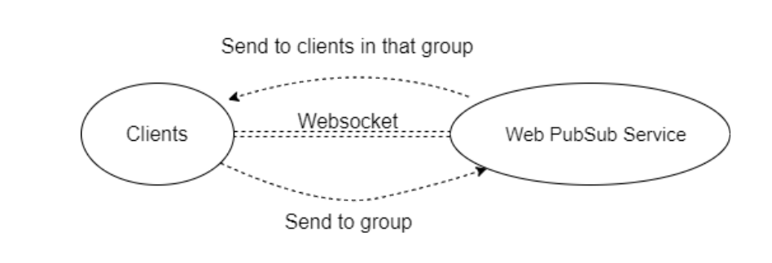
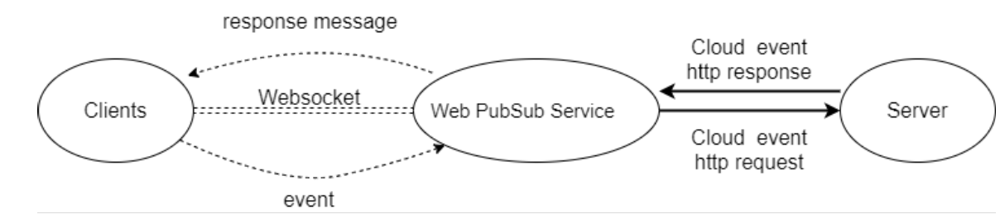
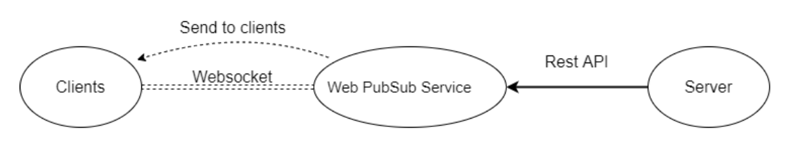

# Performance guide for Azure Web PubSub Service

One of the key benefits of using Azure Web PubSub Service is the ease of scaling. In a large-scale scenario, performance is an important factor. 

In this guide, we introduce the factors that affect Web PubSub service performance. We describe typical performance in different use-case scenarios. 

## Quick evaluation using metrics
   Before going through the factors that impact the performance, let's first introduce an easy way to monitor the pressure of your service. There's a metric called **Server Load** on the Portal.
   
  <kbd></kbd>


   It shows the computing pressure of your Azure Web PubSub service. You could test on your own scenario and check this metric to decide whether to scale up. The latency inside Azure Web PubSub service would remain low if the Server Load is below 70%. 
   
> [!NOTE]
> If you are using unit 50 or larger **and** your scenario is mainly sending to small groups (group size <20), you need to check [sending to small group](#small-group) for reference. In those scenarios there is large routing cost which is not included in the Server Load.
   
   Below are detailed concepts for evaluating performance.
## Term definitions

*Inbound*: The incoming message to Azure Web PubSub Service.

*Outbound*: The outgoing message from Azure Web PubSub Service.

*Bandwidth*: The total size of all messages in 1 second.

## Overview

 This guide answers the following questions:

- What is the typical Azure Web PubSub Service performance for each unit size?

- Does Azure Web PubSub Service meet my requirements for message throughput (for example, sending 100,000 messages per second)?

- For my specific scenario, how can I select the proper unit size?

To answer these questions, this guide first gives a high-level explanation of the factors that affect performance. It then illustrates the maximum inbound and outbound messages for typical use cases: **Send to groups through Web PubSub subprotocol**, **upstream**, and **rest api** .

This guide can't cover all scenarios (and different use cases, message sizes, message sending patterns, and so on). But it provides some basic information to understand the performance limitation.

## Performance insight

This section describes the performance evaluation methodologies, and then lists all factors that affect performance. In the end, it provides methods to help you evaluate performance requirements.

### Methodology

*Throughput* and *latency* are two typical aspects of performance checking. The *maximum throughput (inbound and outbound bandwidth)* is defined as the maximum achieved throughput when 99 percent of messages have latency that's less than 1 second. It's **not** a hard limit.

### Performance factors

Theoretically, Azure Web PubSub Service capacity is limited by computation resources: CPU, memory, and network. For example, more connections to Azure Web PubSub Service cause the service to use more memory. For larger message traffic (for example, every message is larger than 2,048 bytes), Azure Web PubSub Service needs to spend more CPU cycles to process traffic.

The message routing cost also limits performance. Azure Web PubSub Service plays a role as a message broker, which routes the message among a set of clients. A different scenario or API requires a different routing policy. 

For **echo**, the client sends a message to the upstream, and upstream echoes the message back to the client. This pattern has the lowest routing cost. But for **broadcast**, **send to group**, and **send to connection**, Azure Web PubSub Service needs to look up the target connections through the internal distributed data structure. This extra processing uses more CPU, memory, and network bandwidth. As a result, performance is slower.

In summary, the following factors affect the inbound and outbound capacity:

-   Unit size (CPU/memory)

-   Number of connections

-   Message size

-   Message send rate

-   Use-case scenario (routing cost)


### Finding a proper unit size

How can you evaluate the inbound/outbound capacity or find which unit size is suitable for a specific use case?

Each unit size has its own maximum inbound bandwidth and outbound bandwidth. A smooth user experience isn't guaranteed after the inbound or outbound traffic exceeds the threshold. 

```
  inboundBandwidth = inboundConnections * messageSize / sendInterval
  outboundBandwidth = outboundConnections * messageSize / sendInterval
```

- *inboundConnections*: The number of connections sending the message.
- *outboundConnections*: The number of connections receiving the message.
- *messageSize*: The size of a single message (average value). A small message that's less than 1,024 bytes has a performance impact that's similar to a 1,024-byte message.
- *sendInterval*: The interval for sending messages. For example, 1 second means sending one message every second. A smaller interval means sending more messages in a time period. For example, 0.5 second means sending two messages every second.
- *Connections*: The committed maximum threshold for Azure Web PubSub Service for each unit size. Connections that exceed the threshold get throttled.

Assume that the upstream is powerful enough and isn't the performance bottleneck. Then, check the maximum inbound and outbound bandwidth for each unit size.

## Case study

The following sections go through three typical use cases: **send to groups through Web PubSub subprotocol**, **triggering CloudEvent**, **calling rest api**. For each scenario, the section lists the current inbound and outbound capacity for Azure Web PubSub Service. It also explains the main factors that affect performance.

In all use cases, the default message size is 2,048 bytes, and the message send interval is 1 second.

### Send to groups through Web PubSub subprotocol
The service supports a specific subprotocol called `json.webpubsub.azure.v1`, which empowers the clients to do publish/subscribe directly instead of a round trip to the upstream server. This scenario is efficient as no server is involved and all traffic goes through the client-service WebSocket connection.



Group member and group count are two factors that affect performance. To simplify the analysis, we define two kinds of groups:

- **Big group**: The group number is always 10. The group member count is equal to (max
connection count) / 10. For example, for Unit 1, if there are 1,000 connection counts, then every group has 1000 / 10 = 100 members.
- **Small group**: Every group has 10 connections. The group number is equal to (max
  connection count) / 10. For example, for Unit 1, if there are 1,000 connection counts, then we have 1000 / 10 = 100 groups.

**Send to group** brings a routing cost to Azure Web PubSub Service because it has to find the target connections through a distributed data structure. As the sending connections increase, the cost increases.

##### Big group

For **send to big group**, the outbound bandwidth becomes the bottleneck before hitting the routing cost limit. The following table lists the maximum outbound bandwidth.

| Send to big group | Unit 1 | Unit 2 | Unit 10 | Unit 50 | Unit 100 | Unit 200 | Unit 500 | Unit 1000 |
|-------------------|-------|-------|--------|--------|---------|----------|----------|-----------|
| Connections       | 1,000 | 2,000 | 10,000 | 50,000 | 100,000 | 200,000  | 500,000  | 1,000,000 |
| Group member count | 100   | 200   | 1,000  | 5,000  | 10,000  | 5,000    | 10,000   | 20,000    |
| Group count       | 10    | 10    | 10     | 10     | 10      | 10       | 10       | 10        |
| Inbound messages per second | 30    | 30    | 30     | 30     | 30      | 30       | 30       | 30        |
| Inbound bandwidth | 60 KBps | 60 KBps | 60 KBps | 60 KBps | 60 KBps   | 60 KBps   | 60 KBps   | 60 KBps   |
| Outbound messages per second | 3,000 | 6,000 | 30,000 | 150,000| 300,000 | 600,000  | 1,500,000| 3,000,000 |
| Outbound bandwidth | **6 MBps** | **12 MBps** | **60 MBps** | **300 MBps** | **600 MBps** | **1,200 MBps** | **3,000 MBps** | **6,000 MBps** |


##### Small group

The routing cost is significant for sending message to many small groups. Currently, the Azure Web PubSub Service implementation hits the routing cost limit at Unit 50. Adding more CPU and memory doesn't help, so Unit 100 can't improve further by design. If you need more inbound bandwidth, need to scale up to use **Premium_P2**(unit >100).

|   Send to small group     | Unit 1 | Unit 2 | Unit 10  | Unit 50 | Unit 100 | Unit 200 | Unit 500 | Unit 1000 | 
|---------------------------|-------|-------|--------|--------|---------|--------|---------|---------|
| Connections               | 1,000 | 2,000 | 10,000 | 50,000 | 100,000 | 200,000 | 500,000 | 1,000,000 |
| Group member count        | 10    | 10    | 10     | 10     | 10 | 10     | 10     | 10 |
| Group count               | 100   | 200   | 1,000   | 5,000  | 10,000 | 20,000  | 50,000  | 100,000 |
| Inbound messages per second  | 200   | 400   | 2,000    | 10,000  | 10,000   | 20,000   | 50,000 | 100,000 |
| Inbound bandwidth   |  400 KBps  | 800 KBps  | 4 MBps     | 20 MBps     | 20 MBps      | 40 MBps     | 100 MBps    | 200 MBps     |
| Outbound messages per second  |2,000 | 4,000 | 20,000 | 100,000 | 100,000 | 200,000 | 500,000 | 1,000,000 |
| Outbound bandwidth | **4 MBps** | **8 MBps** | **40 MBps** | **200 MBp**s | **200 MBps** | **400 MBps** | **1,000 MBps** | **2,000 MBps** |

> [!NOTE]
> The group count, group member count listed in the table are **not hard limits**. These parameter values are selected to establish a stable benchmark scenario. 

### Triggering Cloud Event 
Service delivers client events to the upstream webhook using the [CloudEvents HTTP protocol](./reference-cloud-events.md).



For every event, it formulates an HTTP POST request to the registered upstream and expects an HTTP response. 

> [!NOTE]
> Web PubSub also supports HTTP 2.0 for upstream events delivering. The below result is tested using HTTP 1.1. If your app server supports HTTP 2.0, the performance will be better.

#### Echo

In this case, the app server writes back the original message back in the http response. The behavior of **echo** determines that the maximum inbound bandwidth is equal to the maximum outbound bandwidth. For details, see the following table.

| Echo | Unit 1 | Unit 2 | Unit 10 | Unit 50 | Unit 100 | Unit 200 | Unit 500 | Unit 1000 |
|------|-------|-------|--------|--------|---------|----------|----------|-----------|
| Connections | 1,000 | 2,000 | 10,000 | 50,000 | 100,000 | 200,000 | 500,000 | 1,000,000 |
| Inbound/outbound messages per second | 500 | 1,000 | 5,000 | 25,000 | 50,000 | 100,000 | 250,000 | 500,000 |
| Inbound/outbound bandwidth | **1 MBps** | **2 MBps** | **10 MBps** | **50 MBps** | **100 MBps** | **200 MBps** | **500 MBps** | **1,000 MBps** |


### REST API

Azure Web PubSub provides powerful [APIs](/rest/api/webpubsub/) to manage clients and deliver real-time messages.



#### Send to user through REST API
The benchmark assigns usernames to all of the clients before they start connecting to Azure Web PubSub Service. 

| Send to user through REST API | Unit 1 | Unit 2 | Unit 10 | Unit 50 | Unit 100 | Unit 200 | Unit 500 | Unit 1000 |
|-------------------------------|-------|-------|--------|--------|---------|----------|----------|-----------|
| Connections                   | 1,000 | 2,000 | 10,000 | 50,000 | 100,000 | 200,000  | 500,000  | 1,000,000 |
| Inbound/outbound messages per second | 180 | 360 | 1,800 | 9,000 | 18,000 | 36,000 | 90,000 | 180,000 |
| Inbound/outbound bandwidth    | **360 KBps** | **720 KBps** | **3.6 MBps** | **18 MBps** | **36 MBps** | **72 MBps** | **180 MBps** | **360 MBps** |


#### Broadcast through REST API
The bandwidth is the same as that for **send to big group**.

| Broadcast through REST API | Unit 1 | Unit 2 | Unit 10 | Unit 50 | Unit 100 | Unit 200 | Unit 500 | Unit 1000 |
|----------------------------|-------|-------|--------|--------|---------|----------|----------|-----------|
| Connections                | 1,000 | 2,000 | 10,000 | 50,000 | 100,000 | 200,000  | 500,000  | 1,000,000 |
| Inbound messages per second| 3     | 3     | 3      | 3      | 3       | 3        | 3        | 3        |
| Outbound messages per second | 3,000 | 6,000 | 30,000 | 150,000| 300,000 | 600,000  | 1,500,000  | 3,000,000  |
| Inbound bandwidth         | 6 KBps | 6 KBps | 6 KBps | 6 KBps | 6 KBps  | 6 KBps   | 6 KBps   | 6 KBps   |
| Outbound bandwidth        | **6 MBps** | **12 MBps** | **60 MBps** | **300 MBps** | **600 MBps** | **1,200 MBps** | **3,000 MB** | **6,000MB**|

## Next steps

[!INCLUDE [next step](includes/include-next-step.md)]
