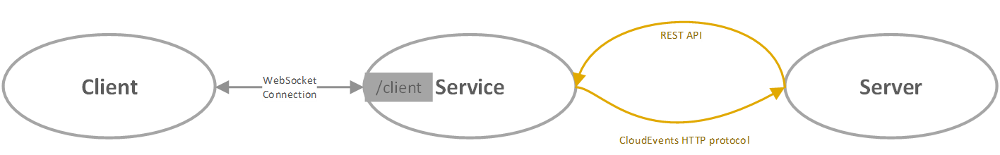
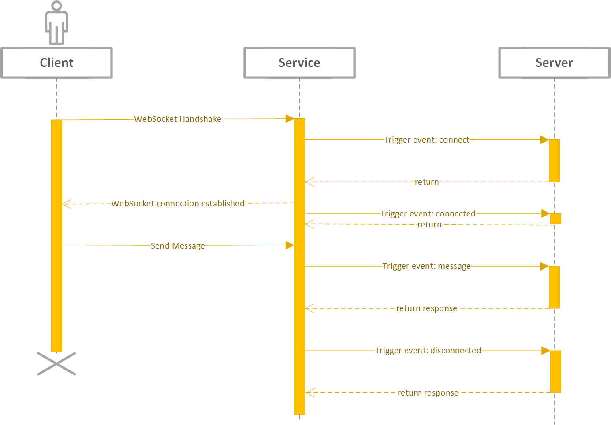
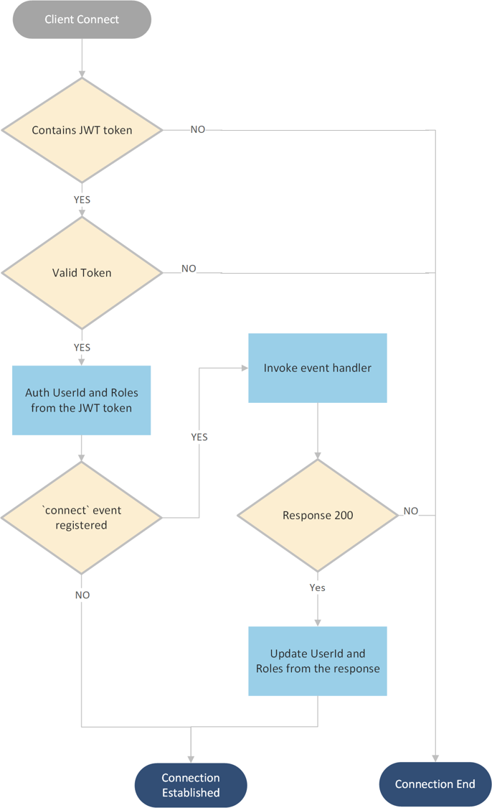
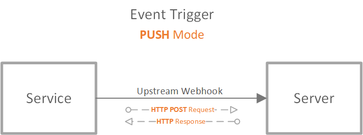
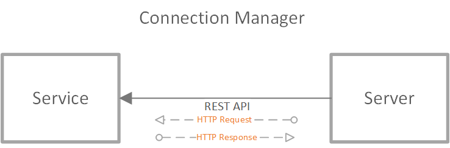
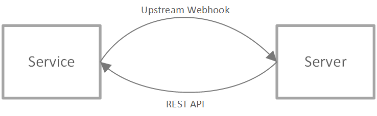

# Azure Web PubSub service internals

Azure Web PubSub Service provides an easy way to publish/subscribe messages using simple [WebSocket](https://tools.ietf.org/html/rfc6455) connections.

- Clients can be written in any language that has Websocket support.
- Both text and binary messages are supported within one connection.
- There's a simple protocol for clients to do direct client-to-client message publishing.
- The service manages the WebSocket connections for you.

## Terms

- **Service**: Azure Web PubSub Service.

[!INCLUDE [Terms](includes/terms.md)]

## Workflow



Workflow as shown in the above graph:

1. A _client_ connects to the service `/client` endpoint using WebSocket transport. Service forward every WebSocket frame to the configured upstream(server). The WebSocket connection can connect with any custom subprotocol for the server to handle, or it can connect with the service-supported subprotocol `json.webpubsub.azure.v1`, which empowers the clients to do pub/sub directly. Details are described in [client protocol](#client-protocol).
2. On different client events, the service invokes the server using **CloudEvents protocol**. [**CloudEvents**](https://github.com/cloudevents/spec/tree/v1.0.1) is a standardized and protocol-agnostic definition of the structure and metadata description of events hosted by the Cloud Native Computing Foundation (CNCF). Detailed implementation of CloudEvents protocol relies on the server role, described in [server protocol](#server-protocol).
3. The Web PubSub server can invoke the service using the REST API to send messages to clients or to manage the connected clients. Details are described in [server protocol](#server-protocol)

## Client protocol

A client connection connects to the `/client` endpoint of the service using [WebSocket protocol](https://tools.ietf.org/html/rfc6455). The WebSocket protocol provides full-duplex communication channels over a single TCP connection and was standardized by the IETF as RFC 6455 in 2011. Most languages have native support to start WebSocket connections.

Our service supports two kinds of clients:

- One is called [the simple WebSocket client](#the-simple-websocket-client)
- The other is called [the PubSub WebSocket client](#the-pubsub-websocket-client)

### The simple WebSocket client

A simple WebSocket client, as the naming indicates, is a simple WebSocket connection. It can also have its custom subprotocol.

For example, in JS, a simple WebSocket client can be created using the following code.

```js
// simple WebSocket client1
var client1 = new WebSocket("wss://test.webpubsub.azure.com/client/hubs/hub1");

// simple WebSocket client2 with some custom subprotocol
var client2 = new WebSocket(
  "wss://test.webpubsub.azure.com/client/hubs/hub1",
  "custom.subprotocol"
);
```

A simple WebSocket client follows a client<->server architecture, as the below sequence diagram shows:


1. When the client starts a WebSocket handshake, the service tries to invoke the `connect` event handler for WebSocket handshake. Developers can use this handler to handle the WebSocket handshake, determine the subprotocol to use, authenticate the client, and join the client to groups.
2. When the client is successfully connected, the service invokes a `connected` event handler. It works as a notification and doesn't block the client from sending messages. Developers can use this handler to do data storage and can respond with messages to the client. The service also pushes a `connected` event to all concerning event listeners, if any.
3. When the client sends messages, the service triggers a `message` event to the event handler to handle the messages sent. This event is a general event containing the messages sent in a WebSocket frame. Your code needs to dispatch the messages inside this event handler. If the event handler returns non-successful response code for, the service drops the client connection. The service also pushes a `message` event to all concerning event listeners, if any. If the service can't find any registered servers to receive the messages, the service also drops the connection.
4. When the client disconnects, the service tries to trigger the `disconnected` event to the event handler once it detects the disconnect. The service also pushes a `disconnected` event to all concerning event listeners, if any.

#### Scenarios

These connections can be used in a typical client-server architecture where the client sends messages to the server and the server handles incoming messages using [Event Handlers](#event-handler). It can also be used when customers apply existing [subprotocols](https://www.iana.org/assignments/websocket/websocket.xml) in their application logic.

### The PubSub WebSocket client

The service also supports a specific subprotocol called `json.webpubsub.azure.v1`, which empowers the clients to do publish/subscribe directly instead of a round trip to the upstream server. We call the WebSocket connection with `json.webpubsub.azure.v1` subprotocol a PubSub WebSocket client. For more information, see the [Web PubSub client specification](https://github.com/Azure/azure-webpubsub/blob/main/protocols/client/client-spec.md) on GitHub.

For example, in JS, a PubSub WebSocket client can be created using the following code.

```js
// PubSub WebSocket client
var pubsub = new WebSocket(
  "wss://test.webpubsub.azure.com/client/hubs/hub1",
  "json.webpubsub.azure.v1"
);
```

A PubSub WebSocket client can:

- Join a group, for example:

  ```json
  {
    "type": "joinGroup",
    "group": "<group_name>"
  }
  ```

- Leave a group, for example:

  ```json
  {
    "type": "leaveGroup",
    "group": "<group_name>"
  }
  ```

- Publish messages to a group, for example:

  ```json
  {
    "type": "sendToGroup",
    "group": "<group_name>",
    "data": { "hello": "world" }
  }
  ```

- Send custom events to the upstream server, for example:

  ```json
  {
    "type": "event",
    "event": "<event_name>",
    "data": { "hello": "world" }
  }
  ```

[PubSub WebSocket Subprotocol](./reference-json-webpubsub-subprotocol.md) contains the details of the `json.webpubsub.azure.v1` subprotocol.

You may have noticed that for a [simple WebSocket client](#the-simple-websocket-client), the _server_ is a **must have** role to receive the `message` events from clients. A simple WebSocket connection always triggers a `message` event when it sends messages, and always relies on the server-side to process messages and do other operations. With the help of the `json.webpubsub.azure.v1` subprotocol, an authorized client can join a group and publish messages to a group directly. It can also route messages to different event handlers / event listeners by customizing the _event_ the message belongs.

#### Scenarios

Such clients can be used when clients want to talk to each other. Messages are sent from `client2` to the service and the service delivers the message directly to `client1` if the clients are authorized to do so.

Client1:

```js
var client1 = new WebSocket(
  "wss://xxx.webpubsub.azure.com/client/hubs/hub1",
  "json.webpubsub.azure.v1"
);
client1.onmessage = (e) => {
  if (e.data) {
    var message = JSON.parse(e.data);
    if (message.type === "message" && message.group === "Group1") {
      // Only print messages from Group1
      console.log(message.data);
    }
  }
};

client1.onopen = (e) => {
  client1.send(
    JSON.stringify({
      type: "joinGroup",
      group: "Group1",
    })
  );
};
```

Client2:

```js
var client2 = new WebSocket("wss://xxx.webpubsub.azure.com/client/hubs/hub1", "json.webpubsub.azure.v1");
client2.onopen = e => {
    client2.send(JSON.stringify({
        type: "sendToGroup",
        group: "Group1",
        data: "Hello Client1"
    });
};
```

As the above example shows, `client2` sends data directly to `client1` by publishing messages to `Group1` which `client1` is in.

### Client events summary

Client events fall into two categories:

- Synchronous events (blocking)
  Synchronous events block the client workflow.
  - `connect`: This event is for event handler only. When the client starts a WebSocket handshake, the event is triggered and developers can use `connect` event handler to handle the WebSocket handshake, determine the subprotocol to use, authenticate the client, and join the client to groups.
  - `message`: This event is triggered when a client sends a message.
- Asynchronous events (non-blocking)
  Asynchronous events don't block the client workflow, it acts as some notification to server. When such an event trigger fails, the service logs the error detail.
  - `connected`: This event is triggered when a client connects to the service successfully.
  - `disconnected`: This event is triggered when a client disconnected with the service.

### Client message limit

The maximum allowed message size for one WebSocket frame is **1MB**.

### Client authentication

#### Authentication workflow

Client uses a signed JWT token to connect to the service. The upstream can also reject the client when it's `connect` event handler of the incoming client. The event handler authenticates the client by specifying the `userId` and the `role`s the client has in the webhook response, or decline the client with 401. [Event handler](#event-handler) section describes it in detail.

The following graph describes the workflow.



As you may have noticed when we describe the PubSub WebSocket clients, that a client can publish to other clients only when it's _authorized_ to. The `role`s of the client determines the _initial_ permissions the client have:

| Role                               | Permission                                          |
| ---------------------------------- | --------------------------------------------------- |
| Not specified                      | The client can send events.                         |
| `webpubsub.joinLeaveGroup`         | The client can join/leave any group.                |
| `webpubsub.sendToGroup`            | The client can publish messages to any group.       |
| `webpubsub.joinLeaveGroup.<group>` | The client can join/leave group `<group>`.          |
| `webpubsub.sendToGroup.<group>`    | The client can publish messages to group `<group>`. |

The server-side can also grant or revoke permissions of the client dynamically through [server protocol](#connection-manager) as to be illustrated in a later section.

## Server protocol

Server protocol provides the functionality for the server to handle client events and manage the client connections and the groups.

In general, server protocol contains three roles:

1. [Event handler](#event-handler)
1. [Connection manager](#connection-manager)
1. [Event listener](#event-listener)

### Event handler

The event handler handles the incoming client events. Event handlers are registered and configured in the service through the portal or Azure CLI. When a client event is triggered, the service can identify if the event is to be handled or not. Now we use `PUSH` mode to invoke the event handler. The event handler on the server side exposes a publicly accessible endpoint for the service to invoke when the event is triggered. It acts as a **webhook**.

Web PubSub service delivers client events to the upstream webhook using the [CloudEvents HTTP protocol](https://github.com/cloudevents/spec/blob/v1.0.1/http-protocol-binding.md).

For every event, the service formulates an HTTP POST request to the registered upstream and expects an HTTP response.

The data sent from the service to the server is always in CloudEvents `binary` format.



#### Upstream and Validation

Event handlers need to be registered and configured in the service through the portal or Azure CLI before first use. When a client event is triggered, the service can identify if the event must be handled or not. For public preview, we use `PUSH` mode to invoke the event handler. The event handler on the server side exposes publicly accessible endpoint for the service to invoke when the event is triggered. It acts as a **webhook** **upstream**.

The URL can use `{event}` parameter to define a URL template for the webhook handler. The service calculates the value of the webhook URL dynamically when the client request comes in. For example, when a request `/client/hubs/chat` comes in, with a configured event handler URL pattern `http://host.com/api/{event}` for hub `chat`, when the client connects, it will first POST to this URL: `http://host.com/api/connect`. This behavior can be useful when a PubSub WebSocket client sends custom events, that the event handler helps dispatch different events to different upstream. The `{event}` parameter isn't allowed in the URL domain name.

When setting up the event handler upstream through Azure portal or CLI, the service follows the [CloudEvents abuse protection](https://github.com/cloudevents/spec/blob/v1.0/http-webhook.md#4-abuse-protection) to validate the upstream webhook. The `WebHook-Request-Origin` request header is set to the service domain name `xxx.webpubsub.azure.com`, and it expects the response having header `WebHook-Allowed-Origin` to contain this domain name.

When doing the validation, the `{event}` parameter is resolved to `validate`. For example, when trying to set the URL to `http://host.com/api/{event}`, the service tries to **OPTIONS** a request to `http://host.com/api/validate` and only when the response is valid the configuration can be set successfully.

For now, we don't support [WebHook-Request-Rate](https://github.com/cloudevents/spec/blob/v1.0/http-webhook.md#414-webhook-request-rate) and [WebHook-Request-Callback](https://github.com/cloudevents/spec/blob/v1.0/http-webhook.md#413-webhook-request-callback).

#### Authentication/Authorization between service and webhook

- Anonymous mode
- Simple authentication that `code` is provided through the configured Webhook URL.
- Use Microsoft Entra authorization. For more information, see [how to use managed identity](howto-use-managed-identity.md) for details.
  - Step1: Enable Identity for the Web PubSub service
  - Step2: Select from existing Microsoft Entra application that stands for your webhook web app

### Connection manager

The server is by nature an authorized user. With the help of the _event handler role_, the server knows the metadata of the clients, for example, `connectionId` and `userId`, so it can:

- Close a client connection
- Send messages to a client
- Send messages to clients that belong to the same user
- Add a client to a group
- Add clients authenticated as the same user to a group
- Remove a client from a group
- Remove clients authenticated as the same user from a group
- Publish messages to a group

It can also grant or revoke publish/join permissions for a PubSub client:

- Grant publish/join permissions to some specific group or to all groups
- Revoke publish/join permissions for some specific group or for all groups
- Check if the client has permission to join or publish to some specific group or to all groups

The service provides REST APIs for the server to do connection management.



The detailed REST API protocol is defined [here][rest].

### Event listener

> [!NOTE]
> Event listener feature is in preview.

The event listener listens to the incoming client events. Each event listener contains a filter to specify which kinds of events it concerns, an endpoint about where to send the events to.

Currently we support [**Event Hubs**](https://azure.microsoft.com/products/event-hubs/) as an event listener endpoint.

You need to register event listeners beforehand, so that when a client event is triggered, the service can push the event to the corresponding event listeners. See [this doc](./howto-develop-event-listener.md#configure-an-event-listener) for how to configure an event listener with an event hub endpoint.

You can configure multiple event listeners. The order of the event listeners doesn't matter. If an event matches with multiple event listeners, it will be sent to all the listeners it matches. See the following diagram for an example. Let's say you configure four event listeners at the same time. Then a client event that matches with three of those listeners will be sent to three listeners, leaving the rest one untouched.

:::image type="content" source="media/concept-service-internals/event-listener-data-flow.svg" alt-text="Event listener data flow diagram sample":::

You can combine an [event handler](#event-handler) and event listeners for the same event. In this case, both event handler and event listeners will receive the event.

Web PubSub service delivers client events to event listeners using [CloudEvents AMQP extension for Azure Web PubSub](reference-cloud-events-amqp.md).

### Summary

You may have noticed that the _event handler role_ handles communication from the service to the server while _the manager role_ handles communication from the server to the service. After combining the two roles, the data flow between service and server looks similar to the following diagram using HTTP protocol.



[rest]: /rest/api/webpubsub/

## Next steps

[!INCLUDE [next step](includes/include-next-step.md)]
