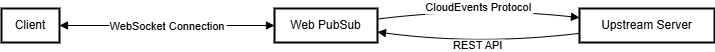

#  Azure Web PubSub service internals

Azure Web PubSub Service provides an easy way to publish/subscribe messages using simple [WebSocket](https://tools.ietf.org/html/rfc6455) connections.

- Client can be written in any language having WebSocket support
- Both text and binary messages are supported within one connection
- A simple protocol for clients to do direct client-client message publish
- The service manages the WebSocket connections for you

## Terms
* **Service**: Azure Web PubSub Service.

[!INCLUDE [Terms](includes/terms.md)]

* **Client Connection** and **ConnectionId**: A client connects to the `/client` endpoint, when connected, a unique `connectionId` is generated by the service as the unique identity of the client connection. Users can then manage the client connection using this `connectionId`. Details are described in [Client Protocol](#client_protocol) section.

* **Client Events**: Events are created during the lifecycle of a client connection. For example, a simple WebSocket client connection creates a `connect` event when it tries to connect to the service, a `connected` event when it successfully connected to the service, a `message` event when it sends messages to the service and a `disconnected` event when it disconnects from the service. Details about *client events* are illustrated in [Client Protocol](#client_protocol) section.

* **Event Handler**: The event handler contains the logic to handle the client events. Register and configure event handlers in the service through the portal or Azure CLI beforehand. Details are described in [Event Handler](#event_handler) section. The place to host the event handler logic is considered as the server-side.

* **Server**: The server can handle client events, manage client connections, and publish messages to groups. The server, comparing to the client, is trustworthy. Details about **server** are described in [Server Protocol](#server_protocol) section.

<a name="workflow"></a>

## Workflow



As illustrated by the above workflow graph:
1. A *client* connects to the service `/client` endpoint using WebSocket transport. Service forward every WebSocket frame to the configured upstream(server). The WebSocket connection can connect with any custom subprotocol for the server to handle, or it can connect with the service-supported subprotocol `json.webpubsub.azure.v1`, which empowers the clients to do pub/sub directly. Details are described in [client protocol](#client_protocol).
2. The service invokes the server using **CloudEvents HTTP protocol** on different client events. [**CloudEvents**](https://github.com/cloudevents/spec/blob/v1.0.1/http-protocol-binding.md) is a standardized and protocol-agnostic definition of the structure and metadata description of events hosted by the Cloud Native Computing Foundation (CNCF). Details are described in [server protocol](#server_protocol).
3. Server can invoke the service using REST API to send messages to clients or to manage the connected clients. Details are described in [server protocol](#server_protocol)

<a name="client_protocol"></a>

## Client protocol

A client connection connects to the `/client` endpoint of the service using [WebSocket protocol](https://tools.ietf.org/html/rfc6455). The WebSocket protocol provides full-duplex communication channels over a single TCP connection and was standardized by the IETF as RFC 6455 in 2011. Most languages have native support to start WebSocket connections. 

Our service supports two kinds of clients:
- One is called [the simple WebSocket client](#simple_client)
- The other is called [the PubSub WebSocket client](#pubsub_client)

<a name="simple_client"></a>

### The simple WebSocket client
A simple WebSocket client, as the naming indicates, is a simple WebSocket connection. It can also have its custom subprotocol. 

For example, in JS, a simple WebSocket client can be created using:
```js
// simple WebSocket client1
var client1 = new WebSocket('wss://test.webpubsub.azure.com/client/hubs/hub1');

// simple WebSocket client2 with some custom subprotocol
var client2 = new WebSocket('wss://test.webpubsub.azure.com/client/hubs/hub1', 'custom.subprotocol')

```

A simple WebSocket client follows a client<->server architecture, as the below sequence diagram shows:


1. When the client starts WebSocket handshake, the service tries to invoke the `connect` event handler (the server) for WebSocket handshake. Users can use this handler to handle the WebSocket handshake, determine the subprotocol to use, auth the client, and join the client to some groups.
2. When the client is successfully connected, the service invokes a `connected` event handler. It works as some notification and doesn't block the client from sending messages. Users can use this handler to do some data storage and can respond with messages sending to the client.
2. When the client sends messages, the services trigger the `message` event to the event handler (the server) to handle the messages sent. This event is a general event containing the messages sent in a WebSocket frame. User needs to dispatch the messages on their own inside this event handler.
3. When the client disconnects, the service tries to trigger the `disconnected` event to the event handler (the server) once it detects the disconnect.

The events fall into two categories:
* synchronous events (blocking)
    Synchronous events block the client workflow. When such an event trigger fails, the service drops the client connection.
    * `connect`
    * `message`
* asynchronous events (non-blocking)
    Asynchronous events don't block the client workflow, it acts as some notification to the upstream event handler. When such an event trigger fails, the service logs the error detail.
    * `connected`
    * `disconnected`
    
#### Scenarios:
Such connection can be used in a typical client-server architecture, that the client sends messages to the server, and the server handles incoming messages using [Event Handlers](#event_handler). It can also be used when customers apply existing [subprotocols](https://www.iana.org/assignments/websocket/websocket.xml) in their application logic.

<a name="pubsub_client"></a>

### The PubSub WebSocket client
The service also supports a specific subprotocol called `json.webpubsub.azure.v1`, which empowers the clients to do publish/subscribe directly instead of a round trip to the upstream server. We call the WebSocket connection with `json.webpubsub.azure.v1` subprotocol a PubSub WebSocket client.

For example, in JS, a PubSub WebSocket client can be created using:
```js
// PubSub WebSocket client
var pubsub = new WebSocket('wss://test.webpubsub.azure.com/client/hubs/hub1', 'json.webpubsub.azure.v1');
```

A PubSub WebSocket client can:
* Join a group, for example:
    ```json
    {
        "type": "joinGroup",
        "group": "<group_name>"
    }
    ```
* Leave a group, for example:
    ```json
    {
        "type": "leaveGroup",
        "group": "<group_name>"
    }
    ```
* Publish messages to a group, for example:
    ```json
    {
        "type": "sendToGroup",
        "group": "<group_name>",
        "data": { "hello": "world" }
    }
    ```
* Send custom events to the upstream server, for example:

    ```json
    {
        "type": "event",
        "event": "<event_name>",
        "data": { "hello": "world" }
    }
    ```

[PubSub WebSocket Subprotocol](./reference-json-webpubsub-subprotocol.md) contains the details of the `json.webpubsub.azure.v1` subprotocol.

You may have noticed that for a [simple WebSocket client](#simple_client), the *server* is a MUST HAVE role to handle the events from clients. A simple WebSocket connection always triggers a `message` event when it sends messages, and always relies on the server-side to process messages and do other operations. With the help of the `json.webpubsub.azure.v1` subprotocol, an authorized client can join a group and publish messages to a group directly. It can also route messages to different upstream (event handlers) by customizing the *event* the message belongs. 

#### Scenarios:
Such clients can be used when clients want to talk to each other. Messages are sent from `client2` to the service and the service delivers the message directly to `client1` if the clients are authorized to do so.

Client1:

```js
var client1 = new WebSocket("wss://xxx.webpubsub.azure.com/client/hubs/hub1", "json.webpubsub.azure.v1");
client1.onmessage = e => {
    if (e.data) {
        var message = JSON.parse(e.data);
        if (message.type === "message" 
        && message.group === "Group1"){
            // Only print messages from Group1
            console.log(message.data);
        }
    }
};

client1.onopen = e => {
    client1.send(JSON.stringify({
        type: "joinGroup",
        group: "Group1"
    }));
};
```

Client2:

```js
var client2 = new WebSocket("wss://xxx.webpubsub.azure.com/client/hubs/hub1", "json.webpubsub.azure.v1");
client2.onopen = e => {
    client2.send(JSON.stringify({
        type: "sendToGroup",
        group: "Group1",
        data: "Hello Client1"
    });
};
```

As the above example shows, `client2` sends data directly to `client1` by publishing messages to `Group1` which `client1` is in.

<a name="client_message_limit"></a>

### Client message limit
The maximum allowed message size for one WebSocket frame is **1MB**.

<a name="client_auth"></a>

### Client Auth

#### Auth workflow

Client uses a signed JWT token to connect to the service. The upstream can also reject the client when it is `connect` event handler of the incoming client. The event handler auth the client by specifying the `userId` and the `role`s the client has in the webhook response, or decline the client with 401. [Event handler](#event_handler) section describes it in detail.

The below graph describes the workflow:


As you may have noticed when we describe the PubSub WebSocket clients, that a client can publish to other clients only when it is *authorized* to. The `role`s of the client determines the *initial* permissions the client have:

| Role | Permission |
|---|---|
| Not specified | The client can send events.
| `webpubsub.joinLeaveGroup` | The client can join/leave any group.
| `webpubsub.sendToGroup` | The client can publish messages to any group.
| `webpubsub.joinLeaveGroup.<group>` | The client can join/leave group `<group>`.
| `webpubsub.sendToGroup.<group>` | The client can publish messages to group `<group>`.

The server-side can also grant or revoke permissions of the client dynamically through [server protocol](#connection_manager) as to be illustrated in a later section.

<a name="server_protocol"></a>

## Server Protocol

Server protocol provides the functionality for the server to manage the client connections and the groups.

In general, server protocol contains two roles:
1. [Event handler](#event_handler)
2. [Connection manager](#connection_manager)

<a name="event_handler"></a>

### Event handler
The event handler handles the incoming client events. Event handlers are registered and configured in the service through portal or Azure CLI beforehand so that when a client event is triggered, the service can identify if the event is expected to be handled or not. Now we use `PUSH` mode to invoke the event handler: that the event handler as the server side, exposes public accessible endpoint for the service to invoke when the event is triggered. It acts as a **webhook**. 

Service delivers client events to the upstream webhook using the [CloudEvents HTTP protocol](https://github.com/cloudevents/spec/blob/v1.0.1/http-protocol-binding.md).

For every event, it formulates an HTTP POST request to the registered upstream and expects an HTTP response. 

The data sending from the service to the server is always in CloudEvents `binary` format.


#### Upstream and Validation

Event handlers need to be registered and configured in the service through portal or Azure CLI beforehand so that when a client event is triggered, the service can identify if the event is expected to be handled or not. For public preview, we use `PUSH` mode to invoke the event handler: that the event handler as the server side, exposes public accessible endpoint for the service to invoke when the event is triggered. It acts as a **webhook** **upstream**. 

When configuring the webhook endpoint, the URL can use `{event}` parameter to define a URL template. The service calculates the value of the webhook URL dynamically when the client request comes in. For example, when a request `/client/hubs/chat` comes in, with a configured event handler URL pattern `http://host.com/api/{event}` for hub `chat`, when the client connects, it will first POST to this URL: `http://host.com/api/connect`. This can be useful when a PubSub WebSocket client sends custom events, that the event handler helps dispatch different events to different upstream. Note that the `{event}` parameter is not allowed in the URL domain name.

When setting up the event handler upstream through Azure portal or CLI, the service follows the [CloudEvents abuse protection](https://github.com/cloudevents/spec/blob/v1.0/http-webhook.md#4-abuse-protection) to validate the upstream webhook. The `WebHook-Request-Origin` request header is set to the service domain name `xxx.webpubsub.azure.com`, and it expects the response having header `WebHook-Allowed-Origin` to contain this domain name.

When doing the validation, the `{event}` parameter is resolved to `validate`. For example, when trying to set the URL to `http://host.com/api/{event}`, the service tries to **OPTIONS** a request to `http://host.com/api/validate` and only when the response is valid the configure can be set successfully.

For now, we do not support [WebHook-Request-Rate](https://github.com/cloudevents/spec/blob/v1.0/http-webhook.md#414-webhook-request-rate) and [WebHook-Request-Callback](https://github.com/cloudevents/spec/blob/v1.0/http-webhook.md#413-webhook-request-callback).

#### Authentication between service and webhook
- Anonymous mode
- Simple Auth that `code` is provided through the configured Webhook URL.
- Use AAD Auth, check [here](howto-use-managed-identity.md) for details.
   - Step1: Enable Identity for the Web PubSub service
   - Step2: Select from existing AAD application that stands for your webhook web app

<a name="connection_manager"></a>

### Connection manager

The server is by nature an authorized user. With the help of the *event handler role*, the server knows the metadata of the clients, for example, `connectionId` and `userId`, so it can:
   - Close a client connection
   - Send messages to a client
   - Send messages to clients that belong to the same user
   - Add a client to a group
   - Add clients authed as the same user to a group
   - Remove a client from a group
   - Remove clients authed as the same user from a group
   - Publish messages to a group

It can also grant or revoke publish/join permissions for a PubSub client:
   - Grant Join/Publish permissions to some specific group or to all groups
   - Revoke Join/Publish permissions for some specific group or for all groups
   - Check if the client has permission to Join/Publish to some specific group or to all groups
   
The service provides REST APIs for the server to do connection management:


The detailed REST API protocol is defined [here][rest].

### Summary
You may have noticed that the *event handler role* handles communication from the service to the server while *the manager role* handles communication from the server to the service. So combing the two roles, the data flow between service and server looks as similar to below, using HTTP protocol:


[rest]: /rest/api/webpubsub/

## Next steps

[!INCLUDE [next step](includes/include-next-step.md)]
