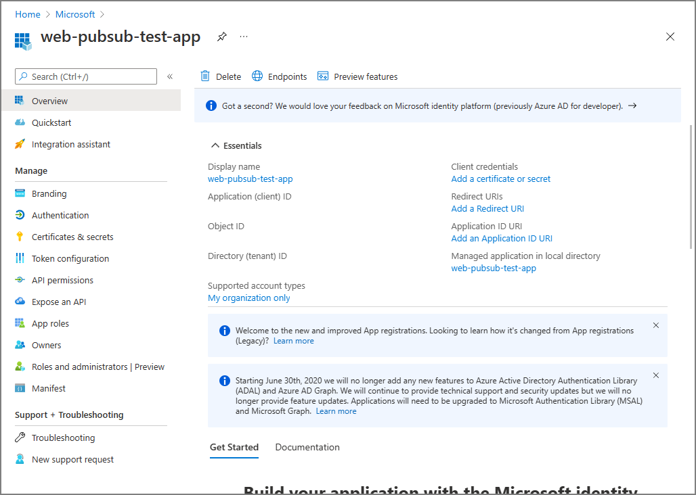
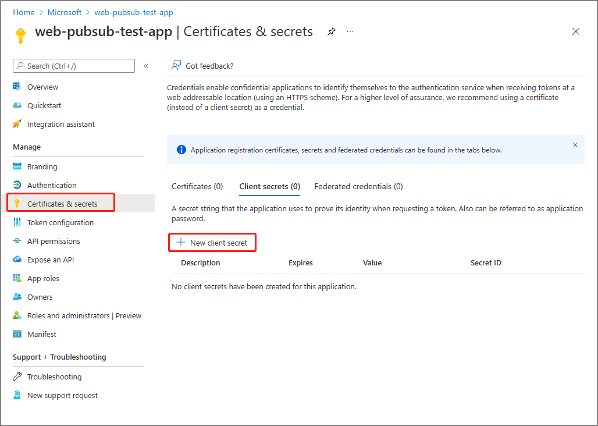
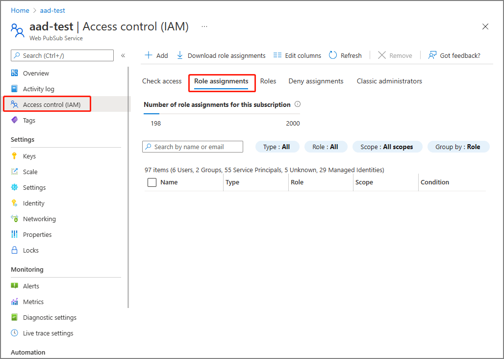
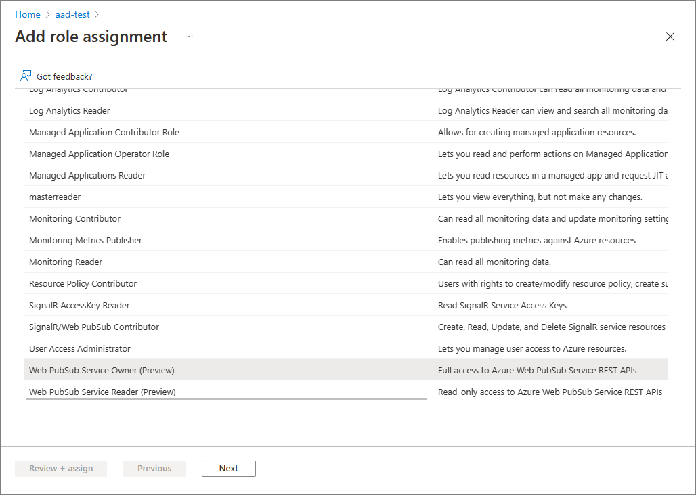
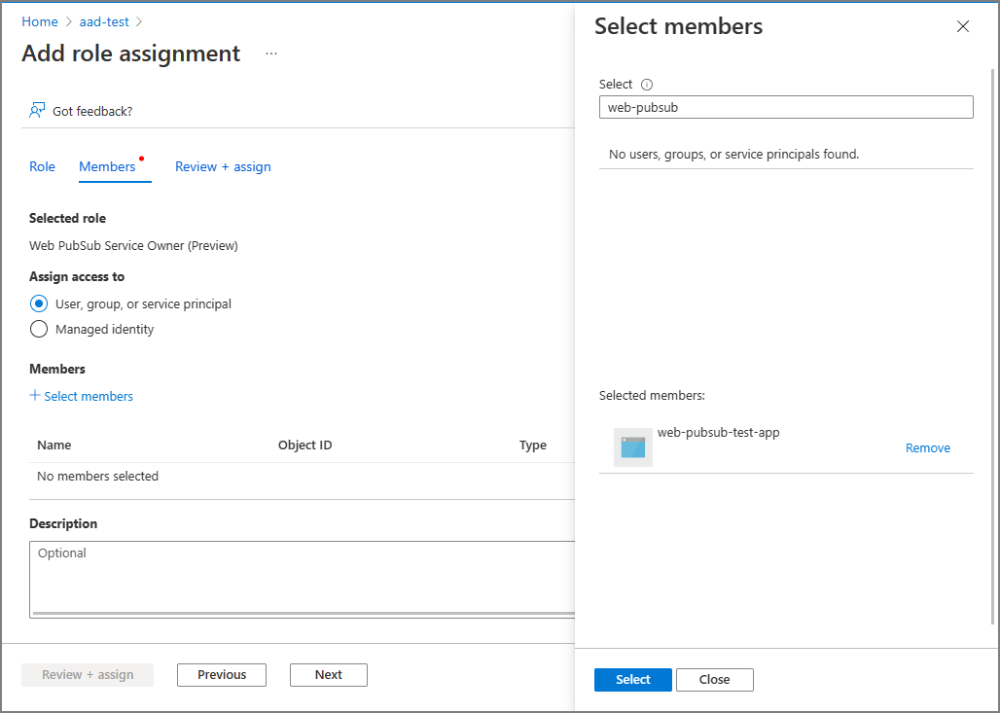

# Authorize request to Web PubSub resources with Azure AD from Azure applications

Azure Web PubSub Service supports Azure Active Directory (Azure AD) authorizing requests from [Azure applications](../active-directory/develop/app-objects-and-service-principals.md). 

This article shows how to configure your Web PubSub resource and codes to authorize the request to a Web PubSub resource from an Azure application.

## Register an application

The first step is to register an Azure application.

1. On the [Azure portal](https://portal.azure.com/), search for and select **Azure Active Directory**
2. Under **Manage** section, select **App registrations**.
3. Click **New registration**.

    

4. Enter a display **Name** for your application.
5. Click **Register** to confirm the register.

Once you have your application registered, you can find the **Application (client) ID** and **Directory (tenant) ID** under its Overview page. These GUIDs can be useful in the following steps.



To learn more about registering an application, see
- [Quickstart: Register an application with the Microsoft identity platform](../active-directory/develop/quickstart-register-app.md).

## Add credentials

You can add both certificates and client secrets (a string) as credentials to your confidential client app registration.

### Client secret

The application requires a client secret to prove its identity when requesting a token. To create a client secret, follow these steps.

1. Under **Manage** section, select **Certificates & secrets**
1. On the **Client secrets** tab, click **New client secret**.

1. Enter a **description** for the client secret, and choose a **expire time**.
1. Copy the value of the **client secret** and then paste it to a secure location. 
    > [!NOTE]
    > The secret will display only once.
### Certificate

You can also upload a certification instead of creating a client secret.


To learn more about adding credentials, see

- [Add credentials](../active-directory/develop/quickstart-register-app.md#add-credentials)

## Add role assignments on Azure portal

This sample shows how to assign a `Web PubSub Service Owner` role to a service principal (application) over a Web PubSub resource. 

> [!Note]
> A role can be assigned to any scope, including management group, subscription, resource group or a single resource. To learn more about scope, see [Understand scope for Azure RBAC](../role-based-access-control/scope-overview.md)
1. On the [Azure portal](https://portal.azure.com/), navigate to your Web PubSub resource.

1. Click **Access Control (IAM)** to display access control settings for the Azure Web PubSub.

1. Click the **Role assignments** tab to view the role assignments at this scope.

   The following screenshot shows an example of the Access control (IAM) page for a Web PubSub resource.

   

1. Click **Add > Add role assignment**.

1. On the **Roles** tab, select `Web PubSub App Server`.

1. Click **Next**.

   

1. On the **Members** tab, under **Assign access to** section, select **User, group, or service principal**.

1. Click **Select Members**

3. Search for and select the application that you would like to assign the role to.

1. Click **Select** to confirm the selection.

4. Click **Next**.

   

5. Click **Review + assign** to confirm the change.

> [!IMPORTANT]
> Azure role assignments may take up to 30 minutes to propagate.
To learn more about how to assign and manage Azure role assignments, see these articles:
- [Assign Azure roles using the Azure portal](../role-based-access-control/role-assignments-portal.md)
- [Assign Azure roles using the REST API](../role-based-access-control/role-assignments-rest.md)
- [Assign Azure roles using Azure PowerShell](../role-based-access-control/role-assignments-powershell.md)
- [Assign Azure roles using Azure CLI](../role-based-access-control/role-assignments-cli.md)
- [Assign Azure roles using Azure Resource Manager templates](../role-based-access-control/role-assignments-template.md)

## Configure your server

It is recommended to configure identity and credentials in your environment variables:

| Variable	| Description |
|------|------
| `AZURE_TENANT_ID`	| The Azure Active Directory tenant(directory) ID. |
| `AZURE_CLIENT_ID`	| The client(application) ID of an App Registration in the tenant. |
| `AZURE_CLIENT_SECRET`	| A client secret that was generated for the App Registration. |
| `AZURE_CLIENT_CERTIFICATE_PATH` | A path to certificate and private key pair in PEM or PFX format, which can authenticate the App Registration. |
| `AZURE_USERNAME`	| The username, also known as upn, of an Azure Active Directory user account. |
| `AZURE_PASSWORD`	| The password of the Azure Active Directory user account. Note this does not support accounts with MFA enabled. |

By doing this, you could use either [DefaultAzureCredential](/dotnet/api/azure.identity.defaultazurecredential) or [EnvironmentCredential](/dotnet/api/azure.identity.environmentcredential) to configure your Web PubSub endpoints.

### Sample codes

These are sample codes for C#. For other supported languages, see JavaScript/Python/Java.

```C#
var endpoint = new Uri("https://<resource1>.webpubsub.azure.com");
var client = new WebPubSubServiceClient(endpoint, "hub", new DefaultAzureCredential());
```

To learn how `DefaultAzureCredential` works, see [DefaultAzureCredential Class](/dotnet/api/azure.identity.defaultazurecredential).

```C#
var endpoint = new Uri("https://<resource1>.webpubsub.azure.com");
var client = new WebPubSubServiceClient(endpoint, "hub", new EnvironmentCredential());
```

You could also use [ClientSecretCredential](/dotnet/api/azure.identity.clientsecretcredential) or [ClientCertificateCredential](/dotnet/api/azure.identity.clientcertificatecredential) directly if you'd like to.

```C#
var endpoint = new Uri("https://<resource1>.webpubsub.azure.com");
var credential = new ClientSecretCredential("tenantId", "clientId", "clientSecret");
var client = new WebPubSubServiceClient(endpoint, "hub", credential);
```
```C#
var endpoint = new Uri("https://<resource1>.webpubsub.azure.com");
var credential = new ClientCertificateCredential("tenantId", "clientId", "pathToCert");
var client = new WebPubSubServiceClient(endpoint, "hub", credential);
```

To learn more about creating `TokenCredential` for Azure AD Authorization, see there articles:

- [DefaultAzureCredential Class](/dotnet/api/azure.identity.defaultazurecredential)
- [ClientSecretCredential Constructors](/dotnet/api/azure.identity.clientsecretcredential.-ctor)
- [ClientCertificateCredential Constructors](/dotnet/api/azure.identity.clientcertificatecredential.-ctor)

## Next steps

See the following related articles:
- [Overview of Azure AD for Web PubSub](concept-azure-ad-authorization.md)
- [Authorize request to Web PubSub resources with Azure AD from managed identities](howto-authorize-from-managed-identity.md)