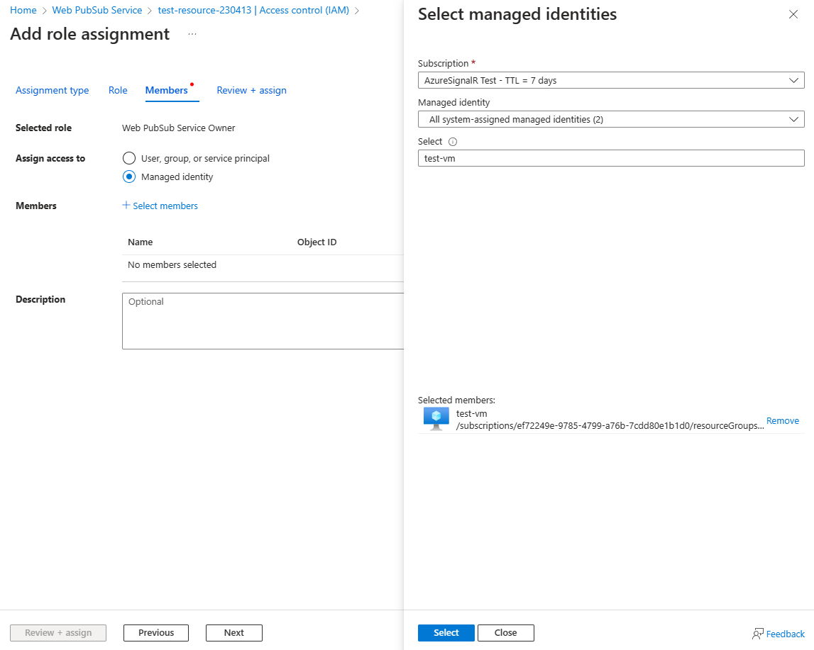

# Authorize request to Web PubSub resources with Microsoft Entra ID from managed identities

Azure Web PubSub Service supports Microsoft Entra ID for authorizing requests from [managed identities](../active-directory/managed-identities-azure-resources/overview.md).

This article shows how to configure your Web PubSub resource and codes to authorize the request to a Web PubSub resource from a managed identity.

## Configure managed identities

The first step is to configure managed identities.

This is an example for configuring `System-assigned managed identity` on a `Virtual Machine` using the Azure portal.

1. Open [Azure portal](https://portal.azure.com/), Search for and select a Virtual Machine.
1. Under **Settings** section, select **Identity**.
1. On the **System assigned** tab, toggle the **Status** to **On**.
   
1. Click the **Save** button to confirm the change.

### How to create user-assigned managed identities

- [Create a user-assigned managed identity](../active-directory/managed-identities-azure-resources/how-manage-user-assigned-managed-identities.md#create-a-user-assigned-managed-identity)

### How to configure managed identities on other platforms

- [Configure managed identities for Azure resources on a VM using the Azure portal](../active-directory/managed-identities-azure-resources/qs-configure-portal-windows-vm.md)
- [Configure managed identities for Azure resources on an Azure VM using PowerShell](../active-directory/managed-identities-azure-resources/qs-configure-powershell-windows-vm.md)
- [Configure managed identities for Azure resources on an Azure VM using Azure CLI](../active-directory/managed-identities-azure-resources/qs-configure-cli-windows-vm.md)
- [Configure managed identities for Azure resources on an Azure VM using templates](../active-directory/managed-identities-azure-resources/qs-configure-template-windows-vm.md)
- [Configure a VM with managed identities for Azure resources using an Azure SDK](../active-directory/managed-identities-azure-resources/qs-configure-sdk-windows-vm.md)

### How to configure managed identities for App service and Azure Functions

- [How to use managed identities for App Service and Azure Functions](../app-service/overview-managed-identity.md).

## Add role assignments on Azure portal

This sample shows how to assign a `Web PubSub Service Owner` role to a system-assigned identity over a Web PubSub resource.

> [!Note]
> A role can be assigned to any scope, including management group, subscription, resource group or a single resource. To learn more about scope, see [Understand scope for Azure RBAC](../role-based-access-control/scope-overview.md)

1. Open [Azure portal](https://portal.azure.com/), navigate to your Web PubSub resource.

1. Click **Access Control (IAM)** to display access control settings for the Azure Web PubSub.

   The following shows an example of the Access control (IAM) page for a resource group.

1. Click the **Role assignments** tab to view the role assignments at this scope.

   The following screenshot shows an example of the Access control (IAM) page for a Web PubSub resource.

   

1. Click **Add > Add role assignment**.

1. On the **Roles** tab, select `Web PubSub Service Owner`.

1. Click **Next**.

   

1. On the **Members** tab, under **Assign access to** section, select **Managed identity**.

1. Click **Select Members**.

1. In the **Select managed identities** pane, select **System-assigned managed identity > Virtual machine**

1. Search for and select the virtual machine that you would like to assign the role to.

1. Click **Select** to confirm the selection.

1. Click **Next**.

   

1. Click **Review + assign** to confirm the change.

> [!IMPORTANT]
> Azure role assignments may take up to 30 minutes to propagate.
> To learn more about how to assign and manage Azure role assignments, see these articles:

- [Assign Azure roles using the Azure portal](../role-based-access-control/role-assignments-portal.md)
- [Assign Azure roles using the REST API](../role-based-access-control/role-assignments-rest.md)
- [Assign Azure roles using Azure PowerShell](../role-based-access-control/role-assignments-powershell.md)
- [Assign Azure roles using Azure CLI](../role-based-access-control/role-assignments-cli.md)
- [Assign Azure roles using Azure Resource Manager templates](../role-based-access-control/role-assignments-template.md)

## Sample codes

We officially support 4 programming languages:

- [C#](./howto-create-serviceclient-with-net-and-azure-identity.md)
- [Python](./howto-create-serviceclient-with-python-and-azure-identity.md)
- [Java](./howto-create-serviceclient-with-java-and-azure-identity.md)
- [JavaScript](./howto-create-serviceclient-with-javascript-and-azure-identity.md)

## Next steps

See the following related articles:

- [Overview of Microsoft Entra ID for Web PubSub](concept-azure-ad-authorization.md)
- [Authorize request to Web PubSub resources with Microsoft Entra ID from Azure applications](howto-authorize-from-application.md)
- [Disable local authentication](./howto-disable-local-auth.md)
