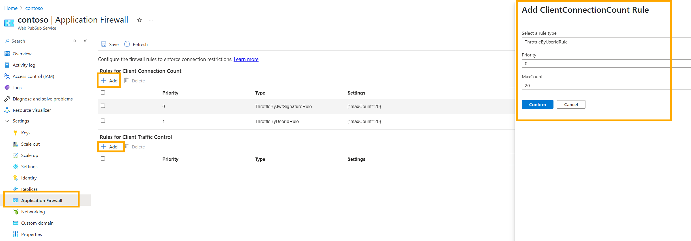

# Application Firewall (Preview) for Azure Web PubSub Service

The Application Firewall provides sophisticated control over client connections in a distributed system. Before diving into its functionality and setup, let's clarify what the Application Firewall does not do:

1. It doesn't replace authentication. The firewall operates behind the client connection authentication layer.
2. It isn't related to network layer access control.

## What Does the Application Firewall Do?

The Application Firewall consists of various rule lists. Currently, there are two rule lists called *Client Connection Count Rules* and *Client Traffic Control Rules*. Future updates will support more rule lists to control aspects such as connection lifetime.

This guideline is divided into three parts:
1. Introduction to different application firewall rules.
2. Instructions on configuring the rules using the Portal or Bicep on the Web PubSub service side.
3. Steps to configure the token on the server side.

## Prerequisites
* A Web PubSub resource in [premium tier](https://azure.microsoft.com/pricing/details/web-pubsub/).

## Client Connection Count Rules
Client Connection Count Rules restrict concurrent client connections. When a client attempts to establish a new connection, the rules are checked **sequentially**. If any rule is violated, the connection is rejected with a status code 429.

   #### ThrottleByUserIdRule
   This rule limits the concurrent connections of a user. For example, if a user opens multiple browser tabs or logs in using different devices, you can use this rule to restrict the number of concurrent connections for that user.

  > [!NOTE]
  > * The UserId must exist in the access token for this rule to work. Refer to [Configure access token](#configure-access-token).

   
   #### ThrottleByJwtSignatureRule
   This rule limits the concurrent connections of the same token to prevent malicious users from reusing tokens to establish infinite connections, which can exhaust connection quota.

  > [!NOTE]
  > *  It's not guaranteed by default that tokens generated by the SDK are different each time. Though each token contains a timestamp, this timestamp might be the same if vast tokens are generated within seconds. To avoid identical tokens, insert a random claim into the token claims.  Refer to [Configure access token](#configure-access-token).


> [!WARNING]
> * **Avoid using too aggressive maxCount**. Client connections may close without completing the TCP handshake. SignalR service can't detect those "half-closed" connections immediately. The connection is taken as active until the heartbeat failure. Therefore, aggressive throttling strategies might unexpectedly throttle clients. A smoother approach is to **leave some buffer** for the connection count, for example: double the *maxCount*.


## Client Traffic Control Rules
Client Traffic Control Rules restrict the inbound throughput of client connections. When a client attempts to send a message, the rules are checked **sequentially**. Within each *aggregation window*, the message size will be aggregated to check against *max inbound message*. If any rule is violated, the connection is disconnected. 

   #### TrafficThrottleByUserIdRule
   This rule limits the inbound throughput of a user. 

   #### TrafficThrottleByJwtSignatureRule
   This rule limits the inbound throughput of each token.

## Set up Application Firewall 

# [Portal](#tab/Portal)
To use Application Firewall, navigate to the Web PubSub **Application Firewall** blade on the Azure portal and click **Add** to add a rule. 



# [Bicep](#tab/Bicep)

Use Visual Studio Code or your favorite editor to create a file with the following content and name it main.bicep:

```bicep
@description('The name for your Web PubSub service')
param resourceName string = 'contoso'

resource webpubsub 'Microsoft.SignalRService/webpubsub@2024-10-01-preview' = {
  name: resourceName
  properties: {
    applicationFirewall:{
        clientConnectionCountRules: [
        // Add or remove rules as needed
        {
          // This rule will be skipped if no userId is set
            type: 'ThrottleByUserIdRule'
            maxCount: 5
        }
        {
            type: 'ThrottleByJwtSignatureRule'
            maxCount: 10
        }
      ]
      clientTrafficControlRules: [
        // Add or remove rules as needed
        {
            // This rule will be skipped if no userId is set
            type: 'TrafficThrottleByUserIdRule'
            // Every minute
            aggregationWindowInSeconds: 60
            // 10MB
            maxInboundMessageBytes: 10485760
        }
        {
            type: 'TrafficThrottleByJwtSignatureRule'
            // Every 30 seconds
            aggregationWindowInSeconds: 30
            // 5MB
            maxInboundMessageBytes: 5242880
        }
      ]
    }
  }
}

```

Deploy the Bicep file using Azure CLI 
   ```azurecli
   az deployment group create --resource-group MyResourceGroup --template-file main.bicep
   ```

----


## Configure access token

The application firewall rules only take effect when the access token contains the corresponding claim. A rule is **skipped** if the connection does not have the corresponding claim. *userId" and *roles* are currently supported claims in the SDK.

Below is an example to add userId and insert a unique placeholder in the access token:

```cs
// The GUID role wont have any effect. But it ensures this token's uniqueness when using rule ThrottleByJwtSignatureRule.
var url = service.GetClientAccessUri((userId: "user1" , roles: new string[] {  "webpubsub.joinLeaveGroup.group1", Guid.NewGuid().ToString()});
```

For more details, refer to [Client negotiation](howto-generate-client-access-url.md#generate-from-service-sdk) .  


