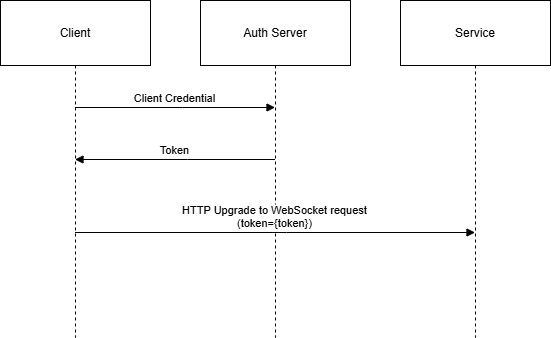

# How To Connect MQTT Clients to Web PubSub

MQTT is a lightweight pub/sub messaging protocol designed for devices with limited resources.

In this article, we introduce how to connect MQTT clients to the service, so that the clients can publish and subscribe messages.

## Connection Parameters

[!INCLUDE [MQTT-Connection-Parameters](includes/mqtt-connection-Parameters.md)]

By default MQTT clients don't have any permissions to publish or subscribe to any topics. You need to grant [permissions](#permissions) to MQTT clients.

## Permissions

A client can publish to other clients only when it's *authorized* to do so. A client's permissions can be granted when it's being connected or during the lifetime of the connection.

| Role | Permission |
|---|---|
| Not specified | The client can send event requests. |
| `webpubsub.joinLeaveGroup` | The client can join or leave any group. |
| `webpubsub.sendToGroup` | The client can publish messages to any group. |
| `webpubsub.joinLeaveGroup.<group>` | The client can join or leave group `<group>`. |
| `webpubsub.sendToGroup.<group>` | The client can publish messages to group `<group>`. |
| | |

## Authentication and Authorization

There are two workflows supported by Web PubSub to authenticate and authorize MQTT clients, so that they have proper permissions.

These workflows can be used individually or in combination. If they're used in together, the auth result in the latter workflow would be honored by the service.

### 1. JWT Workflow

This is the default workflow, shown as follows:

1. The client negotiates with your auth server. The auth server contains the authorization middleware, which handles the client request and signs a JWT for the client to connect to the service.
1. The auth server returns the JWT to the client.
1. The client tries to connect to the Web PubSub service with the JWT token returned from the auth server. The token can be in either the query string, as `/clients/mqtt/hubs/{hub}?access_token={token}`, or the `Authorization` header, as `Authorization: Bearer {token}`.

#### Supported claims
You could also configure properties for the client connection when generating the access token by specifying special claims inside the JWT token:

| Description | Claim type | Claim value | Notes |
| --- | --- | --- | --- |
| The [permissions](#permissions) the client connection initially has | `role` | the role value defined in [permissions](#permissions) | Specify multiple `role` claims if the client has multiple permissions. |
| The lifetime of the token | `exp` | the expiration time | The `exp` (expiration time) claim identifies the expiration time on or after which the token MUST NOT be accepted for processing. |
| The initial groups that the client connection joins once it connects to Azure Web PubSub | `group` | the group to join | Specify multiple `group` claims if the client joins multiple groups. |
| The `userId` for the client connection | `sub` | the userId | Only one `sub` claim is allowed. |

You could also add custom claims into the access token, and these values are preserved as the `claims` property in [connect upstream request body](./reference-mqtt-cloud-events.md#system-connect-event).

[Server SDKs](./howto-generate-client-access-url.md#generate-from-service-sdk) provides APIs to generate the access token for the clients.

<!--TODO Give a simple sample for each language here, and also add link to the generation link-->

### 2. Upstream Server Workflow

The MQTT client sends an MQTT CONNECT packet after it establishes a WebSocket connection with the service, then the service calls an API in the upstream server. The upstream server can auth the client according to the username and password fields in the MQTT connection request, and the TLS certificate from the client.

This workflow needs explicit configuration.
* [Tutorial - Authenticate and authorize MQTT clients based on client certificates](./tutorial-upstream-auth-mqtt-client.md)
* For details about how to use upstream server to auth the clients, see [How to configure event handler](./howto-develop-eventhandler.md)

## Troubleshooting

If you're experiencing failure of connection, or unable to publish or subscribe messages, please check the reason code / return code from the service, or see [How to troubleshoot with resource logs](./howto-troubleshoot-resource-logs.md).

