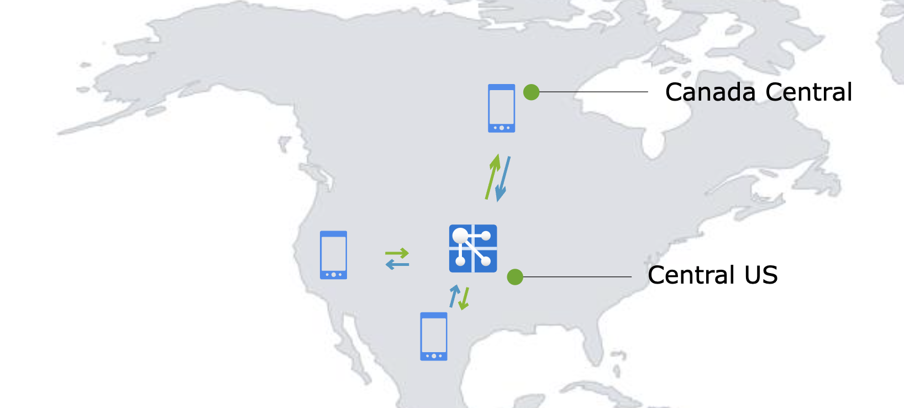
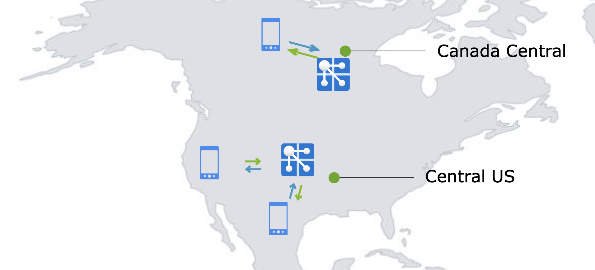
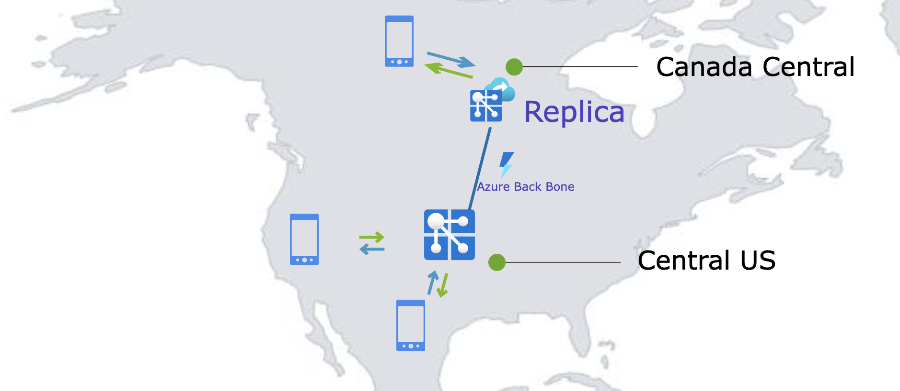
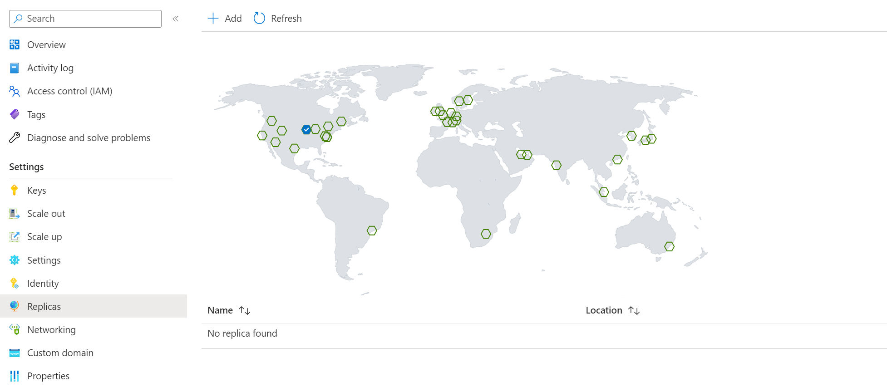
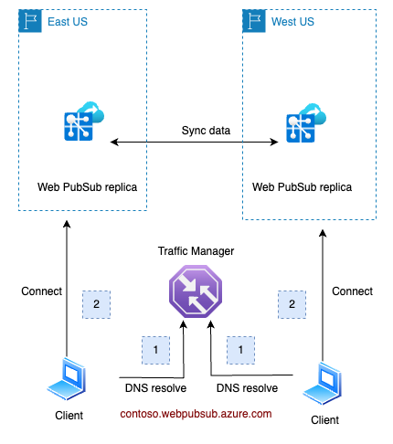
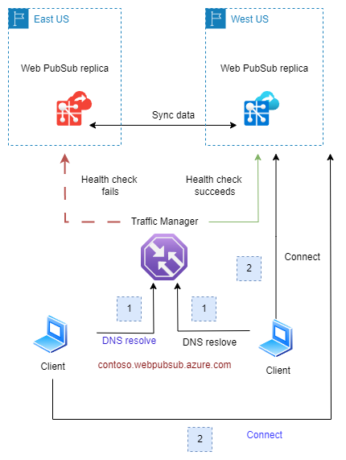
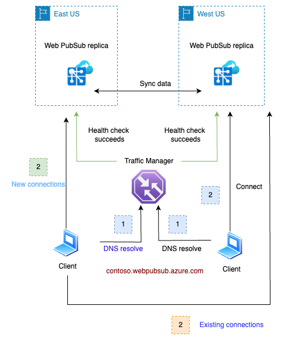
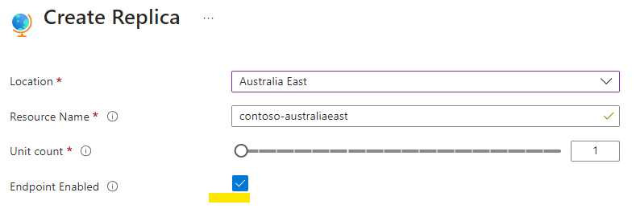
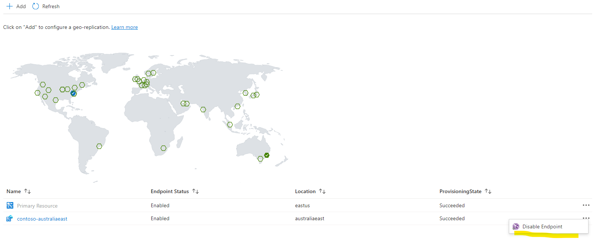

# Geo-replication (Preview) in Azure Web PubSub 

Mission critical apps often need to have a robust failover system and serve users closer to where they are. Before the release of the geo-replication feature, developers needed to deploy multiple Web PubSub resources and write custom code to orchestrate communication across resources. Now, with quick configuration through Azure portal, you can easily enable this feature. 

## Benefits of using geo-replication
* **More resilient to regional outage:** If a regional outage happens, clients will be automatically routed to a healthy replica.
* **Cross-region communication:** Developers use a geo-replication-enabled resource as usual, even though behind-the-scenes there are more than one resource. The communication across replicas is handled by the service. 
* **Enhanced network speed:** Geographically dispersed clients will connect to the nearest replica. These replicas communicate through [Azure global network backbone](https://azure.microsoft.com/explore/global-infrastructure/global-network), ensuring fast and stable networking.
* **Ease of management**. All replicas share the configuration of the primary Web PubSub resource.

## Prerequisites
* A Web PubSub resource in [premium tier](https://azure.microsoft.com/pricing/details/web-pubsub/).

## Example use case
### Contoso, a social media company
Contoso is a social media company with its customer base spread across the US and Canada. Contoso provides a mobile and web app to its users so that they can connect with each other. Contoso application is deployed in Central US. As part of Contoso's architecture, Web PubSub is used to establish persistent WebSocket connections between client apps and the application server. Contoso **likes** that they can offload managing WebSocket connections to Web PubSub, but **doesn't** like reading reports of users in Canada experiencing higher latency. Furthermore, Contoso's development team wants to insure the app against regional outage so that the users can access the app with no interruptions.



Contoso **could** set up another Web PubSub resource in Canada Central which is geographically closer to its users in Canada. However, managing multiple Web PubSub resources brings some challenges:
1. A cross-region communication mechanism would need to be implemented so that users in Canada and US can interact with each other.
2. The development team would need to manage two separate Web PubSub resources, each with distinct domain and connection string.
3. If a regional outage takes place, the traffic needs to be directed to an available resource.

All of the above takes engineering resources away from focusing on product innovation.



### Harnessing the geo-replication feature
With the geo-replication feature, Contoso can now establish a replica in Canada Central, effectively overcoming the above-mentioned challenges. The developer team is glad to find out that they don't need to make any code changes. It's as easy as clicking a few buttons on Azure portal. The developer team is also happy to share with the stakeholders that as Contoso plans to enter the European market, they simply need to add another replica in Europe. 



## How to enable geo-replication in a Web PubSub resource
# [Portal](#tab/Portal)
To create a replica in an Azure region, go to your Web PubSub resource and find the **Replicas** blade on the Azure portal and click **Add** to create a replica.



After creation, you would be able to view/edit your replica on the portal by clicking the replica name.


# [Bicep](#tab/Bicep)

Use Visual Studio Code or your favorite editor to create a file with the following content and name it main.bicep:

```bicep
@description('The name for your Web PubSub service')
param primaryName string = 'contoso'

@description('The region in which to create your Web Pubsub service')
param primaryLocation string = 'eastus'

@description('Unit count of your Web PubSub service')
param primaryCapacity int = 1

resource primary 'Microsoft.SignalRService/webpubsub@2023-08-01-preview' = {
  name: primaryName
  location: primaryLocation
  sku: {
    capacity: primaryCapacity
    name: 'Premium_P1'
  }
  properties: {
  }
}

@description('The name for your Web PubSub replica')
param replicaName string = 'contoso-westus'

@description('The region in which to create the Web PubSub replica')
param replicaLocation string = 'westus'

@description('Unit count of the Web PubSub replica')
param replicaCapacity int = 1

@description('Whether to enable region endpoint for the replica')
param regionEndpointEnabled string = 'Enabled'

resource replica 'Microsoft.SignalRService/webpubsub/replicas@2023-08-01-preview' = {
  parent: primary
  name: replicaName
  location: replicaLocation
  sku: {
    capacity: replicaCapacity
    name: 'Premium_P1'
  }
  properties: {
    regionEndpointEnabled: regionEndpointEnabled
  }
}
```

Deploy the Bicep file using Azure CLI 
   ```azurecli
   az group create --name MyResourceGroup --location eastus
   az deployment group create --resource-group MyResourceGroup --template-file main.bicep
   ```

# [CLI](#tab/CLI)
Update **webpubsub** extension to the latest version, then run:
   ```azurecli
  az webpubsub replica create --sku Premium_P1 -l eastus --replica-name MyReplica --name MyWebPubSub -g MyResourceGroup
   ```

----

## Pricing and resource unit
Each replica has its **own** `unit` and `autoscale settings`.

Replica is a feature of [Premium tier](https://azure.microsoft.com/pricing/details/web-pubsub/) of Azure Web PubSub Service. Each replica is billed **separately** according to its own unit and outbound traffic. Free message quota is also calculated separately.

In the preceding example, Contoso added one replica in Canada Central. Contoso would pay for the replica in Canada Central according to its unit and message in Premium Price.

There will be egress fees for cross region outbound traffic. If a message is transferred across replicas **and** successfully sent to a client or server after the transfer, it will be billed as an outbound message.

## Delete a replica
After you've created a replica for a Web PubSub resource, you can delete it at any time if it's no longer needed. 

To delete a replica in the Azure portal:

1. Navigate to your Web PubSub resource, and select **Replicas** blade. Click the replica you want to delete.
2. Click Delete button on the replica overview blade.

To delete a replica using the Azure CLI:
   ```azurecli
    az webpubsub replica delete --replica-name MyReplica --name MyWebPubSub -g MyResourceGroup
   ```

## Understand how the geo-replication feature works



1. The client resolves the Fully Qualified Domain Name (FQDN) `contoso.webpubsub.azure.com` of the Web PubSub service. This FQDN points to a Traffic Manager, which returns the Canonical Name (CNAME) of the nearest regional Web PubSub instance.
2. With this CNAME, the client establishes a websocket connection to the regional instance (replica).
3. The two replicas will synchronize data with each other. Messages sent to one replica would be transferred to other replicas if necessary.
4. In case a replica fails the health check conducted by the Traffic Manager (TM), the TM will exclude the failed instance's endpoint from its domain resolution results. For details, refer to below [Resiliency and Disaster Recovery](#resiliency-and-disaster-recovery)

> [!NOTE]
> * In the data plane, a primary Azure Web PubSub resource functions identically to its replicas

----

## Resiliency and disaster recovery

Azure Web PubSub Service utilizes a traffic manager for health checks and DNS resolution towards its replicas. Under normal circumstances, when all replicas are functioning properly, clients will be directed  to the closest replica. For instance:

- Clients close to `eastus` will be directed to the replica located in `eastus`.
- Similarly, clients close to `westus` will be directed to the replica in `westus`.

In the event of a **regional outage** in eastus (illustrated below), the traffic manager will detect the health check failure for that region. Then, this faulty replica's DNS will be excluded from the traffic manager's DNS resolution results. After a DNS Time-to-Live (TTL) duration, which is set to 90 seconds, clients in `eastus` will be redirected to connect with the replica in `westus`.



Once the issue in `eastus` is resolved and the region is back online, the health check will succeed. Clients in `eastus` will then, once again, be directed to the replica in their region. This transition is smooth as the connected clients will not be impacted until those existing connections are closed. 




This failover and recovery process is **automatic** and requires no manual intervention.

## Disable or enable the replica endpoint
When setting up a replica, you have the option to enable or disable its endpoint. If it's disabled, the primary FQDN's DNS resolution won't include the replica, and therefore, traffic won't be directed to it.



You can also enable of disable the endpoint after it's been created. On the primary resource's replicas blade, click the ellipsis button on the right side of the replica and choose **Enable Endpoint** or **Disable Endpoint**:



Before deleting a replication, consider disabling its endpoint first. Over time, existing connections will disconnect. As no new connections are coming, the replication becomes idle finally. This ensures a seamless deletion process.
 
This feature is also useful for troubleshooting regional issues.

> [!NOTE]
> * Due to the DNS cache, it might take several minutes for the DNS update to take effect. 
> * Existing connections remain unaffected until they disconnect.

## Impact on performance after enabling geo-replication feature
After replicas are enabled, clients will naturally distribute based on their geographical locations. While Web PubSub takes on the responsibility to synchronize data across these replicas, you'll be pleased to know that the associated overhead on [Server Load](concept-performance.md#quick-evaluation-using-metrics) is minimal for most common use cases. 

Specifically, if your application typically broadcasts to larger groups (size >10) or a single connection, the performance impact of synchronization is barely noticeable. If you're messaging small groups (size < 10), you might notice a bit more synchronization overhead.

To ensure effective failover management, it is recommended to set each replica's unit size to handle all traffic. Alternatively, you could enable [autoscaling](howto-scale-autoscale.md) to manage this.

For more performance evaluation, refer to [Performance](concept-performance.md).

## Breaking issues
* **Using replica and event handler together**

  If you use the Web PubSub event handler with Web PubSub C# server SDK or an Azure Function that utilizes the Web PubSub extension, you might encounter issues with the abuse protection once replicas are enabled. To address this, you can either **disable the abuse protection** or **upgrade to the latest SDK/extension versions**.
  
  For a detailed explanation and potential solutions, please refer to this [issue](https://github.com/Azure/azure-webpubsub/issues/598).
 
