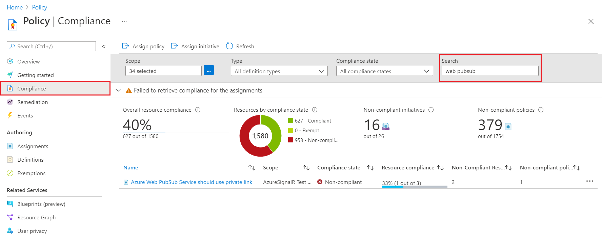

# Audit compliance of Azure Web PubSub Service resources using Azure Policy

[Azure Policy](../governance/policy/overview.md) is a service in Azure that you use to create, assign, and manage policies. These policies enforce different rules and effects over your resources, so those resources stay compliant with your corporate standards and service level agreements.

This article introduces built-in policies for Azure Web PubSub Service. Use these policies to audit new and existing Web PubSub resources for compliance.

There are no charges for using Azure Policy.

## Built-in policy definitions

The following built-in policy definitions are specific to Azure Web PubSub Service:

[!INCLUDE [azure-policy-reference-policies-web-pubsub](../../includes/policy/reference/bycat/policies-web-pubsub.md)]

## Assign policy definitions

* Assign policy definitions using the [Azure portal](../governance/policy/assign-policy-portal.md), [Azure CLI](../governance/policy/assign-policy-azurecli.md), a [Resource Manager template](../governance/policy/assign-policy-template.md), or the Azure Policy SDKs.
* Scope a policy assignment to a resource group, a subscription, or an [Azure management group](../governance/management-groups/overview.md). Web PubSub policy assignments apply to existing and new Web PubSub resources within the scope.
* Enable or disable [policy enforcement](../governance/policy/concepts/assignment-structure.md#enforcement-mode) at any time.

> [!NOTE]
> After you assign or update a policy, it takes some time for the assignment to be applied to resources in the defined scope. See information about [policy evaluation triggers](../governance/policy/how-to/get-compliance-data.md#evaluation-triggers).

## Review policy compliance

Access compliance information generated by your policy assignments using the Azure portal, Azure command-line tools, or the Azure Policy SDKs. For details, see [Get compliance data of Azure resources](../governance/policy/how-to/get-compliance-data.md).

When a resource is non-compliant, there are many possible reasons. To determine the reason or to find the change responsible, see [Determine non-compliance](../governance/policy/how-to/determine-non-compliance.md).

### Policy compliance in the portal:

1. Select **All services**, and search for **Policy**.
1. Select **Compliance**.
1. Use the filters to limit compliance states or to search for policies
   
    [  ](./media/howto-monitor-azure-policy/azure-policy-compliance.png#lightbox)
2. Select a policy to review aggregate compliance details and events. If desired, then select a specific Web PubSub for resource compliance.

### Policy compliance in the Azure CLI

You can also use the Azure CLI to get compliance data. For example, use the [az policy assignment list](/cli/azure/policy/assignment#az-policy-assignment-list) command in the CLI to get the policy IDs of the Azure Web PubSub Service policies that are applied:

```azurecli
az policy assignment list --query "[?contains(displayName,'Web PubSub')].{name:displayName, ID:id}" --output table
```

Sample output:

```
Name                                                                                   ID
-------------------------------------------------------------------------------------  --------------------------------------------------------------------------------------------------------------------------------
[Preview]: Azure Web PubSub Service should use private links  /subscriptions/<subscriptionId>/resourceGroups/<resourceGroup>/providers/Microsoft.Authorization/policyAssignments/<assignmentId>
```

Then run [az policy state list](/cli/azure/policy/state#az-policy-state-list) to return the JSON-formatted compliance state for all resources under a specific resource group:

```azurecli
az policy state list --g <resourceGroup>
```

Or run [az policy state list](/cli/azure/policy/state#az-policy-state-list) to return the JSON-formatted compliance state of a specific Web PubSub resource:

```azurecli
az policy state list \
 --resource /subscriptions/<subscriptionId>/resourceGroups/<resourceGroup>/providers/Microsoft.SignalRService/WebPubSub/<resourceName> \
 --namespace Microsoft.SignalRService \
 --resource-group <resourceGroup>
```

## Next steps

* Learn more about Azure Policy [definitions](../governance/policy/concepts/definition-structure.md) and [effects](../governance/policy/concepts/effects.md)

* Create a [custom policy definition](../governance/policy/tutorials/create-custom-policy-definition.md)

* Learn more about [governance capabilities](../governance/index.yml) in Azure


<!-- LINKS - External -->
[terms-of-use]: https://azure.microsoft.com/support/legal/preview-supplemental-terms/