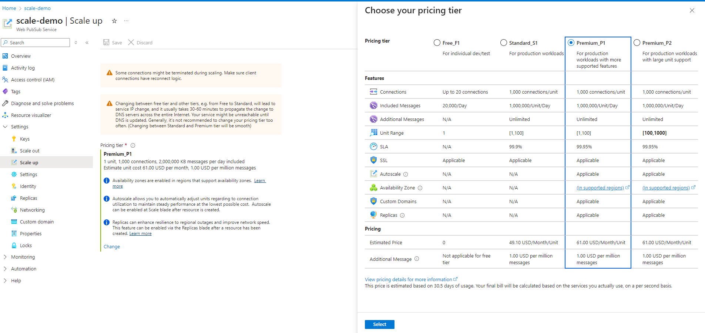
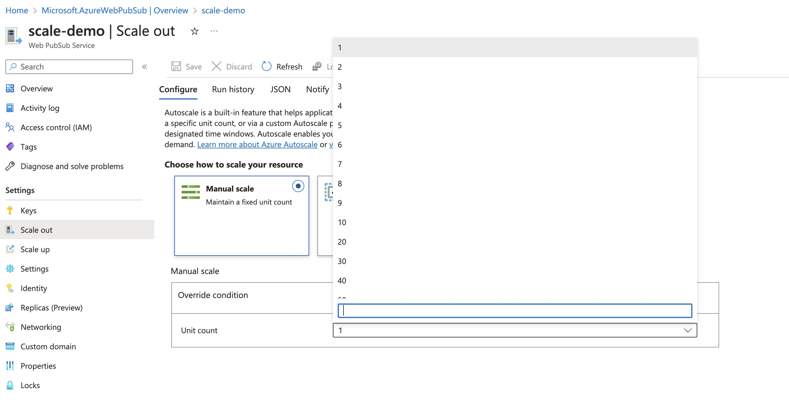

# How to scale an Azure Web PubSub Service instance?
This article shows you how to scale your instance of Azure Web PubSub Service. There are two scenarios for scaling, scale up and scale out.

* [Scale up](https://en.wikipedia.org/wiki/Scalability#Horizontal_and_vertical_scaling): Get more units, connections, messages, and more. You scale up by changing the pricing tier from Free to Standard.
* [Scale out](https://en.wikipedia.org/wiki/Scalability#Horizontal_and_vertical_scaling): Increase the number of Web PubSub units. You can scale out to as many as 100 units. There are limited unit options to select for the scaling: 1, 2, 3, 4, 5, 6, 7, 8, 9, 10, 20, 30, 40, 50, 60, 70, 80, 90 and 100 units for a single Web PubSub Service instance. If you want to scale beyond 100 units, the [Premium_P2](#enhanced-large-instance-support-with-premium_p2-sku) SKU offers expanded capabilities.

The scale settings take a few minutes to apply. In rare cases, it may take around 30 minutes to apply. Scaling doesn't require you to change your code or redeploy your server application.

For information about the pricing and capacities of individual Web PubSub Service, see [Azure Web PubSub Service Pricing Details](https://azure.microsoft.com/pricing/details/web-pubsub/).  

> [!NOTE]
> Changing Web PubSub Service from **Free** tier to **Standard** or **Premium** tier or vice versa, the public service IP will be changed and it usually takes 30-60 minutes to propagate the change to DNS servers across the entire internet. Chaning tiers between  **Standard** and **Premium** will not change the public IP.
> Your service might be unreachable before DNS gets updated. Generally it’s not recommended to change your pricing tier too often.


## Scale up on Azure portal

1. In your browser, open the [Azure portal](https://portal.azure.com).

2. In your Web PubSub Service page, from the left menu, select **Scale Up**.
   
3. Click **Change** and select **Premium_P1** Tier in the pop out blade.
   
    

4. Select **Save**.


## Scale out on Azure portal

1. In your browser, open the [Azure portal](https://portal.azure.com).

2. In your Web PubSub Service page, from the left menu, select **Scale Out**.
   
3. Choose the unit in the **Manual scale** sector.

    

4. Select **Save**.


## Scale using Azure CLI

```bash
# Scale up to Premium_P1 Tier, and scale out to 100 units
az webpubsub update \
  --name $myWebPubSubName \
  --resource-group $myResourceGroupName \
  --sku Premium_P1 \
  --unit-count 100
```


## Compare pricing tiers

For detailed information, such as included messages and connections for each pricing tier, see [Web PubSub Service Pricing Details](https://azure.microsoft.com/pricing/details/web-pubsub/).

For a table of service limits, quotas, and constraints in each tier, see [Web PubSub Service limits](../azure-resource-manager/management/azure-subscription-service-limits.md#azure-web-pubsub-limits).


## Enhanced large instance support with Premium_P2 SKU
The new Premium_P2 SKU is designed to facilitate extensive scalability for high-demand scenarios.  This SKU allows scaling among 100, 200, 300, 400, 500, 600. 700, 800, 900, 1000 units for a single Web PubSub Service instance. This enhancement enables the handling of up to **one million** concurrent connections, catering to large-scale, real-time communication needs.

You can scale up the SKU to Premium_P2 using Azure portal or Azure CLI.

The Premium_P2 tier uses a different architecture internally to manage a large amount of underlying resources. Thus, it's expected that scaling operations of this tier might take longer compared to those in smaller SKUs.

> [!NOTE]
> Be aware that there is a default quota limit capping the number of Web PubSub units at **150** per subscription per region. This is a soft limit and can be increased upon request. To do so, simply submit a support ticket to request an adjustment to this quota.

## Next steps

In this guide, you learned about how to scale single Web PubSub Service instance.

Autoscale is supported in Azure Web PubSub Service Premium Tier.

> [!div class="nextstepaction"]
> [Automatically scale units of an Azure Web PubSub Service](./howto-scale-autoscale.md)
