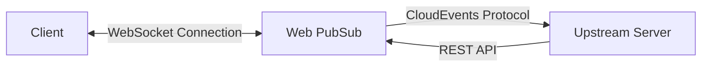
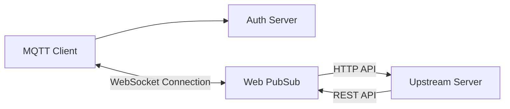
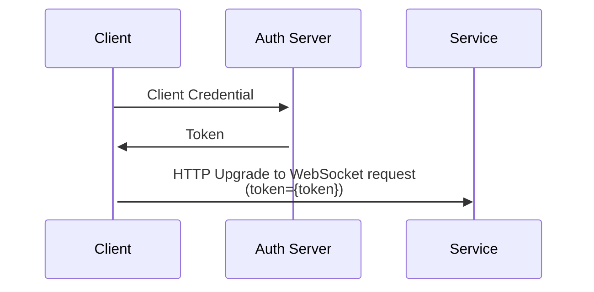

<!--This file just used to save the mermaid source code to generate mqtt-conponents.png.-->

General Workflow in Web PubSub

```mermaid
flowchart LR
    Client <-->|WebSocket Connection|Service[Web PubSub]
    Service -->|CloudEvents Protocol| Server[Upstream Server]
    Server -->|REST API| Service
```

MQTT Workflow

```mermaid
flowchart LR
    Client -->Auth[Auth Server]
    Client[MQTT Client] <-->|WebSocket Connection|Service[Web PubSub]
    Service -->|HTTP API| Server[Upstream Server]
    Server -->|REST API| Service
```

JWT Auth Workflow

```mermaid
sequenceDiagram
    Client->>+Auth Server: Client Credential
    Auth Server->>+Client: Token
    Client->>Service: HTTP Upgrade to WebSocket request <br>(token={token})
```