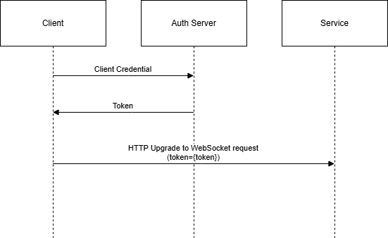
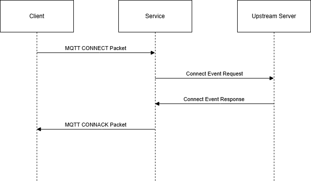

# Overview: MQTT in Azure Web PubSub service (Preview)

[MQTT](https://mqtt.org/) is a lightweight pub/sub messaging protocol designed for devices with constrained resources. Azure Web PubSub service now natively supports MQTT over WebSocket transport.

You can use MQTT protocols in Web PubSub service for the following scenarios:

* Pub/Sub among MQTT clients and Web PubSub native clients.
* Broadcast messages to MQTT clients.
* Get notifications for MQTT client lifetime events.

> [!NOTE]
> MQTT support in Azure Web PubSub is in preview stage.

## Key features

### Standard MQTT protocols support

Web PubSub service supports MQTT 3.1.1 and 5.0 protocols in a standard way that any MQTT SDK with WebSocket transport support can connect to Web PubSub. Users who wish to use Web PubSub in a programming language that doesn't have a native Web PubSub SDK can still connect and communicate using MQTT.

### Cross-protocol communication

MQTT clients can communicate with clients of other Web PubSub protocols. Find more details [here](./reference-mqtt-cross-protocol-communication.md)

### Easy MQTT adoption for current Web PubSub users

Current users of Azure Web PubSub can use MQTT protocol with minimal modifications to their existing upstream servers. The Web PubSub REST API is already equipped to handle MQTT connections, simplifying the transition process.

### Client-to-server request/response model

In addition to the client-to-client pub/sub model provided by the MQTT protocols, Web PubSub also support a client-to-server request/response model. Basically Web PubSub converts a specific kind of MQTT application messages into HTTP requests to registered webhooks, and sends the HTTP responses as application messages back to the MQTT clients.

For more details, see [MQTT custom event handler protocol](./reference-mqtt-cloud-events.md#user-custom_event-event).

## MQTT feature support status

Web PubSub support MQTT protocol version 3.1.1 and 5.0. The supported features include but not limited to:

* All the levels of Quality Of Service including at most once, at least once and exactly once.
* Persistent session. MQTT sessions are preserved for up to 30 seconds when client connections are interrupted.
* Last Will & Testament
* Client Certificate Authentication

### Additional features supported for MQTT 5.0

* Message Expiry Interval and Session Expiry Interval
* Subscription Identifier.
* Assigned Client ID.
* Flow Control
* Server-Sent Disconnect

### Not supported feature

* Wildcard subscription
* Retained messages
* Topic alias
* Shared subscription

## How MQTT is adapted into Web PubSub's system

This section assumes you have basic knowledge about MQTT protocols and Web PubSub. You can find the definitions of MQTT terms in [MQTT V5.0.0 Spec](https://docs.oasis-open.org/mqtt/mqtt/v5.0/os/mqtt-v5.0-os.html#_Toc3901003). You can also learn basic concepts of Web PubSub in [Basic Concepts](./key-concepts.md).

The following table shows similar or equivalent term mappings between MQTT and Web PubSub. It helps you understand how we adapt MQTT concepts into the Web PubSub's system. It's essential if you want to use the [data-plane REST API](./reference-rest-api-data-plane.md) or [client event handlers](./howto-develop-eventhandler.md) to interact with MQTT clients.

[!INCLUDE [MQTT-Term-Mappings](includes/mqtt-term-mappings.md)]

## Client authentication and authorization

In general, a server to authenticate and authorize MQTT clients is required. There are two workflows supported by Web PubSub to authenticate and authorize MQTT clients.

* Workflow 1: The MQTT client gets a [JWT(JSON Web Token)](https://jwt.io) from somewhere with its credential, usually from an auth server. Then the client includes the token in the WebSocket upgrading request to the Web PubSub service, and the Web PubSub service validates the token and auth the client. This workflow is enabled by default.

* Workflow 2: The MQTT client sends an MQTT CONNECT packet after it establishes a WebSocket connection with the service, then the service calls an API in the upstream server. The upstream server can auth the client according to the username and password fields in the MQTT connection request, and the TLS certificate from the client. This workflow needs explicit configuration.
<!--Add link to tutorial and configuration-->

These two workflows can be used individually or in combination. If they're used in together, the auth result in the latter workflow would be honored by the service.

For details on client authentication and authorization, see [How To Connect MQTT Clients to Web PubSub](./howto-connect-mqtt-websocket-client.md).

## Client lifetime event notification

You can register event handlers to get notification when a Web PubSub client connection is started or ended, that is, an MQTT session started or ended.

* [Event handler in Azure Web PubSub service](./howto-develop-eventhandler.md)
* [MQTT CloudEvents Protocol](./reference-mqtt-cloud-events.md)

## REST API support

You can use REST API to do the following things:

* Publish messages to a topic, a connection, a Web PubSub user, or all the connections.
* Manage client permissions and subscriptions.

[REST API specification for MQTT](./reference-rest-api-mqtt.md)

## Event listener support

> [!NOTE]
> Sending MQTT client events to Event Hubs is not supported yet.

## Next step

> [!div class="nextstepaction"]
> [Quickstart: Pub/Sub among MQTT clients](./quickstarts-pubsub-among-mqtt-clients.md)

> [!div class="nextstepaction"]
> [How To Connect MQTT Clients to Web PubSub](./howto-connect-mqtt-websocket-client.md)
