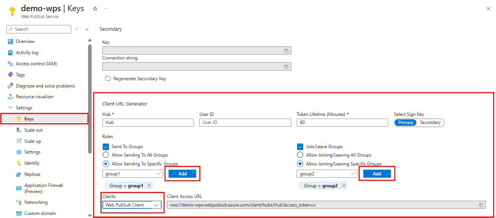

# Quickstart: Pub-sub using Web PubSub client SDK

This quickstart guide demonstrates how to construct a project using the Web PubSub client SDK, connect to the Web PubSub, subscribe to messages from groups and publish a message to the group.

> [!NOTE] 
> The client SDK is still in preview version. The interface may change in later versions

## Prerequisites

- A Web PubSub instance. If you haven't created one, you can follow the guidance: [Create a Web PubSub instance from Azure portal](./howto-develop-create-instance.md)
- A file editor such as Visual Studio Code.

Install the dependencies for the language you're using:

# [JavaScript](#tab/javascript)

Install Node.js

[Node.js](https://nodejs.org)

# [C#](#tab/csharp)

Install both the .NET Core SDK and dotnet runtime.

[.NET Core](https://dotnet.microsoft.com/download)

---

## Add the Web PubSub client SDK

# [JavaScript](#tab/javascript)

The SDK is available as an [npm module](https://www.npmjs.com/package/@azure/web-pubsub-client)

```bash
npm install @azure/web-pubsub-client
```

# [C#](#tab/csharp)

The SDK is available as an [NuGet packet](https://www.nuget.org/packages/Azure.Messaging.WebPubSub.Client)

```bash
# Add a new .net project
dotnet new console

# Add the client SDK
dotnet add package Azure.Messaging.WebPubSub.Client --prerelease
```

---

## Connect to Web PubSub

A client uses a Client Access URL to connect and authenticate with the service, which follows a pattern of `wss://<service_name>.webpubsub.azure.com/client/hubs/<hub_name>?access_token=<token>`. A client can have a few ways to obtain the Client Access URL. For this quick start, you can copy and paste one from Azure portal shown as the following diagram.



As shown in the diagram above, the client has the permissions to send messages to and join a specific group named `group1`.


# [JavaScript](#tab/javascript)

Add a file with name `index.js` and add following codes:

```javascript
const { WebPubSubClient } = require("@azure/web-pubsub-client");
// Instantiates the client object. <client-access-url> is copied from Azure portal mentioned above.
const client = new WebPubSubClient("<client-access-url>");
```

# [C#](#tab/csharp)

Edit the `Program.cs` file and add following codes:

```csharp
using Azure.Messaging.WebPubSub.Clients;
// Instantiates the client object. <client-access-uri> is copied from Azure portal mentioned above.
var client = new WebPubSubClient(new Uri("<client-access-uri>"));
```

---

## Subscribe to a group

To receive message from groups, you need to add a callback to handle messages you receive from the group, and you must join the group before you can receive messages from it. The following code subscribes the client to a group called `group1`.

# [JavaScript](#tab/javascript)

```javascript
// callback to group messages.
client.on("group-message", (e) => {
  console.log(`Received message: ${e.message.data}`);
});

// before joining group, the client needs to start
client.start();

// join a group to subscribe message from the group
client.joinGroup("group1");
```

# [C#](#tab/csharp)

```csharp
// callback to group messages.
client.GroupMessageReceived += eventArgs =>
{
    Console.WriteLine($"Receive group message from {eventArgs.Message.Group}: {eventArgs.Message.Data}");
    return Task.CompletedTask;
};

// before joining group, the client needs to start
await client.StartAsync();

// join a group to subscribe message from the group
await client.JoinGroupAsync("group1");
```
---

## Publish a message to a group

Then you can send messages to the group and as the client has joined the group before, you can receive the message you've sent.

# [JavaScript](#tab/javascript)

```javascript
client.sendToGroup("group1", "Hello World", "text");
```

# [C#](#tab/csharp)

```csharp
await client.SendToGroupAsync("group1", BinaryData.FromString("Hello World"), WebPubSubDataType.Text);
```

---

## Repository and Samples

# [JavaScript](#tab/javascript)

[JavaScript SDK repository on GitHub](https://github.com/Azure/azure-sdk-for-js/tree/main/sdk/web-pubsub/web-pubsub-client)

[TypeScript sample](https://github.com/Azure/azure-sdk-for-js/tree/main/sdk/web-pubsub/web-pubsub-client/samples/v1-beta/typescript)

[Browser sample](https://github.com/Azure/azure-sdk-for-js/tree/main/sdk/web-pubsub/web-pubsub-client/samples-browser)

[Chat app sample](https://github.com/Azure/azure-webpubsub/tree/main/samples/javascript/chatapp/sdk)

# [C#](#tab/csharp)

[.NET SDK repository on GitHub](https://github.com/Azure/azure-sdk-for-net/tree/main/sdk/webpubsub/Azure.Messaging.WebPubSub.Client)

[Log streaming sample](https://github.com/Azure/azure-webpubsub/tree/main/samples/csharp/logstream/sdk)

---

## Next steps

This quickstart provides you with a basic idea of how to connect to the Web PubSub with client SDK and how to subscribe to group messages and publish messages to groups.

[!INCLUDE [next step](includes/include-next-step.md)]
