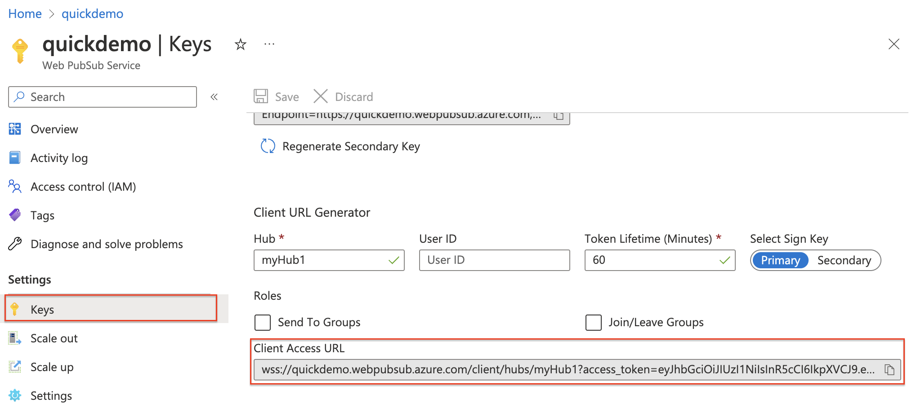

# Event notifications from clients
In the first three articles of "quickstarts", we learned two useful communication patterns using Web PubSub for real-time messaging at scale ***(million+)***.
- **Pub/Sub** among clients that free your application server from the complexity of managing persistent connections
- **Push messages** to clients from your application server as soon as new data is available

In this quickstart guide, we learn about the event system of Web PubSub so that your application server can react to events like when 
> [!div class="checklist"]
> * a client is `connected`
> * a client sends a `message`, which requires further processing 

:::image type="content" source="media/quickstarts-event-notifications-from-clients/notification.gif" alt-text="GIF of application server receiving client events.":::

## Prerequisites
- A Web PubSub resource. If you haven't created one, you can follow the guidance: [Create a Web PubSub resource](./howto-develop-create-instance.md)
- A code editor, such as Visual Studio Code
- Install the dependencies for the language you plan to use 

# [JavaScript](#tab/javascript)
[Node.js 12.x or above](https://nodejs.org)

---

## Create the application
Web PubSub is a standalone service to your application server. While your application retains its role as a traditional HTTP server, Web PubSub takes care of the real-time message passing between your application server and the clients. We first create the client program and then the server program.

### Create the client
# [JavaScript](#tab/javascript)
#### 1. Create a directory for the client app
```bash
mkdir eventHandlerDemo
cd eventHandlerDemo

# The SDK is available as an NPM module.
npm install @azure/web-pubsub-client
```

#### 2. Connect to Web PubSub
A client, be it a browser, a mobile app, or an IoT device, uses a **Client Access URL** to connect and authenticate with your resource. 
This URL follows a pattern of `wss://<service_name>.webpubsub.azure.com/client/hubs/<hub_name>?access_token=<token>`. 
A client can have a few ways to obtain the Client Access URL. For this quick start, you can copy and paste one from Azure portal shown in the following diagram. It's best practice to not hard code the Client Access URL in your code. In the production world, we usually set up an app server to return this URL on demand. [Generate Client Access URL](./howto-generate-client-access-url.md) describes the practice in detail.



Create a file with name `client.js` and add the following code

```javascript
import { WebPubSubClient } from "@azure/web-pubsub-client";

// Instantiates the client object 
// <client-access-url> is copied from Azure portal mentioned above.
const client = new WebPubSubClient("<client-access-url>");

// Registers a handler to the "connected" event
client.on("connected", (e) => {
  console.log(`Connection ${e.connectionId} is connected.`);
});

// You must invoke start() on the client object 
// to establish connection with your Web PubSub resource
client.start();
```
---

### Create the application server

# [JavaScript](#tab/javascript)

#### 1. Install express.js and the Web PubSub server SDK

```bash
npm init -y
npm install --save express

# Installs the middleware from Web PubSub. This middleware will set up an endpoint for you.
npm install --save @azure/web-pubsub-express 
```
#### 2. Create a new file named "server.js" that sets up an empty express app

```javascript
import express from "express";

const app = express();

app.listen(8080, () => console.log('Server started, listening on port 8080'));
```

#### 3. Handle events

With Web PubSub, when there are certain activities happening at the client side *(for example,  when a client is `connected` or `disconnected` with your Web PubSub resource)*, your application server can set up handlers to react to these events. 

##### Here are two notable use cases:
- when a client is connected, you can broadcast this status to all connected clients
- when a client sends a message to your Web PubSub resource, you can persist the message in a database of your choice

```javascript
import express from "express";
import { WebPubSubEventHandler } from ('@azure/web-pubsub-express');

const app = express();

const HUB_NAME = "myHub1";

let handler = new WebPubSubEventHandler(HUB_NAME, {
  path: '/eventhandler', // Exposes an endpoint 
  onConnected: async (req) => {
    console.log(`${req.context.userId} connected`);
  }, 
});

// Registers the middleware with the express app
app.use(handler.getMiddleware());

app.listen(8080, () => console.log('Server started, listening on port 8080'));
```

As configured in the code above, when a client connects with your Web PubSub resource, Web PubSub invokes the Webhook served by your application server at the path `/eventhandler`. Here, we simply print the `userId` to the console when a user is connected.

---

## Expose localhost
Run the program, it should be running on `localhost` at port `8080`. For our purposes, it means your local express app can't be reached on the internet. So, Web PubSub can't invoke the Webhook served at the path `/eventhandler`.

What we need is to expose localhost to be accessible on the internet. There are several tools available for this. 
> [!div class="checklist"]
> * [ngrok](https://ngrok.com)
> * [TunnelRelay](https://github.com/OfficeDev/microsoft-teams-tunnelrelay)

# [ngrok](#tab/ngrok)

#### 1. Download and install ngrok 
You can download ngrok from https://ngrok.com/download

#### 2. Start ngrok and expose port 8080
```bash
ngrok http 8080
```
#### 3. Make note of the generated URL 
"ngrok" outputs a URL like this `https://<domain-name>.ngrok.io`. Now your port `8080` is accessible on the internet.

---

## Set event handler on your Web PubSub resource
Now, we need to let your Web PubSub resource know about this Webhook URL. You can set the event handlers either from Azure portal or Azure CLI. 

# [Azure portal](#tab/portal)
1. Select **"Settings"** from the menu and select **"Add"**
:::image type="content" source="media/quickstarts-event-notifications-from-clients/configure-event-handler-menu.png" alt-text="Screenshot of Azure Web PubSub Configure Event Handler - menu.":::

1. Enter a hub name. For our purposes, enter "**myHub1**" and select "**Add**"

1. In the event handler page, configure the following fields
:::image type="content" source="media/quickstarts-event-notifications-from-clients/configure-event-handler-details.png" alt-text="Screenshot of Azure Web PubSub Configure Event Handler - details.":::

1. Save configuration
:::image type="content" source="media/quickstarts-event-notifications-from-clients/configure-event-handler-save.png" alt-text="Screenshot of Azure Web PubSub Configure Event Handler - save.":::

# [Azure CLI](#tab/cli)
> [!Important]
> Replace &lt;**your-resource-group-name**&gt; with name of the actual resource group that contains your Web PubSub resource. Replace &lt;**your-unique-resource-name**&gt; with the actual name of your Web PubSub resource. Replace &lt;**domain-name**&gt; with the name ngrok outputted.

```azurecli-interactive
az webpubsub hub update --group "<your-resource-group-name>" --name "<your-unique-resource-name>" --hub-name "myHub1" --event-handler url-template="https://<domain-name>.ngrok.io/eventHandler" user-event-pattern="*" system-event="connected"
```
---

## Run the programs
# [JavaScript](#tab/javascript)
#### Start the application server
> [!Important]
> Make sure your localhost is exposed to the internet.

```bash
node server.js
```

#### Start the client program
```bash
node client.js
```

#### Observe the result
You should see the `userId` printed to the console.

---

## Handle message event
Besides system events like `connect`, `connected`, `disconnected`, a client can also send **custom** events. 

#### Modify the client program
Stop your client program and add the following code to `client.js`
```javascript
// ...code from before

client.start();

// The name of the event is message and the content is in text format.
client.sendEvent("message", "sending custom event!", "text");
```

#### Modify the server program
Stop your client program and add the following code to `server.js`

```javascript
// ... code from before

let handler = new WebPubSubEventHandler(HUB_NAME, {
  path: "/eventhandler",
  onConnected: async (req) => {
    console.log(`"${req.context.userId}" is connected.`);
  },
  // This handler function will handle user system
  handleUserEvent: async (req, res) => {
    if (req.context.eventName === "message") {
      console.log(`Received message: ${req.data}`);
      // Additional logic to process the data,
      // e.g save message content to database 
      // or broadcast the message to selected clients.
    }
  },
});

//... code from before
```
#### Start the client program and server program again
You should see both the  `userId` and the `Received message: sending custom event!` printed to the console.

## Summary
This tutorial provides you with a basic idea of how the event system works in Web PubSub. In real-world applications, the event system can help you implement more logic to process system and user generated events. 

## Next steps
> [!div class="nextstepaction"]
> [Explore code samples by language](https://aka.ms/awps/samples)
> [!div class="nextstepaction"]
> [Have fun with playable demos](https://azure.github.io/azure-webpubsub/)
