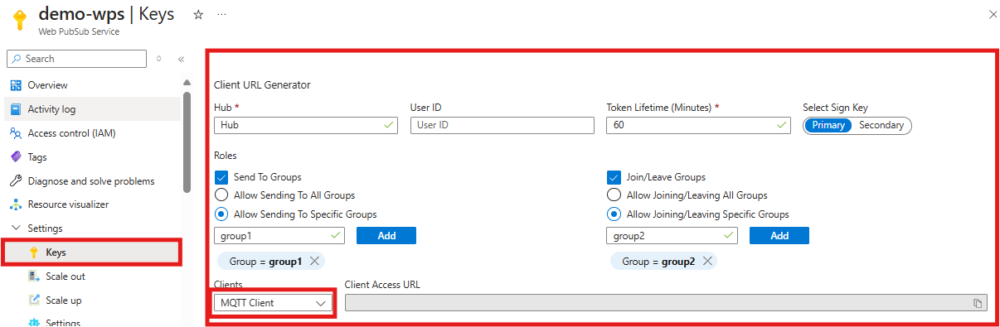
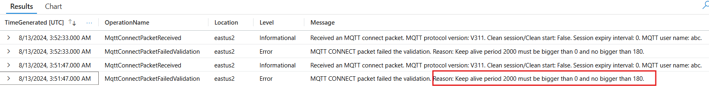

# Publish/subscribe among MQTT clients
:::image type="content" source="media/quickstarts-pubsub-among-clients/among-clients.gif" alt-text="GIF of pub/sub among clients without an application server.":::

This quickstart guide demonstrates how to
> [!div class="checklist"]
> * **connect** to your Web PubSub resource
> * **subscribe** to messages on a specific topic
> * **publish** messages to a topic

## Prerequisites
- A Web PubSub resource. If you haven't created one, you can follow the guidance: [Create a Web PubSub resource](./howto-develop-create-instance.md)
- A code editor, such as Visual Studio Code
- Install the dependencies for the language you plan to use

> [!NOTE]
> Except for the MQTT client libraries mentioned belows, you can choose any standard MQTT client libraries that meet the following requirements to connect to Web PubSub:
> * Support WebSocket transport.
> * Support MQTT protocol 3.1.1 or 5.0.

# [JavaScript](#tab/javascript)

```bash
mkdir pubsub_among_clients
cd pubsub_among_clients

npm install mqtt
```

# [C#](#tab/csharp)

```bash
mkdir pubsub_among_clients
cd pubsub_among_clients

# Create a new .net console project
dotnet new console

dotnet add package MqttNet
```

# [Python](#tab/python)
```bash
mkdir pubsub_among_clients
cd pubsub_among_clients

pip install paho-mqtt
```

<!--Java, Go, C++(Using VCPKG)-->
---

## Connect to Web PubSub

An MQTT uses a **Client Access URL** to connect and authenticate with your resource. This URL follows a pattern of `wss://<service_name>.webpubsub.azure.com/clients/mqtt/hubs/<hub_name>?access_token=<token>`.

A client can have a few ways to obtain the Client Access URL. It's best practice to not hard code the Client Access URL in your code. In the production world, we usually set up an app server to return this URL on demand. [Generate Client Access URL](./howto-generate-client-access-url.md) describes the practice in detail.

For this quick start, you can copy and paste one from Azure portal shown in the following diagram.



As shown in the preceding code, the client has the permissions to send messages to topic `group1` and to subscribe to topic `group2`.

[!INCLUDE [MQTT-Connection-Parameters](includes/mqtt-connection-parameters.md)]

The following code shows how to connect MQTT clients to WebPubSub with MQTT protocol version 5.0, clean start, 30-seconds session expiry interval.

# [JavaScript](#tab/javascript)

Create a file with name `index.js` and add following code

```javascript
const mqtt = require('mqtt');
var client = mqtt.connect(`wss://<service_name>.webpubsub.azure.com/clients/mqtt/hubs/<hub_name>?access_token=<token>`,
        {
            clientId: "client1",
            protocolVersion: 5, // Use MQTT 5.0 protocol
            clean: true,
            properties: {
                sessionExpiryInterval: 30,
            },
        });
```

# [C#](#tab/csharp)

Edit the `Program.cs` file and add following code

```csharp
using MQTTnet;
using MQTTnet.Client;

var mqttFactory = new MqttFactory();
var client = mqttFactory.CreateMqttClient();
var mqttClientOptions = new MqttClientOptionsBuilder()
    .WithWebSocketServer((MqttClientWebSocketOptionsBuilder b) =>
        b.WithUri("wss://<service_name>.webpubsub.azure.com/clients/mqtt/hubs/<hub_name>?access_token=<token>"))
    .WithClientId("client1")
    .WithProtocolVersion(MQTTnet.Formatter.MqttProtocolVersion.V500)
    .WithCleanStart()
    .WithSessionExpiryInterval(30)
    .Build();
await client.ConnectAsync(mqttClientOptions, CancellationToken.None);
```

# [Python](#tab/python)
```python
import paho.mqtt.client as mqtt
from paho.mqtt.packettypes import PacketTypes

def on_connect(client, userdata, flags, reasonCode, properties):
    print("Connected with result code "+str(reasonCode))

def on_connect_fail(client, userData):
    print("Connection failed")
    print(userData)

def on_log(client, userdata, level, buf):
    print("log: ", buf)

host = "<service_name>.webpubsub.azure.com"
port = 443
client = mqtt.Client(client_id= client_id, transport="websockets", protocol= mqtt.MQTTv5)
client.ws_set_options(path="/clients/mqtt/hubs/<hub_name>?access_token=<token>")
client.tls_set()
client.on_connect = on_connect
client.on_connect_fail = on_connect_fail
client.on_log = on_log
connect_properties.SessionExpiryInterval = 30
client.connect(host, port, clean_start = True, properties=connect_properties)
```
---

### Troubleshooting

If your client failed to connect, you could use the Azure Monitor for troubleshooting. See [Monitor Azure Web PubSub](./howto-azure-monitor.md) for more details.

You can check the connection parameters and get more detailed error messages from the Azure Monitor. For example, the following screenshot of Azure Log Analytics shows that the connection was rejected because it set an invalid keep alive interval.


## Subscribe to a topic

To receive messages from topics, the client
- must subscribe to the topic it wishes to receive messages from
- has a callback to handle message event

The following code shows a client subscribes to topics named `group2`.

# [JavaScript](#tab/javascript)

```javascript
// ...code from the last step

// Provide callback to the message event.
client.on("message", async (topic, payload, packet) => {
    console.log(topic, payload)
});

// Subscribe to a topic.
client.subscribe("group2", { qos: 1 }, (err, granted) => { console.log("subscribe", granted); })

```

# [C#](#tab/csharp)

```csharp
// ...code from the last step

// Provide callback to the message event.
client.ApplicationMessageReceivedAsync += (args) =>
{
    Console.WriteLine($"Received message on topic '{args.ApplicationMessage.Topic}': {System.Text.Encoding.UTF8.GetString(args.ApplicationMessage.PayloadSegment)}");
    return Task.CompletedTask;
};
// Subscribe to a topic "topic".
await client.SubscribeAsync("group2", MQTTnet.Protocol.MqttQualityOfServiceLevel.AtLeastOnce);
```

# [Python](#tab/python)

```python
# ...code from the last step

# Provide callback to the message event.
def subscriber_on_message(client, userdata, msg):
    print(msg.topic+" "+str(msg.payload))
client.on_message = subscriber_on_message

# Subscribe to a topic "topic".
client.subscribe("group2")

# Blocking call that processes network traffic, dispatches callbacks and
# handles reconnecting.
# Other loop*() functions are available that give a threaded interface and a
# manual interface.
client.loop_forever()
```

---

## Publish a message to a group
In the previous step, we've set up everything needed to receive messages from `group1`, now we send messages to that group.

# [JavaScript](#tab/javascript)

```javascript
// ...code from the last step

// Send message "Hello World" in the "text" format to "group1".
client.publish("group1", "Hello World!")
```

# [C#](#tab/csharp)

```csharp
// ...code from the last step

// Send message "Hello World" in the "text" format to "group1".
await client.PublishStringAsync("group1", "Hello World!");
```

# [Python](#tab/python)

```python
# ...code from the last step

# Send message "Hello World" in the "text" format to "group1".
client.publish("group1", "Hello World!")
```
---

## Next steps
By using the client SDK, you now know how to
> [!div class="checklist"]
> * **connect** to your Web PubSub resource
> * **subscribe** to topics
> * **publish** messages to topics

Next, you learn how to **push messages in real-time** from an application server to your clients.
> [!div class="nextstepaction"]
> [Push message from application server](quickstarts-push-messages-from-server.md)
