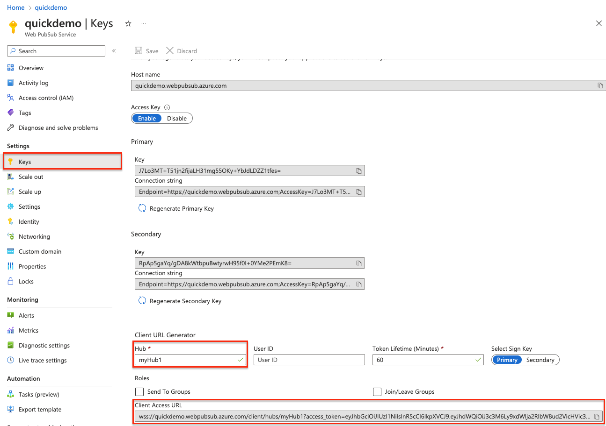
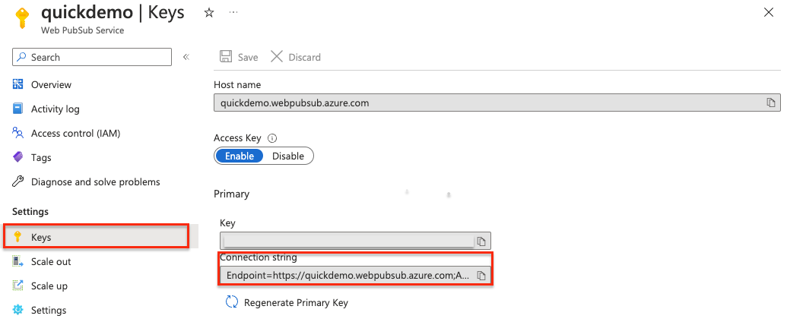

# Push messages from server

The familiar HTTP request/response model was designed to be easy to work with and scalable. However, nowadays end users demand a lot more from the web than it was originally designed for. The HTTP protocol requires users to **initiate** the request in order to receive a response. But developers need a way to send data from server to clients without them asking for it; in other words, they need to **"push"** data to clients, like pushing the latest bidding price of a product on an auction site or fast-moving stock prices in a financial application.

:::image type="content" source="media/quickstarts-push-messages-from-server/server-push.gif" alt-text="GIF of application server pushing data to connected client.":::

This quickstart guide demonstrates how to
> [!div class="checklist"]
> * **subscribe** to messages from an application server
> * **push data** from an application server to **all** connected clients

## Prerequisites

- A Web PubSub resource. If you haven't created one, you can follow the guidance: [Create a Web PubSub resource](./howto-develop-create-instance.md)
- A code editor, such as Visual Studio Code
- Install the dependencies for the language you plan to use 


# [JavaScript](#tab/javascript)

[Node.js](https://nodejs.org)

# [C#](#tab/csharp)

[.NET Core](https://dotnet.microsoft.com/download)

# [Python](#tab/python)

[Python](https://www.python.org/)

# [Java](#tab/java)

* [Java Development Kit (JDK)](/java/openjdk/install/).
* [Apache Maven](https://maven.apache.org/download.cgi)
---

## Create a subscriber client

To subscribe to messages **pushed** from your application server, a client, be it a browser, a mobile app or an IoT device, needs to connect to your Web PubSub resource first, and listens for appropriate message event. 

# [JavaScript](#tab/javascript)
#### Create a project directory named `subscriber` and install required dependencies

```bash
mkdir subscriber
cd subscriber
npm init -y
    
# The client SDK is available as a module on NPM
npm install @azure/web-pubsub-client
```

#### Connect to your Web PubSub resource and register a listener for the `server-message` event 
A client uses a ***Client Access URL*** to connect and authenticate with your resource. 
This URL follows a pattern of `wss://<service_name>.webpubsub.azure.com/client/hubs/<hub_name>?access_token=<token>`. A client can have a few ways to obtain the Client Access URL. For this quick start, you can copy and paste one from Azure portal shown in the following diagram. It's best practice to not hard code the Client Access URL in your code. In the production world, we usually set up an app server to return this URL on demand. [Generate Client Access URL](./howto-generate-client-access-url.md) describes the practice in detail.



As shown in the diagram above, the client joins the hub named `myHub1`.

In the `subscriber` project folder, create a file named `subscribe.js` with the following code

```javascript
import { WebPubSubClient } from "@azure/web-pubsub-client";

// Instantiates the client object
// <client-access-url> is copied from Azure portal mentioned above
const client = new WebPubSubClient("<client-access-url>")

// Registers a handler for the "server-message" event
client.on("server-message", (e) => {
    console.log(`Received message ${e.message.data}`)
});

// Before a client can receive a message, 
// you must invoke start() on the client object.
await client.start();
```

#### Run the program

```bash
node subscribe.js
```
Now this client establishes a connection with your Web PubSub resource and is ready to receive messages pushed from your application server.


# [C#](#tab/csharp)

#### Create a project directory named `subscriber` and install required dependencies

```bash
mkdir subscriber
cd subscriber
# Create a .net console app
dotnet new console

# Add the client SDK
dotnet add package Azure.Messaging.WebPubSub.Client --prerelease
```

#### Connect to your Web PubSub resource and register a listener for the `ServerMessageReceived` event 
A client uses a ***Client Access URL*** to connect and authenticate with your resource. 
This URL follows a pattern of `wss://<service_name>.webpubsub.azure.com/client/hubs/<hub_name>?access_token=<token>`. A client can have a few ways to obtain the Client Access URL. For this quick start, you can copy and paste one from Azure portal shown in the following diagram. It's best practice to not hard code the Client Access URL in your code. In the production world, we usually set up an app server to return this URL on demand. [Generate Client Access URL](./howto-generate-client-access-url.md) describes the practice in detail.


As shown in the diagram above, the client joins the hub named `myHub1`.


#### Replace the code in the `Program.cs` with the following code

```csharp
using Azure.Messaging.WebPubSub.Clients;

// Instantiates the client object
// <client-access-uri> is copied from Azure portal mentioned above
var client = new WebPubSubClient(new Uri("<client-access-uri>"));
client.ServerMessageReceived += eventArgs =>
{
    Console.WriteLine($"Receive message: {eventArgs.Message.Data}");
    return Task.CompletedTask;
};

client.Connected += eventArgs =>
{
    Console.WriteLine("Connected");
    return Task.CompletedTask;
};

await client.StartAsync();


// This keeps the subscriber active until the user closes the stream by pressing Ctrl+C
var streaming = Console.ReadLine();
while (streaming != null)
{
    if (!string.IsNullOrEmpty(streaming))
    {
        await client.SendToGroupAsync("stream", BinaryData.FromString(streaming + Environment.NewLine), WebPubSubDataType.Text);
    }

    streaming = Console.ReadLine();
}

await client.StopAsync();

```
   
#### Run the following command
```bash
dotnet run
```
Now this client establishes a connection with your Web PubSub resource and is ready to receive messages pushed from your application server.

# [Python](#tab/python)

#### Create a project directory named `subscriber` and install required dependencies:

```bash
mkdir subscriber
cd subscriber

# Create venv
python -m venv env
# Activate venv
source ./env/bin/activ

pip install azure-messaging-webpubsubservice
pip install websock
```

#### Use the WebSocket API to connect to your Web PubSub resource. Create a `subscribe.py` file with the following code

```python
import asyncio
import sys
import websockets

from azure.messaging.webpubsubservice import WebPubSubServiceClient


async def connect(url):
    async with websockets.connect(url) as ws:
        print('connected')
        while True:
            print('Received message: ' + await ws.recv())

if __name__ == '__main__':

    if len(sys.argv) != 3:
        print('Usage: python subscribe.py <connection-string> <hub-name>')
        exit(1)

    connection_string = sys.argv[1]
    hub_name = sys.argv[2]

    service = WebPubSubServiceClient.from_connection_string(connection_string, hub=hub_name)
    token = service.get_client_access_token()

    try:
        asyncio.get_event_loop().run_until_complete(connect(token['url']))
        except KeyboardInterrupt:
            pass
    
```

The code creates a WebSocket connection that is connected to a hub in Web PubSub. A hub is a logical unit in Web PubSub where you can publish messages to a group of clients. [Key concepts](./key-concepts.md) contains the detailed explanation about the terms used in Web PubSub.

The Web PubSub service uses [JSON Web Token (JWT)](../active-directory/develop/security-tokens.md#json-web-tokens-and-claims) authentication. The sample code uses `WebPubSubServiceClient.GetClientAccessUri()` in Web PubSub SDK to generate a URL to the service that contains the full URL with a valid access token.

After the connection is established, your client will receive messages through the WebSocket connection. Use `await ws.recv()` to listen for incoming messages.

#### Run the following command

```bash
python subscribe.py $connection_string "myHub1"
```

# [Java](#tab/java)

#### Create a project directory named `pubsub`

```cmd
mkdir pubsub
cd pubsub
```

#### Use Maven to create a new console app called `webpubsub-quickstart-subscriber`;

```console
mvn archetype:generate --define interactiveMode=n --define groupId=com.webpubsub.quickstart --define artifactId=webpubsub-quickstart-subscriber --define archetypeArtifactId=maven-archetype-quickstart --define archetypeVersion=1.4

cd webpubsub-quickstart-subscriber
```

#### Add WebSocket and Azure Web PubSub SDK to the `dependencies` node in `pom.xml`:

* `azure-messaging-webpubsub`: Web PubSub service SDK for Java
* `Java-WebSocket`: WebSocket client SDK for Java

```xml
<dependency>
    <groupId>com.azure</groupId>
    <artifactId>azure-messaging-webpubsub</artifactId>
    <version>1.0.0</version>
</dependency>
<dependency>
    <groupId>org.java-websocket</groupId>
    <artifactId>Java-WebSocket</artifactId>
    <version>1.5.1</version>
</dependency>
```
In Web PubSub, you can connect to the service and subscribe to messages through WebSocket connections. WebSocket is a full-duplex communication channel allowing the service to push messages to your client in real time. You can use any API or library that supports WebSocket. For this sample, we use package [Java-WebSocket](https://github.com/TooTallNate/Java-WebSocket). 

1. Go to the */src/main/java/com/webpubsub/quickstart* directory.
1. Edit replace the contents of the *App.java* file with the following code:

    ```java
    package com.webpubsub.quickstart;
    
    import com.azure.messaging.webpubsub.*;
    import com.azure.messaging.webpubsub.models.*;
    
    import org.java_websocket.client.WebSocketClient;
    import org.java_websocket.handshake.ServerHandshake;
    
    import java.io.IOException;
    import java.net.URI;
    import java.net.URISyntaxException;
    
    /**
    * Connect to Azure Web PubSub service using WebSocket protocol
    */
    public class App 
    {
        public static void main( String[] args ) throws IOException, URISyntaxException
        {
            if (args.length != 2) {
                System.out.println("Expecting 2 arguments: <connection-string> <hub-name>");
                return;
            }
    
            WebPubSubServiceClient service = new WebPubSubServiceClientBuilder()
                .connectionString(args[0])
                .hub(args[1])
                .buildClient();
    
            WebPubSubClientAccessToken token = service.getClientAccessToken(new GetClientAccessTokenOptions());
    
            WebSocketClient webSocketClient = new WebSocketClient(new URI(token.getUrl())) {
                @Override
                public void onMessage(String message) {
                    System.out.println(String.format("Message received: %s", message));
                }
    
                @Override
                public void onClose(int arg0, String arg1, boolean arg2) {
                    // TODO Auto-generated method stub
                }
    
                @Override
                public void onError(Exception arg0) {
                    // TODO Auto-generated method stub
                }
    
                @Override
                public void onOpen(ServerHandshake arg0) {
                    // TODO Auto-generated method stub
                }
    
            };
    
            webSocketClient.connect();
            System.in.read();
        }
    }

    ```

    This code creates a WebSocket connection that is connected to a hub in Azure Web PubSub. A hub is a logical unit in Azure Web PubSub where you can publish messages to a group of clients. [Key concepts](./key-concepts.md) contains the detailed explanation about the terms used in Azure Web PubSub.

    The Web PubSub service uses [JSON Web Token (JWT)](../active-directory/develop/security-tokens.md#json-web-tokens-and-claims) authentication. The sample code uses `WebPubSubServiceClient.GetClientAccessUri()` in Web PubSub SDK to generate a URL to the service that contains the full URL with a valid access token.

    After connection is established, your client will receive messages through the WebSocket connection. Use `onMessage(String message)` to listen for incoming messages.

#### Run the app with following command

```console
mvn compile & mvn package & mvn exec:java -Dexec.mainClass="com.webpubsub.quickstart.App" -Dexec.cleanupDaemonThreads=false -Dexec.args="$connection_string 'myHub1'"
```

---

## Push messages from your application server
Now that you have a client connected your Web PubSub resource, you can push messages from an application server at any time using the server SDK provided by Web PubSub.

# [JavaScript](#tab/javascript)
#### Create a ***new*** project directory named `publisher` and install required dependencies

```bash
mkdir publisher
cd publisher

npm init

# This command installs the server SDK from NPM, 
# which is different from the client SDK you used in subscribe.js
npm install --save @azure/web-pubsub
```

#### Create a `publish.js` file with the following code

```javascript
const { WebPubSubServiceClient } = require('@azure/web-pubsub');

// This is the hub name we used on Azure portal when generating the Client Access URL. 
// It ensures this server can push messages to clients in the hub named "myHub1".
const hub = "myHub1";
    
let server = new WebPubSubServiceClient(process.env.WebPubSubConnectionString, hub);

// By default, the content type is `application/json`. 
// Specify contentType as `text/plain` for this demo.
server.sendToAll(process.argv[2], { contentType: "text/plain" });
```

The `server.sendToAll()` call sends a message to all connected clients in a hub.

#### Get the connection string 
> [!Important]
> A connection string includes authorization information required for your application to access Web PubSub service. The access key inside the connection string is similar to a root password for your service. 

For this quickstart guide, we'll get it from Azure portal as shown below.


#### Run the server program
Run the following commands in a ***new*** command shell.

```bash
# Set the environment variable for your connection string.
export WebPubSubConnectionString="<Put your connection string here>" 

node publish.js "Hello World"
```

#### Observe the received messages on the client side

:::image type="content" source="media/quickstarts-push-messages-from-server/push-messages-from-server.gif" alt-text="GIF of demonstrating an app server pushing data to connected client.":::

Try running the same "subscribe" program in multiple command shells to stimulate more than clients. As soon as the "publish" program is run, you should see messages being delivered in real-time to all these clients.   


# [C#](#tab/csharp)

#### Create a project directory named `publisher` and install required dependencies:

```bash
mkdir publisher
cd publisher
dotnet new console
dotnet add package Azure.Messaging.WebPubSub
```

#### Replace the `Program.cs` file with the following code

```csharp
using System;
using System.Threading.Tasks;
using Azure.Messaging.WebPubSub;

namespace publisher
{
    class Program
    {
        static async Task Main(string[] args)
        {
            if (args.Length != 3) {
                Console.WriteLine("Usage: publisher <connectionString> <hub> <message>");
                return;
            }
            var connectionString = args[0];
            var hub = args[1];
            var message = args[2];
            
            // Either generate the token or fetch it from server or fetch a temp one from the portal
            var serviceClient = new WebPubSubServiceClient(connectionString, hub);
            await serviceClient.SendToAllAsync(message);
        }
    }
}

```
The `SendToAllAsync()` call sends a message to all connected clients in the hub.

#### Run the server program to push messages to all connected clients

```bash
$connection_string="<connection-string>"
dotnet run $connection_string "myHub1" "Hello World"
```

#### Observe the received messages on the client side

```text
# On the command shell used for running the "subscribe" program, you should see the received the messaged logged there. 
# Try running the same "subscribe" program in multiple command shells, which simluates more than clients. 
# Try running the "publish" program several times and you see messages being delivered in real-time to all these clients.   
Message received: Hello World
```

# [Python](#tab/python)

1. First, create a project directory named `publisher` and install required dependencies:

    ```bash
    mkdir publisher
    cd publisher
    # Create venv
    python -m venv env
    # Active venv
    source ./env/bin/activate

    pip install azure-messaging-webpubsubservice

    ```

1. Use the Azure Web PubSub SDK to publish a message to the service. Create a `publish.py` file with the below code:

    ```python
    import sys
    from azure.messaging.webpubsubservice import WebPubSubServiceClient
    
    if __name__ == '__main__':
    
        if len(sys.argv) != 4:
            print('Usage: python publish.py <connection-string> <hub-name> <message>')
            exit(1)
    
        connection_string = sys.argv[1]
        hub_name = sys.argv[2]
        message = sys.argv[3]
    
        service = WebPubSubServiceClient.from_connection_string(connection_string, hub=hub_name)
        res = service.send_to_all(message, content_type='text/plain')
        print(res)
    ```

    The `send_to_all()` send the message to all connected clients in a hub.

1. Run the following command:

    ```bash
    python publish.py $connection_string "myHub1" "Hello World"
    ```

1. Check the previous command shell to that the subscriber received the message:

    ```text
    Received message: Hello World
    ```

# [Java](#tab/java)

1. Go to the `pubsub` directory.  Use Maven to create a publisher console app `webpubsub-quickstart-publisher` and go to the *webpubsub-quickstart-publisher* directory:

    ```console
    mvn archetype:generate --define interactiveMode=n --define groupId=com.webpubsub.quickstart --define artifactId=webpubsub-quickstart-publisher --define archetypeArtifactId=maven-archetype-quickstart --define archetypeVersion=1.4
    cd webpubsub-quickstart-publisher
    ```

1. Add the Azure Web PubSub SDK dependency into the `dependencies` node of `pom.xml`:

    ```xml
    <dependency>
        <groupId>com.azure</groupId>
        <artifactId>azure-messaging-webpubsub</artifactId>
        <version>1.0.0</version>
    </dependency>
    ```

1. Use the Azure Web PubSub SDK to publish a message to the service. Go to the */src/main/java/com/webpubsub/quickstart* directory, open the *App.java* file in your editor, and replace the contents with the following code:

    ```java

    package com.webpubsub.quickstart;
    
    import com.azure.messaging.webpubsub.*;
    import com.azure.messaging.webpubsub.models.*;
    
    /**
    * Publish messages using Azure Web PubSub service SDK
    *
    */
    public class App 
    {
        public static void main( String[] args )
        {
            if (args.length != 3) {
                System.out.println("Expecting 3 arguments: <connection-string> <hub-name> <message>");
                return;
            }
    
            WebPubSubServiceClient service = new WebPubSubServiceClientBuilder()
                .connectionString(args[0])
                .hub(args[1])
                .buildClient();
            service.sendToAll(args[2], WebPubSubContentType.TEXT_PLAIN);
        }
    }

    ```

    The `sendToAll()` call sends a message to all connected clients in a hub.

1. Go to the *webpubsub-quickstart-publisher* directory and run the project using the following command:

    ```console
    mvn compile & mvn package & mvn exec:java -Dexec.mainClass="com.webpubsub.quickstart.App" -Dexec.cleanupDaemonThreads=false -Dexec.args="$connection_string 'myHub1' 'Hello World'"
    ```

1. You can see that the previous subscriber received the message:

    ```text
    Message received: Hello World
    ```

---

## Summary
This quickstart demonstrates how easy it's to push messages from an application server to all connected clients in a hub. Additionally, Web PubSub allows you to push messages to 

> [!div class="checklist"]
> * a subset of the clients in a **hub**
> * a particular group in a **hub**
> * a subset of clients in a **group**

These APIs enable a wealth of use cases, allowing developers to focus on unique business logic while be assured that Web PubSub offers **low latency (<100ms)**, **high availability** and **massive scale (million+ simultaneous connections)**.  

## Next steps
In the next step, we'll explore how to work with the event system of Web PubSub, necessary to build complete web applications.

> [!div class="nextstepaction"]
> [Event notifications from clients](./quickstarts-event-notifications-from-clients.md)
