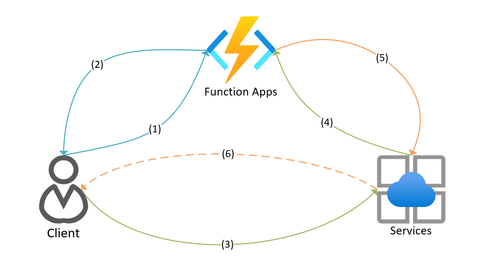

#  Azure Web PubSub trigger and bindings for Azure Functions

This reference explains how to handle Web PubSub events in Azure Functions.

Web PubSub is an Azure-managed service that helps developers easily build web applications with real-time features and publish-subscribe pattern.

| Action | Type |
|---------|---------|
| Run a function when messages come from service | [Trigger binding](#trigger-binding) |
| Bind request to target object under Http trigger for negotiation and upstream requests | [Input binding](#input-binding)
| Invoke service do actions | [Output binding](#output-binding) |

[Source code](https://github.com/Azure/azure-sdk-for-net/blob/master/sdk/webpubsub/) |
[Package](https://www.nuget.org/packages/Microsoft.Azure.WebJobs.Extensions.WebPubSub) |
[API reference documentation](https://github.com/Azure/azure-sdk-for-net/blob/main/sdk/webpubsub/Microsoft.Azure.WebJobs.Extensions.WebPubSub/api/Microsoft.Azure.WebJobs.Extensions.WebPubSub.netstandard2.0.cs) |
[Product documentation](./index.yml) |
[Samples][samples_ref]

## Add to your Functions app

Working with the trigger and bindings requires you reference the appropriate package. The NuGet package is used for .NET class libraries while the extension bundle is used for all other application types.

| Language                                        | Add by...                                   | Remarks 
|-------------------------------------------------|---------------------------------------------|-------------|
| C#                                              | Installing the [NuGet package], version prerelease | |
| C# Script, JavaScript, Python, PowerShell       | [Explicitly install extensions], [Use extension bundles] | The [Azure Tools extension] is recommended to use with Visual Studio Code. |
| C# Script (online-only in Azure portal)         | Adding a binding                                   | To update existing binding extensions without having to republish your function app, see [Update your extensions]. |

> [!NOTE]
> Install the client library from [NuGet](https://www.nuget.org/) with specified package and version.
> 
> ```bash
> func extensions install --package Microsoft.Azure.WebJobs.Extensions.WebPubSub
> ```

[NuGet package]: https://www.nuget.org/packages/Microsoft.Azure.WebJobs.Extensions.WebPubSub
[Use extension bundles]: ../azure-functions/functions-bindings-register.md#extension-bundles
[Explicitly install extensions]: ../azure-functions/functions-bindings-register.md#explicitly-install-extensions 
[Azure Tools extension]: https://marketplace.visualstudio.com/items?itemName=ms-vscode.vscode-node-azure-pack
[Update your extensions]: ../azure-functions/functions-bindings-register.md

## Key concepts



(1)-(2) `WebPubSubConnection` input binding with HttpTrigger to generate client connection.

(3)-(4) `WebPubSubTrigger` trigger binding or `WebPubSubContext` input binding with HttpTrigger to handle service request.

(5)-(6) `WebPubSub` output binding to request service do something.

## Trigger binding

Use the function trigger to handle requests from Azure Web PubSub service. 

`WebPubSubTrigger` is used when you need to handle requests from service side. The trigger endpoint pattern would be like below which should be set in Web PubSub service side (Portal: settings -> event handler -> URL Template). In the endpoint pattern, the query part `code=<API_KEY>` is **REQUIRED** when you're using Azure Function App for [security](../azure-functions/security-concepts.md#system-key) reasons. The key can be found in **Azure portal**. Find your function app resource and navigate to **Functions** -> **App keys** -> **System keys** -> **webpubsub_extension** after you deploy the function app to Azure. Though, this key isn't needed when you're working with local functions.

```
<Function_App_Url>/runtime/webhooks/webpubsub?code=<API_KEY>
```

:::image type="content" source="media/quickstart-serverless/func-keys.png" alt-text="Screenshot of get function system keys.":::

### Example


# [C#](#tab/csharp)

```cs
[FunctionName("WebPubSubTrigger")]
public static void Run(
    [WebPubSubTrigger("<hub>", WebPubSubEventType.User, "message")] UserEventRequest request)
{
    Console.WriteLine($"Request from: {request.ConnectionContext.UserId}");
    Console.WriteLine($"Request message data: {request.Data}");
    Console.WriteLine($"Request message dataType: {request.DataType}");
}
```

`WebPubSubTrigger` binding also supports return value in synchronize scenarios, for example, system `Connect` and user event, when server can check and deny the client request, or send messages to the caller directly. `Connect` event respects `ConnectEventResponse` and `EventErrorResponse`, and user event respects `UserEventResponse` and `EventErrorResponse`, rest types not matching current scenario will be ignored. And if `EventErrorResponse` is returned, service will drop the client connection.

```cs
[FunctionName("WebPubSubTriggerReturnValueFunction")]
public static UserEventResponse Run(
    [WebPubSubTrigger("hub", WebPubSubEventType.User, "message")] UserEventRequest request)
{
    return request.CreateResponse(BinaryData.FromString("ack"), WebPubSubDataType.Text);
}
```

# [JavaScript](#tab/javascript)

Define trigger binding in `function.json`.

```json
{
  "disabled": false,
  "bindings": [
    {
      "type": "webPubSubTrigger",
      "direction": "in",
      "name": "data",
      "hub": "<hub>",
      "eventName": "message",
      "eventType": "user"
    }
  ]
}
```

Define function in `index.js`.

```js
module.exports = function (context, data) {
  console.log('Request from: ', context.bindingData.request.connectionContext.userId);
  console.log('Request message data: ', data);
  console.log('Request message dataType: ', context.bindingData.request.dataType);
}
```

`WebPubSubTrigger` binding also supports return value in synchronize scenarios, for example, system `Connect` and user event, when server can check and deny the client request, or send message to the request client directly. In JavaScript weakly typed language, it will be deserialized regarding the object keys. And `EventErrorResponse` will have the highest priority compare to rest objects, that if `code` is in the return, then it will be parsed to `EventErrorResponse` and client connection will be dropped.

```js
module.exports = async function (context) {
  return { 
    "data": "ack",
    "dataType" : "text"
  };
}
```

---


### Attributes and annotations

In [C# class libraries](../azure-functions/functions-dotnet-class-library.md), use the `WebPubSubTrigger` attribute.

Here's an `WebPubSubTrigger` attribute in a method signature:

```csharp
[FunctionName("WebPubSubTrigger")]
public static void Run([WebPubSubTrigger("<hub>", <WebPubSubEventType>, "<event-name>")] 
    WebPubSubConnectionContext context, ILogger log)
{
    ...
}
```

For a complete example, see C# example.

### Configuration

The following table explains the binding configuration properties that you set in the *function.json* file.

| function.json property | Attribute property | Description |
|---------|---------|---------|
| **type** | n/a |Required - must be set to `webPubSubTrigger`. |
| **direction** | n/a | Required - must be set to `in`. |
| **name** | n/a | Required - the variable name used in function code for the parameter that receives the event data. |
| **hub** | Hub | Required - the value must be set to the name of the Web PubSub hub for the function to be triggered. We support set the value in attribute as higher priority, or it can be set in app settings as a global value. |
| **eventType** | WebPubSubEventType | Required - the value must be set as the event type of messages for the function to be triggered. The value should be either `user` or `system`. |
| **eventName** | EventName | Required - the value must be set as the event of messages for the function to be triggered. </br> For `system` event type, the event name should be in `connect`, `connected`, `disconnected`. </br> For user-defined subprotocols, the event name is `message`. </br> For system supported subprotocol `json.webpubsub.azure.v1.`, the event name is user-defined event name. |
| **connection** | Connection | Optional - the name of an app settings or setting collection that specifies the upstream Azure Web PubSub service. The value will be used for signature validation. And the value will be auto resolved with app settings "WebPubSubConnectionString" by default. And `null` means the validation is not needed and will always succeed. |

### Usages

In C#, `WebPubSubEventRequest` is type recognized binding parameter, rest parameters are bound by parameter name. Check table below of available parameters and types.

In weakly typed language like JavaScript, `name` in `function.json` will be used to bind the trigger object regarding below mapping table. And will respect `dataType` in `function.json` to convert message accordingly when `name` is set to `data` as the binding object for trigger input. All the parameters can be read from `context.bindingData.<BindingName>` and will be `JObject` converted. 

| Binding Name | Binding Type | Description | Properties |
|---------|---------|---------|---------|
|request|`WebPubSubEventRequest`|Describes the upstream request|Property differs by different event types, including derived classes `ConnectEventRequest`, `ConnectedEventRequest`, `UserEventRequest` and `DisconnectedEventRequest` |
|connectionContext|`WebPubSubConnectionContext`|Common request information| EventType, EventName, Hub, ConnectionId, UserId, Headers, Origin, Signature, States |
|data|`BinaryData`,`string`,`Stream`,`byte[]`| Request message data from client in user `message` event | -|
|dataType|`WebPubSubDataType`| Request message dataType, supports `binary`, `text`, `json` | -|
|claims|`IDictionary<string, string[]>`|User Claims in system `connect` request | -|
|query|`IDictionary<string, string[]>`|User query in system `connect` request | -|
|subprotocols|`IList<string>`|Available subprotocols in system `connect` request | -|
|clientCertificates|`IList<ClientCertificate>`|A list of certificate thumbprint from clients in system `connect` request|-|
|reason|`string`|Reason in system `disconnected` request|-|

> [!IMPORTANT]
> In C#, multiple types supported parameter __MUST__ be put in the first, i.e. `request` or `data` that other than the default `BinaryData` type to make the function binding correctly. 

### Return response

`WebPubSubTrigger` will respect customer returned response for synchronous events of `connect` and user event. Only matched response will be sent back to service, otherwise, it will be ignored. Besides, `WebPubSubTrigger` return object supports users to `SetState()` and `ClearStates()` to manage the metadata for the connection. And the extension will merge the results from return value with the original ones from request `WebPubSubConnectionContext.States`. Value in existing key will be overwrite and value in new key will be added.

| Return Type | Description | Properties |
|---------|---------|---------|
|`ConnectEventResponse`| Response for `connect` event | Groups, Roles, UserId, Subprotocol |
|`UserEventResponse`| Response for user event | DataType, Data |
|`EventErrorResponse`| Error response for the sync event | Code, ErrorMessage |
|`*WebPubSubEventResponse`| Base response type of the supported ones used for uncertain return cases | - |

## Input binding

Our extension provides two input binding targeting different needs.

- `WebPubSubConnection`

  To let a client connect to Azure Web PubSub Service, it must know the service endpoint URL and a valid access token. The `WebPubSubConnection` input binding produces required information, so client doesn't need to handle this token generation itself. Because the token is time-limited and can be used to authenticate a specific user to a connection, don't cache the token or share it between clients. An HTTP trigger working with this input binding can be used for clients to retrieve the connection information.

- `WebPubSubContext`

  When using is Static Web Apps, `HttpTrigger` is the only supported trigger and under Web PubSub scenario, we provide the `WebPubSubContext` input binding helps users deserialize upstream http request from service side under Web PubSub protocols. So customers can get similar results comparing to `WebPubSubTrigger` to easily handle in functions. See [examples](#example---webpubsubcontext) in below.
  When used with `HttpTrigger`, customer requires to configure the HttpTrigger exposed url in event handler accordingly.

### Example - `WebPubSubConnection`

The following example shows a C# function that acquires Web PubSub connection information using the input binding and returns it over HTTP. In below example, the `UserId` is passed in through client request query part like `?userid={User-A}`.

# [C#](#tab/csharp)

```cs
[FunctionName("WebPubSubConnectionInputBinding")]
public static WebPubSubConnection Run(
    [HttpTrigger(AuthorizationLevel.Anonymous, "get", "post")] HttpRequest req,
    [WebPubSubConnection(Hub = "<hub>", UserId = "{query.userid}")] WebPubSubConnection connection)
{
    Console.WriteLine("login");
    return connection;
}
```

# [JavaScript](#tab/javascript)

Define input bindings in `function.json`.

```json
{
  "disabled": false,
  "bindings": [
    {
      "authLevel": "anonymous",
      "type": "httpTrigger",
      "direction": "in",
      "name": "req"
    },
    {
      "type": "http",
      "direction": "out",
      "name": "res"
    },
    {
      "type": "webPubSubConnection",
      "name": "connection",
      "userId": "{query.userid}",
      "hub": "<hub>",
      "direction": "in"
    }
  ]
}
```

Define function in `index.js`.

```js
module.exports = function (context, req, connection) {
  context.res = { body: connection };
  context.done();
};
```

---

### Authenticated **tokens**

If the function is triggered by an authenticated client, you can add a user ID claim to the generated token. You can easily add authentication to a function app using App Service Authentication.

App Service Authentication sets HTTP headers named `x-ms-client-principal-id` and `x-ms-client-principal-name` that contain the authenticated user's client principal ID and name, respectively.

You can set the UserId property of the binding to the value from either header using a binding expression: `{headers.x-ms-client-principal-id}` or `{headers.x-ms-client-principal-name}`.

```cs
[FunctionName("WebPubSubConnectionInputBinding")]
public static WebPubSubConnection Run(
    [HttpTrigger(AuthorizationLevel.Anonymous, "get", "post")] HttpRequest req,
    [WebPubSubConnection(Hub = "<hub>", UserId = "{headers.x-ms-client-principal-name}")] WebPubSubConnection connection)
{
    Console.WriteLine("login");
    return connection;
}
```

### Example - `WebPubSubContext`

The following example shows a C# function that acquires Web PubSub upstream request information using the input binding under `connect` event type and returns it over HTTP.

# [C#](#tab/csharp)

```cs
[FunctionName("WebPubSubContextInputBinding")]
public static object Run(
    [HttpTrigger(AuthorizationLevel.Anonymous, "get", "post")] HttpRequest req,
    [WebPubSubContext] WebPubSubContext wpsContext)
{
    if (wpsContext.IsPreflight || !wpsContext.HasError)
    {
        return wpsContext.Response;
    }
    var request = wpsContext.Request as ConnectEventRequest;
    var response = new ConnectEventResponse
    {
        UserId = wpsContext.Request.ConnectionContext.UserId
    };
    return response;
}
```

# [JavaScript](#tab/javascript)

Define input bindings in `function.json`.

```json
{
  "disabled": false,
  "bindings": [
    {
      "authLevel": "anonymous",
      "type": "httpTrigger",
      "direction": "in",
      "name": "req",
      "methods": ["get", "post"]
    },
    {
      "type": "http",
      "direction": "out",
      "name": "$return"
    },
    {
      "type": "webPubSubContext",
      "name": "wpsContext",
      "direction": "in"
    }
  ]
}
```

Define function in `index.js`.

```js
module.exports = async function (context, req, wpsContext) {
  if (!wpsContext.hasError || wpsContext.isPreflight)
  {
    console.log(`invalid request: ${wpsContext.response.message}.`);
    return wpsContext.response;
  }
  console.log(`user: ${wpsContext.connectionContext.userId} is connecting.`);
  return { body: {"userId": wpsContext.connectionContext.userId} };
};
```

---

### Configuration

#### WebPubSubConnection

The following table explains the binding configuration properties that you set in the function.json file and the `WebPubSubConnection` attribute.

| function.json property | Attribute property | Description |
|---------|---------|---------|
| **type** | n/a | Must be set to `webPubSubConnection` |
| **direction** | n/a | Must be set to `in` |
| **name** | n/a | Variable name used in function code for input connection binding object. |
| **hub** | Hub | Required - The value must be set to the name of the Web PubSub hub for the function to be triggered. We support set the value in attribute as higher priority, or it can be set in app settings as a global value. |
| **userId** | UserId | Optional - the value of the user identifier claim to be set in the access key token. |
| **connection** | Connection | Required - The name of the app setting that contains the Web PubSub Service connection string (defaults to "WebPubSubConnectionString"). |

#### WebPubSubContext

The following table explains the binding configuration properties that you set in the functions.json file and the `WebPubSubContext` attribute.

| function.json property | Attribute property | Description |
|---------|---------|---------|
| **type** | n/a | Must be set to `webPubSubContext`. |
| **direction** | n/a | Must be set to `in`. |
| **name** | n/a | Variable name used in function code for input Web PubSub request. |
| **connection** | Connection | Optional - the name of an app settings or setting collection that specifies the upstream Azure Web PubSub service. The value will be used for [Abuse Protection](https://github.com/cloudevents/spec/blob/v1.0.1/http-webhook.md#4-abuse-protection) and Signature validation. The value will be auto resolved with "WebPubSubConnectionString" by default. And `null` means the validation is not needed and will always succeed. |

### Usage

#### WebPubSubConnection

# [C#](#tab/csharp)

`WebPubSubConnection` provides below properties.

| Binding Name | Binding Type | Description |
|---------|---------|---------|
| BaseUri | Uri | Web PubSub client connection uri. |
| Uri | Uri | Absolute Uri of the Web PubSub connection, contains `AccessToken` generated base on the request. |
| AccessToken | string | Generated `AccessToken` based on request UserId and service information. |

# [JavaScript](#tab/javascript)

`WebPubSubConnection` provides below properties.

| Binding Name | Description |
|---------|---------|
| baseUrl | Web PubSub client connection uri. |
| url | Absolute Uri of the Web PubSub connection, contains `AccessToken` generated base on the request. |
| accessToken | Generated `AccessToken` based on request UserId and service information. |

---

#### WebPubSubContext

`WebPubSubContext` provides below properties.

| Binding Name | Binding Type | Description | Properties |
|---------|---------|---------|---------|
| request | `WebPubSubEventRequest` | Request from client, see below table for details. | `WebPubSubConnectionContext` from request header and other properties deserialized from request body describe the request, for example, `Reason` for `DisconnectedEventRequest`. |
| response | `HttpResponseMessage` | Extension builds response mainly for `AbuseProtection` and errors cases. | - |
| errorMessage | string | Describe the error details when processing the upstream request. | - |
| hasError | bool | Flag to indicate whether it's a valid Web PubSub upstream request. | - |
| isPreflight | bool | Flag to indicate whether it's a preflight request of `AbuseProtection`. | - |

For `WebPubSubEventRequest`, it's deserialized to different classes that provide different information about the request scenario. For `PreflightRequest` or not valid cases, user can check the flags `IsPreflight` and `HasError` to know. It's suggested to return system build response `WebPubSubContext.Response` directly, or customer can log errors on demand. In different scenarios, customer can read the request properties as below.

| Derived Class | Description | Properties |
| -- | -- | -- |
| `PreflightRequest` | Used in `AbuseProtection` when `IsPreflight` is **true** | - |
| `ConnectEventRequest` | Used in system `Connect` event type | Claims, Query, Subprotocols, ClientCertificates |
| `ConnectedEventRequest` | Used in system `Connected` event type | - |
| `UserEventRequest` | Used in user event type | Data, DataType |
| `DisconnectedEventRequest` | Used in system `Disconnected` event type | Reason |

> [!NOTE]
> Though the `WebPubSubContext` is a input binding provides similar request deserialize way under `HttpTrigger` comparing to `WebPubSubTrigger`, there's limitations, i.e. connection state post merge is not supported. The return response will still be respected by the service side, but users require to build the response themselves. If users have needs to set the event response, you should return a `HttpResponseMessage` contains `ConnectEventResponse` or messages for user event as **response body** and put connection state with key `ce-connectionstate` in **response header**.

## Output binding

Use the Web PubSub output binding to invoke Azure Web PubSub service to do something. You can broadcast a message to:

* All connected clients
* Connected clients authenticated to a specific user
* Connected clients joined in a specific group
* A specific client connection

The output binding also allows you to manage clients and groups, as well as grant/revoke permissions targeting specific connectionId with group.

* Add connection to group
* Add user to group
* Remove connection from a group
* Remove user from a group
* Remove user from all groups
* Close all client connections
* Close a specific client connection
* Close connections in a group
* Grant permission of a connection
* Revoke permission of a connection

For information on setup and configuration details, see the overview.

### Example

# [C#](#tab/csharp)

```cs
[FunctionName("WebPubSubOutputBinding")]
public static async Task RunAsync(
    [HttpTrigger(AuthorizationLevel.Anonymous, "get", "post")] HttpRequest req,
    [WebPubSub(Hub = "<hub>")] IAsyncCollector<WebPubSubAction> actions)
{
    await actions.AddAsync(WebPubSubAction.CreateSendToAllAction("Hello Web PubSub!", WebPubSubDataType.Text));
}
```

# [JavaScript](#tab/javascript)

Define bindings in `functions.json`.

```json
{
  "disabled": false,
  "bindings": [
    {
      "type": "webPubSub",
      "name": "actions",
      "hub": "<hub>",
      "direction": "out"
    }
  ]
}
```

Define function in `index.js`.

```js
module.exports = async function (context) {
  context.bindings.actions = {
    "actionName": "sendToAll",
    "data": "hello",
    "dataType": "text"
  };
  context.done();
}
```

---

### WebPubSubAction 

`WebPubSubAction` is the base abstract type of output bindings. The derived types represent the action server want service to invoke. 

# [C#](#tab/csharp)

In C# language, we provide a few static methods under `WebPubSubAction` to help discover available actions. For example, user can create the `SendToAllAction` by call `WebPubSubAction.CreateSendToAllAction()`.

| Derived Class | Properties |
| -- | -- |
| `SendToAllAction`|Data, DataType, Excluded |
| `SendToGroupAction`|Group, Data, DataType, Excluded |
| `SendToUserAction`|UserId, Data, DataType |
| `SendToConnectionAction`|ConnectionId, Data, DataType |
| `AddUserToGroupAction`|UserId, Group |
| `RemoveUserFromGroupAction`|UserId, Group |
| `RemoveUserFromAllGroupsAction`|UserId |
| `AddConnectionToGroupAction`|ConnectionId, Group |
| `RemoveConnectionFromGroupAction`|ConnectionId, Group |
| `CloseAllConnectionsAction`|Excluded, Reason |
| `CloseClientConnectionAction`|ConnectionId, Reason |
| `CloseGroupConnectionsAction`|Group, Excluded, Reason |
| `GrantPermissionAction`|ConnectionId, Permission, TargetName |
| `RevokePermissionAction`|ConnectionId, Permission, TargetName |

# [JavaScript](#tab/javascript)

In weakly typed language like `javascript`, **`actionName`** is the key parameter to resolve the type, available actions are listed as below.

| ActionName | Properties |
| -- | -- |
| `SendToAll`|Data, DataType, Excluded |
| `SendToGroup`|Group, Data, DataType, Excluded |
| `SendToUser`|UserId, Data, DataType |
| `SendToConnection`|ConnectionId, Data, DataType |
| `AddUserToGroup`|UserId, Group |
| `RemoveUserFromGroup`|UserId, Group |
| `RemoveUserFromAllGroups`|UserId |
| `AddConnectionToGroup`|ConnectionId, Group |
| `RemoveConnectionFromGroup`|ConnectionId, Group |
| `CloseAllConnections`|Excluded, Reason |
| `CloseClientConnection`|ConnectionId, Reason |
| `CloseGroupConnections`|Group, Excluded, Reason |
| `GrantPermission`|ConnectionId, Permission, TargetName |
| `RevokePermission`|ConnectionId, Permission, TargetName |

> [!IMPORTANT]
> The message data property in the send message related actions must be `string` if data type is set to `json` or `text` to avoid data conversion ambiguity. Please use `JSON.stringify()` to convert the json object in need. This is applied to any place using message property, for example, `UserEventResponse.Data` working with `WebPubSubTrigger`. 
> 
> When data type is set to `binary`, it's allowed to leverage binding naturally supported `dataType` as `binary` configured in the `function.json`, see [Trigger and binding definitions](../azure-functions/functions-triggers-bindings.md?tabs=csharp#trigger-and-binding-definitions) for details.

---

### Configuration

#### WebPubSub

The following table explains the binding configuration properties that you set in the function.json file and the `WebPubSub` attribute.

| function.json property | Attribute property | Description |
|---------|---------|---------|
| **type** | n/a | Must be set to `webPubSub` |
| **direction** | n/a | Must be set to `out` |
| **name** | n/a | Variable name used in function code for output binding object. |
| **hub** | Hub | The value must be set to the name of the Web PubSub hub for the function to be triggered. We support set the value in attribute as higher priority, or it can be set in app settings as a global value. |
| **connection** | Connection | The name of the app setting that contains the Web PubSub Service connection string (defaults to "WebPubSubConnectionString"). |

## Troubleshooting

### Setting up console logging
You can also easily [enable console logging](https://github.com/Azure/azure-sdk-for-net/blob/master/sdk/core/Azure.Core/samples/Diagnostics.md#logging) if you want to dig deeper into the requests you're making against the service.

[azure_sub]: https://azure.microsoft.com/free/
[samples_ref]: https://github.com/Azure/azure-webpubsub/tree/main/samples/functions

## Next steps

[!INCLUDE [next step](includes/include-next-step.md)]
