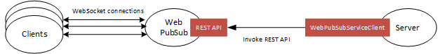

# Azure Web PubSub service client library for Java

[Azure Web PubSub service](./index.yml) is an Azure-managed service that helps developers easily build web applications with real-time features and a publish-subscribe pattern. Any scenario that requires real-time publish-subscribe messaging between server and clients or among clients can use Azure Web PubSub service. Traditional real-time features that often require polling from the server or submitting HTTP requests can also use Azure Web PubSub service.

This article describes the Azure Web PubSub service client library.

You can use this library in your server-side app to manage the WebSocket client connections, as shown in this diagram:



Use this library to:

- Send messages to hubs and groups.
- Send messages to particular users and connections.
- Organize users and connections into groups.
- Close connections
- Grant, revoke, and check permissions for an existing connection

For more information, see:

- [Azure Web PubSub client library Java SDK][source_code]
- [Azure Web PubSub client library reference documentation][api]
- [Azure Web PubSub client library samples for Java][samples_readme]
- [Azure Web PubSub service documentation][product_documentation]

## Getting started

### Prerequisites

- An Azure account with an active subscription is required. If you don't already have one, you can [create an account for free][azure_subscription].
- A [Java Development Kit (JDK)][jdk_link], version 8 or later.

### Include the Package

[//]: # "{x-version-update-start;com.azure:azure-messaging-webpubsub;current}"

```xml
<dependency>
    <groupId>com.azure</groupId>
    <artifactId>azure-messaging-webpubsub</artifactId>
    <version>1.0.0</version>
</dependency>
```

[//]: # "{x-version-update-end}"

### Create a `WebPubSubServiceClient` using connection string

<!-- embedme ./src/samples/java/com/azure/messaging/webpubsub/ReadmeSamples.java#L21-L24 -->

```java
WebPubSubServiceClient webPubSubServiceClient = new WebPubSubServiceClientBuilder()
    .connectionString("{connection-string}")
    .hub("chat")
    .buildClient();
```

### Create a `WebPubSubServiceClient` using access key

<!-- embedme ./src/samples/java/com/azure/messaging/webpubsub/ReadmeSamples.java#L31-L35 -->

```java
WebPubSubServiceClient webPubSubServiceClient = new WebPubSubServiceClientBuilder()
    .credential(new AzureKeyCredential("{access-key}"))
    .endpoint("<Insert endpoint from Azure Portal>")
    .hub("chat")
    .buildClient();
```

## Examples

- [Broadcast message to entire hub](#broadcast-all "Broadcast message to entire hub")
- [Broadcast message to a group](#broadcast-group "Broadcast message to a group")
- [Send message to a connection](#send-to-connection "Send message to a connection")
- [Send message to a user](#send-to-user "Send message to a user")

<a name="broadcast-all"></a>

### Broadcast message to entire hub

<!-- embedme ./src/samples/java/com/azure/messaging/webpubsub/ReadmeSamples.java#L47-L47 -->

```java
webPubSubServiceClient.sendToAll("Hello world!", WebPubSubContentType.TEXT_PLAIN);
```

<a name="broadcast-group"></a>

### Broadcast message to a group

<!-- embedme ./src/samples/java/com/azure/messaging/webpubsub/ReadmeSamples.java#L59-L59 -->

```java
webPubSubServiceClient.sendToGroup("java", "Hello Java!", WebPubSubContentType.TEXT_PLAIN);
```

<a name="send-to-connection"></a>

### Send message to a connection

<!-- embedme ./src/samples/java/com/azure/messaging/webpubsub/ReadmeSamples.java#L71-L71 -->

```java
webPubSubServiceClient.sendToConnection("myconnectionid", "Hello connection!", WebPubSubContentType.TEXT_PLAIN);
```

<a name="send-to-user"></a>

### Send message to a user

<!-- embedme ./src/samples/java/com/azure/messaging/webpubsub/ReadmeSamples.java#L83-L83 -->

```java
webPubSubServiceClient.sendToUser("Andy", "Hello Andy!", WebPubSubContentType.TEXT_PLAIN);
```

## Troubleshooting

### Enable client logging

You can set the `AZURE_LOG_LEVEL` environment variable to view logging statements made in the client library. For
example, setting `AZURE_LOG_LEVEL=2` would show all informational, warning, and error log messages. The log levels can
be found here: [log levels][log_levels].

### Default HTTP Client

All client libraries use the Netty HTTP client by default. Adding the above dependency will automatically configure
the client library to use the Netty HTTP client. Configuring or changing the HTTP client is described in the
[HTTP clients wiki](https://github.com/Azure/azure-sdk-for-java/wiki/HTTP-clients).

### Default SSL library

By default, all client libraries use the Tomcat-native Boring SSL library to enable native-level performance for SSL
operations. The Boring SSL library is an uber jar containing native libraries for Linux / macOS / Windows, and provides
better performance compared to the default SSL implementation within the JDK. For more information, including how to reduce the dependency size, see [performance tuning][https://github.com/Azure/azure-sdk-for-java/wiki/Performance-Tuning].

[!INCLUDE [next step](includes/include-next-step.md)]

<!-- LINKS -->

[azure_subscription]: https://azure.microsoft.com/free
[jdk_link]: /java/azure/jdk
[source_code]: https://github.com/Azure/azure-sdk-for-java/tree/main/sdk/webpubsub/azure-messaging-webpubsub/src
[product_documentation]: ./index.yml
[samples_readme]: https://github.com/Azure/azure-sdk-for-java/blob/main/sdk/webpubsub/azure-messaging-webpubsub/src/samples/README.md
[log_levels]: https://github.com/Azure/azure-sdk-for-java/blob/main/sdk/core/azure-core/src/main/java/com/azure/core/util/logging/ClientLogger.java
[performance_tuning]: https://github.com/Azure/azure-sdk-for-java/wiki/Performance-Tuning
[cla]: https://cla.microsoft.com
[coc]: https://opensource.microsoft.com/codeofconduct/
[coc_faq]: https://opensource.microsoft.com/codeofconduct/faq/
[coc_contact]: mailto:opencode@microsoft.com
[api]: /java/api/overview/azure/messaging-webpubsub-readme