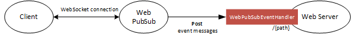

# JavaScript SDK for Azure Web PubSub

[Azure Web PubSub service](https://aka.ms/awps/doc) is an Azure-managed service that helps developers easily build web applications with real-time features and publish-subscribe pattern. Any scenario that requires real-time publish-subscribe messaging between server and clients or among clients can use Azure Web PubSub service. Traditional real-time features that often require polling from server or submitting HTTP requests can also use Azure Web PubSub service.

There are two libraries offered for JavaScript: the service client library and express middleware. The following sections contain more information about these libraries.

- [Service client library](#service-client-library)
- [Express middleware](#express)

<a name="service-client-library"></a>

## Azure Web PubSub service client library for JavaScript

You can use this library in your app server side to manage the WebSocket client connections, as shown in below diagram:


- Send messages to hubs and groups.
- Send messages to particular users and connections.
- Organize users and connections into groups.
- Close connections
- Grant, revoke, and check permissions for an existing connection

Details about the terms used here are described in [Key concepts](#key-concepts) section.

[Source code](https://github.com/Azure/azure-sdk-for-js/blob/main/sdk/web-pubsub/web-pubsub) |
[Package (NPM)](https://www.npmjs.com/package/@azure/web-pubsub) |
[API reference documentation](https://aka.ms/awps/sdk/js) |
[Product documentation](https://aka.ms/awps/doc) |
[Samples][samples_ref]

### Getting started

#### Currently supported environments

- [LTS versions of Node.js](https://nodejs.org/about/releases/)

#### Prerequisites

- An [Azure subscription][azure_sub].
- An existing Azure Web PubSub service instance.

#### 1. Install the `@azure/web-pubsub` package

```bash
npm install @azure/web-pubsub
```

#### 2. Create and authenticate a WebPubSubServiceClient

```js
const { WebPubSubServiceClient } = require("@azure/web-pubsub");

const serviceClient = new WebPubSubServiceClient("<ConnectionString>", "<hubName>");
```

You can also authenticate the `WebPubSubServiceClient` using an endpoint and an `AzureKeyCredential`:

```js
const { WebPubSubServiceClient, AzureKeyCredential } = require("@azure/web-pubsub");

const key = new AzureKeyCredential("<Key>");
const serviceClient = new WebPubSubServiceClient("<Endpoint>", key, "<hubName>");
```

Or authenticate the `WebPubSubServiceClient` using [Azure Active Directory][aad_doc]

1. Install the `@azure/identity` dependency

```batch
npm install @azure/identity
```

2. Update the source code to use `DefaultAzureCredential`:

```js
const { WebPubSubServiceClient, AzureKeyCredential } = require("@azure/web-pubsub");

const key = new DefaultAzureCredential();
const serviceClient = new WebPubSubServiceClient("<Endpoint>", key, "<hubName>");
```

### Key concepts

#### Connection

A connection, also known as a client or a client connection, represents an individual WebSocket connection connected to the Web PubSub service. When successfully connected, a unique connection ID is assigned to this connection by the Web PubSub service.

#### Hub

A hub is a logical concept for a set of client connections. Usually you use one hub for one purpose, for example, a chat hub, or a notification hub. When a client connection is created, it connects to a hub, and during its lifetime, it belongs to that hub. Different applications can share one Azure Web PubSub service by using different hub names.

#### Group

A group is a subset of connections to the hub. You can add a client connection to a group, or remove the client connection from the group, anytime you want. For example, when a client joins a chat room, or when a client leaves the chat room, this chat room can be considered to be a group. A client can join multiple groups, and a group can contain multiple clients.

#### User

Connections to Web PubSub can belong to one user. A user might have multiple connections, for example when a single user is connected across multiple devices or multiple browser tabs.

#### Message

When the client is connected, it can send messages to the upstream application, or receive messages from the upstream application, through the WebSocket connection.

### Examples

#### Get the access token for a client to start the WebSocket connection

```js
const { WebPubSubServiceClient } = require("@azure/web-pubsub");

const serviceClient = new WebPubSubServiceClient("<ConnectionString>", "<hubName>");

// Get the access token for the WebSocket client connection to use
let token = await serviceClient.getClientAccessToken();

// Or get the access token and assign the client a userId
token = await serviceClient.getClientAccessToken({ userId: "user1" });

// return the token to the WebSocket client
```

#### Broadcast messages to all connections in a hub

```js
const { WebPubSubServiceClient } = require("@azure/web-pubsub");

const serviceClient = new WebPubSubServiceClient("<ConnectionString>", "<hubName>");

// Send a JSON message
await serviceClient.sendToAll({ message: "Hello world!" });

// Send a plain text message
await serviceClient.sendToAll("Hi there!", { contentType: "text/plain" });

// Send a binary message
const payload = new Uint8Array(10);
await serviceClient.sendToAll(payload.buffer);
```

#### Send messages to all connections in a group

```js
const { WebPubSubServiceClient } = require("@azure/web-pubsub");

const serviceClient = new WebPubSubServiceClient("<ConnectionString>", "<hubName>");

const groupClient = serviceClient.group("<groupName>");

// Add user to the group
await groupClient.addUser("user1");

// Send a JSON message
await groupClient.sendToAll({ message: "Hello world!" });

// Send a plain text message
await groupClient.sendToAll("Hi there!", { contentType: "text/plain" });

// Send a binary message
const payload = new Uint8Array(10);
await groupClient.sendToAll(payload.buffer);
```

#### Send messages to all connections for a user

```js
const { WebPubSubServiceClient } = require("@azure/web-pubsub");

const serviceClient = new WebPubSubServiceClient("<ConnectionString>", "<hubName>");

// Send a JSON message
await serviceClient.sendToUser("user1", { message: "Hello world!" });

// Send a plain text message
await serviceClient.sendToUser("user1", "Hi there!", { contentType: "text/plain" });

// Send a binary message
const payload = new Uint8Array(10);
await serviceClient.sendToUser("user1", payload.buffer);
```

#### Check if the group has any connection

```js
const { WebPubSubServiceClient } = require("@azure/web-pubsub");
const WebSocket = require("ws");

const serviceClient = new WebPubSubServiceClient("<ConnectionString>", "<hubName>");

const groupClient = serviceClient.group("<groupName>");

// close all the connections in the group
await groupClient.closeAllConnections({ reason: "<closeReason>" });

// check if the group has any connections
const hasConnections = await serviceClient.groupExists("<groupName>");
```

#### Access the raw HTTP response for an operation

```js
const { WebPubSubServiceClient } = require("@azure/web-pubsub");

function onResponse(rawResponse: FullOperationResponse): void {
  console.log(rawResponse);
}
const serviceClient = new WebPubSubServiceClient("<ConnectionString>", "<hubName>");
await serviceClient.sendToAll({ message: "Hello world!" }, { onResponse });
```

### Troubleshooting

#### Enable logs

You can set the following environment variable to get the debug logs when using this library.

- Getting debug logs from the SignalR client library

```bash
export AZURE_LOG_LEVEL=verbose
```

For more detailed instructions on how to enable logs, you can look at the [@azure/logger package docs](https://github.com/Azure/azure-sdk-for-js/tree/main/sdk/core/logger).

#### Live Trace

Use **Live Trace** from the Web PubSub service portal to view the live traffic.

<a name="express"></a>

## Azure Web PubSub CloudEvents handlers for express

When a WebSocket connection connects, the Web PubSub service transforms the connection lifecycle and messages into [events in CloudEvents format](concept-service-internals.md#workflow). This library provides an express middleware to handle events representing the WebSocket connection's lifecycle and messages, as shown in below diagram:



Details about the terms used here are described in [Key concepts](#key-concepts) section.

[Source code](https://github.com/Azure/azure-sdk-for-js/blob/main/sdk/web-pubsub/web-pubsub-express) |
[Package (NPM)](https://www.npmjs.com/package/@azure/web-pubsub-express) |
[API reference documentation](https://aka.ms/awps/sdk/js) |
[Product documentation](https://aka.ms/awps/doc) |
[Samples][samples_ref]

### Getting started

#### Currently supported environments

- [LTS versions of Node.js](https://nodejs.org/about/releases/)
- [Express](https://expressjs.com/) version 4.x.x or higher

#### Prerequisites

- An [Azure subscription][azure_sub].
- An existing Azure Web PubSub endpoint.

#### 1. Install the `@azure/web-pubsub-express` package

```bash
npm install @azure/web-pubsub-express
```

#### 2. Create a `WebPubSubEventHandler`

```js
const express = require("express");

const { WebPubSubEventHandler } = require("@azure/web-pubsub-express");
const handler = new WebPubSubEventHandler("chat");

const app = express();

app.use(handler.getMiddleware());

app.listen(3000, () =>
  console.log(`Azure WebPubSub Upstream ready at http://localhost:3000${handler.path}`)
);
```

### Key concepts

#### Connection

A connection, also known as a client or a client connection, represents an individual WebSocket connection connected to the Web PubSub service. When successfully connected, a unique connection ID is assigned to this connection by the Web PubSub service.

#### Hub

A hub is a logical concept for a set of client connections. Usually you use one hub for one purpose, for example, a chat hub, or a notification hub. When a client connection is created, it connects to a hub, and during its lifetime, it belongs to that hub. Different applications can share one Azure Web PubSub service by using different hub names.

#### Group

A group is a subset of connections to the hub. You can add a client connection to a group, or remove the client connection from the group, anytime you want. For example, when a client joins a chat room, or when a client leaves the chat room, this chat room can be considered to be a group. A client can join multiple groups, and a group can contain multiple clients.

#### User

Connections to Web PubSub can belong to one user. A user might have multiple connections, for example when a single user is connected across multiple devices or multiple browser tabs.

#### Client Events

Events are created during the lifecycle of a client connection. For example, a simple WebSocket client connection creates a `connect` event when it tries to connect to the service, a `connected` event when it successfully connected to the service, a `message` event when it sends messages to the service and a `disconnected` event when it disconnects from the service.

#### Event Handler

Event handler contains the logic to handle the client events. Event handler needs to be registered and configured in the service through the portal or Azure CLI beforehand. The place to host the event handler logic is generally considered as the server-side.

### Examples

#### Handle the `connect` request and assign `<userId>`

```js
const express = require("express");

const { WebPubSubEventHandler } = require("@azure/web-pubsub-express");
const handler = new WebPubSubEventHandler("chat", {
  handleConnect: (req, res) => {
    // auth the connection and set the userId of the connection
    res.success({
      userId: "<userId>"
    });
  },
  allowedEndpoints: ["https://<yourAllowedService>.webpubsub.azure.com"]
});

const app = express();

app.use(handler.getMiddleware());

app.listen(3000, () =>
  console.log(`Azure WebPubSub Upstream ready at http://localhost:3000${handler.path}`)
);
```

#### Only allow specified endpoints

```js
const express = require("express");

const { WebPubSubEventHandler } = require("@azure/web-pubsub-express");
const handler = new WebPubSubEventHandler("chat", {
  allowedEndpoints: [
    "https://<yourAllowedService1>.webpubsub.azure.com",
    "https://<yourAllowedService2>.webpubsub.azure.com"
  ]
});

const app = express();

app.use(handler.getMiddleware());

app.listen(3000, () =>
  console.log(`Azure WebPubSub Upstream ready at http://localhost:3000${handler.path}`)
);
```

#### Set custom event handler path

```js
const express = require("express");

const { WebPubSubEventHandler } = require("@azure/web-pubsub-express");
const handler = new WebPubSubEventHandler("chat", {
  path: "customPath1"
});

const app = express();

app.use(handler.getMiddleware());

app.listen(3000, () =>
  // Azure WebPubSub Upstream ready at http://localhost:3000/customPath1
  console.log(`Azure WebPubSub Upstream ready at http://localhost:3000${handler.path}`)
);
```

#### Set and read connection state

```js
const express = require("express");

const { WebPubSubEventHandler } = require("@azure/web-pubsub-express");

const handler = new WebPubSubEventHandler("chat", {
  handleConnect(req, res) {
    // You can set the state for the connection, it lasts throughout the lifetime of the connection
    res.setState("calledTime", 1);
    res.success();
  },
  handleUserEvent(req, res) {
    var calledTime = req.context.states.calledTime++;
    console.log(calledTime);
    // You can also set the state here
    res.setState("calledTime", calledTime);
    res.success();
  }
});

const app = express();

app.use(handler.getMiddleware());

app.listen(3000, () =>
  console.log(`Azure WebPubSub Upstream ready at http://localhost:3000${handler.path}`)
);
```

### Troubleshooting

#### Enable logs

You can set the following environment variable to get the debug logs when using this library.

- Getting debug logs from the SignalR client library

```bash
export AZURE_LOG_LEVEL=verbose
```

For more detailed instructions on how to enable logs, you can look at the [@azure/logger package docs](https://github.com/Azure/azure-sdk-for-js/tree/main/sdk/core/logger).

#### Live Trace

Use **Live Trace** from the Web PubSub service portal to view the live traffic.

[azure_sub]: https://azure.microsoft.com/free/
[samples_ref]: https://github.com/Azure/azure-webpubsub/tree/main/samples/javascript/

## Next steps

[!INCLUDE [next step](includes/include-next-step.md)]