<properties title="Azure Web Sites Web Hosting Plans In-Depth Overview" pageTitle="Azure Web Sites Web Hosting Plans In-Depth Overview - Windows Azure feature guide" description="Learn how Web Hosting Plans for Azure Web Sites work, and how they benefit your management experience." metaKeywords="Azure Web Sites, Azure Websites, WHP, Web Hosting Plan, Web Hosting Plans, Resource Groups" services="web-sites" solutions="web" documentationCenter="Infrastructure" authors="Byron Tardif and Yochay Kiryaty" videoId="" scriptId="" />
 
#Azure Web Sites Web Hosting Plans In-Depth Overview#
 
Web hosting plans (WHPs) represent a set of features and capacity that you can share across your web sites.  Web hosting plans support the 4 Azure Web Sites pricing tiers (Free, Shared, Basic, and Standard) where each tier has its own capabilities and capacity.  Sites in the same subscription, resource group, and geographic location can share a web hosting plan. All the sites sharing a web hosting plan can leverage all the capabilities and features defined by the web hosting plan tier. All web sites associated with a given web hosting plan run on the resources defined by the web hosting plan. For example, if your web hosting plan is configured to use two "small" virtual machines, all sites associated with that web hosting plan will run on both virtual machines. As always with Azure Web Sites, the virtual machines your sites are running on are fully managed and highly available.
 
In this article we'll explore the key characteristics such as tier and scale of a Web Hosting Plan and how they come into play while managing your web sites. 
 
##Web sites, Web Hosting Plans, and Resource Groups##
 
A web site can be associated with only one web hosting plan at any given time. A web hosting plan is associated with a resource group. A Resource group is a new concept in Azure that serves as the lifecycle boundary for every resource contained within it. Resource groups enable you to manage all the pieces of an application together. 
 
You can have multiple web hosting plans in a resource group and each hosting plan will have its own set of features and capabilities that are utilized by its associated sites.  The following image illustrates this relationship:
 
 
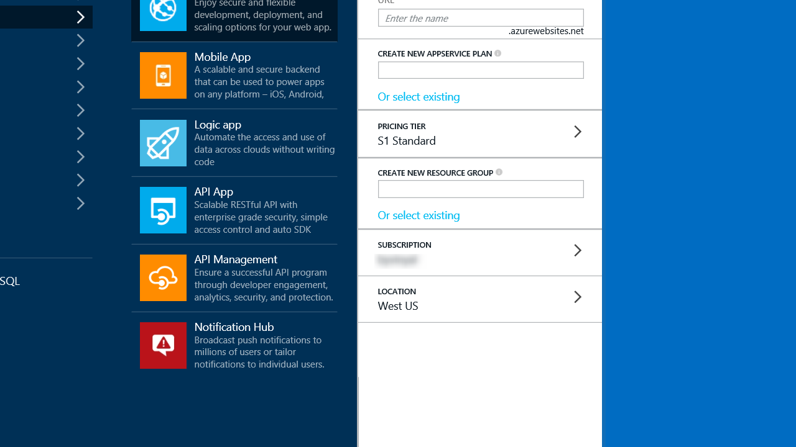
 
 
The ability to have multiple web hosting plans in a single resource group allows you to allocate different sites to different resources, primarily virtual machines running your web sites. For example, this ability allows separation of resources between dev and test and production sites, where you might want to allocate one web hosting plan with its own dedicated set of resources for your production sites, and a second web hosting plan for your dev and test sites. 
 
Having multiple web hosting plans in a single resource group also allows you to define an application that spans across regions. For example, a highly available web site running in two regions will include two web sites, one for each region, and one web site associated with each web hosting plan. In such a situation, all the sites will be associated with a single resource group, which defines one application.  Having a single view of a resource group with multiple web hosting plans and multiple sites makes it easy to manage, control and view the health of the web sites. On top of managing web sites resources and respective sites for a given application, you can associated any related Azure resource such as SQL-Azure databases, and Team Projects. 
 
##When should I create a new resource group and when should I create a new web hosting plan?##
 
When creating a new web site, you should consider creating a new resource group when the web site you are about to create represents a new web application. In this case, creating a new resource group, an associated web hosting plan, and a web sites is the right choice.  When creating such a new web site through the new Azure portal preview, using the gallery or the new web site + SQL option, the portal will default to create a new resource group and web hosting plan for your new site. If you need to, though, you can overwrite these defaults.
 
 
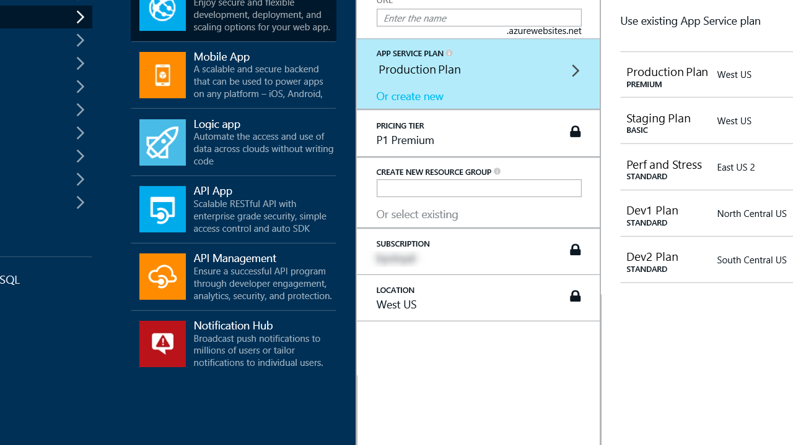
 
 
You can always add a new web site, or any other resources, to an existing resource group. When creating a new web site from the context of an existing resource group, the new web site wizard defaults to the existing resource and web hosting plan. Here too you can overwrite these defaults as needed. When adding a new web site to an existing resource group, you can choose to add the site to an existing web hosting plan (this is the default option in the new Azure portal preview), or you can create a new web hosting plan to add the site to.
 
Creating a new hosting plan allows you to allocate a new set of resource for your web sites, and provides you with greater control over resource allocation, as each web hosting plan gets its own set of virtual machines. Since you can move web sites between web hosting plans, assuming the web hosting plans are in the same regions, the decision of whether to create a new web hosting plan or not is of less important. If a given web site starts consuming too many resources or you just need to separate a few web sites, you can create a new web hosting plan and move your web sites to it.
 
If you want to create a new web site in a different region, and that region doesn't have an existing web hosting plan, you will have to create a new web hosting plan in that region to be able to have a web site associated with it. 
 
An important thing to keep in mind is that you cannot move web hosting plans or web sites between resource groups. Also, you cannot move a web site between two web hosting plans that are in two separate regions. 
 
##Existing resources group in the Azure Preview portal##
 
If you already have existing web sites on Azure Web Sites, you will notice that all your web sites show up in the Azure preview portal. You can see all your web site as a flat list by clicking on the **browse** button on the left navigation pane and selecting **Websites**:
 
 
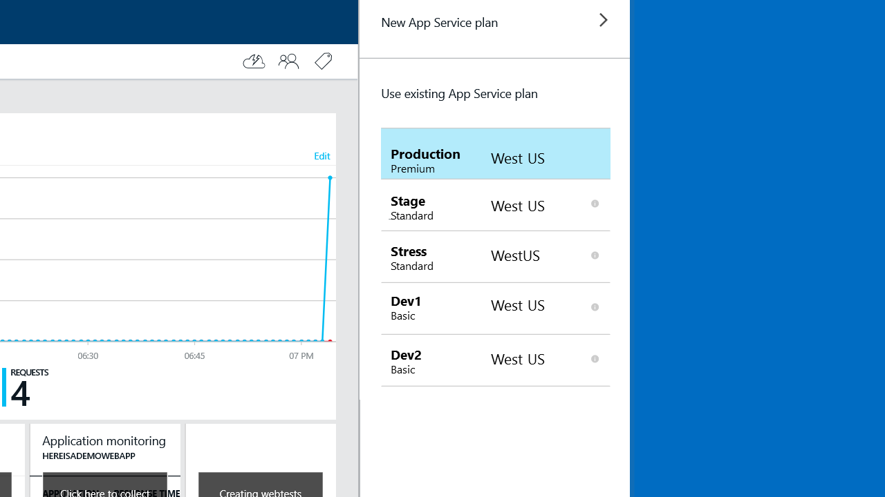
 
 
You can also see all the resource groups that have been created for you by clicking on the **browse** button on the left navigation pane and selecting **Resource groups**:
 
 
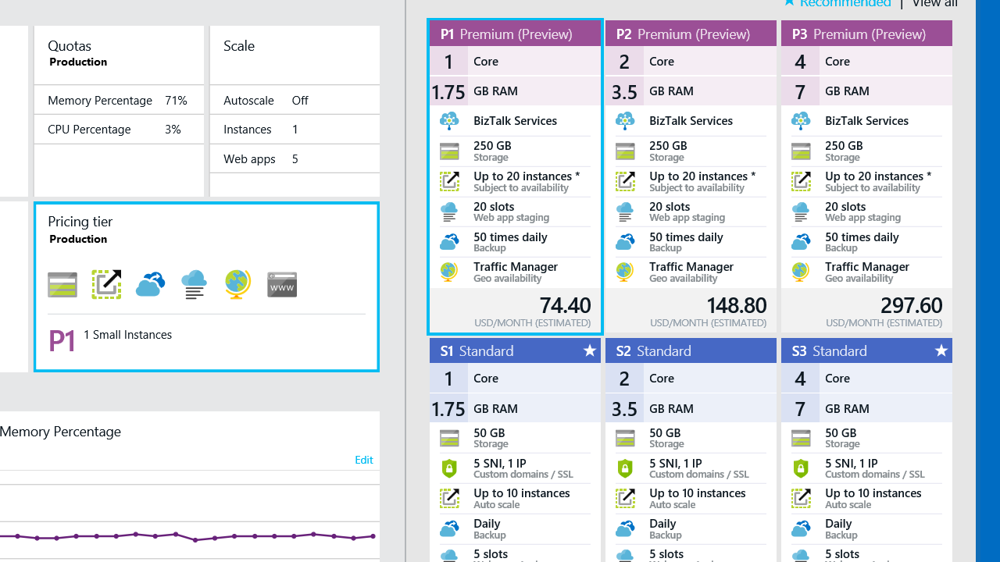
 
 
You will also notice that you have an auto-generated default resource group in each region you already have web sites. The auto generated resource group name for web sites is *Default-Web-<LOCATION NAME>*where location name represents an Azure region (for example *Default-Web-WestUS*). In each resource group you will find all your existing sites for the group's region. Each site you created in the past and will create in the future in either the Full Azure portal or the Azure Preview Portal will be available on both portals. 
 
Since every web site has to be associated with a web hosting plan, we have created default web hosting plans for your existing sites according to the following convention, in each region:
 
* All your **Free** web sites are associated with a **Default** web hosting plan and its pricing tier set to **Free**. 
 
* All your **Shared** web sites are associated with a **Default** web hosting plan and its pricing tier set to **Shared**
 
* All your **Standard** web sites are associated with a default web hosting plan and its pricing tier set to **Standard**. 
 
The name of this web hosting plan is **DefaultServerFarm**. This name was chosen to support a legacy API. The name **ServerFarm** can be somewhat misleading as it refers to a **Web Hosting Plan**, but it's important to notice that it is a name of a web hosting plan and it is not an entity of its own. 
 
##Web Hosting Plan F.A.Q.##
 
**Question**: How do I create a Web Hosting Plan?
 
**Answer**: A Web Hosting Plan is a container and as such, you can't create an empty Web Hosting Plan. However, a new Web Hosting Plan is explicitly created during site creation.
 
To do this using the UI in the new **Azure Portal Preview** click **NEW** and select **Website**, which will open the Website creation blade. In the first image below you can see the **NEW** icon on the bottom left, and in the second image you can see the **Website** creation blade, the **Web Hosting Plan** blade and the **Pricing Tier** blade:
 
 

 
 
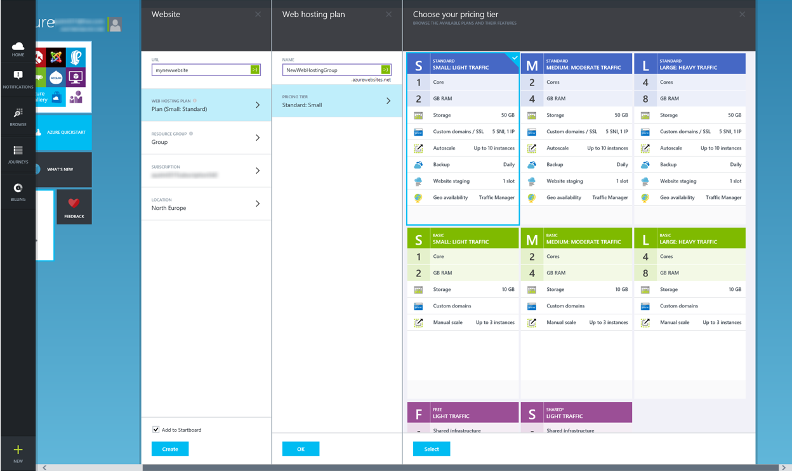
 
 
For this example we are choosing to create a new Website called **contosomarketing** and to place it in the new web hosting plan called **contoso**. The Pricing Tier selected for this Web Hosting Plan is **Small Standard**. For more details on Webhosting Plan Pricing Tiers as well as the features, pricing and scale options provided in each please visit the [Azure Web Sites Web Hosting Plans Spec](http://go.microsoft.com/?linkid=9845586). 
 
It should also be noted that a Web Hosting Plan can also be created in the existing Azure Portal. This is done as part of the **quick create** wizard by selecting **Create new web hosting plan** from the **WEB HOSTING PLAN** drop down:
 
 
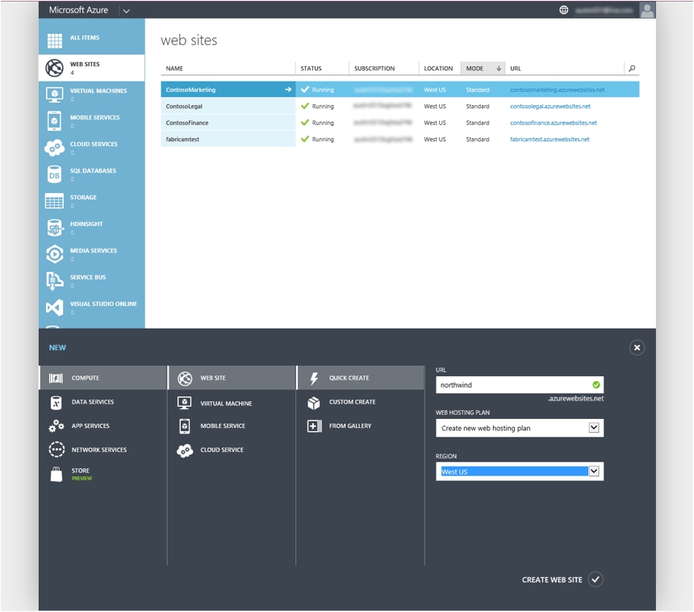
 
 
For this example we are creating a new site called **northwind** and we are choosing to create a new web hosting plan. The result of this operation will be a new web hosting plan called **default0** which contains the **northwind** website. All webhosting plans created through this experience follow this naming convention, and Web Hosting Plans cannot be renamed after having been created. Also, Web Hosting Plans created through this process will be created in the **Free** pricing tier.
 
**Question**: How do I assign a site to a **Web Hosting Plan**?
 
**Answer**: Sites are assigned to a Web Hosting Plan as part of the site creation process. To do this using the UI in the new **Azure Portal Preview**, click **NEW** and select **Website**:
 
 

 
 
Then, in the Website creation blade, select the hosting plan:
 
 
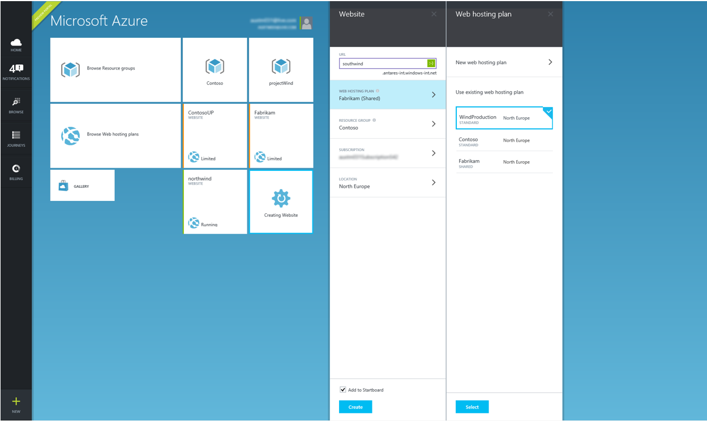
 
 
A site can also be created into a specific Web Hosting Plan using the existing Azure Portal. This is done as part of the **quick create** wizard. After typing in the website URL, use the **WEB HOSTING PLAN** drop-down to select a plan to add the site to:
 
 
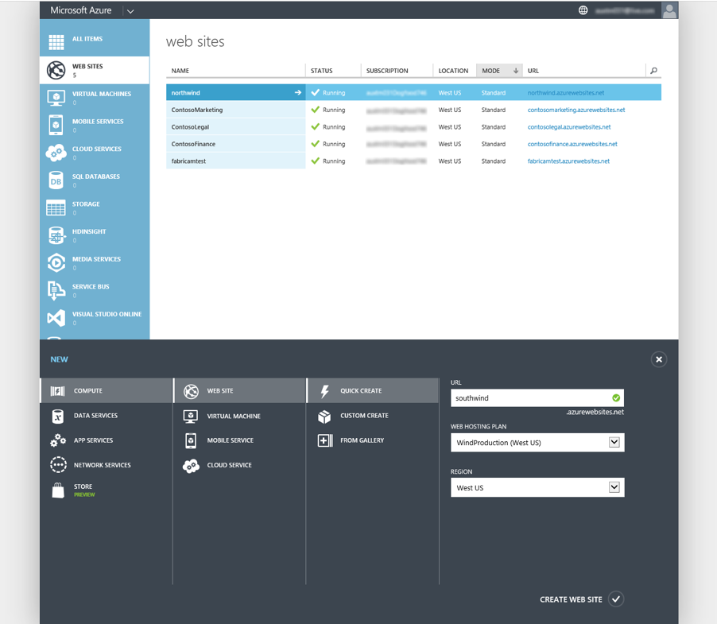
 
 
**Question**: How can I move a Site to a different Web Hosting Plan?
 
**Answer**: Moving a site to a different Web Hosting Plan is not currently supported using the Azure Portal Preview or the Full Azure Portal. However, using the [Azure PowerShell tools](http://www.windowsazure.com/en-us/documentation/articles/install-configure-powershell/), you can move sites between different web hosting plans. To do this, install the Azure PowerShell tools, open a power shell prompt. Then, switch to the new **Azure Resource Manager** mode using the *Switch-AzureMode AzureResourceManager* Cmdlet and authenticate using the *Add-AzureAccount* Cmdlet.
 
For this example assume a Resource Group named **powershell** with 2 Web Hosting Plans (**whp1** & **whp2**) and 2 Websites (**pstest** & **pstest2**) have already been created. To get the content of a Resource group you can use the *Get-AzureResourceGroup* Cmdlet:
 
 
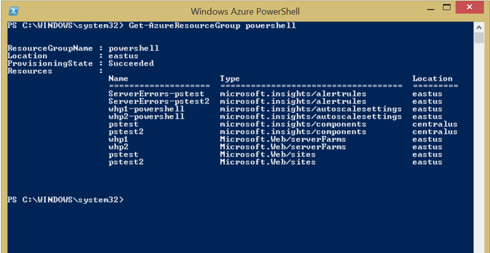
 
 
To get the detailed configuration for each of these items you can use the *Get-AzureResource* Cmdlet. In the two screenshots below, the command is being used to show the details for the **pstest** and **pstest2** websites:
 
 
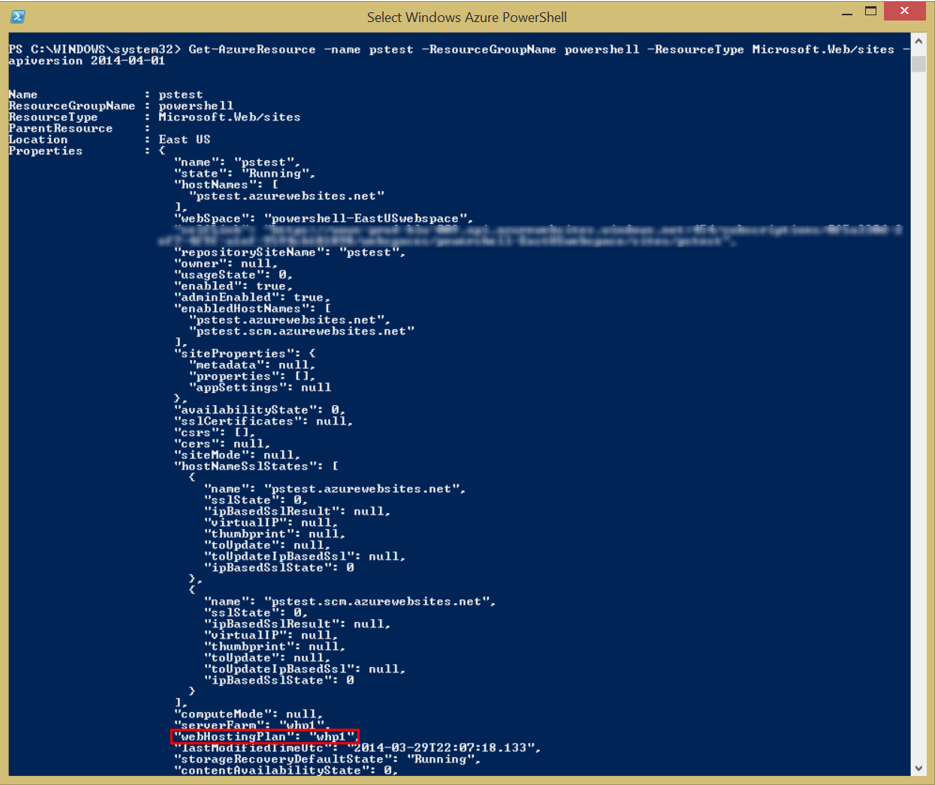
 
 
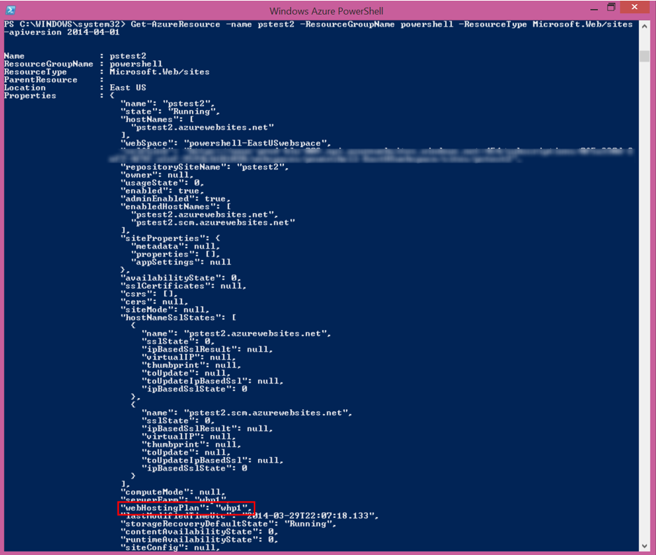
 
 
As you can see from the output of the Cmdlet, both of the sites are currently associated with the **whp1** web hosting plan. You will also notice the **ServerFarm** property also points to **whp1**, and that is because **ServerFarm** is a legacy concept being replaced by the Web Hosting Plan concept.
 
Next, we are going to move the **pstest2** website to the **whp2** web hosting plan using the *Set-AzureResource* Cmdlet. The *Set-AzureResource* Cmdlet takes a Hash Table as the input for the **PropertyObject** parameter. This way any resource configuration can be changed by defining it in a hash table and passing the object to this Cmdlet.
 
For this example we will define a variable named **$whp** containing a hash table comprised of the **name** and **value** pair for the Web Hosting Plan property and the value we want to set it to be:
 
 
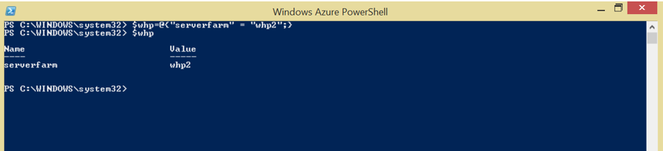
 
 
Next, we use the defined Hash Table **$whp** to set the Web Hosting Plan property of the site:
 
 
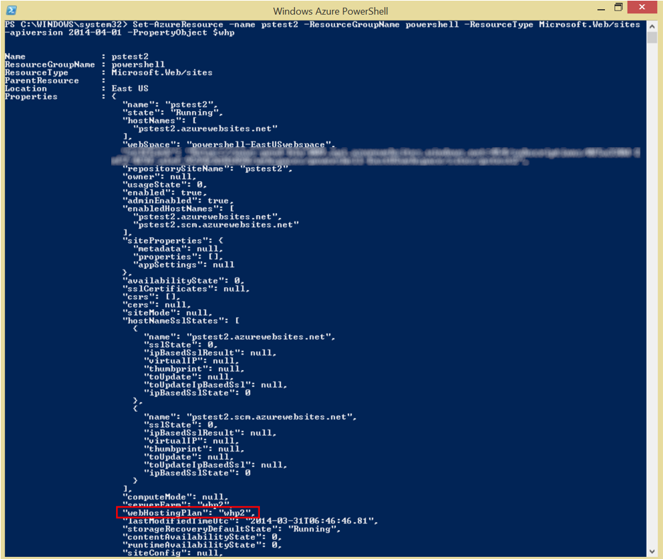
 
 
For more information on using the Powershell Cmdlets visit [this article](http://msdn.microsoft.com/library/azure/jj156055.aspx).
 
Note that each web hosting plan has its own pricing tier. When you move a site from a **Free** tier web hosting plan to a **Standard** web hosting plan, your web site will be able to leverage all the features and resources of the Standard tier. 
 

 
**Question**: How can I Scale a Web Hosting Plan?
 
**Answer**: There are two ways to scale a Web Hosting Plan. One way is to scale up your web hosting plan and all sites associated with that web hosting plan. By changing the pricing tier of a web hosting plan, all sites in that web hosting plan will be subject to the features and resources defined by that pricing tier. 
 
In the image below you can see the **Web Hosting Plan** blade as well as the **Pricing Tier** blade. Clicking on the **Pricing Tier** part in the **Web Hosting Plan** blade expands the **Pricing Tier** blade where you can change the pricing tier for the web hosting plan:
 
 
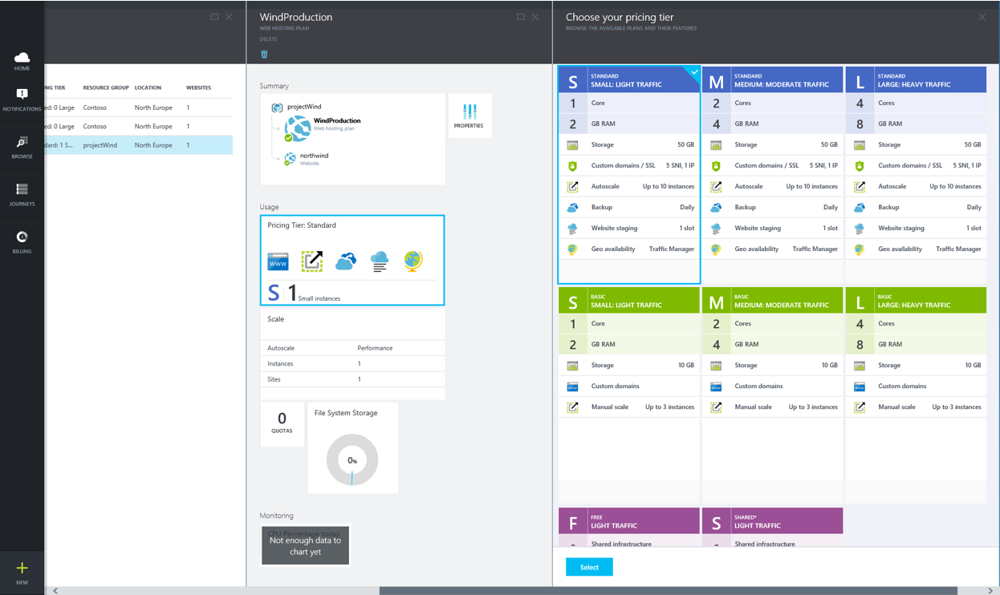
 
 
The second way to scale a plan is to scale it out by increasing the number of instances in your Web Hosting Plan. In the image below you can see the **Web Hosting Plan** blade as well as the **Scale** blade. Clicking on the Scale area in the **Web Hosting Plan** blade expands it and allows changing the instance count of the plan:
 
 
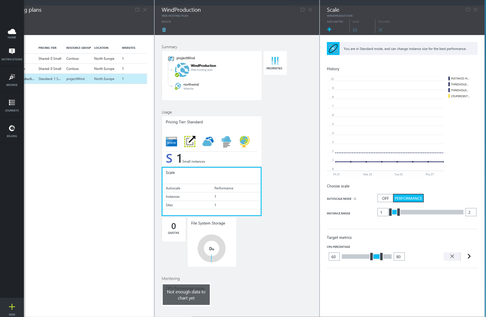
 
 
Since the Web Hosting Plan in the above image is configured to use the **Standard** pricing tier, the **AutoScale** option is enabled. 
 
Performing this in the Full Azure Portal can be done in the **Scale** tab, as seen below:
 
 
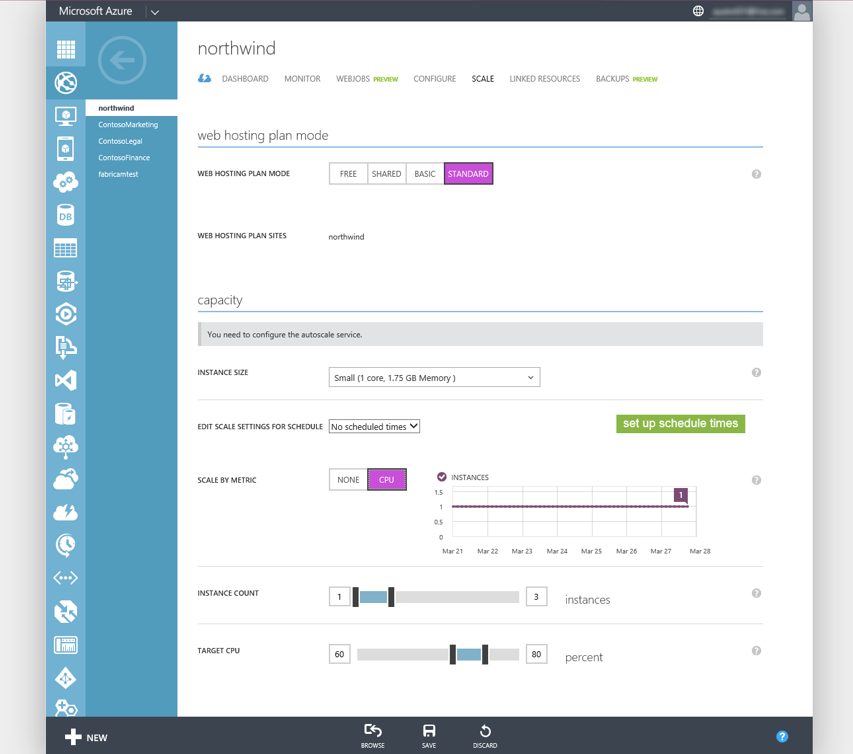
 
 
**Question**: How Can I Delete a Web Hosting Plan?
 
**Answer**: To delete a Web Hosting Plan you must first delete all websites associated with it. Once all the Websites in a Web Hosting Plan have been deleted a Web Hosting Plan can be deleted from the Web Hosting Plan blade:
 
 
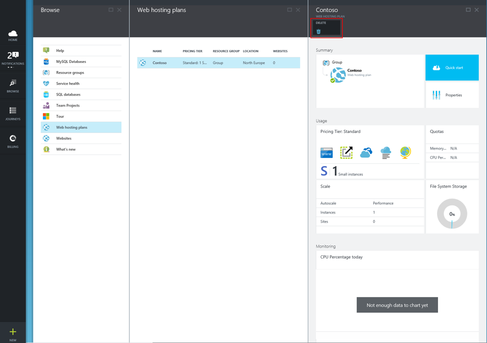
 
 
In the Full Azure Portal deleting the last website in a web hosting plan will automatically delete the associated web hosting plan.
 
**Question**: How Can I monitor a web hosting plan?
 
**Answer**: Web Hosting Plans can be monitored using the Monitoring parts in the Web Hosting Plan Blade:
 
 
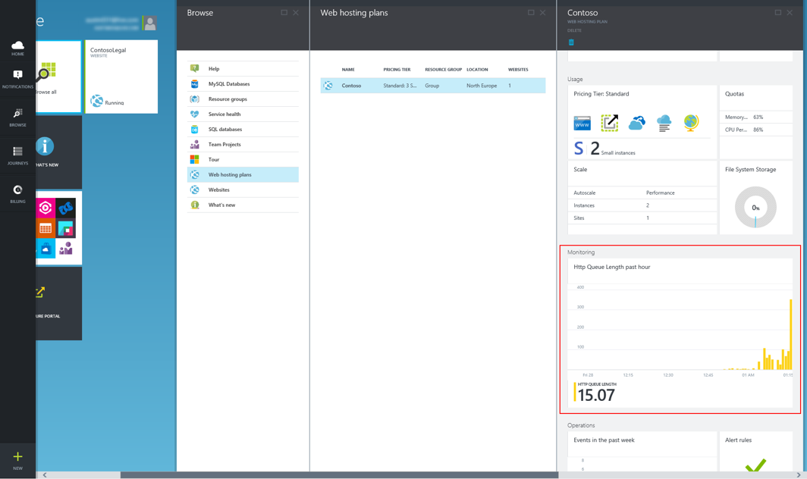
 
 
The monitoring controls can be customized by right clicking on the control and selecting **edit query**:
 
 
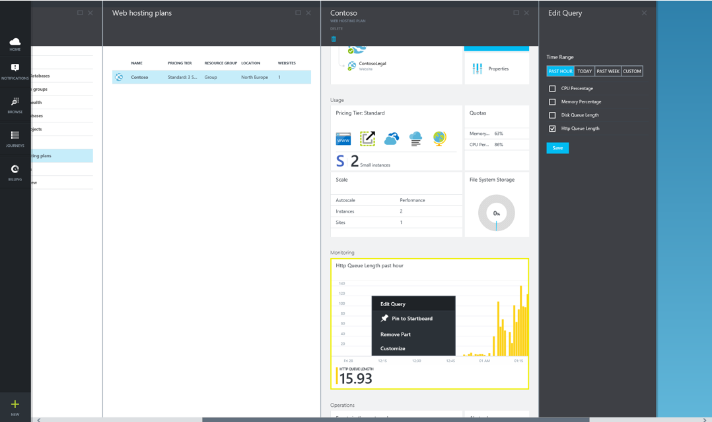
 
 
The metrics exposed are:
 
* CPU Percentage
 
* Memory Percentage
 
* Disk Queue Length 
 
* HTTP Queue Length. 
 
This metrics represent the average usage across instances belonging to a Web Hosting Plan. All of these metrics can be used to set up alerts as well as Auto Scale rules.
 
##Take away and Conclusions##
 
Web hosting plans represent a set of features and capacity that you can share across your web sites.  A Web hosting Plan give you the flexibility to allocate specific sites to a given resource set- Virtual Machines, and further optimize you Azure resource allocation and usage for Web Sites. 
