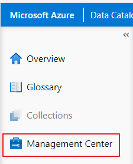
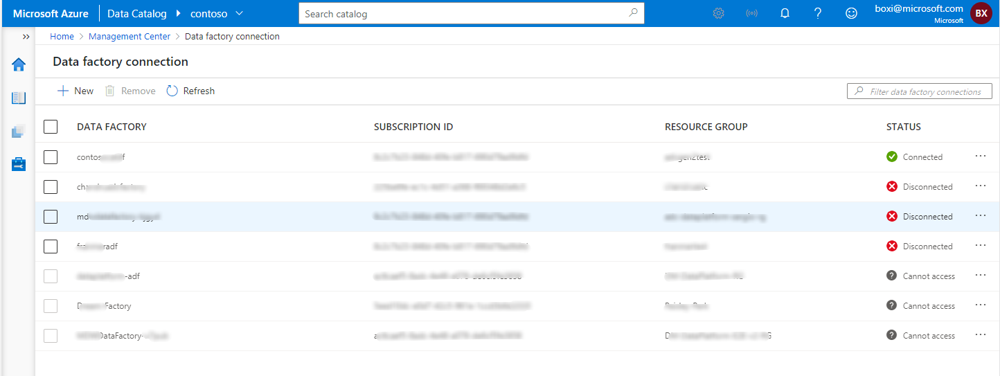

# Catalog Client Overview

## Home Page

:::image type="content" source="./media/catalog-client-overview/image8.png" alt-text="Screenshot":::

:::image type="content" source="./media/catalog-client-overview/image9.png" alt-text="Screenshot":::

:::image type="content" source="./media/catalog-client-overview/image10.png" alt-text="Screenshot":::

The main areas of the home page are:

1. Search

2. Catalog analytics: Shows the number of active users, data sources, data assets, and glossary terms

3. Browse: Currently only Browse by asset type is enabled. Other browse capabilities will be exposed here in future iterations.

4. Recently Accessed -- The list of recently accessed data assets.

5. My items -- The list of owned data assets for the logged-on user.

6. Glossary terms - A searchable dictionary of common terms that an organization uses to describe key business terms and their definitions

7. FAQ/Documentation links.

8. Asset count by data source.

9. Top Classifications

10. Pinned Assets

### Pin and unpin data assets

1. Click **Pin** to pin the current data asset to homepage.

   :::image type="content" source="./media/catalog-client-overview/image11.png" alt-text="Screenshot":::

2. Find all the pinned data assets on homepage.

   :::image type="content" source="./media/catalog-client-overview/image12.png" alt-text="Screenshot":::

3. Click **Unpin** to unpin the current data asset.

   :::image type="content" source="./media/catalog-client-overview/image13.png" alt-text="Screenshot":::

## Search

**Click anywhere in the search textbox** to open the search experience.

:::image type="content" source="./media/catalog-client-overview/image14.png" alt-text="Screenshot":::

By default, you will see a list of your most recently searched files.

:::image type="content" source="./media/catalog-client-overview/image15.png" alt-text="Screenshot":::

### Search Box

You can enter one or more search terms in the search box. As you type, you will see auto-complete results and search suggestions with the matched keywords showing up as highlighted inline.

Clicking on any of the values in the autocomplete list will take you to the search results that match.

:::image type="content" source="./media/catalog-client-overview/image16.png" alt-text="Screenshot":::

The **Suggestions** list shows you results from the **Name** field of the Asset. Clicking on any of these results will take you to the **Asset Details** view for that particular asset.

If you click on the **Search** icon

:::image type="content" source="./media/catalog-client-overview/image17.png" alt-text="Screenshot"::: in the upper right or press **Enter,** the system will execute the search request and take you to the **Search Results** page.

:::image type="content" source="./media/catalog-client-overview/image18.png" alt-text="Screenshot":::

> [!NOTE]
> The results list for suggestions and user searches can differ slightly. This is because the results in the suggestions list are based on fuzzy matching, while user-initiated search results are based on exact matches.

### Search Criteria

Project Babylon currently supports the following style search criteria:

  Search Term                                         Finds
  --------------------------------------------------- -----------------------------------------------------------------------------------------------------------------------------------------
  hive                                                documents that contain **hive**
  \"hive database\"                                   documents that contain exactly \"**hive database**\", of the specified order **\*The number of spaces do not matter, case insensitive**
  hive database, hive OR database, hive && database   documents that contain hive or database **Always specify Boolean operators (AND, OR, NOT) in all caps.**
  hive AND database,hive && database                  documents that contain hive and database **Always specify Boolean operators (AND, OR, NOT) in all caps.**
  hive AND (database OR warehouse)                    combination
  hive NOT database                                   Assetsthat contain "hive" but do not contain "database"
  hiv\*                                               wild card, matches hiv, hive, hivbar, etc.

### Quick Filters

Quick filters are used to narrow down the search results returned by the search APIs instantaneously before returning the matching assets to the search result page.

### Search Quick Filter: Search by Asset type:

From the Quick Filters pane, you can either select to filter by Asset type. The total number of assets of that type are displayed next to each entry.  
 :::image type="content" source="./media/catalog-client-overview/image19.png" alt-text="Screenshot":::

You can select one of the filters in the list and a list of matching assets will be displayed in **Suggestions** pane.

You can also perform a search in this field by typing the partial name of an Asset type, such as "sql", to see all types that contain that word.

 :::image type="content" source="./media/catalog-client-overview/image20.png" alt-text="Screenshot":::

### Search Quick Filter: Search by Classification:

You can also choose to filter by Classification name in the same manner.
Like in the above example, you can also type a search phrase, for example, "Bank" will filter the list to all classifications containing the name Bank.

 :::image type="content" source="./media/catalog-client-overview/image21.png" alt-text="Screenshot":::

> \[!NOTE\] This list shows all matches for the Asset type, no matter
> the file type. These suggestions are fuzzy matches. Clicking on any
> asset in the **Suggestions** pane will take you to the **Asset
> Details** view where you can see more details.

### Search Quick Filter: Search by Person

On the home page, click on **Search catalog**. Specify the name of a
**Person**, e.g. the name of an Owner or Expert. Possible suggestions of destined assets, if any, will be displayed in the dropdown. Click on a suggested asset to go to its Asset Details page, or click on **All results \>** or **Search** to perform a search for assets that contains the specified person's name.

:::image type="content" source="./media/catalog-client-overview/image22.png" alt-text="Screenshot":::

### Search Results Page

Once entering the search key, the results are returned in the search result page with further filters available in the left navigation bar.

### More results

1. Enter search keywords.

2. When there isn't any auto completion or suggestion, click **See more results** to search.

   :::image type="content" source="./media/catalog-client-overview/image23.png" alt-text="Screenshot":::

### Search Results View

- Displays the total number of matches at the top of the page.

- Matched keywords are highlighted.

- Clicking any item in the list will take you to the **Asset Details** view for that item.

  :::image type="content" source="./media/catalog-client-overview/image24.png" alt-text="Screenshot":::

- Pagination is at the bottom of the results page to see more results

  :::image type="content" source="./media/catalog-client-overview/image25.png" alt-text="Screenshot":::

### Sort Search Results

You can sort your search results by either relevance or by name

:::image type="content" source="./media/catalog-client-overview/image26.png" alt-text="Screenshot":::

### Filtering Search Results

You can further filter your search results by clicking on the **left nav filters** from the search results page. You can choose and select
**Asset type**, **Classification.**

:::image type="content" source="./media/catalog-client-overview/image27.png" alt-text="Screenshot":::

Multi select option is also available.

### Filter search results by Asset Type for Dynamic filters

Selecting an asset type filter from left nav enables additional filters called dynamic filters that correspond to an asset type. For example, choosing Azure SQL Database enables the dynamic filter for the Server, Database and Schema. These options enable the user to narrow down the search results.

 :::image type="content" source="./media/catalog-client-overview/image28.png" alt-text="Screenshot":::

### Filter search results by Classification

 :::image type="content" source="./media/catalog-client-overview/image29.png" alt-text="Screenshot":::

### Edit/Delete a search results filter

Simply uncheck the checkbox next to the filter name to remove a filter.

### Recent Pane

The Recent pane will display your most recently accessed assets if any.

You can also click the **See all \>** link which will take you to the **Recent** **View** page which shows you the full list of recently accessed files:

 :::image type="content" source="./media/catalog-client-overview/image30.png" alt-text="Screenshot":::

### Recent View

 :::image type="content" source="./media/catalog-client-overview/image31.png" alt-text="Screenshot":::
To narrow down the list, you can enter a name in **Filter by name**
textbox.

 :::image type="content" source="./media/catalog-client-overview/image32.png" alt-text="Screenshot":::

You can also remove the items in the list individually by selecting an item (or items) and clicking the **Remove** button.

 :::image type="content" source="./media/catalog-client-overview/image33.png" alt-text="Screenshot":::

Alternatively, you can also clear the entire list at once by clicking on the **Clear** button

 :::image type="content" source="./media/catalog-client-overview/image34.png" alt-text="Screenshot":::

## Browsing by asset type

The Browse page allows you to browse to a certain type of asset.

- Click **Asset type** icon which will open the **Browse asset types** view where you can see the list of existing asset types.

  :::image type="content" source="./media/catalog-client-overview/image35.png" alt-text="Screenshot":::

- Click the **Asset type** icon to browse for assets of the selected type.

- The Browse asset type page is designed to show all asset types that are present in the catalog, along with the total asset count below the asset type name.

  :::image type="content" source="./media/catalog-client-overview/image36.png" alt-text="Screenshot":::

You can click on any asset on this page to be taken to the **Asset Details** view.

:::image type="content" source="./media/catalog-client-overview/image37.png" alt-text="Screenshot":::

### Asset Details

The Asset Details page is a summarized view of the metadata for a particular asset.

:::image type="content" source="./media/catalog-client-overview/image38.png" alt-text="Screenshot":::

1. Name: (for example, Customer) - This is the name of the asset.

2. Type: (for example, Azure SQL Table) - This is the assets type.

3. Edit, Refresh, Pin/Unpin - use these action buttons to edit data on an asset details page, to refresh the page to see any updated data or to pin or unpin the asset from the home page.

4. Overview Tab - this is the default tab for the asset details page. It contains the overview information about the asset.

5. Description - can be manually added by end users or applied using the API.

6. Classifications - classifications can be added to and removed from the asset by clicking on the Edit button.

7. Properties - This section contains the technical metadata for the asset as reported by the scanner. The properties that you see in this area will vary by data source. One property that is always shown is the **qualifiedName** , which is the fully qualified name (uri) for the asset in the data source.

8. Last Updated - the date/time and user that last updated the asset in the catalog.

9. Hierarchy - the hierarchy viewer shows the hierarchical relationship of the asset in the data source. For example, for a SQL Table, it will show a parent relationship to a schema, then the schemas parent database, and finally the database's parent SQL Server. Clicking anyone of these hyperlinks will take you to the asset details for that particular asset.

10. Glossary terms - this section shows any glossary terms that have been associated with this asset, along with the total number of terms on the asset. Each of the terms are hyperlinks, and if clicked will take you to the glossary term details page where you can see further information about the term.

### Schema Tab

This tab displays schema information of a structured file or table typed asset. This tab is only present on these types of assets where the schema is relevant or could be determined by the system.

 :::image type="content" source="./media/catalog-client-overview/image39.png" alt-text="Screenshot":::

- The column names are sorted by ascending order on names.

- You can click on any individual item in the **Column Name** column to jump to the asset details view for that column asset.

 :::image type="content" source="./media/catalog-client-overview/image40.png" alt-text="Screenshot":::

### Lineage Tab

The tab will display lineage for the asset, if available. Currently the catalog only supports lineage results for Azure Data Factory **Copy**
activities and Azure Data Factory **Data Flow** activities.

 :::image type="content" source="./media/catalog-client-overview/image41.png" alt-text="Screenshot":::

- Use Zoom +/- buttons, zoom slider

  :::image type="content" source="./media/catalog-client-overview/image42.png" alt-text="Screenshot":::, or the mouse wheel to change the zoom level.

- Clicking the **Auto Align** button

  :::image type="content" source="./media/catalog-client-overview/image43.png" alt-text="Screenshot"::: will rest the graph back to default if you have moved nodes around.

- Clicking the **Zoom to Fit** button

  :::image type="content" source="./media/catalog-client-overview/image44.png" alt-text="Screenshot"::: will enlarge or reduce the graph so that it fits within the canvas.

- Clicking the **Full Screen** button  expands the graph to the entire screen. Use Esc to return to escape full screen and go back to the default view.

  :::image type="content" source="./media/catalog-client-overview/image45.png" alt-text="Screenshot":::

- Clicking the **Zoom Preview** button will display a mini view of the graph, which allows you to pan around in the graph. This can be helpful if you are viewing a graph that extends past the viewable screen area.

  :::image type="content" source="./media/catalog-client-overview/image46.png" alt-text="Screenshot":::

- The entire graph canvas can be panned by dragging on it with the mouse.

- Hover on a node to view more details:

  :::image type="content" source="./media/catalog-client-overview/image47.png" alt-text="Screenshot":::

- On Hover:

  :::image type="content" source="./media/catalog-client-overview/image48.png" alt-text="Screenshot":::

  To pivot the graph to view the lineage of another asset, click on the node you would like to pivot on and select on the "Switch to asset" link that appears at the bottom:

  :::image type="content" source="./media/catalog-client-overview/image49.png" alt-text="Screenshot":::

  The catalog will then load the lineage graph for that asset:

  :::image type="content" source="./media/catalog-client-overview/image50.png" alt-text="Screenshot":::

### Dependency Graph

Clicking on any node will cause the graph to highlight all related assets and processes to make it easy to trace dependencies.

:::image type="content" source="./media/catalog-client-overview/image51.png" alt-text="Screenshot":::

If needed, you can rearrange any nodes in the graph by dragging them to another spot in the canvas. This can make it easier to see nodes that may be covered up.

You can also view columns and column level lineage for non-binary assets (For example: SQL table)

By clicking on "Expand to view the columns"

:::image type="content" source="./media/catalog-client-overview/image52.png" alt-text="Screenshot":::

The column pane will open which allows you to choose one or more columns.

:::image type="content" source="./media/catalog-client-overview/image53.png" alt-text="Screenshot":::

Select the columns to see column level lineage.

 :::image type="content" source="./media/catalog-client-overview/image54.png" alt-text="Screenshot":::

Hover over the selected columns to highlight them in lineage graph
 :::image type="content" source="./media/catalog-client-overview/image55.png" alt-text="Screenshot":::

### Filtering the lineage view

You can filter by either column or data asset by using the search box to search by name

:::image type="content" source="./media/catalog-client-overview/image56.png" alt-text="Screenshot":::

For more detailed information about how lineage works, refer to the [Catalog lineage user guide](catalog-lineage-user-guide.md).

### Related Tab

The tab displays all the assets that are related to the asset that you have in view. In this example, you can see that this SQL Table is related to a schema ,fifteen columns and four ADF copy processes.

Click on columns to see all fifteen columns.

 :::image type="content" source="./media/catalog-client-overview/image57.png" alt-text="Screenshot":::

Click on inputToProcesses to see the ADF copy processes.

 :::image type="content" source="./media/catalog-client-overview/image58.png" alt-text="Screenshot":::

- Drag the graph to pan.

- Use the mouse wheel to change the zoom level.

- Click a node to display the related assets on the floating panel.

- Click an asset link on the floating panel or double-click a node to navigate to the asset.

- Click :::image type="icon" source="./media/catalog-client-overview/image59.png" alt-text="Screenshot"::: button to close the floating panel.  :::image type="icon" source="./media/catalog-client-overview/image60.png" alt-text="Screenshot":::node indicates a collection of multiple assets.

### Contacts Tab

This tab displays the "Owners" and "Experts" associated with an asset.
Multiple Experts and Owners can be added in this tab.

 :::image type="content" source="./media/catalog-client-overview/image61.png" alt-text="Screenshot":::

### Edit Asset

1. On the Asset Details page, edit the asset as follows:

   a. Click on **Edit** to go to the Edit Asset experience.

      :::image type="content" source="./media/catalog-client-overview/image62.png" alt-text="Screenshot":::

2. On the Overview tab of the Edit Asset experience, **Description**, **Classifications**, and the associated **Glossary Terms** of the asset can be updated. Click on **Save** to save the update changes or **Cancel** to quit. Multiple Classifications and Glossary Terms can be associated to an asset.

   :::image type="content" source="./media/catalog-client-overview/image63.png" alt-text="Screenshot":::

3. On the schema tab of the Edit Asset experience, the associated **Column-level Classification**, the **Column Description, Column Data Type, and Column name of the** asset can now be updated. Make your desired updates and click on **Save** to save the update changes or **Cancel** to quit. Note: when you change the **Column Name**, the system changes only the friendly name that appears in the catalog for that column. It does not change the name of the column in the underlying data asset. Also note that any future scans will not overwrite a user provided column name. Note that the Sample Value, Null Count and Distinct Values columns are placeholders and inactive at the current time. These will be lit up in future iterations.

   :::image type="content" source="./media/catalog-client-overview/image64.png" alt-text="Screenshot":::

4. On the Contacts tab of the Edit Asset experience, the associated **Experts** and **Owners** can be updated. Make your desired updates and click on **Save** to save the update changes or **Cancel** to quit.

   :::image type="content" source="./media/catalog-client-overview/image65.png" alt-text="Screenshot":::

## Glossary

The glossary feature allows you to create and manage your terms.

Supported features:

- Create Terms one at a time

- Create terms in bulk (using a .csv file)

- Delete Terms in bulk

- Edit Terms one at a time

- Editing the **Term Name** is currently **disabled**.

- Add a Definition

- Add Synonyms & Acronyms

### Term List

1. On the home page, click on Management Center and then click on Glossary in table of contents.

   :::image type="content" source="./media/catalog-client-overview/image66.png" alt-text="Screenshot":::

- On the Term List page, **New**, **Edit**, **Import Terms** and
    **Delete** terms can be performed. Click on **Refresh** to refresh the list of terms.

   :::image type="content" source="./media/catalog-client-overview/image67.png" alt-text="Screenshot":::

### New term

1. On the Term List page, click on **+ New term**.

   :::image type="content" source="./media/catalog-client-overview/image68.png" alt-text="Screenshot":::

2. Give your new term a name, which must be unique in the catalog. The term name is case sensitive, meaning you could have a term called **Sample** and **sample** in the catalog.

   - You can additionally add the following additional properties:

3. Add a **Definition**.

4. Set the **Status** for the term - New terms will default to Draft Status.

   :::image type="content" source="./media/catalog-client-overview/image69.png" alt-text="Screenshot":::

   - These status markers are metadata associated with the term.

     There are currently not wired up into any workflow, they are provided to help you manage your glossary. Eventually these will be used with a workflow engine to help you manage the state of your glossary. Currently you can set the following status on each term:

     - **Approved**: This term is official/standard/approved
     - **Alert**: This term needs attention
     - **Expired**: This term should no longer be used
     - **Draft**: This term is not yet officially implemented

5. You can also add **Synonyms**,**Related terms**, and provide an **Acronym** if desired.

6. You can optionally click on the **Contacts** tab and add Experts and Stewards to your term.

   :::image type="content" source="./media/catalog-client-overview/image70.png" alt-text="Screenshot":::

7. Click **Create** to create your term.

### Viewing a term details page

1. On the Term List page, click on a term's name to view the term details page.

   :::image type="content" source="./media/catalog-client-overview/image71.png" alt-text="Screenshot":::

2. On the Term Details page, click on **Edit** to edit the term details, **Delete** to delete the term, or click on any of the terms listed under **Synonyms** or **Related terms** to view those terms.

   :::image type="content" source="./media/catalog-client-overview/image72.png" alt-text="Screenshot":::

### Importing Terms into the Glossary

Data Catalog provides a template .csv file for you to import your terms into your ADC Glossary.

- You can import terms any time you need, be aware that duplicate terms will be overwritten.

- Term names are case sensitive. **Example**: \"Sample\" and \"saMple\" could both exist in the glossary

1. When you are in the Glossary, click on "Import terms"

   :::image type="content" source="./media/catalog-client-overview/image73.png" alt-text="Screenshot":::

2. Download the csv template and use it to enter your terms you would like to add.

> [!IMPORTANT\]
> The system only supports importing columns that are available in the template. You can also review the file for issues after upload.
> :::image type="content" source="./media/catalog-client-overview/image74.png" alt-text="Screenshot":::

- Once you've finished filling our your .csv file, select your file to import and then click the **OK** button.
- The system will upload the file and add all the terms to your catalog.

### Edit term

1. On the Terms List page, select a term by clicking on its **checkbox** or **...**, and then click on **Edit** to edit the term.

   :::image type="content" source="./media/catalog-client-overview/image75.png" alt-text="Screenshot":::

2. On the Overview tab of the Edit term experience, you can update **Definition**. **Status**, **Synonyms**, **Related terms** and **Acronyms. Once updates are complete, click Save to confirm the changes or Cancel to discard them.**

   :::image type="content" source="./media/catalog-client-overview/image76.png" alt-text="Screenshot":::

### Delete term

On the Terms List page, you can delete one or more terms in a few different ways:

1. Click on one or more **checkboxes** or the **select-all checkbox** at the top to select one or more terms, and then click on **Delete** at the top to delete the terms.

2. Click on **...** to select a term, and then click on **Delete** on the menu to delete the term.

   :::image type="content" source="./media/catalog-client-overview/image77.png" alt-text="Screenshot":::

3. On the Term Details page, click on **Delete** to delete the term.

   :::image type="content" source="./media/catalog-client-overview/image78.png" alt-text="Screenshot":::

## Access permissions

Azure Data Catalog access permissions provides a basic access permissions infrastructure. For reasons that will eventually be resolved that infrastructure is split into two sections. One section handles creating/deleting catalogs and scanning. The other section handles access to all other API endpoints.

### Azure Portal Managed Permissions

To create a catalog in the first place one must have resource creation permissions in the resource group that the catalog is to be created in. This is managed via the Access control (IAM) section of the resource group the catalog is to be created in. One needs to be in the contributor or owner roles to create a new catalog instance.

Once a catalog has been created it can be deleted by anyone who is in the owner or contributor role on the catalog itself.

For general information on how to add someone to a contributor or owner role on a resource group please see [Role Based Access Control Assignment Portal](../role-based-access-control/role-assignments-portal.md).

One additional capability handled in the Azure Portal is that in order to be able to scan content a user must be in the contributor or owner role on the catalog itself. Note that those who would create/update/delete scans need to actually be in two roles. The owner or contributor role in the Azure Portal and the Catalog Admin or Data Source Admin roles in the Azure Data Catalog Portal. For details on how to get someone into both roles please see section 8.3.

## Annotation Management

> [!NOTE]
> This section was written based on ADC Gen 2 and is not yet updated. However, the general steps are similar. You might find wordings and screenshots are different in your Babylon account. If you're blocked at any point, send an email to BabylonDiscussion\@microsoft.com.

The catalog provides a set of annotations that can be used to curate assets to make them more discoverable and so that they can be used for policy and other scenarios.

### Classifications

One type of annotation in the catalog is a Classifications.

A classification is a piece of metadata which is intended on classifying what type of data exists in the file. For example, an email address, a phone number, etc.

Out of the box, the system provides a default list of classifications.
You can view this full list of classifications in the Classification quick filter from the search box on the home page.

 :::image type="content" source="./media/catalog-client-overview/image91.png" alt-text="Screenshot":::

Any of these classifications can be manually applied to assets at the file level or at the column level.

 :::image type="content" source="./media/catalog-client-overview/image92.png" alt-text="Screenshot":::

They can also be automatically applied by the catalog scanner, which uses classification rules in order to detect when data is seen that matches a pattern.

You will likely want to define your own classifications to be used in your catalog.

To manage your classifications, head to the Management Center

 :::image type="content" source="./media/catalog-client-overview/image93.png" alt-text="Screenshot"::: in the left bar in the catalog UX.

Click on
 :::image type="content" source="./media/catalog-client-overview/image94.png" alt-text="Screenshot"::: to get to the classification management screen

There are two tabs, Custom and System.

Starting with the System tab, you will see the full list of system classifications.

 :::image type="content" source="./media/catalog-client-overview/image95.png" alt-text="Screenshot":::

 :::image type="content" source="./media/catalog-client-overview/image96.png" alt-text="Screenshot":::

These classifications are read-only and cannot be edited or deleted from your catalog.

If you click the Custom tab, you will see your custom classifications
(if there are any)

### Create a custom classification

Click on New:

 :::image type="content" source="./media/catalog-client-overview/image97.png" alt-text="Screenshot":::

The Add new classification screen appears. Provide a unique name for your classification:

 :::image type="content" source="./media/catalog-client-overview/image98.png" alt-text="Screenshot":::

We suggest that you use your company name as a top level namespace to organize your classifications and to maintain uniqueness. For example, `CONTOSO.CUSTOMERID`.

The name must start with a letter followed by a sequence of letters, numbers, period (.) or underscore (\_) characters. It can be upper or lowercase and must be unique in your catalog.

Notice that the Friendly name is auto created by the system as you type.
This friendly name is what is shown on the actual classification tag in the UX in order to improve readability

 :::image type="content" source="./media/catalog-client-overview/image99.png" alt-text="Screenshot":::

The rule being used is that the name will be trimmed to the last two segments of the namespace, the casing gets changed to first letter is capitalized, and the rest lower cased. All underscores are replaced by spaces.

For example, if you created a classification name of `CONTOSO.FINANCE.ACCOUNT_ID`, the system would generate a friendly name of Finance.Account ID, which is what would show to users in the catalog.

 :::image type="content" source="./media/catalog-client-overview/image100.png" alt-text="Screenshot":::

### Filter a classification list

You can use the Filter by name field to quickly get to a custom classification, which helps if you have a long list.

 :::image type="content" source="./media/catalog-client-overview/image101.png" alt-text="Screenshot":::

### Delete a classification

To delete a classification, select the checkbox next to the classification and click the delete button

 :::image type="content" source="./media/catalog-client-overview/image102.png" alt-text="Screenshot":::

This system will prompt you to confirm the deletion

 :::image type="content" source="./media/catalog-client-overview/image103.png" alt-text="Screenshot":::

Click Delete and the classification should be removed from the list.

> \[!TIP\] You cannot delete custom classifications that have been
> associated to an asset(s). You will get an error

 :::image type="content" source="./media/catalog-client-overview/image104.png" alt-text="Error":::. You must first remove the
> classification from the asset.

## Connection to Azure Data Factory (ADF)

> [!NOTE]
> This section was written based on ADC Gen 2 and is not yet updated. However, the general steps are similar. You might find wordings and screenshots are different in your Babylon account. If you're blocked at any point, send an email to BabylonDiscussion\@microsoft.com.

This section explains how to connect ADF to import data lineage generated by ADF copy and dataflow activities into ADC catalog. For ADF to successfully communicate lineage information to a catalog instance the ADF must authenticate itself to ADC using an identity that ADC recognizes.

### View existing connections

At a given time, more than one ADF can connect to a catalog and push lineage information. Follow below steps to see the list of ADF that are connected to the catalog.

1. Click **Management center**

   

2. Click **Data factory connection**

   

3. Data factory connection list

   

Status explanation

- **Connected**: the data factory is successfully connected to current data catalog.

- **Disconnected**: the data factory still has access to the catalog, but it's connected to other catalog, which means data lineage won't be reported to current data catalog automatically.

- **Cannot** **access**: the current user does not have access to the data factory so we cannot get the connection status.

### New data factory connection

1. Click **+ New** to create a data factory connection

   :::image type="content" source="./media/catalog-client-overview/image108.png" alt-text="Screenshot":::

2. Select data factories from the list, which can be filtered by subscription name. Some options are disable because the data factory is already connected to current catalog, or the data factory doesn't have MSI (only for data factories created before ADF GA).

   > [!Note]
   > You can only select less than 50 data factories one time due to limitations. If you want to select all data factories regardless of the throttling, append this feature flag after catalog URL: `?``feature``.dataFactoryLimit``=unlimited.

   - *For example: [https://adc.azure.com/catalog/\<mycatalog\>/management/dataFactoryConnection/connectionsList?**feature.dataFactoryLimit=unlimited**](https://adc.azure.com/catalog/%3cmycatalog%3e/management/dataFactoryConnection/connectionsList?feature.dataFactoryLimit=unlimited)*

   :::image type="content" source="./media/catalog-client-overview/image109.png" alt-text="Screenshot":::

3. Click **OK**.

   :::image type="content" source="./media/catalog-client-overview/image110.png" alt-text="Screenshot":::

4. If some of the selected data factories are already connected to other catalog, it will pop up a dialog to let customers confirm the reconfiguration

   :::image type="content" source="./media/catalog-client-overview/image111.png" alt-text="Screenshot":::

      - Click **Cancel** if the data factory should not be redirected from former catalog to current catalog.  
      - Click **Continue** if the data factory can be disconnected from former catalog and connect to current catalog.

5. Customers will get notified when connections are established.

 :::image type="content" source="./media/catalog-client-overview/image112.png" alt-text="Screenshot":::

### Remove data factory connection

1. Check to select one or more existing data factory connections.

   :::image type="content" source="./media/catalog-client-overview/image113.png" alt-text="Screenshot":::

2. Click **Remove** to remove the selected data factory connections.

   :::image type="content" source="./media/catalog-client-overview/image114.png" alt-text="Screenshot":::
