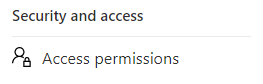

# Catalog Permissions

Permission to call almost all of the APIs in the catalog are controlled via the Babylon Portal. The one exception, setting up scans, is discussed in detail in section "Giving someone permission to scan content into the catalog".

## Babylon Portal managed permissions

Babylon uses Role Based Access Control (RBAC). The following five roles are defined:

- **Catalog administrator** -- Able to call all APIs on the catalog that are managed via the Babylon Portal. Note that this does not make the Catalog administrator an owner or contributor in the Azure Portal.

- **Data source administrator** -- Responsible for setting up scans and connecting Atlas hooks.

- **Curator** -- Responsible for editing content once it's entered into the catalog.

- **Contributor** -- Read only access to the catalog.

- **Automated data source process** -- Used when needing to provision service principals or Managed Identities into the catalog so that they can push information to the catalog. This role is currently primarily used when giving ADF access to push lineage into the catalog.

Azure Active Directory users, groups, service principals and managed identities can be added to roles.

A catalog administrator is not the same thing as an owner or contributor in the Azure Portal. It is true that whomever creates a catalog is automatically made the Catalog Admin in the catalog but that is where the connection ends. So it's possible, for example, for someone to be a Catalog Admin in the Azure Data Catalog Portal but if they are not a contributor or owner in the Azure Portal then their attempts to set up
scans won't work.

All roles are currently global. For example, if one is in the contributor role then one can read all entries in the catalog. In the future we plan on introducing "fine grained access control" where it will be possible to specify that someone is in a role only for some parts of the catalog, but not others.

### Viewing permissions

To see the Babylon Portal's permissions settings first go to the Management Center by clicking on the  icon on the left hand side navigation panel and then select the "Access permissions" menu item:

### The Access permissions screen

This screen enables one to see which users are in which roles. The screen is broken into 5 sections, one for each role type. The picture below shows the five sections in collapsed mode so that their values are not visible.

The up and down arrows (e.g. and  are provided to make it easier to navigate the screen by collapsing and expanding sections as needed.

### Adding and removing security principals (including yourself) from roles

A security principal is a user, an Azure Active Directory group, a service principal or a managed identity. All of them can be added/removed from roles.

A user can always use this screen to remove themselves from a role but the rest of the add/remove functionality is only available to those in appropriate roles. For example, a Catalog administrator can do everything described below. A Data source administrator can only add or remove security principals from the Data source administrator role.

To add a security principal to a role click on **Add user** and select the role you want to add the security principal to.

Only users in the Catalog Administrator or Data source administrator roles will be able to see the **Add user** button.

The example below show how to add a new Catalog administrator:

This will bring up the page for adding someone to a role. It is possible to add multiple people or Azure Active Directory Groups at once. All names must validate against the catalog's Azure tenant's Azure Active Directory.

To remove one or more people or groups from a role, select the check box by their names and select Remove access:

.

### Giving someone permission to scan content into the catalog

In order to scan content into the catalog one must be an Owner or Contributor on in the Azure Portal as well as a Catalog administrator or Data source administrator in the Azure Data Catalog Portal.

The previous section described in detail how to make someone a Catalog administrator or Data source administrator in the Babylon Portal. This is a necessary step to enabling someone to managing scanning. Below we explain how to make someone a contributor on the catalog in the Azure Portal, the final step to enable someone to
initiate scans. 

Please go to the Azure Portal <https://portal.azure.com> and find the Catalog Resource.

Click on **Access control (IAM)**

Then click on **Add a role assignment**

Then choose Role = Contributor and add the user who is going to be setting up scanning.

## Security roles

This detailed table shows what roles can perform which actions in the Catalog:

| Catalog Activities | Catalog Admin role | Data Source Admin role | Automated Data Source Process role | Curator role | Contributor role |
|--|--|--|--|--|--|
| Read Azure Data Catalog Portal Role Membership | Yes | Yes | No | Yes | Yes |
| Create, Update, and Delete  Azure Data Catalog Portal Role Membership | Yes | No | No | No | No |
| Remove self from Azure Data Catalog Portal roles (where directly provisioned)| Yes | Yes | Yes | Yes | Yes |
| Create, Update, and Delete identities in Automated Data Source Process Role| Yes | Yes | No | No | No |
| Access the catalog Portal, the Search API and Catalog Analytics| Yes | Yes | No | Yes | Yes |
| Read entries in the catalog | Yes | Yes | Yes | Yes | Yes |
| Create, Update and Delete entries in the catalog | Yes | Yes | Yes | Yes | No |
| Create, Update and Delete  Lineage via the REST API  | Yes | Yes | Yes | No | No |
| Read classification Definitions | Yes | Yes | Yes | Yes | Yes |
| Create, Update and Delete  Classification Definitions | Yes | Yes | Yes | Yes | No |
| Create, Read, Update and Delete Classification Instances on an entity | Yes | Yes | Yes | Yes | No |
| Create, Read, Update and Delete  Managed Scanning config | Yes | Yes | No | No | No |
| Creating Multiple Atlas Glossaries | Yes | No | No | No | No |
| Read Term & Category Definitions | Yes | Yes | Yes | Yes | Yes |
| Create, Update and Delete  Term & Category Definitions | Yes | No | No | Yes | No |
| Associate Glossary Terms with Entities | Yes | Yes | Yes | Yes | No |
| Create, Read, Update and Delete  Classification Rules | Yes | Yes | No | No | No |
| Use Business Rules API | Yes | Yes | No | No | No |
| Read Kafka Connection Strings | Yes | Yes | Yes | No | No |
| Create, Read, Update and Delete  Resource Set Policies | Yes | Yes | No | No | No |
| Read Data Factory Connection List  | Yes | Yes | Yes | Yes | Yes |
| Create, Update and Delete  Data Factory Connection List | Yes | Yes | No | No | No |

