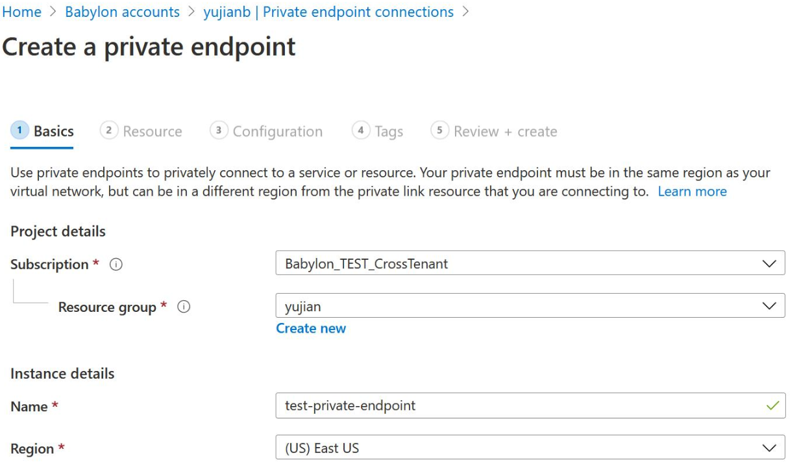

# Use private endpoints for your Babylon account

This article describes how to use private endpoints to secure network traffic with Babylon.

## Introduction

You can use private endpoints for your Babylon accounts to allow clients and users on a virtual network (VNet) to securely access the catalog over a Private Link. The private endpoint uses an IP address from the VNet address space for your Babylon account. Network traffic between the clients on the VNet and the Babylon account traverses over the VNet and a private link on the Microsoft backbone network, eliminating exposure from the public internet.

> [!NOTE]
> We currently support only access to the Babylon portal UX, scan APIs and catalog APIs via private endpoints. We don't support scanning data sources behind a private endpoint in Babylon, this is work in-progress and will be available in the next few months.

## Create Babylon account with a gateway service private endpoint

1. Navigate to the following link to create your new Babylon account (select the subscription that has been allow-listed for you)

    ```
    https://portal.azure.com/?feature.canmodifystamps=true&feature.customportal=false&Microsoft_Azure_ProjectBabylon=staging&Microsoft_Azure_ProjectBabylon_privateEndpoint=true&feature.showassettypes=Microsoft_Azure_ProjectBabylon_BabylonAccountResource&microsoft_azure_marketplace_ItemHideKey=Microsoft_Azure_ProjectBabylonHidden#blade/HubsExtension/BrowseResourceBlade/resourceType/Microsoft.ProjectBabylon%2FAccounts
    ```

2. Fill basic information, and set connectivity method to Private endpoint in **Networking** tab. Select Add to add a private endpoint.

    

3. In the Create private endpoint blade, set Babylon subresource to **account**, choose your virtual network and subnet, and select the Private DNS Zone where the DNS will be registered (you can also utilize your won DNS servers or create DNS records using host files on your virtual machines)

    

4. Select OK.

5. Select Review + create. You're taken to the Review + create page where Azure validates your configuration.

6. When you see the Validation passed message, select Create.

## Create a private endpoint for the Babylon web portal

1. Navigate to the Babylon account you created, select the Private endpoint connections under the Settings section. (You will have to use the same link as above)
    
2. Select **+Private** endpoint to create a new private endpoint.

    

3. Fill in basic information.

    

4. In Resource tab, select Resource type to be **Microsoft.ProjectBabylon/accounts**.

    

5. Select the Resource to be the newly created Babylon account and select target subresource to be portal.

6. Select the virtual network and Private DNS Zone in the Configuration tab. Navigate to the summary page, and select **Create** to create the portal private endpoint.

    

## Enabling access to Azure Active Directory

> [!NOTE]
> If your VM, VPN gateway or VNET peering gateway has public internet access, it can access Babylon portal and Babylon account enabled with Private endpoints, and you do not have to follow the rest of the instructions below. If your private network has network security group rules set to deny all public Internet traffic, you will need to add some rules to enable Azure Active Directory access. Please follow instructions below to do so.

The instructions below are for accessing Babylon securely from an Azure VM. Follow similar steps if you are using VPN or other VNET peering gateways.

1. Navigate to your VM in the Azure portal, select Networking tab under Settings section. Then Select Outbound port rules and Select Add outbound port rule.

    

2. In Add outbound port rule blade, select *Destination* to be Service Tag, Destination service tag to be **AzureActiveDirectory**, Destination port ranges to be *, Action to be allow, **Priority should be higher than the rule that denied all Internet traffic**. Create the rule.

    
 
3. Follow the same steps to create another rule to allow `AzureResourceManager` service tag. If you need to access the Azure portal, you can also add a rule for *Azure portal* service tag.

4. Connect to the VM, open the browser, navigate to the browser console (Ctrl + Shift + J) and switch to the network tab to monitor network requests. Enter `web.babylon.azure.com` in the url box and try to sign in using your Azure AD credentials. Login may fail and in the network tab on the console you can see Azure AD trying to access `aadcdn.msauth.net` but getting blocked.

    
 
5. In this case, open a Command prompt on the VM and ping this url (aadcdn.msauth.net), get its IP, and then add an outbound port rule for the IP in VM's network security rules. Set the Destination to IP Address and set Destination IP addresses to aadcdn's IP. Due to load balancer and traffic manager, Azure AD CDN's IP might be dynamic. Once you get its IP, add it to your VM's host file to force browser visit that IP to get Azure AD CDN.

    

    
 
6. Once the new rule is created, navigate back to the VM and try logging in using your Azure AD credentials again. If the login succeeds, then Babylon portal is ready to use. But in some cases, Azure AD will redirect to other domains to login based on customer's account type. For e.g. for a live.com account, Azure AD will redirect to live.com to login, then those requests would be blocked again. For Microsoft employee accounts, Azure AD will access msft.sts.microsoft.com for login information. Check the networking requests in browser networking tab to see which domain's requests are getting blocked, redo the previous step to get its IP and add outbound port rules in network security group to allow requests for that IP (if possible, add the url and IP to VM's host file to fix the DNS resolution). If you know the exact login domain's IP ranges, you can also directly add them into networking rules.

7. Now login to Azure AD should be successful. Babylon Portal will load successfully but listing all Babylon accounts won't work since it can only access a specific Babylon account. Enter *web.babylon.azure.com/resource/{babylonAccountName}* to directly visit the Babylon account that you successfully set up a private endpoint for.

## Enable private endpoint on existing Babylon accounts

There are 2 ways you can add a Babylon private endpoints after creating your Babylon account:

1. Using the Azure portal (Babylon account)
2. Using the Private link center

### Using the Azure portal (Babylon account)

1. Navigate to the Babylon account from the Azure portal, select the Private endpoint connections under the Settings section. (You will have to use the same link as below; You will not see some tabs if you don't use the feature flag)

    ```
    https://portal.azure.com/?feature.canmodifystamps=true&feature.customportal=false&Microsoft_Azure_ProjectBabylon=staging&Microsoft_Azure_ProjectBabylon_privateEndpoint=true&feature.showassettypes=Microsoft_Azure_ProjectBabylon_BabylonAccountResource&microsoft_azure_marketplace_ItemHideKey=Microsoft_Azure_ProjectBabylonHidden#blade/HubsExtension/BrowseResourceBlade/resourceType/Microsoft.ProjectBabylon%2FAccounts
    ```
    
2. Select **+Private** endpoint to create a new private endpoint

    

3. Fill in basic information

    

4. In Resource tab, select Resource type to be **Microsoft.ProjectBabylon/accounts**.

    

5. Select the Resource to be the newly created Babylon account and select target sub-resource to be account.

6. Select the virtual network and Private DNS Zone in the Configuration tab. Navigate to the summary page, and select **Create** to create the portal private endpoint.

    

> [!NOTE]
> You will need to follow the same steps as above for the target sub-resource selected as 'Portal' as well.

### Using the Private link center

1. Navigate to the Azure portal using the link below.

    ```
    https://portal.azure.com/?feature.canmodifystamps=true&feature.customportal=false&Microsoft_Azure_ProjectBabylon=staging&Microsoft_Azure_ProjectBabylon_privateEndpoint=true&feature.showassettypes=Microsoft_Azure_ProjectBabylon_BabylonAccountResource&microsoft_azure_marketplace_ItemHideKey=Microsoft_Azure_ProjectBabylonHidden#blade/HubsExtension/BrowseResourceBlade/resourceType/Microsoft.ProjectBabylon%2FAccounts
    ```

2. In the search bar at the top of the page, search for 'private link' and navigate to the private link blade by selecting the first option.

3. Select on **+ Add** and fill in the basic details:

    

    

4. Select the Resource to be the already created Babylon account and select target sub-resource to be account.

5. Select the virtual network and Private DNS Zone in the Configuration tab. Navigate to the summary page, and select **Create** to create the account private endpoint.

    

> [!NOTE]
> You will need to follow the same steps as above for the target sub-resource selected as 'Portal' as well.

## Next steps

- [Tutorial: Scan Azure data sources by using a self-hosted IR](scan-azure-data-sources-self-hosted-integration-runtime.md)