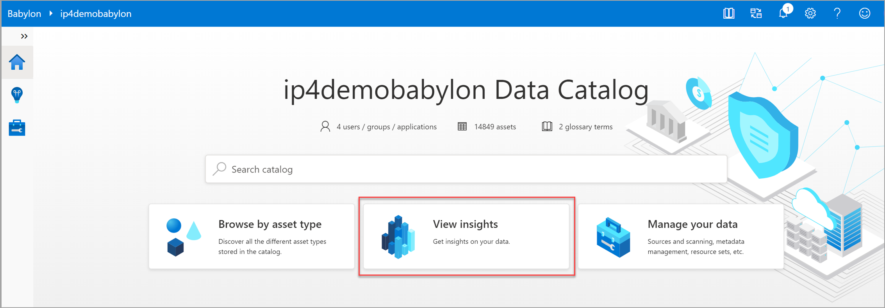
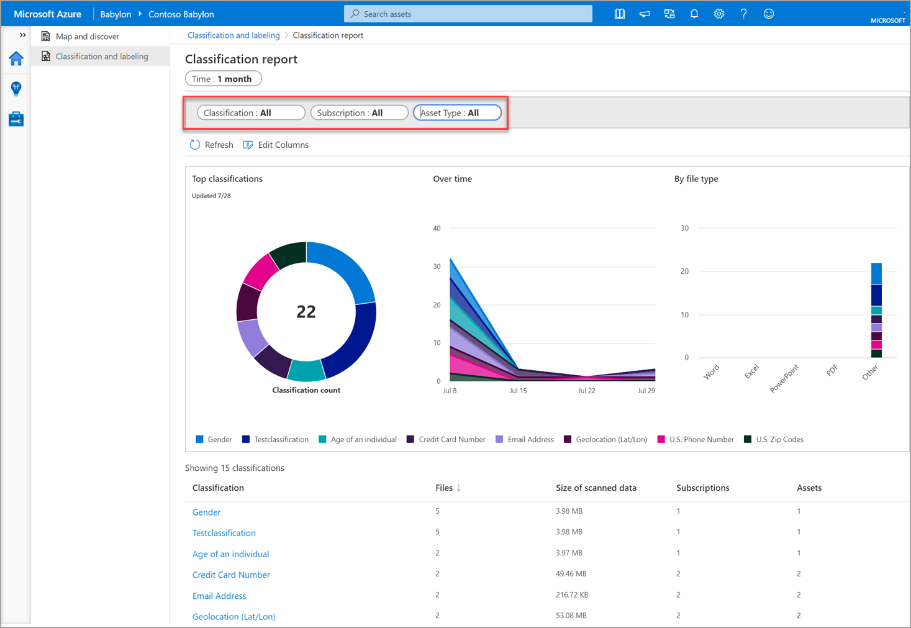
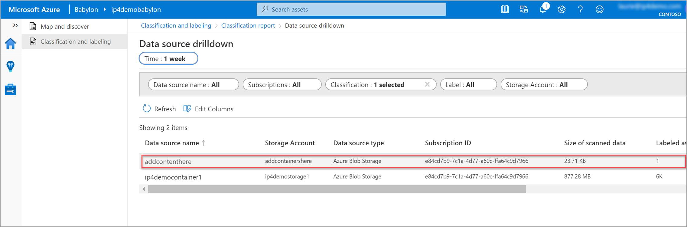

# Classification insights about your data from Project Babylon 

This how-to guide describes how to access, view, and filter Babylon classification insight reports for your data in Azure Blob storage, Azure files, ADLS GEN 1, and ADLS GEN 2.
Make sure you've done the following before getting started with Babylon insights:

- [Configure your Azure resources](scan-azure-data-sources-portal.md)
- Populate the relevant accounts with your test data

You'll also need to set up and complete a scan on the test data in each data source before you begin. Follow the instructions for scanning test data in [Azure resources](scan-azure-data-sources-portal.md).

In this how-to guide, you'll learn how to:
> [!div class="checklist"]
> Launch your Babylon account from Azure. 
> View insights on your data. 
> View and filter classifications.
> Learn how to review and search classifications made on your data estate. 

After making sure your Babylon source data was created, contains test data, and a test scan was completed, let's get started.  

> [!NOTE]
> If you're blocked at any point in this process, send an email to BabylonDiscussion@microsoft.com for support.

## Babylon insights

### Use Babylon insights

In Babylon, classifications are similar to subject tags and are used to mark and identify content of a specific type found within your data estate during scanning. Sensitivity labels are used to identify the categories of classification types within your organizational data, and the group the policies you wish to apply to each category. Babylon makes use of the same sensitive information types as Microsoft 365, allowing you to stretch your existing security policies and protection across your entire content and data estate.  

1. Go to the **Babylon** [instance screen in the Azure portal](https://aka.ms/babylonportal). Select your Babylon account.

1. When the Babylon blade is open, click the **Launch Babylon** account tile in the **Get Started** section.  

    

1. With Babylon open, click the **View insights** tile to access your insights area.

    
    
1. Within insights, select the **Classification and labeling** blade.
    

1. The main page of classification and labeling offers display tiles that show key details discovered about your scanned data over the time span. 

    - The **Classified files** tile provides the number of unique files containing classifications
    - -The center tile is dynamic and shows the percentage of files that were autoclassified with the most common label. 
    - **Data scanned** is size of the scanned data set in the time span.
    - **Top classifications** shows the number of unique files found containing the most common classifications over the time span.

1. Select the **View all classifications** link at the bottom of the **Top classifications** tile. The resulting report displays all classifications found within your data over the time period selected in the **Time** filter.  
    
    

1. Use the **Classification**, **Subscription**, and **Asset Type** filters to change your views and filter out specific classifications, subscriptions, or asset types from the report.

    

1. Depending on how you choose to filter the classification report, the report tiles will display: 

    - Top eight classifications found in the data scanned
    - Top eight classifications found by day/week/hour
    - Top eight classifications found by file type in the scanned data

### Data source drilldown 

After selecting a classification, such as **credit card number**, drill down into the classification data sources to learn which of your data sources contain that specific classification. 

If you have sensitive classifications, like credit card information, you'll want to make sure that data source is secured using an appropriate label with the right policies.

**Classification drill down:** 

1. Select on any classification from the list (such as **credit card number**) to drill down further into the data source and classification specifics. 

    

1. In the **Data source drilldown** list, select the **addcontenthere** data source from the list. 

    

1. Each data source in a classification list provides details on the **Storage account**, **Data source type**, **Subscription ID**, **size of the scanned data** as well as all **Labels** currently assigned to the data. 

## Next steps

Learn more from Babylon reports
> [!div class="nextstepaction"]
> [Sensitivity labeling insights](./sensitivity-insights.md)

> [!div class="nextstepaction"]
> [File extension insights](file-extension-insights.md)