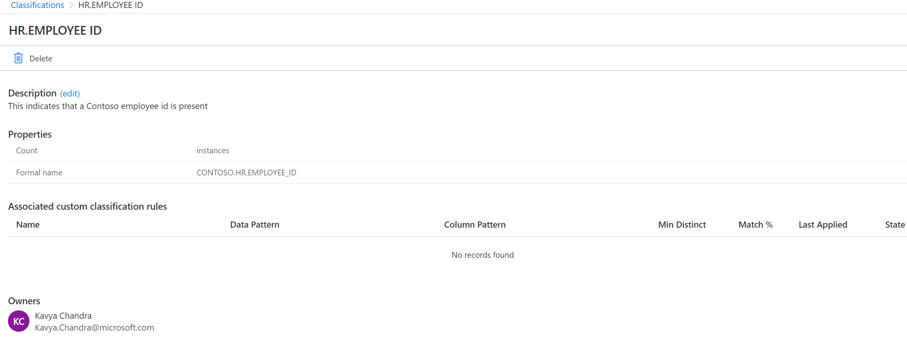

# Create a custom classification

This article describes how you can create custom Babylon classifications to define data types in your data estate that are unique to your organization.

## Custom classification

By default, the catalog provides a large set of default classifications that represent typical personal data types that you might have in your data estate.

## Steps to create a custom classification

To create a custom classification:

1.From your catalog, select the **Management Center** icon.

 

2.Select **Classifications** under Metadata management from the left
    navigation

 

3.Select **New**

The **Add new classification** pane opens, where you can give your
classification a name and a description. It\'s good practice to use a
name-spacing convention, such as your company name.classification name.
The Microsoft system classifications are grouped under the reserved
MS.Namespace. An example
is **MS.GOVERNMENT.US.SOCIAL\_SECURITY\_NUMBER**.

The system enforces that your name starts with a letter followed by a
sequence of letters, numbers, and period (.) or underscore characters.
No spaces are allowed. As you type, the UX automatically generates a
friendly name. This friendly name is what users see when you apply it to
an asset in the catalog.

To keep the name short, the system creates the friendly name based on
the following logic:

- All but the last two segments of the namespace are trimmed.

- The casing is adjusted so that the first letter of each word is
    capitalized. All other letters are converted to lowercase.

- All underscores (\_) are replaced with spaces.

As an example, if you named your
classification **CONTOSO.HR.EMPLOYEE\_ID**, the friendly name is stored
in the system as **Hr.Employee ID**.

Select **OK**, and your new classification is added to your
classification list.

Selecting the classification in the list opens the classification
details page. Here, you find all the details about the classification.
These details include the count of how many instances there are, the
formal name, associated classification rules (if any), and the owner
name.

