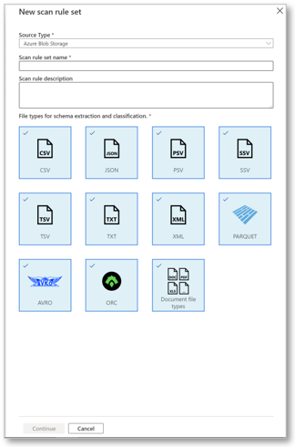
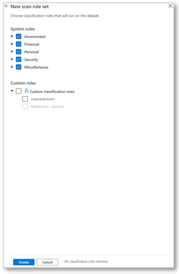
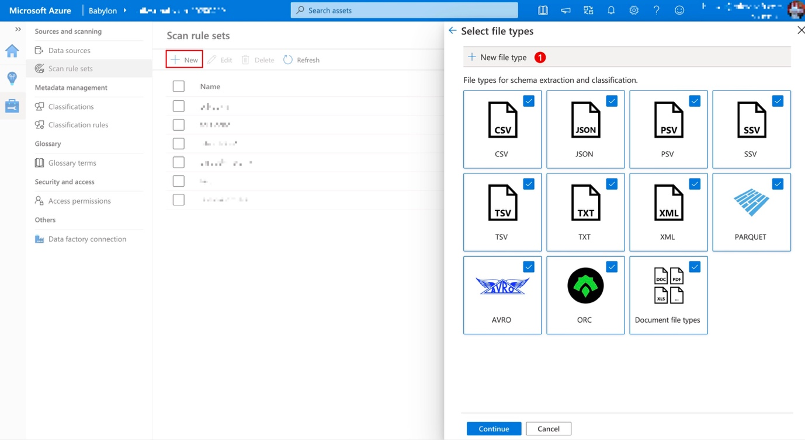
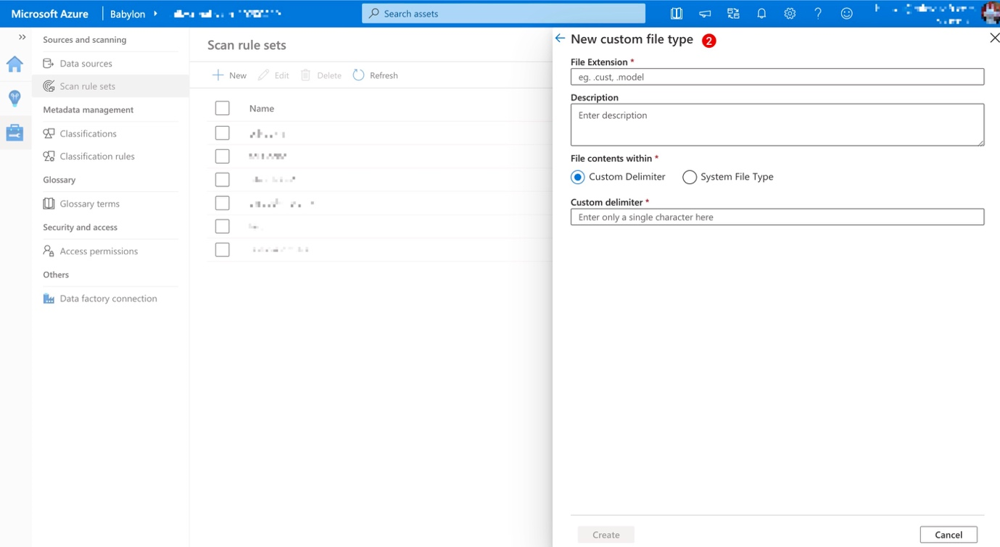
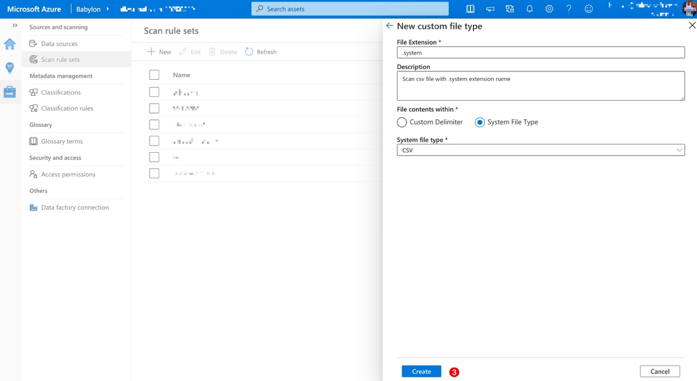
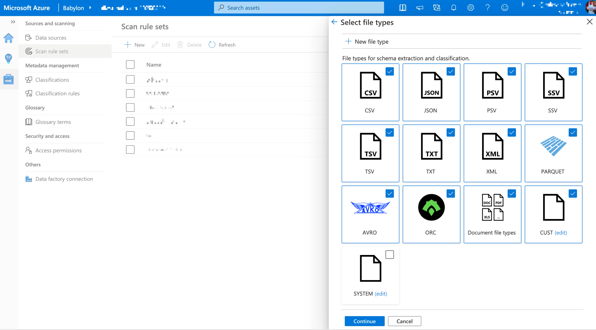

# Create a Scan Rule Set

This article describes how you can create scan rule sets in Babylon to quickly scan data sources in your organization.

## Scan rule sets overview

A scan rule set is a container you can use to group a set of scan rules
together so that you can easily associate them with a scan. You might
create a default scan rule set for each of your data source types, and
then use these scan rule sets by default for all scans within your
company. You might also want people with the right permissions to create
other scan rule sets with different configurations based on business
need.

## Steps to create a scan rule set

To create a custom classification:

1.From your catalog, select the **Management Center** icon.

2.Select Scan rule sets from the left navigation

3.Select **New** and the **New scan rule set** pane appears where you
can choose the configuration that you want

Use the **Source Type** drop-down list to select the data sources that
the catalog scanner supports. You can create one for each type of data
source you intend to scan. Notice that the options change based on the
store type that you choose. In the previous example, we selected Azure
Blob Storage. The file type options appear, and you can select them or
cancel the selection. If we had chosen Azure SQL Database, for example,
these file types wouldn\'t appear because they aren\'t relevant to a SQL
server.

\[!NOTE\] The **Document file types** option allows you to include or
exclude office file types: .odt, .odp, .ods, .pps, .doc, .dot, .pot,
.ppt, .xlc, .xls, .xlt, .docx, .docm, .pptx, .pptm, .ppsx, .xlsx, .xlsm,
.xlsb, and .pdf

4.Give your scan rule set a name. The maximum length is 63 characters,
with no spaces allowed. Optionally, enter a description for the scan
rule set. The maximum length is 256 characters.

5.If it's a data lake type data source (e.g. ADLS gen2, Azure blob etc.), choose file types for which you want to have schema extracted and classified.

You can also create custom file types, go to the **Create custom file types** section.

Note: The above step is not applicable to all scan rule set types

6.Select the **Continue** button. On the next screen, select
the **System rules** or **Custom classification rules** check boxes
for the rules you want to include.

By default, all the **System rules** check boxes are selected. You can
also clear them globally by category. You can also expand the category
node and clear individual classification rule check boxes. For example,
if the rule for **Argentina.DNI Number** has high false positives, you
can clear only that check box.

7.Select the **Create** button to finalize the creation of the scan
rule set. Notice that it shows you how many total classification
rules were selected.

### Create custom file types

Scan rule set now supports adding custom extension and define custom column delimiter.
Go to management center and choose scan rule sets section on the left navigation bar.

1. Click on the "+ New" button to create a new scan rule set, or choose one of the existing scan rule sets and click "Edit" button.
2. Upon clicking the button, scan rule set sidebar will open. Upon filling out the name and optional description information, click "Continue" to the next step.
3. Click "+ New file type" banner to create a new file type.

4. Fill out the information needed for a custom file type which includes the file extension and description.

a. You can define your own custom delimiter (currently we only support single character in this field)

b. Or you can specify that file contents within this file extension is one of the system file types

5. Then by clicking "Create" button to save the custom file. It will redirect to the previous page. The new custom file types will be displayed like below. You can enable/disable them by toggling the tile. By clicking "edit" link besides the file type name, you can edit or delete it.

6. Click "Continue" to finish up the process. After that, you can associate this scan rule set with scans like you normally would do. Then you're all set!

## System Scan Rule sets

System Scan Rule sets are Microsoft defined scan rule sets that come built-in to Babylon. Each System Scan Rule set has a data source type it is associated with. You can associate these to scans while setting them up. When Microsoft makes an update to these system default rule sets, you can choose to update them as well, and the update will apply to all the scans you have already associated them to. 

You can see the list of System scan rule sets by navigating to the management center and clicking on 'Scan rule sets' and choosing the system tab.

Each System scan rule set has a Name, sourcetype and version. On clicking the version number, you can see the rules associated with the current version and the previous version (if it exists).

If an update is available, you can click on 'Update' and can choose from the list of versions available for this system scan rule set, to update to. The blade will also provide details about the version the user chooses and that of the current version they are on.

### Associating a scan with a system scan rule set

While setting up your scan, you can choose to associate it with a system scan rule set as shown below.

