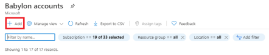

# Quickstart: Create a Babylon Account

In this quickstart, you create a Babylon Account.

## Prerequisites

* A [Microsoft Azure](https://azure.microsoft.com/) subscription.
* You need to have your own [Azure Active Directory tenant](https://docs.microsoft.com/azure/active-directory/fundamentals/active-directory-access-create-new-tenant).

* The following steps are needed to configure your subscription to enable Babylon to run in the subscription:

    1. Navigate to the **Subscriptions** on the [Azure portal](https://portal.azure.com)

    1. From the list of subscriptions, Select the **subscription** you want to use. Note that administrative access permission for the subscription is required.

        

    1. For your subscription, select **Resource providers**. If the **Microsoft.ProjectBabylon** resource provider is not registered, register it by selecting the **Register** link.

        

> [!Note]
> You may need a **subscription owner** to register the provider for you. You can check this by using Azure portal, clicking on **Subscriptions**, navigating to your subscription ID, and going to "Resource providers" section.
>
> If you filter to "Microsoft.ProjectBabylon" you will see the current state of the registration for your subscription. It will need to be in "Registered", you can click "Register" to manually register the
provider.

## How to create a new Babylon account

1. Go to the **Babylon** [instance screen in the Azure portal](https://aka.ms/babylonportal).

   
1. Select **Add** button to create a new Babylon instance. You can add only one Babylon instance at a time.
1. If necessary, change the subscription to the one that was put into the allow list for your private preview access.

   

1. Name your catalog by using the **Name** field. Note that you can't use spaces or symbols. 

   > [!IMPORTANT]
   > We recommend that you don't name your catalog by using your company name or sensitive information during the private preview. DNS names are not private, and your company's participation in the private preview might be disclosed via the DNS name.
1. Make a choice for **Location**, and then select **Next**.
1. The Azure portal will give you an opportunity to add tags. These tags will be for use only in the Azure portal, not the catalog. They don't affect the catalog for the purposes of the private preview.
1. Select the **Review & Create** button, and then select the **Create** button.
   
   It will take a few minutes to complete catalog creation. The newly created Babylon instance will show up in the list on your **Babylon accounts** page.
1. When Babylon creation is finished, select the **Go to resource** button.

1. Select **Launch babylon account**.

   

## Clean up resources

If you're not going to continue to use this application, delete your Babylon account with the following steps:

1. Go to the **Babylon** [instance screen in the Azure portal](https://aka.ms/babylonportal).

2. Select the Babylon instance that you created at the beginning of the tutorial. Click Delete, type the name of the data catalog instance, and then click Delete.

## Summary

In this tutorial, you created a Babylon account.

## Next steps

> [!div class="nextstepaction"]
> [Create a custom classification](create-a-custom-classification.md)