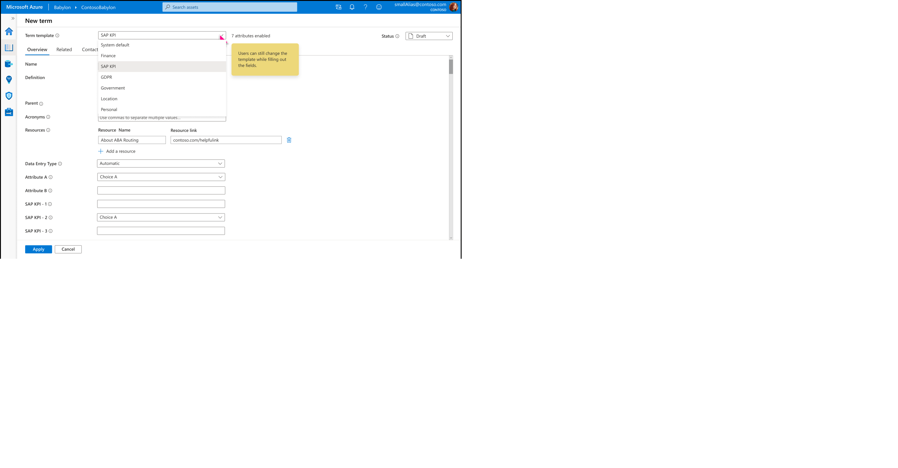
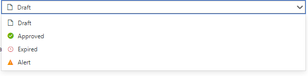
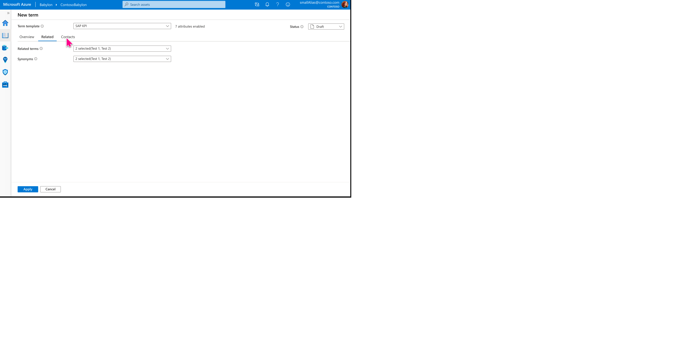
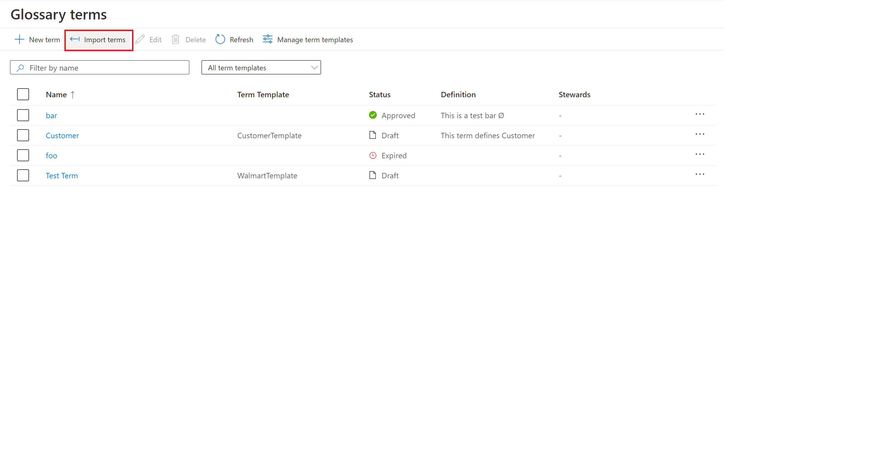
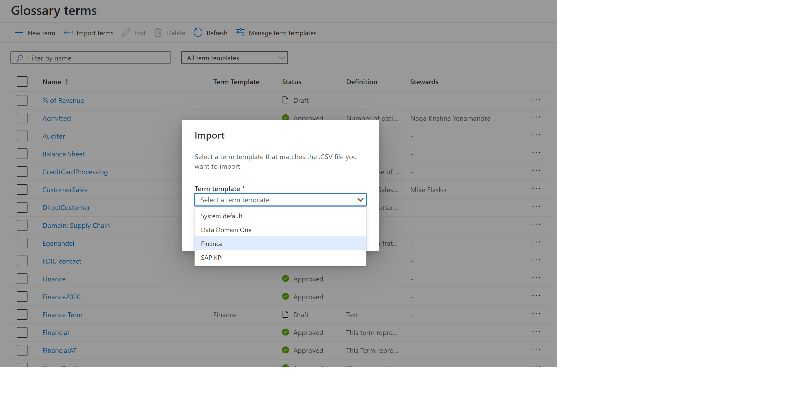
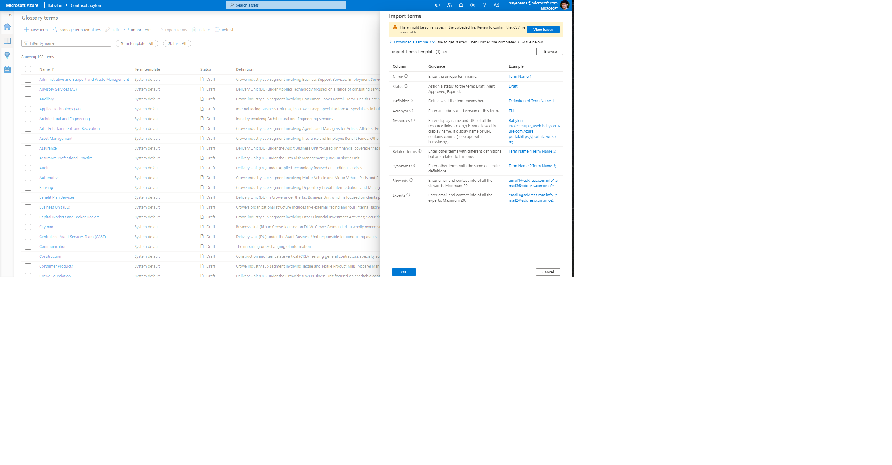

# How to Browse Data catalog

This guide outlines how to create a business glossary term, import terms using .csv file and exporting glossary terms.

## Create a new term

1. Click on the glossary icon in the left navigation on home page to go to term list page.

     

2. On the Term List page, select **+ New term**. A blade will pop up with "System Default" template selected. Choose the template you want to create glosary term with and click **Continue**

   	

3. Give your new term a name, which must be unique in the catalog. The term name is case sensitive, meaning you could have a term called **Sample** and **sample** in the catalog.

   - You can additionally add the following additional properties:

4. Add a **Definition**.

5. Set the **Status** for the term - New terms will default to Draft Status.

   

   These status markers are metadata associated with the term. Currently you can set the following status on each term:

   - **Draft**: This term is not yet officially implemented
   - **Approved**: This term is official/standard/approved
   - **Expired**: This term should no longer be used
   - **Alert**: This term needs attention

   These statuses are currently not wired up into any workflow, they are provided to help you manage your glossary. Eventually, these will be used with a workflow engine to help you manage the state of your glossary. 
   
   
6. You can also add  **Resources**, **Acronym** if desired. If the term is part of hierarchy you can add parent terms at **Parent** in the overview tab.

7. You can also add **Synonyms**,**Related terms** in the related tab.
    
 	

7. Optionally, select the **Contacts** tab to add Experts and Stewards to your term.

   

8. Select **Create** to create your term.

## Import Terms into Glossary  

Data Catalog provides a template .csv file for you to import your terms
into your Babylon Glossary.

-   You can import terms any time you need, be aware that duplicate
    terms will be overwritten.

-   Term names are case sensitive. **Example**: \"Sample\" and
    \"saMple\" could both exist in the glossary

1.  When you are in the Glossary, click on "Import terms"

>  

2.	You will be presented with a blase to select the term template that matches with .CSV you want to import 

>  

3.  Download the csv template and use it to enter your terms you would
    like to add.

-   \[!IMPORTANT\] The system only supports importing columns that are
    available in the template. The "System Default" template will have all the out of the box attributes.
	However, custom term templates will have out of the box attributes and additional custom attributes defined in the template.
	Hence, the .CSV file differs both from total number of columns and column names depending on the term template selected.
	You can also review the file for issues after upload.
    
>    

4. Once you've finished filling our your .csv file, select your file to  import and then select **OK**.

5. The system will upload the file and add all the terms to your catalog.

## Export Terms from Glossary with custom attributes 

You should be able to export terms from glossary as long as the selected terms belong to same term template. 

1.  When you are in the Glossary, by default the 'Export' button is disabled. Select the terms you want to export, the 'Export' button will be 
	enabled if the selected terms belong to same template

>  

>  

2.	Click on 'Export' to download the selected terms. 

>  